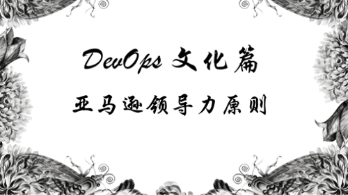
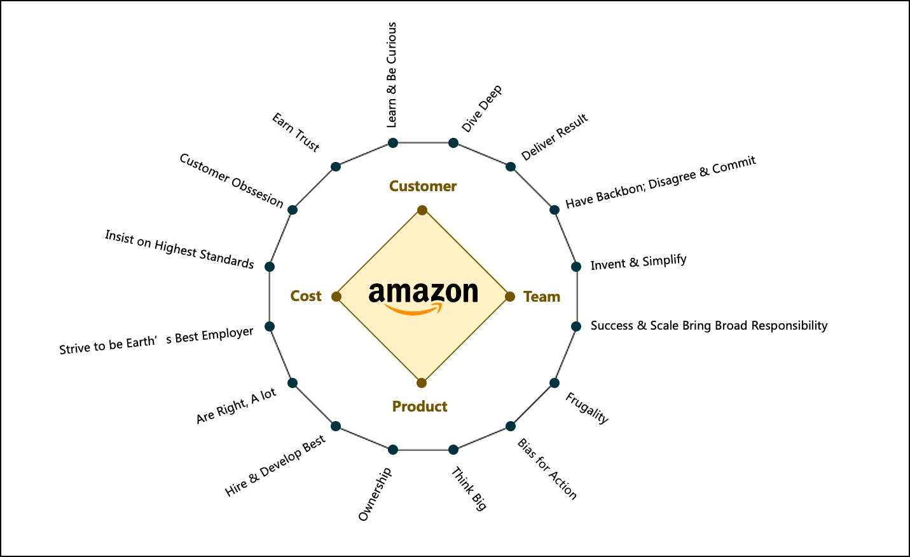
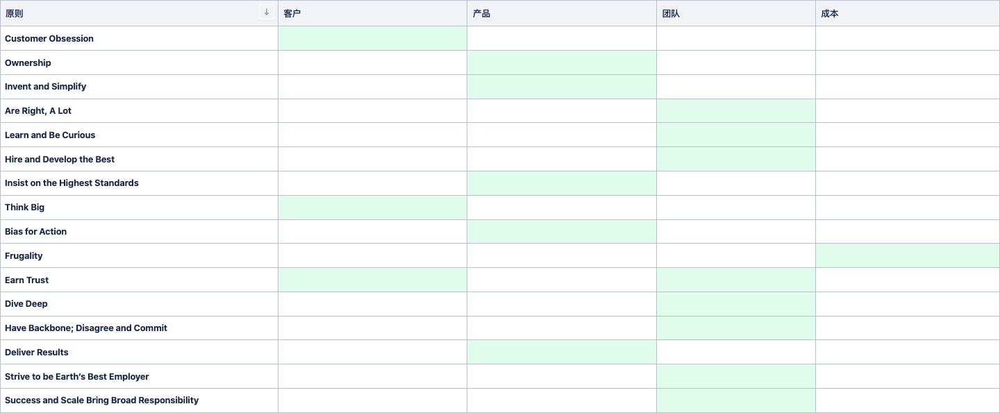

# DevOps 文化篇：亚马逊领导力原则



DevOps 的核心原则由四个部分组成，称之为 CAMS。

- 文化 Culture
- 自动化 Automation
- 评估 Measurement
- 共享 Sharing

其中，文化是一种无形资产，应该也是最**晦涩难懂**的部分。

```
绝大部分情况下， 老板的理念直接决定了企业的文化。
```

我们抛开文化的哲学意义，以亚马逊为例，看看文化如何发挥作用，怎么把【挂在墙上的标语，落地到解决方案】中。

[Amazon Leadership Principles](https://www.aboutamazon.co.uk/working-at-amazon/our-culture/our-leadership-principles)

# 文化与企业竞争力
亚马逊使用 16个领导力原则支撑了企业的核心竞争力。纵观亚马逊的领导力原则，都是围绕着【客户】，【产品】，【团队】，【成本】的角度出发。

虽然16个领导力原则覆盖了所有4个企业核心竞争力，细细品味的话，不难发现，侧重点偏向于【产品】&【团队】，而不是一味的【满足客户】&【以成本换利润】。



## Customer Obsession - 客户至上
> Leaders start with the customer and work backwards. They work vigorously to earn and keep customer trust. 
> Although leaders pay attention to competitors, they obsess over customers.

Leader 从客户角度出发开展工作。以积极地工作赢得客户的信任。竞争对手固然需要关注，但更需要关注客户。

## Ownership - 主人翁
> Leaders are owners. They think long term and don't sacrifice long-term value for short-term results. 
> They act on behalf of the entire company, beyond just their own team. They never say "that's not my job."

Leader 就是项目所有者。他们需要长远考虑，不会为了短期结果而牺牲长期价值。他们代表整个公司行事，而不仅仅是他们自己的团队。他们从不说“那不是我的工作”。

## Invent and Simplify - 创新与简化
> Leaders expect and require innovation and invention from their teams and always find ways to simplify. 
> They are externally aware, look for new ideas from everywhere, and are not limited by "not invented here." 
> As we do new things, we accept that we may be misunderstood for long periods of time.
  
Leader 应当要求团队积极创新，并追求简化。他们思维开放，从各个方面寻找新的思路，不能有【不应该是我们这里创新】想法。当我们开拓新的事物时，接受【可能会被误解很长一段时间的】风险。

## Are Right, A Lot - 一直正确的处事方式
> Leaders are right a lot. They have strong business judgment and good instincts. 
> They seek diverse perspectives and work to disconfirm their beliefs.

Leader 需要保持正确的处事方式。他们有很强的商业判断力和良好的直觉。他们寻求不同的观点，并努力推翻自己的信念。

## Learn and Be Curious - 保持学习和探索心态
> Leaders are never done learning and always seek to improve themselves. They are curious about new possibilities and act to explore them.
  
Leader 需要一直保持学习的状态，他们总是寻求提高自己。他们对新的可能性充满好奇并采取行动探索它们。

## Hire and Develop the Best - 培养最优秀的人才
> Leaders raise the performance bar with every hire and promotion. They recognize exceptional talent, and willingly move them throughout the organization. 
> Leaders develop leaders and take seriously their role in coaching others. 
> We work on behalf of our people to invent mechanisms for development like Career Choice.
  
Leader 通过每次的招聘和提拔，提高绩效标准。他们需要辨识接触的人才，并愿意在公司内部按需要调动他们。Leader 积极培养 Leader 并认真对待他们在指导他人方面的作用。我们从员工的角度出发，积极探索职业发展的方向。

## Insist on the Highest Standards - 坚持最高标准
> Leaders have relentlessly high standards—many people may think these standards are unreasonably high. 
> Leaders are continually raising the bar and driving their teams to deliver high-quality products, services, and processes. 
> Leaders ensure that defects do not get sent down the line and that problems are fixed so they stay fixed.
  
Leader 保持【无条件】的高标准-“许多人可能认为这些标准高得不合理”。Leader 不断提高标准并推动他们的团队提供高质量的产品、服务和流程。Leader 确保缺陷不会影响到生产线，并且问题需要得到及时修复。

## Think Big - 放大格局
> Thinking small is a self-fulfilling prophecy. Leaders create and communicate a bold direction that inspires results. 
> They think differently and look around corners for ways to serve customers.
  
狭窄的思维空间是一种自我满足。Leader 制定 & 传达一个大胆的方向，以获得积极的结果。他们以不同的方式思考并四处寻找服务客户的方法。

## Bias for Action - 敢于行动
> Speed matters in business. Many decisions and actions are reversible and do not need extensive study. We value calculated risk taking.
  
商业中速度很重要。许多决定和行动是可逆的，不需要深入研究。我们重视经过计算的风险承担。

## Frugality - 节俭
> Accomplish more with less. Constraints breed resourcefulness, self-sufficiency and invention. 
> There are no extra points for growing headcount, budget size, or fixed expense.
  
提倡以有限资源获得更多成果。有限资源往往促进更多的发明创造。增加员工人数、预算规模或固定费用没有额外加分。

## Earn Trust - 赢得信任
> Leaders listen attentively, speak candidly, and treat others respectfully. 
> They are vocally self-critical, even when doing so is awkward or embarrassing. 
> Leaders do not believe their or their team’s body odor smells of perfume. 
> They benchmark themselves and their teams against the best.

Leader 应当认真倾听，坦诚交谈，尊重他人。即使会尴尬，Leader 也要学会大声自我批评。Leader 不自我满足，与最好的人/团队进行比较。

## Dive Deep - 深入到工作细节
> Leaders operate at all levels, stay connected to the details, audit frequently, and are sceptical when metrics and anecdote differ. 
> No task is beneath them.
  
Leader 的工作覆盖各个层面，始终与细节保持联系，经常审计，并且在衡量标准和轶事不同时持怀疑态度。不存在【非我本职工作】。

## Have Backbone; Disagree and Commit - 要有主见；要有反对和承诺的勇气
> Leaders are obligated to respectfully challenge decisions when they disagree, even when doing so is uncomfortable or exhausting. 
> Leaders have conviction and are tenacious. They do not compromise for the sake of social cohesion. 
> Once a decision is determined, they commit wholly.
  
对于有异议的决定，即使会令人不舒服，Leader 有义务【恭敬地】提出反对意见。Leader 需要有信念。Leader 不会因为【服众】而做出妥协，一旦作出决定，他们就会全身心投入。

## Deliver Results - 交付结果
> Leaders focus on the key inputs for their business and deliver them with the right quality and in a timely fashion. 
> Despite setbacks, they rise to the occasion and never settle.

Leader 专注于关键资源投入，并保质，准时交付结果。尽管遇到挫折，他们还是挺身而出，永不妥协。

## Strive to be Earth’s Best Employer - 努力成为全球最好的雇主
> Leaders work every day to create a safer, more productive, higher performing, more diverse, and more just work environment. 
> They lead with empathy, have fun at work, and make it easy for others to have fun. 
> Leaders ask themselves: Are my fellow employees growing? Are they empowered? Are they ready for what’s next? 
> Leaders have a vision for and commitment to their employees’ personal success, whether that be at Amazon or elsewhere.
  
Leader 要每天努力创造一个更安全、更高效、更多样化和更公正的工作环境。他们以同理心为主导，在工作中获得乐趣，并让其他人更容易在工作中获得乐趣。Leader 自问：我的同事在成长吗？他们有权力吗？他们准备好迎接下一个阶段了吗？无论是在亚马逊还是其他地方，Leader 对员工的个人成功有着期望和承诺。

## Success and Scale Bring Broad Responsibility - 能力越强，责任越大
> We started in a garage, but we’re not there anymore. We are big, we impact the world, and we are far from perfect. 
> We must be humble and thoughtful about even the secondary effects of our actions. 
> Our local communities, planet, and future generations need us to be better every day. 
> We must begin each day with a determination to make better, do better, and be better for our customers, our employees, our partners, and the world at large. 
> And we must end every day knowing we can do even more tomorrow. Leaders create more than they consume and always leave things better than how they found them.
  
我们已经从当初的车库走了出来，变得很大，并且影响着世界，但我们远非完美。我们的一举一动都会引人注目，所以必须谦虚谨慎。周围环境促使我们每天都要变得更好。我们每天都要为我们的客户、我们的员工、我们的合作伙伴和整个世界作出努力。每一天的结束，都要为明天的发展作出努力。Leader 要以少的消耗，创造更大的价值。

# 如何落地？
接下来看看亚马逊是如何把【墙上的标语】落地到办公桌上的。

如果一切事情都行云流水，其实是不需要这些原则的。就好比，足球场上，大家都相互礼让，就不需要裁判了。

只有【遇到问题】的时候，才能这些原则才能发挥作用。甚至可以这么说，一个企业的竞争力，就是解决问题的能力。

所以，亚马逊的领导力原则，也是为了解决问题而生的。

只是读这些原则的话，还是没法体会，当然，最好的方法就是在亚马逊里工作一段时间。不过，我们还是可以通过模型来理解。

这是基于亚马逊的工作经验，以及个人理解，分析出来的模型。使用方法也很简单。
- 第一步：判断问题属于企业的哪个核心价值
- 第二步：判断核心价值相关的原则有哪些
- 第三步：以【产品】->【客户】->【团队】->【成本】的顺序进行原则上的取舍（当然，顺序可以变通）



## 出现问题时
工作中，天天都会遇到问题，亚马逊也如此。遇到问题本身并不是一件糟糕的事情。

我们来举个最常见的例子：【项目上线时间 Delay】

几乎一半以上的项目上线都会 Delay，因为我们要走的路，没有一个是一马平川。
亚马逊在处理这类问题的时候，【无形中】，也使用了16个领导力原则。

- 第一步，项目自然属于【产品】和【客户】的核心范畴。
- 第二步，看看哪些原则可以适用解决 Delay 问题的范围。

接下来就是根据项目的特性，在原则中进行取舍了。比方说，需要配合特定活动日期的项目，则以客户为先。如果是因为项目质量问题而产生的 Delay，那就采用【Insist on the Highest Standards】。

我们经常会纠结在【客户信任】与【产品质量】的权衡中，我没有按时交付，是不是就失去了客户信任。
当然，按时交付固然非常重要，不过赢得客户信任不仅仅是按时交付，让客户获得产品价值更为重要。如果，项目延期能够给客户带来更大的价值，那也只值得的。

至于项目延期问题，可以通过流程改进等方法进行后续优化。

## 出现纷争时
纷争也是工作中每天都会遇到的问题。

我们来举个常见的例子：【这个功能，这次到底要不要】

这个问题的解决方案，也可以归结到【产品】&【客户】的核心价值中。我们再从领导力原则中进行取舍。

- Invent and Simplify
- Insist on the Highest Standards
- Bias for Action
- Deliver Results
- Think Big

大多数情况下，【Invent and Simplify】与【Bias for Action】会胜出。当然，根据不同的项目，结果会不一样，但是有一个【判断标准】，我们的会议就不会是【相互撕扯】地浪费时间。

## 分配利益时
晋升应该是对员工最重要的时刻之一。每个公司对于晋升都有内部的评估体系，不过，很多时候，员工拿到评估报告的时候会比较茫然。

亚马逊对于每一个员工的评估，都是基于领导力原则来进行的。Leader 会收集员工一整年的工作数据，并根据领导力原则，给每一个原则项进行评估。

最后，得出来的结果也会很直观。员工可以通过过往的工作过程，自我认知是哪一方面的不足，导致了晋升的失败。

## 取舍两难时
在技术领域，经常会遇到取舍两难的境地。

举个例子：【用哪个技术栈来实现更好】

如果有资深的工程师踩过坑的话，这个问题会很好解决，不过，大多时候我们看到的都是新事物。这时候，还是老办法，选取核心价值，并取舍原则。

在亚马逊最常用的一个原则就是【Invent and Simplify】，他们会选择更为简洁的方法来解决这个问题，哪怕执行过程中，我们需要更多的时间，架构的简洁更重要。

# 亚马逊的企业文化，能拿过来用吗？
亚马逊已经是一个庞大企业，公司文化自然也是大企业的文化，会覆盖到工作的方方面面。

如果是中小企业，我们能直接拿过来用吗？个人的推荐是：这么多用不上。

举个例子，【Strive to be Earth’s Best Employer】和【Success and Scale Bring Broad Responsibility】这两个原则对于中小企业明显用不上。

这里推荐一个适合中小企业的选项。对中小企业来说，小步快跑更为适合，因此，下面这个原则应该是最适合的。

- 【Customer Obsession】
- 【Earn Trust】
- 【Ownership】
- 【Invent and Simplify】
- 【Frugality】
- 【Deliver Results】

# 总结
我们根据自己的理念，创造文化标语不是一件特别困难的事情。如何把文化融入到工作才是最关键的一环。

要达到这个目的，文化本身不能是一个【模凌两可】的语句，更应该是一个【法则】一样的存在。只有这样，平日的工作中，才可以得到广泛的应用。企业文化本身也会在【不知不觉】中融入到每个人的脑子里，久而久之，从【文化】变成【习惯】。

