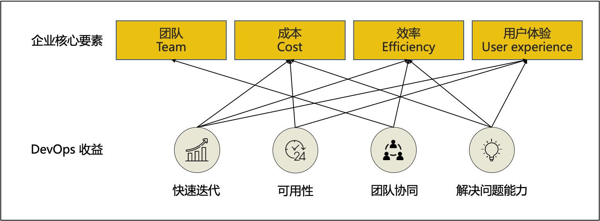
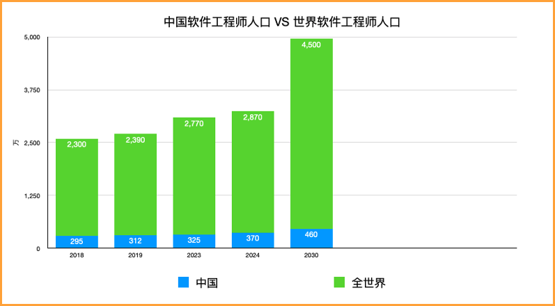
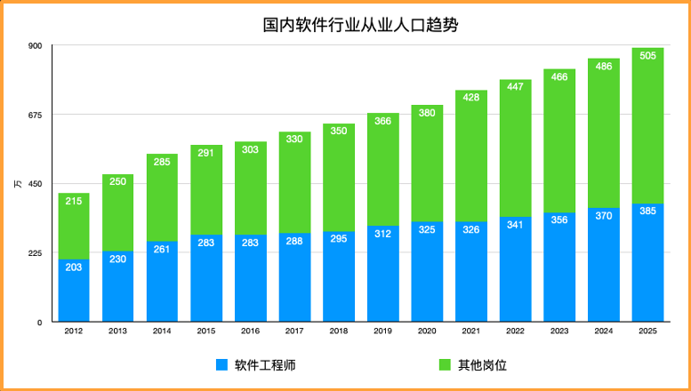
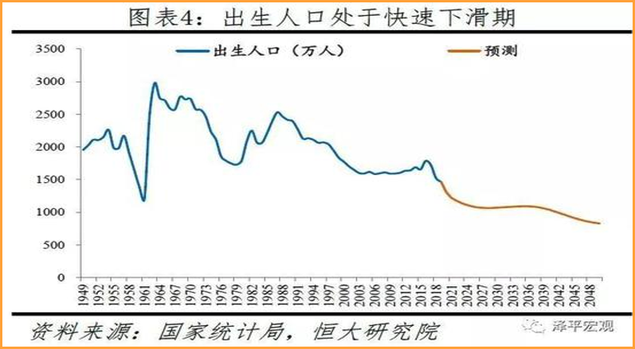
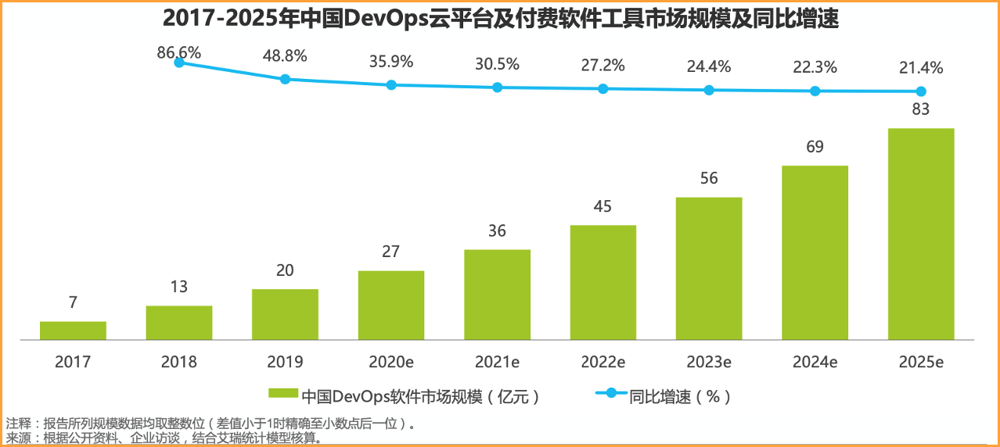
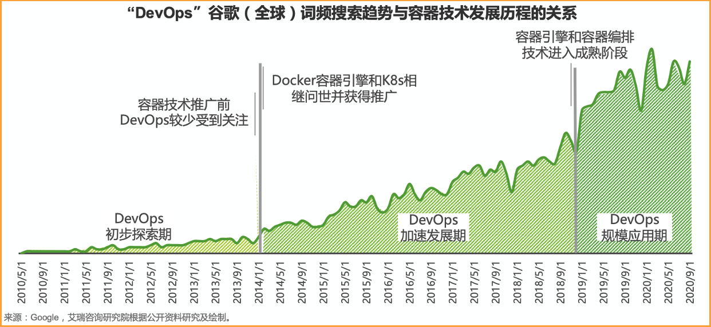
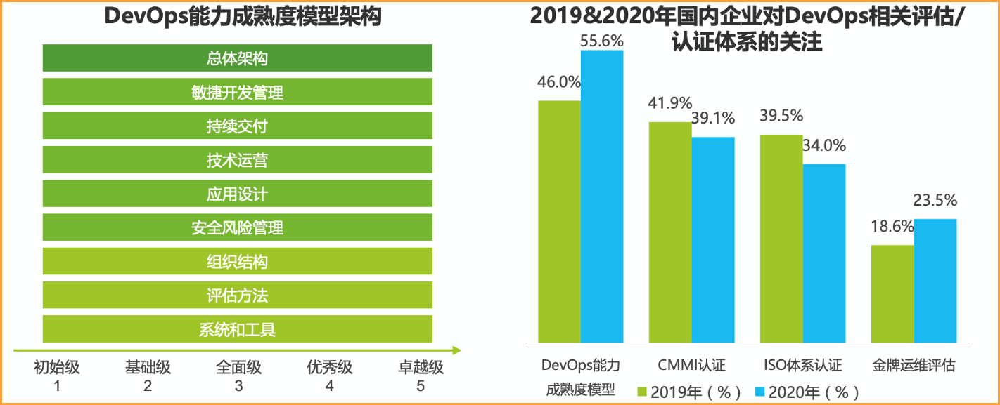
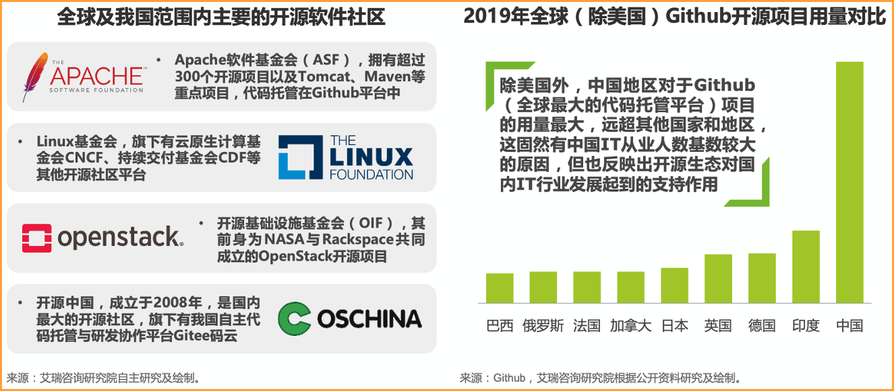
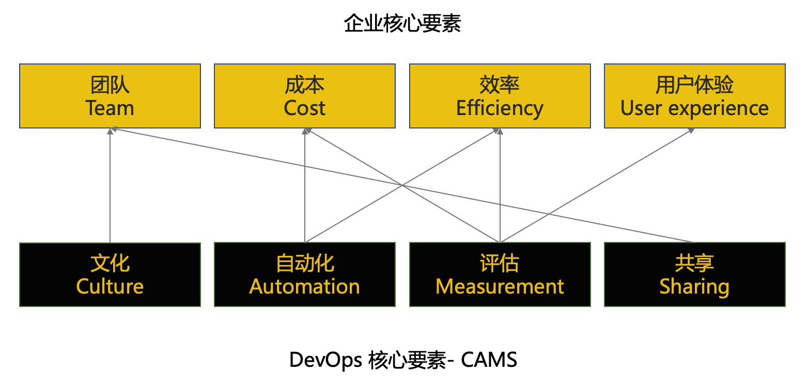

# 从决策者的角度理解 DevOps
在上两篇的文章中，我们分别从【员工】和【Leader】的角度去理解了 DevOps。

- 从员工的角度理解 DevOps
- 从 Leader 的角度理解 DevOps

如果是一个决策者，应该如何理解 DevOps？

## 回顾

| 角色 | 理解 |
| --- | --- |
| 员工 | 根据一个规则，拿着一系列工具，按照某个流程来完成工作。大部分的员工是不会去【感知】或者【质疑】流程或者工具。|
| Leader | 规则的制定者，实施者，需要根据团队情况，指定，改变，评估规矩。Leader 需要根据 [CAMS](https://www.atlassian.com/devops/frameworks/calms-framework) 以及团队实际情况，构建团队文化，自动化，评估体系，共享体系。 |

## Agile，DevOps 只是一种方式
> 不要有这种误区：
>
> 不做 DevOps 没有竞争力，做了 DevOps 就一定有竞争力。
>
> 举个例子，如果是一个3～5人的初创团队，DevOps 对于他们，不会有直接的帮助，更应该把重点放在拓展业务，打磨产品。
 
之前的文章中，我们一直在讨论 Agile，DevOps 这些概念，决策者视角下，这些只是提升【企业竞争力】的一种方式而已。

任何企业都可以有符合自身情况的更好方式，提升【企业竞争力】。

## DevOps 能给企业带来什么？
身为决策者，需要了解 DevOps 能为企业带来什么，不能带来什么。

Puppet 将 DevOps 的获益归纳为了如下4类，我们再把这4类联系到企业核心要素中。

由此看出，DevOps 本身不会【直接提升】某个业务或者某个产品的价值，DevOps 提升的是企业的生产效率，从而提升企业竞争力。

> DevOps 好比是欧洲先进【足球青训体系】，引入这个体系，无法让我们【立刻】进入世界杯，然而，这是变成【足球强国】的必要条件。

## 若想引入，如何去做？
如果想要通过 DevOps 提升【企业竞争力】，推荐决策者根据如下的顺序进行决策。

- 判断时机
- 找出问题点，选择实施顺序
- 自上而下推广
- 提供资源，调整架构
- 评估结果，给予肯定

## 判断时机 - 时候到了吗？
判断目前是否应该引入 DevOps，可以从【外部】和【内部】两个方面考量。

### 外部环境
DevOps 的生态发展即为外部环境，先来看看 DevOps 外部状况。

目前的调研结果，DevOps 的外部环境已经颇为成熟。

总体来看，人口，政策，成熟度等都有利于 DevOps 的推广。在我们看来，人口驱动是重点。

**说白一点，人才的竞争会越发激烈。**

#### 1. 人口驱动 - 从人口红利到工程师红力
软件行业人口持续增长，国内人口逐渐呈现下降趋势，软件行业的人口红利逐渐消失。

> 截止2030年，全世界开发者，将有望突破4500万。
> 
> 来自：[Software Developer statistics 2021](https://www.daxx.com/blog/development-trends/number-software-developers-world)
>

> 截止2025年，国内软件行业人口将有望突破 900万。
> 
> 来自：[关键软件领域人才白皮书](https://cloud.tencent.com/developer/article/1821126)
>

> 根据国家人口统计局的统计，国内现在面临着人口老龄化的趋势。
> 
> 来自：[中国人口报告2020](https://finance.sina.com.cn/china/gncj/2020-02-25/doc-iimxyqvz5539802.shtml)
>

#### 2. 行业驱动 - 软件行业持续增长
软件行业将持续增长，将会带动 DevOps 一同增长。

> 来自：[艾瑞咨询：2020年中国DevOps应用发展研究——艾瑞云原生系列报告（二）](http://report.iresearch.cn/report/202012/3702.shtml)
>

#### 3. 技术驱动 – 云原生，容器技术推广 
> 随着容器和云普及，DevOps 发展也得到了逐步发展。
> 
> 来自：[艾瑞咨询：2020年中国DevOps应用发展研究——艾瑞云原生系列报告（二）](http://report.iresearch.cn/report/202012/3702.shtml)
>

#### 4. 政策驱动 – 国内行业标准建立 
> 2018年4月， DevOps标准项目“研发运营一体化能力成熟度模型”在中国通信标准化协会立项成功。
> 
> 来自：[艾瑞咨询：2020年中国DevOps应用发展研究——艾瑞云原生系列报告（二）](http://report.iresearch.cn/report/202012/3702.shtml)
>

#### 5. 生态驱动 – 开源社区
> 开源生态的不断充实和发展为开发和运维工程师提供了多样化的工具选择，构筑起DevOps丰富的资源池。
> 
> 来自：[艾瑞咨询：2020年中国DevOps应用发展研究——艾瑞云原生系列报告（二）](http://report.iresearch.cn/report/202012/3702.shtml)
>

### 内部环境
内部环境的判断，决策者可以通过如下几个方面考量，如果企业内部已经出现了 1/3 以上的情况，决策者应该开始考虑 DevOps 了。

- 人员
- [x] 招聘效果不佳。
- [x] 员工离职频繁，新老员工能力停滞不前。
- [x] 员工加班情况频繁，且业务进度不佳。
- [x] 团队间出现内卷，相互竞争，浪费人力资源。
- [x] 内部骨干提拔比例低下。

- 产品
- [x] 产品创新停滞，业务扩展缓慢。
- [x] 产品自动化流水线缺失，频繁出现事故。
- [x] 出现内部产品同质化。
- [x] 产品成本居高不下。

- 评估
- [x] 企业内部技术/业务共享机制缺失。
- [x] 企业内部评估机制混乱。

- 文化
- [x] 企业文化无法落实到工作中。

## 找出问题点，选择实施顺序
有了内部环境的判断，也就有了问题点，不过，解决单点问题从来不是决策者希望看到的。

并且，先解决哪个问题，看起来都是【正确】的，很难作出判断。

我们可以从企业/产品的核心出发，选择实施顺序。
比如，企业需要的是提升产品迭代效率，那么首选的顺序应该是【自动化】，【评估】体系建设。

## 自上而下推广 - 决定 DevOps 的成败
我们确定了问题点，实施顺序，接下来一定要自上而下【强力】推广。这种项目，员工是很难体会其价值所在的。

导致的结果会是【敷衍了事】。因为，员工认为很难从中得到【提拔】的机会。

推进过程中，也会遇到各种阻力，只有一道明确的【圣旨】才可以让推广顺利进行。

> Amazon 在 2002 年强制推行微服务架构，就是由 CEO Jeff Bezos 给全员发了一封邮件。
>
> 最核心的一句：Anyone who doesn’t do this will be fired.
>
> [The Bezos API Mandate: Amazon’s Manifesto For Externalization](https://nordicapis.com/the-bezos-api-mandate-amazons-manifesto-for-externalization/)

## 提供资源，调整架构
### 提供资源
有了计划，提供资源肯定是必不可少的。目前，国内外有很多开源&付费的 Agile，DevOps 的相关产品和解决方案。我们会在后面的文章中介绍。

这里，我们只给出选型建议（当然，如果是出于拉投资等目的去引入 DevOps 产品，就另说了）。

- 不要一口气买下一站式平台所有功能，用不上。
- 选择云原生，K8S 原生的产品。
- 尽量选择有开源基础的产品。
- 不要让引入的 DevOps 产品卡住技术升级的脖子。
- 产品 + 说明书 + 培训是必备。
- 听听员工体验和口碑再决定。

### 调整架构
接下来的工作就是相应的架构调整了。对于不熟悉 DevOps 的团队来说，公司里一定要有这么几个角色。

如果企业里没有如下的角色，几乎无法推广 DevOps，只依赖第三方公司的产品【一定达不到】目的。

- **DevOps 传播者团队**：需要有一个团队或者个人不断针对业务进行革新，打出标杆，才可能会被模仿。
- **自动化架构师**： 根据业务属性，可以对流程，测试等进行自动化架构设计的人/团队。
- **研发+测试工程师**：每一个研发/测试都要逐渐转型。
- **质量+安全评估团队**：最好由研发人员组成。
- **实用工具评估团队**：新技术，新工具的评估者。

## 评估结果，给予肯定
根据 Atlassian 的评估，海外企业接纳 DevOps 的周期为**1年**，所以，决策者要对时间周期有心理预期。

各个团队的 Leader 需要根据实际数据来汇报 DevOps 的进程。举几个例子：
- 部署构建自动化百分比
- 测试自动化百分比
- 时间成本（Blocking time & Waiting time）百分比
- 产品的用户反馈

此外，很重要的一点，要给【做 DevOps】的团队/员工给予认可，否则，没有人会愿意去做【老板不认可】的事情。

## 总结
我们从宏观的角度分析了决策者在 DevOps 推广中的角色。

回顾我们之前的两篇文章，员工，Leader，决策者应该在 DevOps 上共同投入，否则，只会是一个面子工程。

| 角色 | 理解 |
| --- | --- |
| 决策者 | 方向的掌舵人，要根据企业情况，确定实施顺序，提供资源，调整架构，给予评估及肯定。|
| Leader | 规则的制定者，实施者，需要根据团队情况，指定，改变，评估规矩。Leader 需要根据 [CAMS](https://www.atlassian.com/devops/frameworks/calms-framework) 以及团队实际情况，构建团队文化，自动化，评估体系，共享体系。 |
| 员工 | 根据一个规则，拿着一系列工具，按照某个流程来完成工作，要积极接受变化，提升个人能力。|

我们会在后续的文章中，深入介绍 DevOps 中的细节。