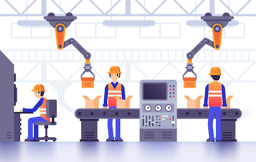

# 从 Leader 的角度理解 DevOps
在上一篇【从员工的角度理解 DevOps】中，我们从普通员工的视角理解了 DevOps。

现在来看看，从团队 Leader 的角度，如何理解 DevOps。

## 回顾
> 回顾一下上一篇文章中的内容，在上一篇文章中，我们尽量以通俗语言去说明什么是 DevOps，什么是 Agile。
>
> 简单讲，从员工的视觉来说，就是根据一个规则，拿着一系列工具，按照某个流程来干活儿。
> 
> 1: Agile 是一堆很虚的方法论，复杂工具集合，适合产品线去使用。
>
> 2: DevOps 把研发线需要的方法论，复杂工具也纳入了进来，同时运维也加入了。

从员工角度理解 DevOps 是什么样的？

- 员工感觉不到从 DevOps 或 Agile 获益，是普及环节出了问题，员工不知道怎么去运用。

- Agile 使得产品线员工们，有了先进的方法论，研发线员工们的生产力**没有**得到提升。

- Agile（敏捷开发）或者 Lean（精益开发）并不是软件领域的大佬们凭空想出来的，而是由工业制造领域得到了验证。

- Agile（敏捷开发）是项目管理，产品研发流程方法论集合, 解决生产流程优化，团队协同问题。

- Agile 的使用者包含了【产品经理，项目经理，研发&测试，团队 Leader】，DevOps 把【运维】【决策者】这个角色也引入了进来。

- Agile 的方法论集中在了【项目管理】【产品管理】【团队管理】，DevOps 补充了【产品运维】【客户管理】。

## 换个角度，理解 Agile

从员工的角度来说，Agile 就是一系列需要遵守的规矩，例如，站会，Scrum 等等。

然而，对于 Leader，角色则应是 Agile 的实施者。

| 角色 | 如何理解 | 应该做什么 |
| --- | --- | --- |
| 员工 | Agile 是一系列需要遵守的规矩 | 熟悉并使用流程，工具，提出建议。|
| Leader | Agile 规矩的制造者，实施者 | 根据团队情况，指定规矩，改变规矩，评估规矩 |

> 注意，虽然 Leader 的角色变成了规矩的制造者，实施者，但不代表 Leader 只负责指挥，这是常见的错误现象。

## Leader 的疑问

> 问1：跟兄弟们提了无数次 Agile，为什么就是不执行？
> 
> 问2：产品经理，项目经理倒是按照 Agile 模版创建任务，为什么项目一直延期？
>
> 问3：引入了 Agile，为什么产品质量还是上不去？
>
> 问4：为什么团队里还是没有人愿意提建议？
>
> 问5：每个月都在做 1v1 沟通，但是还是有人离职？
>
> 问6：酒也喝了，骂也骂了，为什么兄弟们还是不服我？
>
> 问7：老板一直在质疑效率，该做的都做了，到底哪里除了问题？
>
> 问8：花大价钱请了资深员工，效率还是上不去，是怎么回事？

接下来，我们以 Amazon 文化为例，简单来聊一聊针对这些问题 Amazon 是如何做的，会有一些启发。

### 1.了解团队生产力

身为 Leader，如果不了解团队的生产力，任何规划都无从谈起。

**Leader 先要问一下自己，我的团队生产力如何？**

相信很多 Leader 都没有想过这个问题，我们以 Amazon 内部的一个细节作为例子。

> Amazon 的 Leader 对于团队的生产力是非常了解的，每一个 Sprint 里，Task 的完成效率，代码提交次数，Code Review 的频率，故障处理的是时间等等。
> 
> 在每一次的双周会中，Leader 都会拿出这些数据，跟团队一起过一遍。注意，这里不是去【骂员工】做的慢，而是客观评估。
>
> Leader 通过这些细节数据，评估团队的当前生产力。有了生产力数据，自然也能发现问题。

**通过数据了解当前团队生产力，leader 应该对项目进展，预期，有一杆秤。**

### 2.了解你的团队

很多 Leader 都认为了解团队。不过，真是如此吗？我们根本不可能让员工对 Leader 掏心置腹，不要有这种幻想。

从团队管理的角度来讲，掏心置腹也不是一个好办法，与其如此，倒不如去了解员工在团队里要什么？无非就这么几个。
- 薪酬待遇
- 升职空间
- 学习空间
- 工作与生活平衡
- 避免内卷

Leader 在与员工 1v1 的时候，是否会谈论上述的问题？还是拿着项目【画饼】，重复着：只要你干得好，都会有的。

> Amazon 的 Leader 在与员工 1v1 的时候，经常会谈论这些问题，而且非常直接。
>
> 比方说，在谈论升职问题的时候，他们会提出目前无法升职的原因，比如，独立完成的项目还不够，代码提交还不够等等。同时，还会在后续的时间里，安排解决这类问题。
> 
> 如果，一个员工经常加班加点也完不成任务，Leader 会主动提出疑问，是不是我安排的任务不合理，导致你的工作生活打破了平衡。
>
> Amazon 的 Leader 通过这种简单直接方式与员工沟通，得到每一个人在工作方面的想法，并解决问题。

**了解团队，不是去了解每一个人的性格，喜好，而是去了解员工对团队的【期望值】是否一直在持续。**

### 3.了解你的团队业务

一个团队里，最了解团队业务的人应该是 Leader，而不是研发和产品。

某些情况下，员工升到 Leader 之后，就开始把经历全都放到了【管理】中。
久而久之，连业务里的核心架构，数据，排期，需求等都不了解。最后，会出现这种情况。

**Leader 向上汇报的时候，团队的员工跟着一起写 PPT。**

> 还是以 Amazon 为例，Amazon 的 Leader 对于内部的核心业务是非常了解的，而且是实时的，并不是过期的数据。
>
> 所以，当 Amazon 的 Leader 们去讨论更大型项目的时候，整个流程会非常平滑，不会出现因为不熟悉业务而卡顿的情况。
>
> 那他们是如何做到的？
> 
> 其实很简单，就是通过每天的晨会，周会以及项目讨论会。比如，Amazon 的 Leader 一定会参加每天的晨会，因为晨会是拿到业务实时情况的最好途径。
>
> 再比如，项目架构讨论会也是 Leader 必参加的会议。 

**身为团队 Leader，可以不是业务/技术最牛的人，但必须是最了解业务的人。**

### 4.根据生产力，团队，业务制定规则

了解了生产力，团队状况，以及业务，Leader 的下一个任务就是制定规则了。

在之前的文章中，我们也提到过，引入 Agile 的时候，一定不要抄袭。我们应该做的是，根据业务需要制定规则。

我们会在后续的文章中，阐述如何根据不同业务属性，决定规则侧重点。

> 在 Amazon 的时候，分别在两个不同的团队工作过。两个团队的业务虽然都属于云计算，不过业务属性明显不一样。
>
> 第一个团队，不会和客户有直接的接触，属于底层业务，所以，Leader 在制定规则时候，侧重点放在了稳定性，自动化。
>
> 第二个团队，会和客户有直接接触，所以，Leader 制定规则的时候，侧重点放在了功能迭代，监控告警，自动化。

**规则要以一个 Sprint 为周期，随时可变。**

### 5.了解工具的使用

规则离不开工具，所以工具的选择以及使用是非常重要的。

身为 Leader，要非常了解团队工具的使用，而不是每次都跟员工去要数据。

> Amazon 的 Leader 几乎不会出现跟员工要数据这种情况。他们对于业务的工具使用非常娴熟，甚至高于员工。

**不要让员工成为 Leader 的工具人。**

### 6.让员工具备解决问题的能力

> - 硬实力：写代码，对编程语言的了解，使用 Redis，使用 Spring 等能力，来源于学校。
>
> - 软实力：解决问题的能力，比如，解决客户提出的疑问，解决故障，系统重构，代码质量，创新思维等，来源于公司。

根据个人的亲身经历，如果对比北美大厂员工和国内大厂员工的能力的话：

- 硬实力，在大家都在一个起跑线上，有些时候，国内的员工硬实力要更强。
- 软实力，国内员工就稍逊一筹。

对于 Leader 来说，更需要员工具备强大的软实力，即，解决问题的能力，而不是只懂得执行的能力。

这也是为什么 Leader 在工作的时候，感觉到很累，什么事情都要亲力亲为，员工做出来的东西，跟 Leader 的期望有差距的原因。

> 在 Amazon，有一个对每一个员工的评估标准，叫做 Ownership。工作中，如果员工发现了某个问题，那么员工就要自己独立解决这个问题。
>
> 包括，设计，实现，测试，部署，评估，运维。如果中间出现困难，Leader 会主动提供资源，帮助完成任务。
> 
> 在 Amazon 几乎所有的工作任务都是如此，久而久之，员工对于工作的态度有了转变，即，要把事儿干好，而不是干完。
> 
> 同时，对整个业务也会有大局观，任何环节出了问题，每一个员工都可以出来解决问题。
>
> 员工本身也会有成就感。试想一下，如果写了100行代码，就结束这个任务的话，员工是不会有任何成就感的，只有亲身经历100行代码如何在业务中体现价值，才会有成就感。

**给员工发挥的空间，给予认可，同时要主动给予帮助，以提升解决问题的能力。**

## 换个角度，理解 DevOps

从员工的视觉，DevOps 扩充了 Agile，并且把运维角色也引入了进来。从而研发线的员工也开始遵循 DevOps 的方法论，提升效率。

对于 Leader 来说，高度要更高一些。身为 Leader，在理解 DevOps 的时候，需要从四个角度去理解 DevOps，这也是 DevOps 的核心。

CAMS：
- 文化 Culture
- 自动化 Automation
- 评估 Measurement
- 共享 Sharing

这四个核心，根据不同的团队规模，有着不同的方法论，Leader 需要根据自身情况而定。然而，普及 DevOps 的时候，一定要抓住这四个核心。

## Leader 的疑问

> 问1：打造团队文化，太虚了，我该从何入手？
>
> 问2：我的团队里大家相互不服，很难一起合作。
>
> 问3：已经安排员工进行自动化改造，效果甚微。
>
> 问4：已经加了监控告警，但是质量还是上不去。
>
> 问5：在团队里进行了几次知识分享会，不过持续不到1个月就黄了。
>
> 问6：DevOps 把产品，研发，运维，测试都引入了进来，不过大家还是按照以前的方式来工作。

我们在讨论 Agile 的时候，讲述了6个需要注意的方向。身为 Leader，把握住这6个方向，可以达到【了解团队，运营团队】的基本目的。

接下来，就应该围绕 CAMS，来提升团队的生产力了。

### 1.不要让文化成为空谈

一个企业一旦规模大起来之后，都会有文化出现，无论是成文的文化，比如，【科技向善】，【客户为先】等等，还是非成文的文化。

要想让文化深入到员工，不是一两次动员会或者一个劲地洗脑就能搞定的。大到一个项目，小到一个任务，都不能偏离文化，否则，对于文化的敬畏也就没有了。

> Amazon 有一个著名的 Leadership Principles，用16个语句，体现了 Amazon 的企业文化。
> 之前提到的 Ownership 就是其中之一。
> 
> Amazon 在平时工作中，充分利用了这16句真言。
>
> 比如，Leader 在对员工进行评估的时候，会根据 16个原则来逐一进行沟通，并且给出改进意见和帮助。
>
> 在遇到项目优先级的时候，也会运用到此原则，16个原则中的第一条就是【洞察客户】，即，如果某个项目关系到【客户真正的需求】，那么无条件提前。
> 
> 在架构设计上，有争执的时候，会运用到【发明和简化】这个原则，以简单，但是可用性好的设计为准。
>
> 如果还是没有办法得到结论，就会运用【赢得信任】这个原则，邀请高级别程序员来旁听。

纵观，Amazon 的做法，无论是安排任务，员工评估，产品设计等等环节，Leader 都在运用着企业文化来运营团队，这也是为什么新员工在 Amazon 不会出现迷茫的原因。 

**文化要体现在工作内容中。**

### 2.自动化，要循序渐进，每个人都参与进来

自动化就是一个技术范畴了。不过，这里我们先不讲有哪些自动化工具可以使用。

我们谈一谈进行自动化改造过程中可能出现的问题。

常见问题：
- Leader 通常希望别的团队，或者公司帮我完成自动化。
- 团队里，只有个别人负责自动化，而且只负责自动化，比如自动化交付。
- 想在短时间内，完成全流程自动化。
- 自动化是有了，产品质量还是老样子。

我们来看看 Amazon 的自动化是一种什么体验。

> Amazon 里，有一个部署神器，叫做 pipeline（不是 AWS 官网上的 Code Pipeline）。这个 Pipeline 主要负责代码的构建，部署操作。
>
> Pipeline 本身做的非常开放，团队可以根据需要，自行安排流程。
>
> 每一个新员工在入职的时候，第一堂课学习的就是如何使用 Pipeline，即，如何部署。新员工入职的前几个月，很多任务也是部署上线。这在国内可并不多见。
>
> 团队中，每一个员工都能熟练掌握 Pipeline 的操作，并且 Pipeline 流程的修改也会根据不同服务模块，不断进行改变。
>
> 比如，某些模块需要在部署前，进行压力测试，研发就会在 Pipeline 里添加压力测试功能，当然这也需要员工从头到尾负责到底。
>
> 一个 Pipeline 的自动化，要做到新手操作不会出现故障，代码跟着自动化流程随时改进。

**自动化不是别人给我做全套，而是根据需要组装。**

### 3.绝不能忘了评估

在国内工作的经历中，我发现【评估】这个阶段是最容易被大家忽略的一部分。

什么是评估？其实，简单点说的话，就是：怎么去判断产品现在运行的好还是不好？

我在面试新人的时候，也会经常问这个问题，大概50%的人，不知道从何下手，大概40%的人会提出添加监控告警，只有不到10%的人会愿意继续深入探讨【评估】。

这种情况其实是不好的，因为，你要知道，你的客户是根据【评估结果】来买单的，呈现给客户的，也是产品的评估。

> Amazon 对于评估这一块儿做的非常严格。
>
> 在 Amazon 里，什么样的微服务模块，才可以上线？讲一讲我当时的经历。
>
> 当时，我负责了一个很小的功能模块，功能很简单，就是转发客户邮件，逻辑代码写下来，可能都用不到 2天。不过当时，对于一个新人的我，就这么一个微服务，
> 花了我2个月的时间，才上线。这也是 Amazon 的一个风格，一个新人，都要经历这么一个任务。
>
> 从最初的设计文档，Review 超过3次，代码框架，逻辑实现，单元测试，都需要团队进行 Code Review。
>
> 还要邀请安全团队，进行一次安全性评估。
>
> 然后，这个微服务的 Pipeline 也要自己根据特性，进行搭建。
>
> 还有就是监控指标，监控 Dashboard，告警策略，以及触发告警之后的操作手册。
>
> 只有你的微服务具备了上述的评估标准，才可以上线。
>
> 那这种看似【浪费时间】的做法好不好？如果你去接手这种微服务的后期维护的话，你愿不愿意？

**评估不是简单的监控内存指标，而是对整个流程的评估。**

### 4.共享要成为习惯

很多团队都尝试过进行知识分享，或者跨团队知识分享。不过效果并不太好，因为这种强制学习的氛围，很枯燥，也提不起员工的兴趣。

即使学到了东西，也不知道什么时候去运用。

> Amazon 也会有不少分享，其中 COE 是最有意思的一个。
>
> 所谓 COE 就是拿着大事故，大问题，进行分享，当然，这不是批斗会，真是在分享经验。
> 我在 Amazon 的那几年，也因为操作不当，或者代码错误，进行过2次 COE，会议氛围非常和谐，给出的事故细节非常客观，有什么说什么。
>
> 请来的大佬们，也会根据自己的理解给出建议。注意，大佬们是对【系统】给建议，而不是对【人】给建议。
>
> 除了团队内部的 COE，整个部门，整个公司也会有 COE，这种影响到了整个公司业务线的 COE 会在全公司直播，而且是大佬们在激烈地讨论。
> 
> 对员工们来说，从这种事故中获取经验，要比知识分享获取经验要深刻地多。
>
> 其次，Amazon 每天的晨会也是分享的一个重要手段，大家在谈论每天工作的时候，会随性分享出自己的经验以及收益。（所以，不要硬性规定晨会必须在15分钟内完成）

**拿着问题/事故去共享，而不是知识分享。**

## 总结
DevOps 对于 Leader 来说，是制定规矩的一个框架，就跟我们写代码一样，如果想写得好，就要深入了解框架，DevOps 亦如此。

Leader 在推行 DevOps 的时候，要随时根据情况进行调整，要让员工们都参与进来，而不是我说你写。