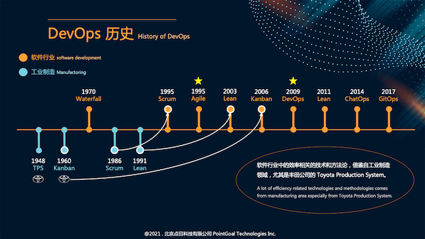
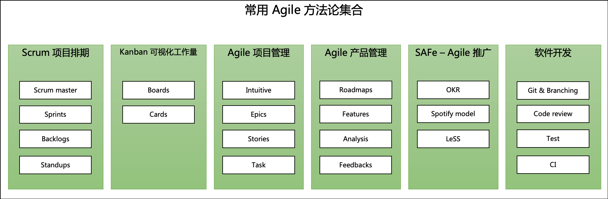
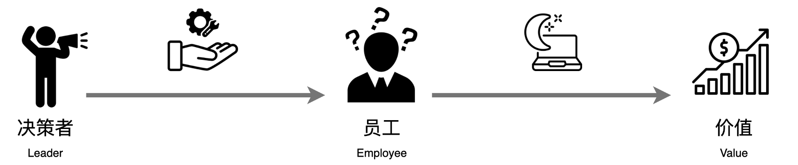
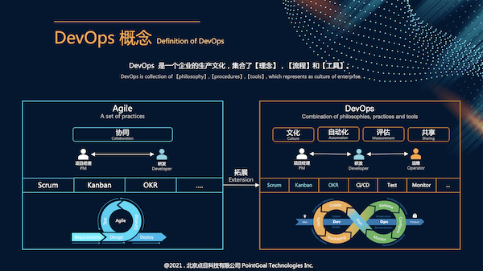

# 从员工的角度理解 DevOps
> 问：为什么从员工的角度出发？
>
> 答：如果从领导者的角度解释，说着说着，我们会逐渐开始【唱高调，提出正确的废话】，对于员工来说，根本无法体会。

DevOps 是一个非常模凌两可的概念，主流大公司针对于 DevOps 都有自己的解释，写得也很抽象，大家可以自行参考一下。
- [亚马逊](https://aws.amazon.com/devops/what-is-devops/)
- [谷歌](https://cloud.google.com/devops#section-2)
- [微软](https://azure.microsoft.com/en-gb/overview/what-is-devops/#devops-overview)
- [Atlassian](https://www.atlassian.com/devops/what-is-devops/benefits-of-devops)

## 历史演变
既然 DevOps 的概念不太好理解，那我们就看一下【软件研发流程】的历史变迁。

我们接触到的名词，例如，Agile, Lean, Kanban, Scrum 的根源，其实来源于 TPS（丰田生产系统）。不少的概念和模式都是受到 TPS 的启发。

所以，Agile（敏捷开发）或者 Lean（精益开发）并不是软件领域的大佬们凭空想出来的，而是由工业制造领域得到了验证。

> 这里，我们要消除掉第一个疑虑！
>
> Agile（敏捷开发），Lean（精益开发），DevOps 等等，的的确确**有好处**的，并不是唱高调。

## 名词解释
在继续阅读之前，让我们先用最通俗的语言来解释【软件研发流程】一系列名词。

| 名词 | 解释 |
| --- | --- |
| Waterfall | 一气合成地开发方式，一口气完成整个开发流程。|
| Agile（敏捷开发） | 项目管理，产品研发流程方法论集合。  解决的问题：生产流程优化，团队协同。 |
| Epics | 属于 Agile，工作的度量单位。 比方说，开发一套线上点餐系统，就属于一个 Epics。|
| Stories | 属于 Agile，工作的度量单位。 比方说，点餐系统中的登陆逻辑，就属于一个 Story。|
| Task | 属于 Agile，工作的度量单位。 比方说，点餐系统中,登陆逻辑中的二维码登陆功能，就属于一个 Task。|
| SAFe | Scaled agile framework。 解决的问题：如何在整个企业中推广 Agile |
| Scrum | Agile 的延伸，项目排期方法论。 解决的问题：项目排期。 |
| Scrum master | 属于 Scrum，负责 Scrum 的有序进行的人，千万不要只让 Leader 去当，要所有人轮流。 解决的问题：确保项目进度。 |
| Sprints | 属于 Scrum，一种时间单位，一般为2周，比如以2周围单位，进行项目进度总结。 解决的问题：项目排期。 |
| Backlogs | 属于 Scrum，代办列表。 解决的问题：记录工作中出现的，需要高优解决的问题。|
| Standups | 属于 Scrum，站会，每天早上进行的简短会议。 解决的问题：共享工作信息。|
| Kanban | 可视化工作量和工作进度的方法论。 解决的问题：以可视化的方式排期，提高效率。 |
| Lean（精益开发）| Agile 的延伸。 解决的问题：优化产品研发成本。 |
| DevOps | 补充了 Agile（敏捷开发）缺失的部分，一种 IT 企业文化。 解决的问题：全方位提升企业效率。|
| ChatOps | DevOps 的分支，通过 Chat 工具，进行运维。 解决的问题：让流程透明化。 |
| GitOps | DevOps 的分支，把部署流程写到代码库的方式。 解决的问题：让开发者涉及到运维当中。|
| FinOps | DevOps 的分支，云财务运营。 解决的问题：节约云资源成本。|
| AiOps | DevOps 的分支，把 AI 技术融合到运维中，孵化期。 |

有了上面的名词解释，我们就可以继续往下走了。

## 理解 Agile（敏捷开发）
在进一步阐述 DevOps 之前，我们先要了解 Agile（敏捷开发），因为 DevOps 是 Agile 的一个扩展。

我相信很多人已经在公司里参与到了 Agile，不过没有什么感觉而已，甚至，不少时候，我们认为的【浪费时间】的一些操作，有可能就是 Agile 的一部分。

之前我们提到过，Agile 是研发流程方法论的集合，先来看看 Agile 中最常用的方法论结合吧。

是不是很熟悉，好多经常听到的名词和流程。其实我们平时在公司里接触到的操作，就是 Agile 的一部分。

> 当然，如果我们对公司里进行的 Agile 模式感到厌倦，不是因为 Agile 本身，而是 Agile 的应用方式出了差错。
>
> 就好比，火锅本身是好吃的，厨师把火锅做的难以入口，就不应该怪火锅。

Agile 的方法论集合里，包含了项目排期，项目管理，产品管理，工作量评估，软件开发，个人绩效等方面。也有其他的一些，不过这里我们不细讲。

知道了 Agile 里有哪些方法论，也可以推导出，Agile 里使用者有哪些。
- 产品经理
- 项目经理
- 研发，测试
- 团队 Leader

### 员工疑问
谈到这里，我们就可以得出那一系列问题的答案。
大家都是员工，凭心而论，大家应该都有过下面的疑问，我就是其中之一。

> 问1：为啥我们的团队在进行 Agile，不过没啥效果？
> 
> 问2：天天做 Agile，还不如多写几行代码！
>
> 问3：产品经理，项目经理天天只会画表格，到底在干什么？
>
> 问4：公司干嘛要推 Agile？
> 
> 问5：每次周会都要做什么表格来汇报，直接说不行吗？
>
> 问6：OKR 是个什么东西？年终绩效，还不是看谁和老板关系好？

### 疑问解答
在了引入 Agile 的时候，**环节**出了问题。而不是在员工。

我们的决策者们，发一封内部邮件，做一次全员大会，组内大会，就开始推广 Agile 了。

之后，你会看见公司内网上多了几个买过来的 Agile 产品。

**问题来了**：东西买来了，我该怎么用？不少决策者是没有考虑到这个的。

正确的做法是，产品 + 说明书 + 培训。我们缺少的就是，【说明书】+【培训】这个环节。

> 就好比，我发给了你一支枪，没教你怎么打仗，上去就是活靶子。

## 开始讲讲 DevOps
我们用通俗的方式介绍了一下 Agile，现在开始讲讲 DevOps，老办法，用大白话来讲。

> DevOps 是 Agile 的一个延伸产物，最终形态是【企业生产文化】。
> 
> 如果说，Agile 的使用者包含了【产品经理，项目经理，研发&测试，团队 Leader】，那么，DevOps 把【运维】【决策者】这个角色也引入了进来。
>
> 如果说，Agile 的方法论集中在了【项目管理】【产品管理】【团队管理】【软件研发】，那么，DevOps 补充了【产品运维】【客户管理】。
>
> 如果说，Agile 的核心在于【团队协同】，那么，DevOps 的核心在于【自动化】【文化】【评估】【共享】。
> 
> 如果说，Agile 对于生产线的流程是【协同作战】，那么，DevOps 在这个流程之上，注重了【闭环】。

让我们一个一个展开来看看。

### DevOps 使用者
我们诚实地讲，一个公司要是引入了 Agile，最开始活跃的是项目经理和团队 Leader。

为啥？看一下 Agile 方法论集合，大多数集中在了项目管理那一层。

至于研发体系下的员工，工作内容没啥区别。不过，要想一想，一个 IT 公司，人最多的是研发体系下的人。

这个会引入一个很大的团队内部矛盾。
【研发体系员工】和【产品体系员工】相互看不上，互怼，这种现象仿佛已经成了必然，都成了段子。

这些矛盾从何而来？简单点儿说，就是：我们产品线都引入了这么先进的方法论，你们研发线的生产力咋跟不上？

所以，DevOps 在 Agile 之上，把研发，测试，运维体系也纳入了进来。把整个生产线都做了一个闭环。

> 说白了，要进步，得大伙儿一起进步，不是说项目管理方法进步了，你的项目就进步了，这是不合理的。

### DevOps 方法论
除了使用者得到了扩展，方法论方面也得到了扩展。Agile 的方法论集中在【我咋能把这事儿计划好】，DevOps 拓展成了【我咋能把事儿做好】。

除了项目管理层面的方法论，DevOps 还拓展了如下几个方面。
- 测试
- CI/CD
- 监控告警
- 服务运维
- 服务评估

我们在后续的文章中会重点介绍几大方法论。这里就先有个了解。

### DevOps 核心
说到核心，网上的 Agile 的核心很多，大家也有自己的看法。不过，我们认为，Agile 的核心就是【团队协同】。

从哪里可以看出来？最简单的方法就是看那些 Agile 的产品。

即时聊天平台（企业微信，钉钉，飞书），团队文档平台（Confluence），项目管理平台（Jira，Trello，Kanban）。这些产品的核心就是【促进团队协同】。

DevOps 既然是 Agile 的一个拓展，那么自然要比 Agile 丰富了不少。总共有4个大核心，叫做 CAMS。
- 文化 Culture
- 自动化 Automation
- 评估 Measurement
- 共享 Sharing

怎么去理解这四个核心？就那你现在的团队或者公司做个比较，来回答一下这个问题吧。我们举几个例子。

- 还记得你们公司的文化口号是啥吗？
- 公司对于员工在工作时出错，是一个怎么样的处理方式？
- 公司对于普通员工的学习是一个怎么样的文化？
- 从项目开始到项目交付，所有环节的自动化是怎么样的？
- 对于每一个产品，每一个人，每一项工作，公司是怎么评估的？是否使用了客观数据？
- 公司内部有没有共享知识的平台（这里不是指八卦共享平台）？
- 每个事故是否都会共享给其他团队？

上面的这些问题，看似不重要，不过正是一个企业健康发展，员工满意的一个核心指标嘛。

DevOps 就是要解决这类问题。

### DevOps 流程
DevOps 的流程就是我们经常看到的那个像八卦图一样的东西。

也有不少人认为，DevOps 的流程就是把测试，运维职位干掉，让研发做所有的事情。当然，像 Amazon，Google 确实是如此。

不过，我们的建议是：根据企业/团队自身情况来判断。

简单点来说，Amazon，Google 能做到这一点，是因为人家的自动化，评估，共享，文化这些做的比较完善，并且员工可以站在【巨人，也就是技术大佬】的肩膀上工作。
我们可不行，所以，不要一刀切。按照实际情况，一点一点改变。

所以，DevOps 流程的最重要的一点在于【自动化】和【评估】。DevOps 的理念中，要把所有的流程尽量做成自动化，并且可以随时观察。这可是个大工程，不是随便买一套产品就可以的。

#### 顺便聊一聊：一站式平台
针对于企业效率提升，国内好像非常喜欢推出一站式平台，就是把所有东西都塞到一起，就在一个网站上操作。

说一说我的观点。

一站式的优点比较明确（还是用大白话讲）。
- 一下子就能展现成果，我花了1个月的时间，就搭建了一个企业效率平台。
- 企业不用花经历去搞企业效率提升的东西。
- 不太熟悉企业效率提升的知识，但是就能立刻上手。
- 跟着流行趋势走

不过，我的观点有所不同，一站式虽然能快速搭建，不过，效果却不怎么样。还是老问题，你只给我工具，没教我怎么用。就好比，只学会了招式，心法没学。

此外，一站式就意味着封闭，无论是，流程还是底层技术，人家给你什么，你就用什么。到时候，有新技术出来，又得逼着人家给你出一个新版本。

还有就是，每个团队，对于流程的理解，需求不一样，根本无法用同样的流程来走。

所以，个人认为，一站式有它的好处，不过，从长远角度看，一站式未必是个好东西。个人更推荐把单个产品引入进来，自行根据需要搭建。虽然会花一些精力，财力。
不过，在这个过程中，既能学到新东西，也能按照本身条件来搭建，产品线的核心流程也会掌握在自己手里，还能根据技术潮流，随时更新底层框架。更甚至，如果流程是自己的，后续换大方向也是很容易的事情。

## 总结
Agile，DevOps，Lean 这些都不是凭空想出来的东西，而是在工业领域得到过验证的。

想提升企业效率，提高员工幸福感，不是买一套产品就能解决的。

企业最重要的还是员工，提升企业效率的基础，不是让挤压员工，而是把【人】，【工具】，【规矩】用得恰到好处。

