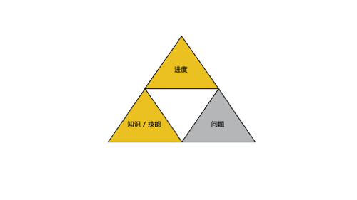
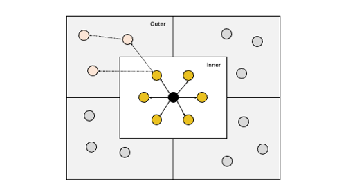

# DevOps 共享篇：最佳共享方式

DevOps 的核心原则由四个部分组成，称之为 CAMS。

- 文化 Culture
- 自动化 Automation
- 评估 Measurement
- 共享 Sharing

其中，共享是【都想做】，【都在做】，又没什么【效果】的一个部分。

首先阐述我们对于【共享】观点：

> 共享【问题】，而不是单调乏味的知识分享。

# 共享的目的
企业内部实现共享的根本目的，是为了提升企业竞争力，即，企业解决问题的能力。也就是不断优化企业员工/机制/流程。
说得更白一点，就是提升员工能力。

# 共享的内容
共享在企业内部的作用，我们就不做阐述了，重要性大家都有所了解。先分析一下【可共享】的内容。

- 进度：项目进度。我们一直进行的站会，周会，年会其实都是在共享进度。
- 知识/技能：这类共享最为常见，比方说，公司内部的系统设计分享，优秀销售事迹分享。
- 问题：处于共享的灰色地带，很少有团队愿意把【不好的】东西共享出来。

在亚马逊的共享体系中，最有意思的就是【问题】的共享。业务发展越快，问题出现的概率就越高，每天都会出现大大小小的问题，客户问题，产品问题，流程问题，销售问题，财务问题等等。

对于问题，最好的态度应是：发现问题，解决问题，吸取经验，分享经验。不过，很多时候，因为害怕但责，问题停滞在了【解决问题】的阶段，并没有继续往后走。

亚马逊对于这些问题保持了比较【透明】的态度。在亚马逊内部，有一个叫 COE 的共享机制，就是我们常说的【复盘】。亚马逊把 COE 透明化到了全公司级别，有时候是对外公开级别。

COE 的特点：
- 只要是影响到了服务 SLA，差不多都会安排 COE
- 负责 COE 共享会议的人，一般为事故/问题出现时的 On-call（也就是值班人员）
- 负责 COE 共享会议的人，按照时间点，准备好材料（不是 PPT，而是文档），把时间，操作历史，客户反馈等信息全部记录在案。
- COE 材料全公司公开
- 邀请高级别 Leader/ Technical Leader 参会
- 重大事故，在全公司直播
- 只谈问题经过，root cause，修改建议。
- 即使员工做了 COE，不会对绩效有负面影响。

亚马逊对于 COE 的做法，对于员工和公司文化发展，也起到了积极作用。

COE 的好处：
- 员工不在害怕犯错误，敢于承担，每个员工慢慢会接受【Ownership】的公司文化。
- 员工对于问题的态度，不再是【盖住问题】，而是公开，解决，共享。不知不觉中，【诚实度】得到了提升。
- 知识/技能通过问题传播，传播范围更广，我们稍后介绍。

# 最佳传播方式
其实有一句名言，可以解释最佳传播方式：【好事不出门，坏事传千里】。

我们打个比方，有两个会议：
-【某团队攻坚 XX 大客户成功案例】
-【某产品故障 2个小时复盘会】

我想大家会更愿意去听一听【事故】的会议。倒不是说，事故复盘会里有更多的知识点，而是我们的本能会对这类【谈资】更有兴趣。而且，会有一个一传十，十传百的意外效果。

对于分享的效果，当然是传播的越广泛越好。如果只是简简单单的【Java 高并发实战】分享，是没有办法传播到 Outer Space 中，影响范围局限在了 Inner Space。

如果是【XX 产品高并发缺陷，引发的事故复盘】，则会有一定概率让人们八卦一句：【你听说 XX 团队的那个事故了吗？他们原来是这么弄的】。
通过这类问题共享，可以更吸引听众，再通过客观的梳理分析，分享内部技术/流程等优化，以达到分享的最优效果。

亚马逊也有知识分享会，除非是业界大牛的分享会，一般团队的分享，其实去的人也比较少，传播范围也局限在团队内部。

反而是，公司级别的 COE，大家都喜欢去听。而且，通过别人的问题，找到共性，进而改进自己的产品。

如果大家对消息传播有兴趣，可以参考： [Fake news propagates differently from real news even at early stages of spreading](https://www.semanticscholar.org/paper/Fake-news-propagates-differently-from-real-news-at-Zhao-Zhao/14dbb2411fdc974fb1593eafaeb806faf9d29a45) 

# 总结
我们之前探讨了分享的类别和最佳分享方式。

| 共享内容 | 共享方式 | 观点 |
| --- | --- | --- |
| 流程 | 站会，例会 | 必要，在共享体系统，占50%以上。|
| 知识/技能 | 知识分享会 | 可选，不要太多，占10%左右，很多时候，是分享者在巩固学习内容，而不是听众。|
| 问题 | 复盘会 | 必要，让问题引出解决方案，知识点。传播更广，让员工不再【惧怕】问题。|
