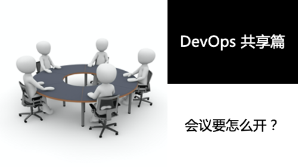
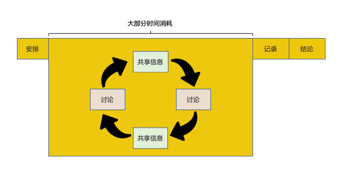
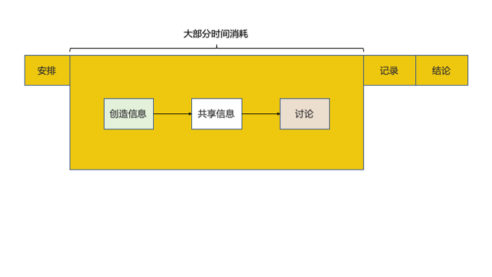

# DevOps 共享篇：会议要怎么开？

一旦踏入工作岗位之后，我们不可避免地要开会。随着工作经验的积累，职位的上升，开会的频率会越来越高。

我们通过亚马逊的会议文化，分析一下【一个有效率的会议】应该是如何的。

# 会议的分类
根据不同的行业，团队，项目，Leader，会有各式各样的会议类型，会议的类型来源于企业/团队的文化，由【决策者】制定。

这篇文章，我们不对会议的类型做讨论，我们主要讨论【如何有效率地开会】。

| 会议类型 | 例子 |解释 |
| --- | --- | --- |
| 状态更新 | 站会，周会，例会 | 最常见的会议类型之一。包括定期的团队和项目会议，其主要目标是通过更新进度、挑战和后续步骤来协调团队。在这类会议中常见的小组活动是解决问题、决策、确定优先级和任务分配。 |
| 信息共享 | 知识分享 | 演示、信息共享会议、辩论、主题演讲和讲座都是例子。这些会议的主要目标是让演讲者与与会者分享信息。 |
| 决策 | 立项会 | 通过讨论，得出业务相关的决策。 |
| 解决问题 | 复盘 | 最复杂和最多样化的会议类型。无论会议是解决已确定的问题，还是专注于制定应对未来的战略和计划，需要集思广益、评估和商定可能的解决方案。|
| 创新 | 头脑风暴 | 通常从跳出思维定式开始，通过集思广益分享想法。|
| 团队建设 | 年会，团建 | 例如全员会议，启动会议，团建，公司活动。 |

# 开会的目的
根据不同的会议，我们会有不同的预期。在绝大部分的会议中，我们最终要得到的结果就是：
- 因为何种理由（Why）
- 什么时候（When）
- 由谁（Who）
- 在哪里（Where）
- 做什么（What）

因此，会议在进行 & 结束的时候，我们需要得到【5W】结论。

当然，如果是类似【信息共享】的会议，最终的目的就不是【5W】。可以参考之前的文章 [DevOps 共享篇：最佳共享方式]()。

# 为什么会议会产生低效？

根据上面的流程图可以看出，会议中的绝大部分时间是【信息共享】与【讨论】的循环。

举个例子，准备了会议 PPT，在讲 PPT 的过程中，时不时会被打断，然后，神不知鬼不觉，我们开始讨论起了其他的问题。

最终的结果，要么是因为时间问题，会议结束，没有得出任何结果，**安排下一次会议**。要么是**延长会议时间**。

> **为什么会这样？**
> 
> 进行任何的讨论，一个核心基础是，大家要在同一个起跑线上，也就是说，参会者的信息储备要在同一个级别上。
>
> 讲 PPT 的过程中，参会者在边听边储备信息量，遇到不理解的地方，会打断主讲人，进入一个循环。
>
> 其实，很多疑问在后几页的 PPT 中已经有介绍。

# 亚马逊如何解决？
大家可以参考此视频：[贝索斯谈亚马逊会议](https://v.qq.com/x/page/v3304g3tfsb.html)

在亚马逊的会议文化里，有两个特点。

- 没有 PPT，使用文档替代
- 开会前，大家不说话，用10分钟左右的时间，阅读文档，储备信息

亚马逊的做法，其实就是打破了【信息共享】和【讨论】之间的无限循环。

这么做有几个好处：
- 打破【信息共享】和【讨论】之间的无限循环
- 消除了 PPT 形式主义
- 共享信息量更全
- 会议时间可控
- 主会者的付出更容易得到尊重
- 更容易得出会议结论

# 总结
我们通过亚马逊的例子，分析了【高效】的会议的建议。这篇文章中，我们并没有分析【站会】，会在后续的文章中继续讨论。

简单来讲，会议提效，要设法在短时间内，把更多的信息量共享出来，并得出下一步的工作计划。大家可以在日常会议中进行实践。