# 必了解的 DevOps 工具链集合 2021（全）
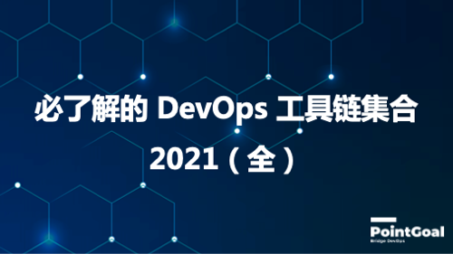

通过10几年的发展，DevOps 逐渐步入成熟期，根据 Google 的搜索统计，【DevOps 工具】搜索量一直呈现增长趋势。
DevOps 涵盖了整个软件开发的生命周期，因此，相应的工具链生态也非常丰富。然而，没有任何一个工具可以涵盖所有流程，适合所有环境。

目前，【码农】这个词汇成了软件工程师的一个代名词，个人不是特别喜欢这个词汇。

优秀的软件工程师应该是一个问题的【发现者，解决者】，而不是任务的【接受者，完成者】。

如果想要成功转型称为【Problem Resolver】，就需要了解 DevOps 工具链，并熟练掌握其用法。

今天，我们就来看看，目前有哪些流行的工具。

> 在后续的文章中，我们会介绍如何【$0】开销搭建一个小规模 DevOps 全工具链。

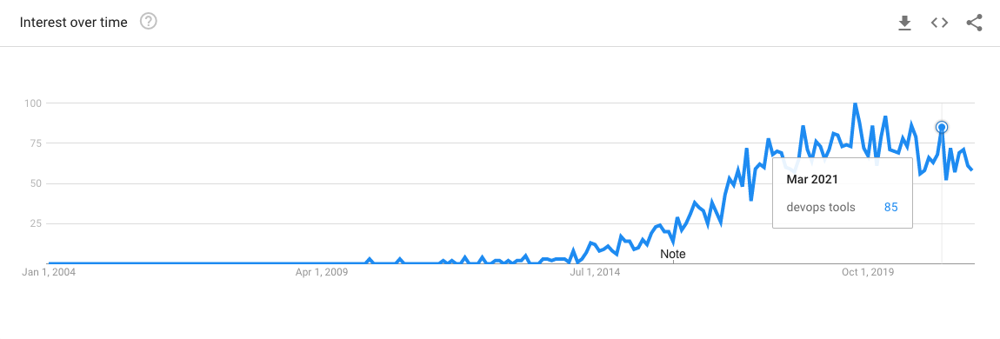

我们以软件开发的【生命周期】为基准，看看每个阶段有哪些流行的工具。为了能够更好的展示，细分一下每个流程。

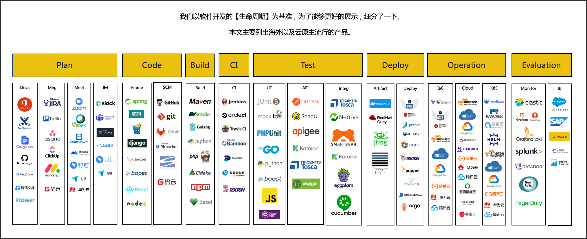

## 项目管理（Plan）

这个阶段属于 Agile 的范畴，解决的问题是【如何把工作规划好】。

我们主要调研文档系统，项目管理系统，会议系统，即时通讯系统。

### 文档工具：Microsoft 365
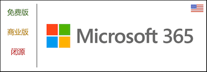

> 应该是目前应用最广泛的文档工具，随着线上文档平台的需求，Office 也逐渐推出了云版本。

**功能方面，不用我们再介绍了，包含了 Word，PowerPoint，Outlook，Excel 等众多产品。**

- [官网](https://www.office.com/)
- [教程](https://www.office.com/)

使用了订阅的方式。包含家庭版，商用版。根据不同的功能，收取的费用也不一样，起步价 $5。[详情](https://www.microsoft.com/en-sg/microsoft-365/buy/compare-all-microsoft-365-products-b)

### 文档工具：Confluence

> Confluence 由澳大利亚公司 Atlassian 开发，使用Java编写。
>
> 2004年3月25日推出 Confluence，Confluence已整合为群组软件的一部分，可以搭配JIRA或其他 Atlassian 的产品，包括 Bamboo, Clover,Crowd, Crucible,和Fisheye 使用。

**以个人的经验，Confluence 是现今最好用的一款企业 Wiki 应用，国内很多大公司也都在使用 Confluence。提供私有化 & SaaS 版本。**

- [官网](https://www.atlassian.com/software/confluence)
- [教程](https://www.atlassian.com/software/confluence/guides)

| 功能 | 介绍 |
| --- | --- |
| 知识库 | [详细描述](https://www.atlassian.com/software/confluence/features) |
| 协作 | [详细描述](https://www.atlassian.com/software/confluence/features) |
| 共享 | [详细描述](https://www.atlassian.com/software/confluence/features) |

使用了订阅 & 私有化的方式。有免费版，标准版，高级版，企业版。根据不同的功能，收取的费用也不一样。起步价 $5/用户。[详情](https://www.atlassian.com/software/confluence/pricing)

### 文档工具：Google docs

> Google Docs起源自两个独立的产品：Writely 和 XL2Web。
>
> Writely 是由软件公司 Upstartle 于2005年8月推出的文本处理器。2006年3月9日，Google宣布收购 Upstartle。
>
> 2010年3月，Google收购在线文档协作公司 DocVerse。DocVerse的产品能让多用户在线共同编辑Microsoft Word以及Microsoft Excel和Microsoft PowerPoint。
>
> 2012年6月，Google收购 Quickoffice，该公司的产品能让用户在移动设备上编辑Microsoft Word以及Microsoft Excel和Microsoft PowerPoint。
>
> 2012年10月，Google Documents更名为Google Docs[7]。

**小规模海外团队适合使用，国内无法使用，不推荐。**

- [官网](https://www.google.com/docs/about/)
- [教程](https://www.google.com/docs/about/)

### 文档工具：Github Pages

> GitHub Pages 是 GitHub 自 2008 年以来向 GitHub 用户提供的静态 Web 托管服务，用于托管用户博客、项目文档，甚至作为页面创建的整本书。

**适合开源项目的文档，不推荐内部使用。**

- [官网](https://pages.github.com/)
- [教程](https://pages.github.com/)

### 文档工具：PingCode
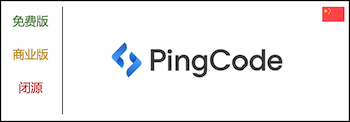

> PingCode是由国内老牌SaaS厂商 Worktile 打造的智能化研发管理工具。
>
> PingCode 隶属于北京易成时代科技有限公司。

**国内发展比较久的一款应用，支持 SaaS & 私有化版本。**

- [官网](https://pingcode.com/)
- [教程](https://pingcode.com/)

使用了订阅 & 私有化的方式。有免费版，团队版，企业版，私有部署版。根据不同的功能，收取的费用也不一样。起步价 ¥199 /用户/年。[详情](https://pingcode.com/product/wiki)

比起海外的 SaaS 应用，国内使用时，速度是一个很大的优势。

### 文档工具：Tower

> ONES 旗下的 Tower 文档工具。

**国内发展很好的一家公司，支持 SaaS & 私有化版本。**

- [官网](https://tower.im/)
- [教程](https://tower.im/guides)

使用了订阅 & 私有化的方式。有免费版，团队版，企业版，私有部署版。根据不同的功能，收取的费用也不一样。起步价 ¥199 /用户/年。[详情](https://pingcode.com/product/wiki)

比起海外的 SaaS 应用，国内使用时，速度是一个很大的优势。

### 文档工具：腾讯文档

> 腾讯文档是一款可多人同时编辑的在线文档，支持在线Word/Excel/PPT/PDF/收集表/思维导图/流程图多种类型。
>
> 可以在电脑端（PC客户端、腾讯文档网页版）、移动端（腾讯文档App、腾讯文档微信/QQ小程序）、iPad（腾讯文档APP）等多类型设备上随时随地查看和修改文档。
>
> 打开网页就能查看和编辑，云端实时保存，权限安全可控。

**腾讯出品的在线文档平台。中小规模团队，开源项目推荐使用。目前免费。**

- [官网](https://docs.qq.com/)
- [教程](https://docs.qq.com/)

### 项目管理：Jira

> 澳大利亚 Atlassian 公司出品。JIRA这个名字并不是一个缩写，而是截取自 “Gojira”，日文的哥斯拉发音。
>
> 2002年发布第一个版本。

**老牌项目管理应用，用户群体庞大。支持 SaaS 版本和私有化版。**

- [官网](https://www.atlassian.com/software/jira)
- [教程](https://www.atlassian.com/software/jira/guides)

功能非常庞大，我们这里就不一一列举了，网上的介绍，视频也非常多，大家可以了解一下。不太适合小规模团队使用，因为功能庞大，小规模团队用不上。

使用了订阅 & 私有化的方式。有免费版，标准版，高级版，企业版。根据不同的功能，收取的费用也不一样。起步价 $7.5/用户/月。[详情](https://www.atlassian.com/software/jira/pricing)

### 项目管理：Trello

> Trello 是基于 Web 的看板式列表制作应用程序，是 Atlassian 的子公司。
>
> 最初由 Fog Creek Software 于 2011 年创建，于 2014 年分拆为独立公司的基础，
>
> 后来于 2017 年 1 月出售给 Atlassian。

**Trello 是海外互联网企业常用的一款项目追踪/管理的应用。主要以 Kanban 的形式呈现，比较直观，适合各种团队使用。**

- [官网](https://trello.com/)
- [教程](https://trello.com/en/guide)

如果团队希望使用 Kanban 模式，推荐使用 Trello。

使用了订阅 & 私有化的方式。有免费版，标准版，高级版，企业版。根据不同的功能，收取的费用也不一样。起步价 $5 /用户/月。[详情](https://trello.com/en/pricing)

### 项目管理：Asana

> 2008年达斯廷·莫斯科维茨离开Facebook，与贾斯丁·罗森斯坦一起创办了阿萨纳。在Facebook时，他们一起工作以改善其员工的工作效率。
>
> 2012年4月，Asana 把它们的 API 开放给了第三方开发者。
>
> 有Asana账户的任何人都可以免费使用其应用程序接口（API），通过他们的开发者网站来使用其应用程序接口。

**功能丰富，很多大公司在使用这款产品。**

- [官网](https://asana.com/)
- [教程](https://asana.com/pricing)

使用了订阅的方式。有免费版，标准版，高级版，商业版。根据不同的功能，收取的费用也不一样。起步价 $10.99 /用户/月。[详情](https://asana.com/pricing)    

### 项目管理：ClickUp

> 2017年成立与美国，目前为C轮融资，是一个快速成长的公司。

**功能丰富，UI 界面简单易用。**

- [官网](https://clickup.com/)
- [教程](https://docs.clickup.com/en/)

使用了订阅的方式。有免费版，标准版，商业版，商业高级版，企业版。根据不同的功能，收取的费用也不一样。起步价 $5 /用户/月。[详情](https://clickup.com/pricing)

### 项目管理：Monday.com

> Monday.com 2014 年和 2019 年 7 月推出，基于 19 亿美元的估值，该公司筹集了 1.5 亿美元。该公司于2021年6月上市。

**功能丰富，实例雄厚的公司。**

- [官网](https://monday.com/)
- [教程](https://monday.com/blog/project-management/monday-com-tutorial/)

使用了订阅的方式。有免费版，基础版，标准版，专业版，企业版。根据不同的功能，收取的费用也不一样。起步价 $8 /用户/月。[详情](https://monday.com/pricing)

### 项目管理：国产
国内的项目管理产品也非常多，我们这里只列出云厂商的几款。

| 产品 | 链接 |
| --- | --- |
| 阿里云 | [云效](https://cn.aliyun.com/product/yunxiao/project) |
| 腾讯云 | [Coding 项目管理](https://cloud.tencent.com/product/coding-pm) |
| 腾讯云 | [TAPD](https://www.tapd.cn/) |
| 华为云 | [云项目管理](https://www.huaweicloud.com/theme/459571-1-Y) |
| Gitee | [Gitee](https://gitee.com/enterprises) |

### 即时通讯
即时通讯平台是必不可少的一个关键产品，关乎到【共享】企业文化。不过，企业级别的即时通讯需求比To C端要复杂一些，需要和各种 DevOps 系统整合。

我们介绍几款最流行的企业级别即时通讯工具。

大部分即时通讯类产品都提供了范围很广的免费套餐，中小规模团队应该是足够使用的。至于选型，可根据个人喜好来选择。

| 产品 | 描述 |
| --- | --- |
| [Slack](https://slack.com) | Slack是由Slack技术所开发的一款基于云端运算的即时通讯软件，2013年8月正式推出。|
| [Microsoft Teams](https://teams.microsoft.com) | Microsoft Teams是一个通信和协作软件，它集成了聊天、视频会议、 文件存储 (包括文件协作)、Office 365等功能。|
| [Chime](https://aws.amazon.com/chime) | 是一种通信服务，可让您在组织内外会面、聊天和拨打业务电话，所有这些都使用单个应用程序。|
| [企业微信](https://work.weixin.qq.com) | 腾讯出品的企业级即时通信产品。|
| [钉钉](https://www.dingtalk.com/) | 阿里出品的企业级即时通信产品。|
| [飞书](https://www.feishu.cn/) | 字节跳动出品的企业级即时通信产品。|

### 会议系统（Meeting）
在疫情散播之前，会议系统其实没有得到那么大的重视。疫情之前，对于远程会议，大公司一般会使用 Cisco WebEx。小公司直接用 IM 语音解决。

随着远程办公的需求日益增大，对于会议系统的要求也很丰富。这也是腾讯会议，钉钉会议等国内产品，去年开始突然发力的原因。

### 会议系统：Zoom

> Zoom由袁征(美籍华人)于2011年成立，他原是一名来自思科的首席工程师及其协作业务部门WebEx。
>
> 2013年1月开始推出Zoom服务，已经上市。

Zoom 目前是全球最有影响力的会议系统的品牌之一，以 SaaS 的方式提供服务。

- [官网](https://zoom.us/)
- [教程](https://support.zoom.us/hc/en-us/articles/206618765-Zoom-video-tutorials)

除了视频会议，还提供了一会录制，美颜，日程安排等配套的功能。

使用了订阅的方式。有免费版，专业版，商业版，企业版。根据不同的功能，收取的费用也不一样。起步价为 $14.99 /月 [详情](https://zoom.us/pricing)

### 会议系统：WebEx
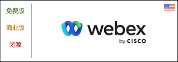

> 最初于1996年由Subrah Iyar和朱敏以ActiveTouch创建。 
>
> 2007年3月15日，思科系统公司宣布将以32亿美元的价格收购Webex。

WebEx 是最老牌的会议系统，以至于在疫情之前，很多大公司使用的都是 WebEx，可见其影响力。我们在会议室里看到会议设备，大部分都是 WebEx 产品。
随着疫情的蔓延，WebEx 也积极推动了免费服务。

- [官网](https://www.webex.com/)
- [教程](https://help.webex.com/en-US/article/nrebr3c/Get-started-with-Webex-Meetings-for-hosts)

使用了订阅 & 私有化的方式。有免费版，入门版，商业版，企业版。根据不同的功能，收取的费用也不一样。起步价为 $13.50 /月 [详情](https://mediafiles.webex.com/zh-tw/pricing/index.html)

### 会议系统：腾讯会议

> 2019年12月正式对外发布，目前有中国版（腾讯会议）以及国际版（voov）。

在疫情期间，腾讯会议对于远程协同办公起了非常重要的作用，在此期间全程免费使用。

- [官网](https://meeting.tencent.com/)
- [教程](https://meeting.tencent.com/support.html)

腾讯会议包含了会议系统应该有的大部分功能。

使用了订阅 & 私有化的方式。有个人版，商业版，企业版，腾讯会议 Rooms。根据不同的功能，收取的费用也不一样。起步价为 ¥399 /月 [详情](https://meeting.tencent.com/buy.html)

### 会议系统：钉钉

> 2014年5月，钉钉在阿里巴巴内部立项。钉钉是一个即时通讯系统，里面包含了会议的功能。

在疫情期间，钉钉对于远程协同办公起了非常重要的作用。

- [官网](https://www.dingtalk.com/)
- [教程](https://alidocs.dingtalk.com/i/p/Y7kmbokZp3pgGLq2)

钉钉包含了会议系统应该有的大部分功能。

收费模式请参考官网。

### 会议系统：飞书

> 飞书，字节跳动旗下企业协作平台，将即时沟通、智能日历、音视频会议、OKR、飞书文档和工作台深度整合，通过开放兼容平台，让成员在一处即可实现高效的沟通和流畅的协作，全方位提升企业效率。
>
> 目前有中国版（飞书）以及国际版（lark）。

- [官网](https://www.feishu.cn/)
- [教程](https://www.feishu.cn/hc/zh-CN/)

飞书包含了会议系统应该有的大部分功能。

收费模式请参考官网。

## 代码（Code）

代码相关的工具更为繁多，这里我们讨论代码仓库。

代码仓库主要分为 SaaS 和私有化两种模式，如果是规模大的公司/团队，可以考虑使用私有化，即使是私有化，也建议部署在云环境中。除非是对代码有着高安全性要求。

个人建议，如果是开源项目，中小规模团队，使用 GitHub & Gitee，大团队/大公司，购买私有化版本的代码仓库。至于品牌，因为涉及到商业沟通，可以根据具体沟通情况而定，这里不做阐述。

### SCM 工具：Github

**如果是开源项目，或者小团队项目，建议使用 GitHub。**

> GitHub是通过Git进行版本控制的软件源代码托管服务平台，由GitHub公司（曾称Logical Awesome）的开发者Chris Wanstrath、P. J. Hyett和汤姆·普雷斯顿·沃纳使用Ruby on Rails编写而成。
>
> GitHub平台于2007年10月1日开始开发。网站于2008年2月以beta版本开始上线，4月份正式上线。
>
> 截止到2020年1月，GitHub已经有超过4000万注册用户和1.9亿代码库（包括至少2800万开源代码库），事实上已经成为了世界上最大的代码存放网站和开源社区。
>
> 2018年6月4日晚，美国科技公司微软宣布以75亿美元的股票收购GitHub。

毋庸置疑，Github 是全球最大的代码托管服务商，也是开源项目的首选代码仓库。目前，开源中国针对于国内的开源项目，也在推广[gitee](https://gitee.com/)，大家可以了解一下。

- [官网](https://github.com)
- [教程](https://docs.github.com/en)

| 功能 | 介绍 |
| --- | --- |
| 协同开发 | Git 对于协同开发有很多功能，包括 Code Review，Pull，Notification 等等。[详细描述](https://github.com/features) |
| CI/CD | 支持 CI/CD 功能. [文档](https://about.gitlab.com/features/) |
| 安全性 | 强化了代码扫描，依赖扫描等功能。[详细描述](https://about.gitlab.com/features/) |
| 监控 | 代码仓库的监控功能。[详细描述](https://about.gitlab.com/features/) |

使用了订阅的方式。有免费版，高级版，终极版。根据不同的功能，收取的费用也不一样。[详情](https://about.gitlab.com/pricing/)

### SCM 工具：Git

**大团队的话，可以使用 Git 在云上搭建自己的代码仓库，不过，需要一定的运维开销。能买私有化，售后保障的代码仓库，就不要在这上面花费精力了。**

> Git 是一个分布式版本控制软件，最初由林纳斯·托瓦兹创作，于2005年以GPL发布。最初目的是为更好地管理Linux内核开发而设计。
> 
> 2005年，安德鲁·垂鸠写了一个简单程序，可以连接BitKeeper的存储库，BitKeeper著作权拥有者拉里·麦沃伊认为安德鲁·垂鸠对BitKeeper内部使用的协议进行逆向工程，决定收回无偿使用BitKeeper的许可。
>
> Linux内核开发团队与BitMover公司进行磋商，但无法解决他们之间的歧见。
>
> 林纳斯·托瓦兹决定自行开发版本控制系统替代BitKeeper，以十天的时间编写出git第一个版本。

- [官网](https://git-scm.com/)
- [教程](https://git-scm.com/docs)

备注：由于 GitHub 可以通过 git CLI 来操作，GitHub 也包含了下面的核心功能。

| 功能 | 介绍 |
| --- | --- |
| 开源 | 免费使用 |
| 分支管理 | 通过分支的概念，实现了多人协同开发便捷性。[详情](https://git-scm.com/about/branching-and-merging) |
| 小而快 | 与 SVN 相比，Git 的性能明显优越。[详情](https://git-scm.com/about/small-and-fast) |
| 分布式 | 分布式架构，提高系统可用性。[详情](https://git-scm.com/about/distributed) |
| 数据保障 | 通过 checksum 等方式，保证数据的完整性。[详情](https://git-scm.com/about/info-assurance) |
| 集合区 | 就是我们上说的 git add, git commit。[详情](https://git-scm.com/about/staging-area) |
| 商标 | 无法直接使用带有 Git 字样的商标，不过 GitHub，GitLab 由于历史原因是被允许的，但是你不能使用类似 Git++ 这种商标。[详情](https://git-scm.com/about/trademark) |

免费，用户可以自己安装并使用。

### SCM 工具：GitLab
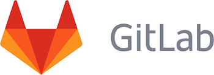

**支持私有化部署，SaaS 版本，中小团队建议使用。**

> 2011年，GitLab 由乌克兰程序员 Dmitriy Zaporozhets 和 Valery Sizov 开发，它由 Ruby 写成。后来，一部分用 Go 语言重写。
> 
> 最初，该产品命名为 GitLab，是完全免费的开源软件，按照 MIT 许可证分发。

- [官网](https://about.gitlab.com/)
- [教程](https://about.gitlab.com/get-started/)

| 功能 | 介绍 |
| --- | --- |
| 开源 | 免费使用 |
| 项目管理 | 与 GitHub 项目管理类似。[详情](https://about.gitlab.com/features/) |
| 小而快 | 与 SVN 相比，Git 的性能明显优越。[详情](https://git-scm.com/about/small-and-fast) |
| 分布式 | 分布式架构，提高系统可用性。[详情](https://git-scm.com/about/distributed) |
| 数据保障 | 通过 checksum 等方式，保证数据的完整性。[详情](https://git-scm.com/about/info-assurance) |
| 集合区 | 就是我们上说的 git add, git commit。[详情](https://git-scm.com/about/staging-area) |
| 商标 | 无法直接使用带有 Git 字样的商标，不过 GitHub，GitLab 由于历史原因是被允许的，但是你不能使用类似 Git++ 这种商标。[详情](https://git-scm.com/about/trademark) |

如果团队希望搭建自己的代码托管平台，建议使用 GitLab。

### SCM 工具：Bitbucket

**支持私有化部署，SaaS 版本，中小团队建议使用。**

> Bitbucket起初是一家独立的创业公司。
>
> 2010年9月29日，Bitbucket被风险投资公司Atlassian收购。起初，Bitbucket只提供对Mercurial项目的支持。
>
> 2011年10月3日，Bitbucket正式宣布支持Git托管。

- [官网](https://bitbucket.org/product)
- [教程](https://bitbucket.org/product/guides)

| 功能 | 介绍 |
| --- | --- |
| 免费私有仓库 | 无限数量的似有仓库数量。 |
| CI/CD | 提供 CI/CD 功能。[详情](https://bitbucket.org/product/features/pipelines) |
| 安全性 | 代码安全性扫描。[详情](https://bitbucket.org/product/features/devsecops) |

使用了订阅的方式。有免费版，标准版，高级版。根据不同的功能，收取的费用也不一样。[详情](https://bitbucket.org/produ

### SCM 工具：SVN

**老牌代码版本控制系统，不推荐使用，除非是历史原因，必须继承使用。**

> CollabNet 于2000年创建SVN项目，意在写出一款近似CVS操作方式的版本控制系统。
>
> 2009年11月，Subversion被Apache Incubator项目所接收。
>
> 2010年1月，正式成为Apache软件基金会的一个顶级项目，免费。

- [官网](https://subversion.apache.org/)
- [教程](https://subversion.apache.org/quick-start)

### SCM 工具：Gitee

**开源中国推荐的代码托管平台。国内中小团队推荐使用。如果是国内大团队，可以考虑私有化版本。**

> Gitee（码云）是开源中国于2013年推出的基于Git的代码托管和协作开发平台，提供中国本土化的代码托管服务。
> 
> Gitee 隶属于深圳奥思网络科技有限公司。

- [官网](https://gitee.com/)
- [教程](https://gitee.com/help)

| 功能 | 介绍 |
| --- | --- |
| 代码安全托管 | 安全、稳定、快速的企业级代码管理体验。[详情](https://gitee.cn/products/code.html) |
| 代码评审 | 内置基于 Pull Request 的代码评审机制从流程上完善代码准入。[详情](https://gitee.cn/products/code.html) |
| 项目协同 | [详情](https://gitee.cn/products/code.html) |

使用了SaaS 订阅，私有化部署的方式。根据不同的功能，收取的费用也不一样。[详情](https://gitee.com/enterprises)

### SCM 工具：云厂商
除了上述的几个代码托管平台，每个云厂商都有代码托管服务，这里我们列出大云厂商的代码托管服务。

好处就是可以通过云账号，直接接入代码托管，实现云原生，支持的功能也与专业代码托管平台无很大的差异。

**如果团队对于某个云厂商有强依赖，可以考虑使用云上的代码托管。**

| 云厂商 | 链接 |
| --- | --- |
| AWS | [AWS CodeCommit](https://aws.amazon.com/codecommit/) |
| Azure | [Azure Repos](https://azure.microsoft.com/en-us/services/devops/repos/) |
| Google | [Cloud Source Repositories](https://cloud.google.com/source-repositories) |
| 阿里云 | [云效代码托管](https://click.aliyun.com/se/1009965787/) |
| 腾讯云 | [工蜂](https://code.tencent.com/) |
| 腾讯云 | [Coding 代码托管](https://cloud.tencent.com/product/coding-cr) |
| 华为云 | [CodeHub](https://support.huaweicloud.com/topic/62607-1-H)

### 语言框架
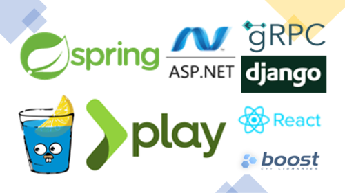

语言框架都是免费的，推荐使用流行的框架，不要使用小众的框架。并不是说小众的不好，而是很难在网上找到相关资料和问题解答。

| 语言 | 框架 |
| --- | --- |
| Java | [Spring](https://spring.io/) |
| Golang | [grpc](https://grpc.io/) 支持多语言，[gin](https://github.com/gin-gonic/gin) |
| Python | [django](https://www.djangoproject.com/) |
| PHP | [Laravel](https://laravel.com/) |
| C/C++ | [boost](https://www.boost.org/) |
| JavaScript | [react](https://reactjs.org/), [nodejs](https://nodejs.org/en/) |
| C# | [ASP.NET](https://dotnet.microsoft.com/apps/aspnet) |
| Scala | [scala](https://www.playframework.com/) |

## 编译（Build）

这里我们谈论的是依赖管理以及编译工具，而非持续构建。代码编译与代码类型强绑定，我们来介绍几个流行语言的依赖管理工具。
编译工具都是免费的。

| 语言 | 工具 |
| --- | --- |
| Java | [Maven](https://maven.apache.org/), [Gradle](https://gradle.org/) |
| Golang | [gomod](https://golang.org/ref/mod) |
| Python | [python](https://packaging.python.org/tutorials/packaging-projects/) |
| PHP | [composer](https://getcomposer.org/doc/00-intro.md) |
| C/C++ | [cmake](https://cmake.org/cmake/help/latest/guide/tutorial/index.html) |
| JavaScript | [npm](https://www.npmjs.com/) |
| C# | [NuGet](https://www.nuget.org/) |
| Scala | [sbt](https://www.scala-sbt.org/1.x/docs/Dependency-Management-Index.html) |
| 通用 | [Bazel](https://bazel.build/) |

## 持续集成（CI）

持续集成，是一种软件工程流程，是将所有软件工程师对于软件的工作副本持续集成到共享主线（mainline）的一种举措。该名称最早由葛来迪·布区（Grady Booch）在他的布区方法中提出。

持续集成中，有几个重要的原则。

1：维护一个代码库

2：自动构建

3：让构建时会自我测试

4：每人每天都应提交一次

5：每份提交都应进行建置

6：用在线环境的复本测试

7：让获取最新发布版本更容易

8：任何人都可以查看最后建置的结果

9：自动部署

我们在之前的文章中提到过，DevOps 重要的一环就是自动化，自动化里就无法避开 CI。

随着 DevOps 的发展，持续集成的软件应用也非常繁多，我们介绍几个流行的 CI 服务。

### CI 工具：Jenkins

**最老牌的 CI 工具，历史悠久，并且生态庞大。缺点就是比较老，维护成本较高。随着容器的普及，出现了更切合容器环境的 Jenkins X。**

**如果团队还没有接入容器，有历史包袱，或者短时间内没有计划接入容器的话，可以考虑使用 Jenkins，不过，本人还是建议逐渐摒弃 Jenkins 的使用和维护。**

> Jenkins是一款由Java编写的开源的持续集成工具。在与Oracle发生争执后，项目从Hudson项目复刻。
>
> Jenkins的前身是Hudson (软件)项目。Hudson 2004年夏天始创于Sun Microsystems，2005年2月首次发布于java.net。
>
> 2007年前后，Hudson被称为相对CruiseControl和其他开源的构建服务器（Build Server）更好的选择。
>
> 2008年5月的JavaOne大会上，Hudson成为“Duke选择奖”开发人员解决方案分类的得主。
>
> 2010年11月，关于由谁主导来Hudson，该项目的主要贡献者和Oracle之间展开谈判。尽管在多个方面达成一致，争议集中在是否把Hudson注册为商标，后来Oracle声明对Hudson的名字拥有权利，并在2010年12月申请将其注册为商标。
>
> 2011年1月11日，社群号召投票将项目名称从“Hudson”变更为“Jenkins”。2011年1月29日，社群投票以压倒多数批准通过该提案，创建Jenkins项目。
>
> 2011年2月1日，Oracle表示他们打算继续Hudson的开发，并认为Jenkins是Hudson的复刻，而非重命名。

- [官网](https://www.jenkins.io/)
- [教程](https://www.jenkins.io/doc/book/)

| 功能 | 介绍 |
| --- | --- |
| 免费 ||
| 持续集成/部署 | 可通过 UI 或者 .jenkinsfile 配置。[详情](https://www.jenkins.io/doc/book/) |
| 简易安装 | 多种安装方式，可在单机，K8S，多集群中部署。[详情](https://www.jenkins.io/doc/book/) |
| 配置简单 | 相对于代码，简单了不少。[详情](https://www.jenkins.io/doc/book/) |
| 插件丰富 | 生态丰富。[详情](https://www.jenkins.io/doc/book/) |

### CI 工具：CircleCI

> CircleCI 成立于 2011 年，总部位于旧金山，员工在世界各地远程工作。
>
> 目前已经到了 F 轮融资，在 CI 领域，名列前茅。

**提供免费版，很多开源项目会使用 CircleCI 作为 CI工具，如果是 GitHub 开源项目，建议使用。**

- [官网](https://circleci.com/)
- [教程](https://circleci.com/docs/2.0/tutorials/)

| 功能 | 介绍 |
| --- | --- |
| 包含了 CI 所需要的所有特性 | [详情](https://circleci.com/) |
| SaaS 服务稳定 | [详情](https://circleci.com/) |

使用了订阅的方式。有免费版，性能版，扩展版。根据不同的功能，收取的费用也不一样。起步价格在 $15/月。[详情]https://circleci.com/pricing/)

### CI 工具：Travis CI
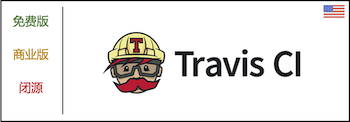

> 曾经是一款开源软件，现在核心代码已经闭源，提供 SaaS 版本。
>
> 2011年成立的一家德国公司，2019年被 Idera, Inc 收购。

**提供免费版，很多开源项目会使用 TravisCI 作为 CI工具，如果是 GitHub 开源项目，建议使用。**

- [官网](https://www.travis-ci.com/)
- [教程](https://docs.travis-ci.com/user/tutorial/)

| 功能 | 介绍 |
| --- | --- |
| 包含了 CI 所需要的所有特性 | [详情](https://docs.travis-ci.com/user/tutorial/) |

使用了订阅的方式。有免费版，性能版，扩展版。根据不同的功能，收取的费用也不一样。起步价格在 $69/月。[详情](https://www.travis-ci.com/pricing/?_gl=1*dj5o1s*_ga*MTY2NzExMzE1NC4xNjM2MDI3MTk5*_ga_XRYGSZFQ0P*MTYzNjAyNzE5Ni4xLjEuMTYzNjAyNzYyMS4yOQ..)

### CI 工具：Bamboo

**提供30天免费试用，如果希望在自己的云环境中搭建 CI 系统，建议使用，口碑良好。**

> 澳大利亚公司 Atlassian 旗下的一款 CI 产品。是一款纯私有化的产品。

- [官网](https://www.atlassian.com/software/bamboo)
- [教程](https://confluence.atlassian.com/bamboo/getting-started-with-bamboo-289277283.html)

| 功能 | 介绍 |
| --- | --- |
| 包含了 CI 所需要的所有特性 | [详情](https://confluence.atlassian.com/bamboo/getting-started-with-bamboo-289277283.html) |

使用了纯私有化方案，起步价在 $1200 美元。[详情](https://www.atlassian.com/purchase/product/bamboo-data-center)

### CI 工具：TeamCity
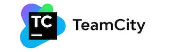

> 捷克的 Jetbrains 2006年出品的 CI 系统。Jetbrains 还出品了我们熟知的 Intellij, Goland 等 IDE。

**提供了 SaaS 版本和私有化版本，如果希望在自己的云环境中搭建 CI 系统，建议使用，口碑良好。**

- [官网](https://www.jetbrains.com/teamcity/)
- [教程](https://www.jetbrains.com/help/teamcity/getting-started-with-teamcity.html)

| 功能 | 介绍 |
| --- | --- |
| 包含了 CI 所需要的所有特性 | [详情](https://www.jetbrains.com/help/teamcity/getting-started-with-teamcity.html) |

使用了SaaS & 私有化方案，可试用14天，起步价在 $299 美元。[详情](https://www.jetbrains.com/teamcity/buy/#on-premises)

### CI 工具：Drone

> 一款开源的 CI 系统。2020年被 Harness 收购。被 Cisco，ebay，CapitalOne，vmware 等多家企业使用，口碑良好。

**提供了 SaaS 版本和私有化版本，如果希望在自己的云环境中搭建 CI 系统，建议使用，口碑良好。**

- [官网](https://www.drone.io/)
- [教程](https://docs.drone.io/)

| 功能 | 介绍 |
| --- | --- |
| 包含了 CI 所需要的所有特性 | [详情](https://docs.drone.io/) |

使用了SaaS & 私有化方案，可试用14天，起步价在 $299 美元。[详情](https://www.drone.io/enterprise/)

### CI 工具：Tekton

> 一款开源的 CI/CD 应用，针对于云原生，K8S原生设计，2019年2月发布第一个版本，目前还在持续迭代中。

**一款运行在 K8S 中的 CI/CD 系统，用 K8S Job 替代了传统 CI 系统的 Job 流程。如果希望自行搭建 CI 系统，建议使用。**

- [官网](https://tekton.dev/)
- [教程](https://tekton.dev/)

| 功能 | 介绍 |
| --- | --- |
| 针对于云原生，K8S原生设计 | [详情](https://tekton.dev/) |
| 开源社区活跃 | [详情](https://tekton.dev/) |

### CI 工具：国产
除了上述的几款国外 CI 系统之外，国内也有很多类似的厂商，包括云厂商也相继退出了自己的 CI 应用。

国内产品非常多，我们只列出几个大厂商的产品，大家可以在百度自行搜索。持续集成的技术已经非常成熟，所以不会有掉链子的情况。

不过因为国内的生态还差一点，所以如果购买，需要根据价格，售后服务等情况来判断。

| 产品 | 链接 |
| --- | --- |
| 阿里云 | [云效流水线](https://cn.aliyun.com/product/yunxiao/flow?channel=yy_sem_key_chixujicheng&utm_content=se_1009965998) |
| 腾讯云 | [Coding 持续集成](https://coding.net/products/ci) |
| 华为云 | [流水线](https://www.huaweicloud.com/theme/1074441-1-C) |
| 火山引擎 | [持续集成](https://www.huaweicloud.com/theme/1074441-1-C) |
| 网易 | [网易轻帆](https://sf.163.com/product/cicd?fromnsf=baidu_service_01952) |

## 测试（测试）

### 单元测试
我们都希望有自动生成单元测试的工具，不过，目前还没有如此神器。事实上，单元测试体现了代码的【可测试性】，所以，与源代码的质量是相关的，写好单元测试，也是写好源代码的关键之一。

我们根据不同的编程语言，看一下有哪些单元测试类工具，我们只列出最流行的几个框架。

| 语言 | 测试框架 | Mock | 
| --- | --- | --- |
| Java | [Junit](https://junit.org/junit5/) | [mockito](https://site.mockito.org/) |
| Golang | [go](https://golang.org/doc/tutorial/add-a-test) | [GoMock](https://github.com/golang/mock) |
| Python | [unittest](https://docs.python.org/3/library/unittest.html) | [unittest.mock](https://docs.python.org/3/library/unittest.mock.html) |
| PHP | [PHPUnit](https://phpunit.readthedocs.io/en/9.5/) | [Mcck](https://phpunit.de/manual/6.5/en/test-doubles.html#test-doubles.mock-objects) |
| C/C++ | [Boot.Test](https://www.boost.org/doc/libs/1_77_0/libs/test/doc/html/index.html) | [gmock](http://google.github.io/googletest/gmock_cook_book.html) |
| JavaScript | [jest](https://jestjs.io/) | [jest.Mock](https://jestjs.io/docs/mock-functions) |
| C# | [C# UT](https://docs.microsoft.com/en-us/visualstudio/test/walkthrough-creating-and-running-unit-tests-for-managed-code?view=vs-2019) | [C# Mock](https://docs.microsoft.com/en-us/archive/msdn-magazine/2004/october/unit-testing-mock-objects-to-the-rescue-test-your-net-code-with-nmock) |
| Scala| [ScalaTest](https://www.scalatest.org/user_guide/writing_your_first_test) | [ScalaMock](https://www.scalatest.org/user_guide/testing_with_mock_objects) |

### API 测试
随着 OpenAPI 的推广，API 测试也比以前规范了不少。我们列出几款流行的 API 测试工具。

| 工具 | 介绍 | 收费模式 |
| --- | --- | --- |
| [Postman](https://www.getpostman.com/) | 最流行的 API 测试工具。| 免费版 & 收费版 |
| [SoapUI](https://www.soapui.org/) | 开源 Web API 测试工具。| 免费版 |
| [Apigee](https://cloud.google.com/apigee/) | 并入 Google Cloud | 免费版 & 收费版 |
| [Katalon Studio](https://www.katalon.com) | 适用于 API、Web 应用程序、桌面应用程序和移动应用程序的免费测试自动化解决方案。| 免费版 & 收费版 |
| [Tricentis](https://www.tricentis.com/) | 整合式的测试平台。| 收费版 |

### 综合测试平台
除了最基本的单元测试和 API 测试工具，业界还提供了一整套的测试平台。

测试平台种类繁多，根据不同的业务，提供了不同的测试解决方案，比如，CDN 测试，压力测试等等。

我们这里只列出一些流行的测试平台，如果想要在国内找到相应的测试平台，最好的办法就是询问各大云平台，每个云平台都有测试服务售卖。

| 工具 | 介绍 | 收费模式 |
| --- | --- | --- |
| [Tricentis](https://www.tricentis.com/) | 整合式的测试平台。| 收费版 |
| [Neotys](https://www.neotys.com/) | API，移动端，压力等测试解决方案。| 收费版 |
| [SmartBear](https://smartbear.com/) | 提供了多种测试方案。| 收费版 |
| [Katalon Studio](https://www.katalon.com) | 适用于 API、Web 应用程序、桌面应用程序和移动应用程序的免费测试自动化解决方案。| 免费版 & 收费版 |
| [Eggplant](https://www.eggplantsoftware.com/) | 提供了多种测试方案。| 收费版 |

## 部署（Deploy）

部署可分为三种类型。

- 进程替换式：最传统的方式，通常用于物理机，就是把老进程关闭掉，再启动新的进程。
- Volume 替换式：用于云主机，把 Artifact 打包在块存储中，虚拟机替换块存储。
- 容器镜像：用容器镜像更新版本。

### 制品 (Artifact) 管理工具
所谓制品其实就是代码经过编译，得出来的打包文件。可以是任意形式的文件，比如 tar 文件，Docker 镜像等等。

这里我们主要介绍一下 Docker Registry 平台，也就是 Docker 仓库。当然，用户也可以通过 [distribution](https://github.com/distribution/distribution) 自行搭建。

| 工具 | 描述 |
| --- | --- |
| [DockerHub](https://hub.docker.com/) | 免费，不过有限流。|
| [Quay](https://quay.io/) | 免费，RedHat 容器仓库。|
| [JFrog](https://jfrog.com/artifactory) | 收费，近期比较火的平台，支持多种格式仓库和分发。|
| [Nexus](https://www.sonatype.com/products/repository-pro) | 专业 Artifact 管理工具。|

除了上述的几款平台，每个云厂商提供了容器仓库。

### 持续部署（CD）工具：Ansible
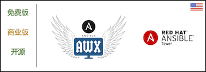

**应该是使用最广泛的一款部署工具了。使用命令行的方式操作，也可以使用 [AWX](https://github.com/ansible/awx) UI 来操作。**

**目前很多团队使用 Ansible 进行集群环境的初始化。**

> 一款开源软件。
>
> Ansible 由 Michael DeHaan 编写并于 2015 年被 Red Hat 收购。 
>
> Ansible 是无代理的，通过 SSH 或 Windows 远程管理（允许远程 PowerShell 执行）临时远程连接以执行其任务。

- [官网](https://www.ansible.com/)
- [教程](https://docs.ansible.com/ansible/latest/user_guide/intro_getting_started.html)

理论上 Ansible 可以做任何事情，最常用的用法是【集群环境初始化】，【进程替换式部署】。

### 持续部署（CD）工具：Spinnaker

**对于 K8S 和云虚拟机有好的一款部署开源应用。由 Netflix 开发。在 Netflix 业务中得到了验证。**

**如果希望商业版的 Spinnaker，可以考虑 [Amory](https://www.armory.io/)**

> Spinnaker 是一个免费的开源持续交付软件平台，最初由 Netflix 开发并由 Google 扩展。
> 
> 与 Kubernetes、Google Cloud Platform、AWS、Microsoft Azure 和 Oracle Cloud 配合使用。

- [官网](https://spinnaker.io/)
- [教程](https://spinnaker.io/docs/)

如果想要使用 Spinnaker，运维是一个问题，需要一个专门的人来运维，同时，由于部署模式与传统的【替换进程】的方法不一样，需要一段时间的培训。

### 持续部署（CD）工具：Tekton

> 一款开源的 CI/CD 应用，针对于云原生，K8S原生设计，2019年2月发布第一个版本，目前还在持续迭代中。

**一款运行在 K8S 中的 CI/CD 系统，用 K8S Job 替代了传统 CD 系统的 Job 流程。如果希望自行搭建 CD 系统，建议使用。**

- [官网](https://tekton.dev/)
- [教程](https://tekton.dev/)

| 功能 | 介绍 |
| --- | --- |
| 针对于云原生，K8S原生设计 | [详情](https://tekton.dev/) |
| 开源社区活跃 | [详情](https://tekton.dev/) |

与 Spinnaker 相比起来，轻量化了不少，缺点就是需要编写一个 Job YAML 模版，比起 Spinnaker 的 UI 操作，需要一定的 K8S 知识储备。

### 持续部署（CD）工具：Chef App Delivery

> 2009年出品的一款部分开源的产品，包含了服务器管理，应用部署等多种功能。
>
> 在商业领域有着不错的口碑，不过在开源生态领域资料不多。

**在开源生态领域资料不多，中小团队不推荐使用。**

- [官网](https://www.chef.io/)
- [教程](https://www.chef.io/)

### 持续部署（CD）工具：Puppet

> Puppet由卢克·卡尼斯 (Luke Kanies) 于2005年创立。
>
> 使用了核心开源模式，是一个包含了多种 DevOps 功能为一体的整体解决方案。
>
> 在商业领域有着不错的口碑，不过在开源生态领域资料不多。

**在开源生态领域资料不多，中小团队不推荐使用。**

- [官网](https://puppet.com/)
- [教程](https://puppet.com/)

### 持续部署（CD）工具：Jenkins

**Jenkins 也可以作为 CD 服务来使用。**

### 持续部署（CD）工具：Jenkins X

**针对于云原生，K8S 研发的一款开源 CI/CD 产品。**

- [官网](https://jenkins-x.io/)
- [教程](https://jenkins-x.io/v3/about/)

### 持续部署（CD）工具：Argo

**以 GitOps 的为主旨，用于 Kubernetes 的一款 CD 开源工具。**

- [官网](https://github.com/argoproj/argo-cd/)
- [教程](https://argo-cd.readthedocs.io/en/stable/)

### 持续部署（CD）工具：Octopus Deploy
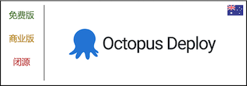

**支持云原生，Kubernetes 的一款 CD 工具。**

- [官网](https://octopus.com/)
- [教程](https://octopus.com/)

以订阅和私有化的方式提供服务，起步价：$50/月。[详情](https://octopus.com/pricing/overview)

## 运维（Operation）

运维领域的生态比其他几个阶段都要庞大，这里我们重点介绍资源管理（IaC，Cloud，Kubernetes）领域内的工具。

### IaC 工具：Terraform

> 2014年 7月发布异地版本，由 Hashicorp 公司出品。是一个跨云的 IaC 工具，目前支持几乎所有流行的云厂商。
>
> 开源免费。

**IaC 领域，Terraform 无疑是最流行的一个。推荐使用。**

- [官网](https://www.terraform.io)
- [教程](https://www.terraform.io/docs/index.html)

### IaC 工具：Ansible

**Ansible 也可以用做 IaC 工具。**

- [官网](https://www.ansible.com/)
- [教程](https://docs.ansible.com/ansible/latest/user_guide/intro_getting_started.html)

### IaC 工具：云厂商

| 云厂商 | 产品 |
| --- | --- |
| AWS | [CloudFormation](https://aws.amazon.com/cloudformation/) |
| Azure | [Azure Resource Manager](https://docs.microsoft.com/en-us/azure/azure-resource-manager/management/overview) |
| Google Cloud | [Deployment Manager](https://cloud.google.com/deployment-manager/docs) |
| 阿里云 | [云速搭](https://www.aliyun.com/product/developerservices/cadt) |
| 腾讯云 | [TIC](https://cloud.tencent.com/product/tic) |
| 华为云 | [应用编排服务](https://www.huaweicloud.com/product/aos.html) |

### 云厂商：AWS

> 亚马逊公司所创建的云计算平台，向个人、企业和政府提供一系列包括信息技术基础架构和应用的服务，如存储、数据库、计算、机器学习等等。
>
> 2006年云产品 S3，EC2 首次亮相，AWS目前提供超过175种服务产品。

**AWS 无疑是目前全球最大的云服务厂商，包括技术，市场，影响力。在服务稳定性，性能方面非常突出。如果业务对底层的服务稳定性有很高的要求，或者希望在海外使用，推荐使用 AWS。**

**不过有些服务，在国内是不提供的，比如 CloudFont。**

- [官网](https://aws.amazon.com/)
- [教程](https://docs.aws.amazon.com/index.html)

| 代表产品 | 功能领域 |
| --- | --- |
| EC2 | 计算 |
| S3 | 存储 |
| RDS | 数据库 |
| CloudFront | CDN |
| Route 53 | DNS |
| Lambda | 无服务函数 |

### 云厂商：Azure

> 微软的公用云端服务 (Public Cloud Service) 平台。
>
> 自 2008 年开始发展，2010年2月份正式推出。

**Azure 目前与 AWS 竞争全球公有云市场非常激烈，无论是数据中心，产品类型，规模已经与 AWS 奇虎相当。**

**不少国内云厂商在基础产品类型，接口上，学习了 AWS，不过 Azure 有自己的特色。**

- [官网](https://azure.microsoft.com/)
- [教程](https://docs.microsoft.com/)

| 代表产品 | 功能领域 |
| --- | --- |
| Virtual Machines | 计算 |
| Azure Blob Storage | 存储 |
| Azure SQL | 数据库 |
| Content Delivery Network | CDN |
| Azure DNS | DNS |
| Azure Functions | 无服务函数 |

### 云厂商：Google Cloud

> Google 提供的云计算服务，
>
> 2008年4月，Google发布了应用程序引擎，同时也是其旗下首款云端计算服务。

**与 Azure，AWS 一起竞争全球云市场的份额，以 Google 强大的技术优势，数据中心优势，迅速发展。**

**如果有出海的业务，可以考虑，国内暂不提供服务。**

- [官网](https://cloud.google.com)
- [教程](https://cloud.google.com/gcp/getting-started)

| 代表产品 | 功能领域 |
| --- | --- |
| Compute Engine | 计算 |
| Cloud Storage | 存储 |
| Cloud SQL | 数据库 |
| Cloud CDN | CDN |
| Google Kubernetes Engine | 容器 |
| App Engine | 无服务函数 |

### 云厂商：Openshift

> OpenShift 是由 Redhat 推出的 PaaS 云计算平台。2011年首次推出。
>
> Openshift 目前共提供三种产品：OpenShift Online、OpenShift Enterprise 和 OpenShift Origin。 
>
> 其中，OpenShift Online 是面向普通开发者和小微企业的线上公有云平台；OpenShift Enterprise 是面向企业的私有云平台；OpenShift Origin 是一个开源项目，是构成前两个的基础。

**一款开源的云平台。不少公司会改造 Openshift 搭建内部的云平台，也有商业化 Openshift 的公司。**

**如果有自行搭建云平台的需求，可以使用 Openshift，否则最好不要自行搭建，运维成本会超乎想象。**

**也可以把 Openshift 搭建在云服务之上，比如 Openshift on AWS，不过这是有特殊需求的时候，才做的选择。**

- [官网](https://www.redhat.com/en/technologies/cloud-computing/openshift)
- [教程](https://www.redhat.com/en/technologies/cloud-computing/openshift)

### 云厂商：Heroku

> Heroku是一个支持多种编程语言的云平台服务。在2010年被 Salesforce.com 收购。

**Heroku 没有像 AWS 那样覆盖所有的云产品，Heroku 在特定场景为入口，打造了使用更方便的产品。**

- [官网](https://www.heroku.com/)
- [教程](https://devcenter.heroku.com/)

| 代表产品 | 功能领域 |
| --- | --- |
| Heroku Platform | 容器 |
| Heroku Redis | 数据库 |
| Heroku Postgres | 数据库 |
| Apache Kafka on Heroku | 数据流 |

### 云厂商：阿里云

> 创立于2009年9月，为阿里巴巴集团全资所有。
>
> 至2020年，公有云IaaS厂商全球市场份额阿里云排名第三，仅次于AWS和Azure。

**国内公有云领域的龙头，产品和服务方面，覆盖了云计算所有领域。国内团队，推荐使用。**

**提供国内版，国际版，私有化。**

- [官网](https://cn.aliyun.com/)
- [教程](https://help.aliyun.com/) 

| 代表产品 | 功能领域 |
| --- | --- |
| ECS | 计算 |
| OSS | 存储 |
| Cloud SQL | 数据库 |
| Cloud CDN | CDN |
| Google Kubernetes Engine | 容器 |
| App Engine | 无服务函数 |

### 云厂商：华为云

> 华为云成立于2005年，隶属于华为公司。
>
> 专注于云计算中公有云领域的技术研究与生态拓展，致力于为用户提供一站式云计算基础设施服务。

**华为云目前与阿里云竞争国内公有云市场非常激烈，无论是在数据中心，产品类型，规模。**

**提供国内版，国际版，私有化。**

- [官网](https://www.huaweicloud.com/)
- [教程](https://support.huaweicloud.com/) 

| 代表产品 | 功能领域 |
| --- | --- |
| ECS | 计算 |
| OBS | 存储 |
| RDS | 数据库 |
| CDN | CDN |
| CCD | 容器 |
| FunctionGraph | 无服务函数 |

### 云厂商：腾讯云

> 2010年由腾讯开放平台开始发展，陆续开始提供云服务器，CDN，数据库等核心产品。

**与华为云，阿里云 一起竞争国内云市场的份额，以强大的技术积累，迅速发展。**

**提供国内版，国际版，私有化。**

- [官网](https://cloud.tencent.com/)
- [教程](https://cloud.tencent.com/document/product) 

| 代表产品 | 功能领域 |
| --- | --- |
| CVM | 计算 |
| COS | 存储 |
| TencentDB | 数据库 |
| CDN | CDN |
| EKS | 容器 |
| SCF | 无服务函数 |

### 云厂商：百度智能云

> 百度智能云于2015年正式对外开放运营。

- [官网](https://cloud.baidu.com/)
- [教程](https://cloud.baidu.com/) 

| 代表产品 | 功能领域 |
| --- | --- |
| BCC | 计算 |
| BOS | 存储 |
| RDS | 数据库 |
| CDN | CDN |
| CCE | 容器 |

### 云厂商：Ucloud

> UCloud是基础云计算服务提供商，成立于2012年3月。

- [官网](https://www.ucloud.cn/)
- [教程](https://www.ucloud.cn/site/developer-center/overview.html) 

| 代表产品 | 功能领域 |
| --- | --- |
| UHost | 计算 |
| US3 | 存储 |
| UDB | 数据库 |
| UCDN | CDN |
| UK8S | 容器 |

### 云厂商：金山云

> 金山软件旗下云计算企业，2012年3月成立。

- [官网](https://www.ksyun.com/)
- [教程](https://docs.ksyun.com/) 

| 代表产品 | 功能领域 |
| --- | --- |
| KEC | 计算 |
| KS3 | 存储 |
| KRDS | 数据库 |
| CDN | CDN |
| KCE | 容器 |

### K8S 集群管理
据大部分云厂商都提供了 K8S 服务，K8S 的管理可以直接在云控制台进行操作。

特殊情况下，如果希望自己搭建 K8S 服务，可以使用一些平台级服务。

| 产品 | 描述 | 
| --- | --- |
| [minikube](https://github.com/kubernetes/minikube) | 开源单机版 K8S，用于测试验证。 |
| [Rancher](https://rancher.com/) | 解决了跨任何基础架构管理多个 Kubernetes 集群的操作和安全挑战，|
| [灵雀云](https://www.alauda.cn/) | Kubernetes 商业化工具平台，提供了一键部署 Kubernetes，同时解决 Kubernetes 使用难等问题。 |

## 评估（Evaluation）

评估阶段包含了【监控】【告警】【分析】三个阶段，这里我们先不做细讲。

【监控】的范围非常广泛，有几个属于我们需要了解一下。我们会在后续的文章中详细介绍各个领域。

- **APM:** Application Performance Monitoring
- **BAM:** Business Activity Monitoring
- **ITIM:** IT Infrastructure Monitoring
- **ITOM:** IT Operation Monitoring
- **ITSM:** IT Service Monitoring
- **NPMD:** Network Performance Monitoring and Diagnostic
- **SIEM:** Security Information and Event <M>anagement.

有了【监控】，就可以实现【告警】和【分析】。这里我们主要介绍分析领域中的 BI 工具。

### 监控：Elastic

> 一家荷兰公司，于 2012 年在荷兰阿姆斯特丹成立，前身为 Elasticsearch。
> 
> Elastic 是一家搜索公司，为搜索、日志记录、安全性、可观察性和分析用例构建自我管理和 SaaS 产品。

**处理日志方面最流行的一款产品，从日志收集，过滤，分析，监控，搜索的全链路产品。**

**很多云厂商都把 Elastic 产品放到了官方产品页中，可以方便开启。不过，使用 Elastic 需要一定的知识储备。**

- [官网](https://www.elastic.co/)
- [教程](https://www.elastic.co/guide/index.html) 

| 代表产品 | 功能领域 |
| --- | --- |
| Elasticsearch | 搜索引擎 |
| Kibana | Web UI |
| Beats | 收集齐 |
| Logstash | 过滤器 |

### 监控：Prometheus + Grafana

> Prometheus 是一款用于事件监控和警报的免费软件应用程序。2012 年开始在 SoundCloud 开发。
> 
> Grafana是一个跨平台、开源的数据可视化网络应用程序平台。Grafana 于 2014 年由 Torkel Ödegaard 作为 Orbitz 项目的一个分支首次发布。

**最流行的开源监控方案，代码注入式，部分云厂商也开始在官网里添加了 Prometheus 服务。推荐使用。**

- [Prometheus 官网](https://www.elastic.co/)
- [Prometheus 教程](https://prometheus.io/docs/introduction/overview/) 
- [Grafana 官网](https://grafana.com)
- [Grafana 教程](https://grafana.com/docs/grafana/latest/) 

### 监控：Grafana Loki

> Loki 是受 Prometheus 启发的水平可扩展、高可用、多租户日志聚合系统。

**Elastic 在日志收集，搜索方面表现很好，不过使用难度上面，却一直在上升。如果希望一种简单的日志收集 + 搜索功能的产品，推荐这款。**

- [官网](https://grafana.com/oss/loki/)
- [教程](https://grafana.com/go/webinar/loki-getting-started-emea/?pg=oss-loki&plcmt=hero-txt) 

### 监控：Splunk

> Splunk是一家位于美国旧金山的科技公司，其公司产品主要关注机器生成大数据的搜索、监控和分析。
>
> 旗下同名产品可以为指定数据源的数据创建索引并创建关联，然后生成图表、报告、警告，并以图形网页的形式予以展示。
>
> 2003年成立。

**日志，监控，APM，安全等功能的产品，有很多大企业在使用，Splunk 与不少云厂商也有战略合作。**

**大企业/团队适合使用，就是有点贵。**

- [官网](https://www.splunk.com/)
- [教程](https://docs.splunk.com/Documentation) 
- [价格](https://www.splunk.com/en_us/software/pricing.html)

### 监控：DataDog

> Datadog 是一种针对云的监控服务，通过基于 SaaS 的数据分析平台提供对服务器、数据库、工具和服务的监控，以 ITIM 为主打产品。
>
> 2010 年创立。

**DataDog 对于海外的云厂商监控兼容性是非常好的，使用也方便。如果使用到了 AWS 等海外云厂商，建议使用。**

- [官网](https://www.datadoghq.com/)
- [教程](https://docs.datadoghq.com/) 
- [价格](https://www.datadoghq.com/pricing)

### 监控：New Relic

> New Relic 是一家总部位于美国旧金山的技术公司，开发基于云的软件以帮助网站和应用程序所有者跟踪其服务的性能。
>
> 以 ITSM 为主打产品。2008 年成立。

**一款综合监控类型产品，包含 ITIM，ITOM，ITSM，SIEM，NPMD等多个领域的产品。有海外业务的大团队建议使用。**

- [官网](https://newrelic.com/)
- [教程](https://docs.newrelic.com/) 
- [价格](https://newrelic.com/pricing)

提供免费版，标准版，专业版，企业版。

### 监控：云厂商
除了 SaaS 厂商，每一个云厂商提供了监控服务，我们列举一下。

| 云厂商 | 产品 |
| --- | --- |
| AWS | [CloudWatch](https://aws.amazon.com/cloudwatch/) |
| Azure | [Monitor](https://docs.microsoft.com/en-us/azure/azure-monitor/overview) |
| Google Cloud | [Cloud Monitoring](https://cloud.google.com/monitoring) |
| 阿里云 | [云监控](https://cn.aliyun.com/product/jiankong) |
| 华为云 | [CES](https://www.huaweicloud.com/product/ces.html) |
| 腾讯云 | [CM](https://cloud.tencent.com/document/product/248) |

### 告警：Pagerduty

> PagerDuty 是一家美国云计算公司，专门为 IT 部门提供 SaaS 事件响应平台。
>
> 2009年成立。

**一款老牌的告警 SaaS 服务，与监控生态的兼容性非常好。**

- [官网](https://www.pagerduty.com/)
- [教程](https://www.pagerduty.com/resources/) 
- [价格](https://www.pagerduty.com/pricing/)

提供免费版，专业版，商业版，企业版。

### 告警：其他
除了专业的告警服务，像微信，企业微信，钉钉，飞书等 IM 工具也包含了告警接口。

所以中小团队，如果没有特殊的需要，没有必要特地买一个告警服务，在监控平台上配置 IM 工具即可。

我们会在后续的文章中介绍几个最佳实践。

### BI 工具：Salesforce

> Salesforce 是一个以提供个人化需求进行客户关系管理规划和服务的互联网企业，总部位于美国加利福尼亚州旧金山。
>
> Salesforce公司于1999年由当时37岁的甲骨文（Oracle）高级副总裁，俄罗斯裔美国人马克·贝尼奥夫（Marc Benioff，1964/09/25-）创办。

**目前 SaaS 行业最大的公司之一，除了提供 BI 工具（Tableau），还有其他很多领域的产品。**

- [官网](https://www.salesforce.com/ca/products/einstein-analytics/overview/)
- [教程](https://www.salesforce.com/ca/products/einstein-analytics/getting-started/) 
- [价格](https://www.salesforce.com/ca/products/einstein-analytics/pricing/)

### BI 工具：SAP

> SAP公司是德国一家软件企业，总部位于德国巴登符腾堡州瓦尔多夫，主营企业资源管理软件。
>
> 1972年在德国创立。

**老牌企业软件提供商，目前很多公司和公共事业单位在使用。除了提供 BI 工具，还有其他很多领域的产品。**

- [官网](https://www.sap.com/hk/products/analytics.html)
- [教程](https://www.sap.com/hk/products/analytics.html) 

### BI 工具：Microsoft Power BI

> Power BI 是 Microsoft 的一项业务分析服务。
>
> 它旨在提供交互式可视化和商业智能功能，其界面足够简单，最终用户可以创建自己的报告和仪表板。是 Microsoft Power Platform 的一部分。
>
> 2011年发布。

**微软提供的 BI 工具，与 Azure 云兼容性较好。**

- [官网](https://powerbi.microsoft.com/en-us/)
- [教程](https://powerbi.microsoft.com/en-us/getting-started-with-power-bi/) 
- [价格](https://powerbi.microsoft.com/en-us/pricing/)

### BI 工具：Google Data Studio

> 谷歌于 2016年3月15日推出的一种在线工具，用于将数据转换为可定制的信息报告和仪表板，作为企业谷歌分析 360 套件的一部分。 
>
> 2016 年 5 月，Google 宣布面向个人和小型团队的免费版 Data Studio。
>
> Google Data Studio 是 Google Marketing Platform 的一部分。

- [官网](https://datastudio.google.com/)
- [教程](https://datastudio.google.com/) 

### BI 工具：Amazon QuickSight

> AWS 出品，面向云的可扩展、无服务器、可嵌入、机器学习驱动的 BI 服务。

- [官网](https://aws.amazon.com/quicksight/)
- [教程](https://aws.amazon.com/quicksight/getting-started/) 
- [价格](https://aws.amazon.com/quicksight/pricing)

### BI 工具：阿里云 Quick BI

> Quick BI——阿里云上客户都在用的BI产品（中国唯一入选Gartner ABI魔力象限BI）。
>
> 无缝对接各类云上数据库和自建数据库，大幅提升数据分析和报表开发效率，0代码鼠标拖拽式操作交互，让业务人员也能轻松实现海量数据可视化分析。

- [官网](https://www.aliyun.com/product/bigdata/bi)
- [教程](https://www.aliyun.com/product/bigdata/bi) 
- [价格](https://www.aliyun.com/product/bigdata/bi)

### BI 工具：华为 FusionInsight

> 华为云FusionInsight智能数据湖，已为全球60+国家和地区，3000+政府、金融、运营商、大企业等政企客户提供企业级数据湖解决方案。

- [官网](https://e.huawei.com/cn/solutions/cloud-computing/big-data/)

### BI 工具：腾讯云 BI

> 商业智能分析 BI（Business Intelligence，BI）支持自服务数据准备、探索式分析和企业级管控，是新一代的敏捷自助型 BI 服务平台。
>
> 只需几分钟，您就可以在云端轻松自如地完成数据分析、业务数据探查、报表制作等一系列数据可视化操作。
>
> 便捷的拖拉拽式交互操作方式，让您无需依赖 IT 人员，无需担心试错成本，快速洞察数据背后的关联、趋势和逻辑。

- [官网](https://cloud.tencent.com/product/bi/)
- [教程](https://cloud.tencent.com/document/product/590) 
- [价格](https://cloud.tencent.com/document/product/590/19140)
