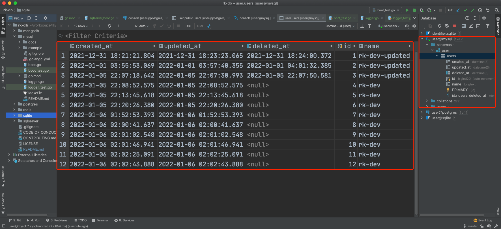

# 通过 YAML 文件初始化 MySQL gorm

## 介绍
本文通过一个完整的例子，介绍如何通过 YAML 文件，轻松初始化 [gorm](https://github.com/go-gorm/gorm)。

我们将会使用 [rk-boot](https://github.com/rookie-ninja/rk-boot) 来初始化。

> GORM 已经封装很好，这个有什么用？
>
> [rk-boot/database/mysql](https://github.com/rookie-ninja/rk-db/mysql) 没有对 gorm 进行2次封装。
> 而是提供了一个通过 YAML 初始化 gorm 的方法。我们希望通过这种方式，简化 gorm 初始化过程，包括日志，实例管理。
>
> 同时，通过一个 YAML 文件表述微服务中的依赖，会比阅读代码更加简洁。

## 安装
我们安装两个依赖，一个是 MySQL 启动器，另一个是 [gin-gonic/gin](https://github.com/gin-gonic/gin) Web 框架启动器。

之所以安装 [gin-gonic/gin](https://github.com/gin-gonic/gin) ，是因为我们会创建一个拥有 API 的 MySQL CRUD 例子。

```go
go get github.com/rookie-ninja/rk-boot/database/mysql
go get github.com/rookie-ninja/rk-boot/gin
```

## 快速开始
请参考 [完整例子](https://github.com/rookie-ninja/rk-db/mysql/example)

我们创建一个简单微服务，包含如下 API。

- GET /v1/user, 列出所有用户信息
- GET /v1/user/:id, 获取用户信息
- PUT /v1/user, 创建用户
- POST /v1/user/:id, 更新用户信息
- DELETE /v1/user/:id, 删除用户

### 1.创建 boot.yaml
boot.yaml 文件会告诉 rk-boot 如何启动进程。例子中有两个功能。

- gin: 告诉 rk-boot 启动 8080 端口
- mySql: 告诉 rk-boot 如何初始化 gorm，并且创建链接，配置日志。

```yaml
---
gin:
  - name: user-service
    port: 8080
    enabled: true
mySql:
  - name: user-db                     # Required
    enabled: true                     # Required
    locale: "*::*::*::*"              # Required
    addr: "localhost:3306"            # Optional, default: localhost:3306
    user: root                        # Optional, default: root
    pass: pass                        # Optional, default: pass
    database:
      - name: user                    # Required
        autoCreate: true              # Optional, create database automatically, default: false
#        dryRun: false                # Optional, default: false
#        params: []                   # Optional, default: ["charset=utf8mb4","parseTime=True","loc=Local"]
#    logger:
#      level: warn                    # Optional, default: warn
#      encoding: json                 # Optional, default: console
#      outputPaths: [ "mysql/log" ]   # Optional, default: []
```

### 2.创建 main.go
在 main.go 函数中，我们实现了两个东西。

- userDb.AutoMigrate(&User{}): 让 gorm 自动创建 User 表。
- 在 gin.Router 中注册 API。

```go
// Copyright (c) 2021 rookie-ninja
//
// Use of this source code is governed by an Apache-style
// license that can be found in the LICENSE file.
package main

import (
	"context"
	"github.com/gin-gonic/gin"
	"github.com/rookie-ninja/rk-boot"
	"github.com/rookie-ninja/rk-boot/gin"
	"github.com/rookie-ninja/rk-db/mysql"
	"gorm.io/gorm"
	"net/http"
	"strconv"
	"time"
)

var userDb *gorm.DB

func main() {
	boot := rkboot.NewBoot()

	boot.Bootstrap(context.TODO())

	// Auto migrate database and init global userDb variable
	mysqlEntry := rkmysql.GetMySqlEntry("user-db")
	userDb = mysqlEntry.GetDB("user")
	if !userDb.DryRun {
		userDb.AutoMigrate(&User{})
	}

	// Register APIs
	ginEntry := rkbootgin.GetGinEntry("user-service")
	ginEntry.Router.GET("/v1/user", ListUsers)
	ginEntry.Router.GET("/v1/user/:id", GetUser)
	ginEntry.Router.PUT("/v1/user", CreateUser)
	ginEntry.Router.POST("/v1/user/:id", UpdateUser)
	ginEntry.Router.DELETE("/v1/user/:id", DeleteUser)

	boot.WaitForShutdownSig(context.TODO())
}

// *************************************
// *************** Model ***************
// *************************************

type Base struct {
	CreatedAt time.Time      `yaml:"-" json:"-"`
	UpdatedAt time.Time      `yaml:"-" json:"-"`
	DeletedAt gorm.DeletedAt `yaml:"-" json:"-" gorm:"index"`
}

type User struct {
	Base
	Id   int    `yaml:"id" json:"id" gorm:"primaryKey"`
	Name string `yaml:"name" json:"name"`
}

func ListUsers(ctx *gin.Context) {
	userList := make([]*User, 0)
	res := userDb.Find(&userList)

	if res.Error != nil {
		ctx.JSON(http.StatusInternalServerError, res.Error)
		return
	}
	ctx.JSON(http.StatusOK, userList)
}

func GetUser(ctx *gin.Context) {
	uid := ctx.Param("id")
	user := &User{}
	res := userDb.Where("id = ?", uid).Find(user)

	if res.Error != nil {
		ctx.JSON(http.StatusInternalServerError, res.Error)
		return
	}

	if res.RowsAffected < 1 {
		ctx.JSON(http.StatusNotFound, "user not found")
		return
	}

	ctx.JSON(http.StatusOK, user)
}

func CreateUser(ctx *gin.Context) {
	user := &User{
		Name: ctx.Query("name"),
	}

	res := userDb.Create(user)

	if res.Error != nil {
		ctx.JSON(http.StatusInternalServerError, res.Error)
		return
	}
	ctx.JSON(http.StatusOK, user)
}

func UpdateUser(ctx *gin.Context) {
	uid := ctx.Param("id")
	user := &User{
		Name: ctx.Query("name"),
	}

	res := userDb.Where("id = ?", uid).Updates(user)

	if res.Error != nil {
		ctx.JSON(http.StatusInternalServerError, res.Error)
		return
	}

	// get user
	userDb.Where("id = ?", uid).Find(user)

	ctx.JSON(http.StatusOK, user)
}

func DeleteUser(ctx *gin.Context) {
	uid, _ := strconv.Atoi(ctx.Param("id"))
	res := userDb.Delete(&User{
		Id: uid,
	})

	if res.Error != nil {
		ctx.JSON(http.StatusInternalServerError, res.Error)
		return
	}
	ctx.String(http.StatusOK, "success")
}
```

### 3.启动 main.go

```
$ go run main.go

2022-01-20T01:38:21.698+0800    INFO    boot/gin_entry.go:596   Bootstrap ginEntry      {"eventId": "7cbf2a59-ebae-46a1-b8a9-595aeab6c774", "entryName": "user-service"}
------------------------------------------------------------------------
endTime=2022-01-20T01:38:21.699029+08:00
startTime=2022-01-20T01:38:21.698951+08:00
elapsedNano=78296
timezone=CST
ids={"eventId":"7cbf2a59-ebae-46a1-b8a9-595aeab6c774"}
app={"appName":"rk","appVersion":"","entryName":"user-service","entryType":"Gin"}
env={"arch":"amd64","az":"*","domain":"*","hostname":"lark.local","localIP":"10.8.0.2","os":"darwin","realm":"*","region":"*"}
payloads={"ginPort":8080}
error={}
counters={}
pairs={}
timing={}
remoteAddr=localhost
operation=Bootstrap
resCode=OK
eventStatus=Ended
EOE
2022-01-20T01:38:21.699+0800    INFO    mysql/boot.go:331       Bootstrap mysql entry   {"entryName": "user-db", "mySqlUser": "root", "mySqlAddr": "localhost:3306"}
2022-01-20T01:38:21.699+0800    INFO    mysql/boot.go:406       Creating database [user]
2022-01-20T01:38:21.718+0800    INFO    mysql/boot.go:428       Creating database [user] successs
2022-01-20T01:38:21.718+0800    INFO    mysql/boot.go:431       Connecting to database [user]
2022-01-20T01:38:21.726+0800    INFO    mysql/boot.go:443       Connecting to database [user] success
```

### 4.验证
#### 4.1 创建用户

```
$ curl -X PUT "localhost:8080/v1/user?name=rk-dev"
{"id":2,"name":"rk-dev"}
```

#### 4.2 更新用户

```
$ curl -X POST "localhost:8080/v1/user/2?name=rk-dev-updated"
{"id":2,"name":"rk-dev-updated"}
```

#### 4.3 列出所有用户

```
$ curl -X GET localhost:8080/v1/user
[{"id":2,"name":"rk-dev-updated"}]
```

#### 4.4 获取用户信息

```
$ curl -X GET localhost:8080/v1/user/2
{"id":2,"name":"rk-dev-updated"}
```

#### 4.5 删除用户

```shell script
$ curl -X DELETE localhost:8080/v1/user/2
success
```



## YAML 选项
用户可以通过 YAML 同时初始化多个 [gorm](https://github.com/go-gorm/gorm) 实例。请使用不同的名字。

| name | Required | description | type | default value |
| ------ | ------ | ------ | ------ | ------ |
| mysql.name | Required | The name of entry | string | MySql |
| mysql.enabled | Required | Enable entry or not | bool | false |
| mysql.locale | Required | See locale description bellow | string | "" |
| mysql.description | Optional | Description of echo entry. | string | "" |
| mysql.user | Optional | MySQL username | string | root |
| mysql.pass | Optional | MySQL password | string | pass |
| mysql.protocol | Optional | Connection protocol to MySQL | string | tcp |
| mysql.addr | Optional | MySQL remote address | string | localhost:3306 |
| mysql.database.name | Required | Name of database | string | "" |
| mysql.database.autoCreate | Optional | Create DB if missing | bool | false |
| mysql.database.dryRun | Optional | Run gorm.DB with dry run mode | bool | false |
| mysql.database.params | Optional | Connection params | []string | ["charset=utf8mb4","parseTime=True","loc=Local"] |
| mysql.logger.encoding | Optional | Log encoding type, json & console are available options | string | console |
| mysql.logger.outputPaths | Optional | Output paths of logger | []string | [stdout] |
| mysql.logger.level | Optional | Logger level, options: silent, error, warn, info | string | warn |

### Locale 用法
Locale 选项是为了通过环境变量，区分不同的 YAML Entry 而引入的。

```
RK use <realm>::<region>::<az>::<domain> to distinguish different environment.
Variable of <locale> could be composed as form of <realm>::<region>::<az>::<domain>
- realm: It could be a company, department and so on, like RK-Corp.
         Environment variable: REALM
         Eg: RK-Corp
         Wildcard: supported

- region: Please see AWS web site: https://docs.aws.amazon.com/AWSEC2/latest/UserGuide/using-regions-availability-zones.html
          Environment variable: REGION
          Eg: us-east
          Wildcard: supported

- az: Availability zone, please see AWS web site for details: https://docs.aws.amazon.com/AWSEC2/latest/UserGuide/using-regions-availability-zones.html
      Environment variable: AZ
      Eg: us-east-1
      Wildcard: supported

- domain: Stands for different environment, like dev, test, prod and so on, users can define it by themselves.
          Environment variable: DOMAIN
          Eg: prod
          Wildcard: supported

How it works?
First, we will split locale with "::" and extract realm, region, az and domain.
Second, get environment variable named as REALM, REGION, AZ and DOMAIN.
Finally, compare every element in locale variable and environment variable.
If variables in locale represented as wildcard(*), we will ignore comparison step.

Example:
# let's assuming we are going to define DB address which is different based on environment.
# Then, user can distinguish DB address based on locale.
# We recommend to include locale with wildcard.
---
DB:
  - name: redis-default
    locale: "*::*::*::*"
    addr: "192.0.0.1:6379"
  - name: redis-default
    locale: "*::*::*::test"
    addr: "192.0.0.1:6379"
  - name: redis-default
    locale: "*::*::*::prod"
    addr: "176.0.0.1:6379"
```
