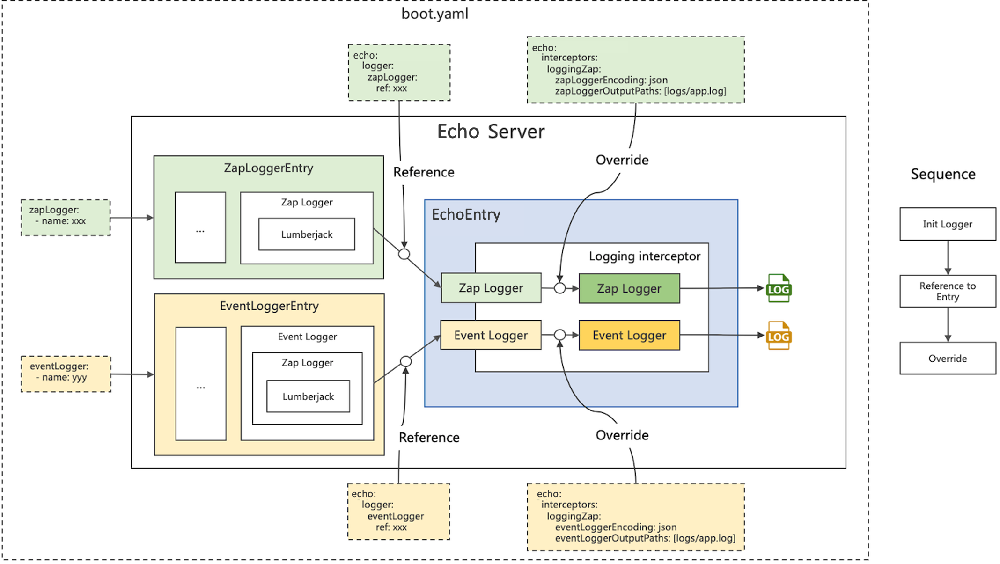

# Echo 框架：日志配置管理

## 介绍
通过一个完整例子，在 Echo 框架中合理管理日志。

> **有什么使用场景？**
>
> - 日志自动滚动
> - 分成多个日志文件
> - 日志格式修改
> - 等等

我们将会使用 [rk-boot](https://github.com/rookie-ninja/rk-boot) 来启动 Echo 框架的微服务。

请访问如下地址获取完整教程：

- https://rkdocs.netlify.app/cn

## 安装
```go
go get github.com/rookie-ninja/rk-boot
```

## 简述概念
rk-boot 使用如下两个库管理日志。

- [zap](https://github.com/uber-go/zap) 管理日志实例
- [lumberjack](https://github.com/natefinch/lumberjack) 管理日志滚动

rk-boot 定义了两种日志类型，会在后面详细介绍，这里先做个简短介绍。

- ZapLogger: 标准日志，用于记录 Error, Info 等。
- EventLogger: JSON 或者 Console 格式，用于记录 Event，例如 RPC 请求。

## 快速开始
在这个例子中，我们会试着改变 zap 日志的路径和格式。

### 1.创建 boot.yaml

```yaml
---
zapLogger:
  - name: zap-log                        # Required
    zap:
      encoding: json                     # Optional, options: console, json
      outputPaths: ["logs/zap.log"]      # Optional
echo:
  - name: greeter
    port: 8080
    enabled: true
```

### 2.创建 main.go
往 zap-log 日志实例中写个日志。

```go
package main

import (
	"context"
	"github.com/rookie-ninja/rk-boot"
	"github.com/rookie-ninja/rk-entry/entry"
)

func main() {
	// Create a new boot instance.
	boot := rkboot.NewBoot()

	// Bootstrap
	boot.Bootstrap(context.Background())

	// Write zap log
	rkentry.GlobalAppCtx.GetZapLoggerEntry("zap-log").GetLogger().Info("This is zap-log")

	// Wait for shutdown sig
	boot.WaitForShutdownSig(context.Background())
}
```

### 4.验证
文件夹结构

```
├── boot.yaml
├── go.mod
├── go.sum
├── logs
│   └── zap.log
└── main.go
```

日志输出
```json
{"level":"INFO","ts":"2021-10-21T02:10:09.279+0800","msg":"This is zap-log"}
```

## 配置 EventLogger
上面的例子中，我们配置了 zap 日志，这回我们修改一下 EventLogger。

### 1.创建 boot.yaml
```yaml
---
eventLogger:
  - name: event-log                      # Required
    encoding: json                       # Optional, options: console, json
    outputPaths: ["logs/event.log"]      # Optional
echo:
  - name: greeter
    port: 8080
    enabled: true
```

### 2.创建 main.go
往 event-log 实例中写入日志。

```go
package main

import (
	"context"
	"github.com/rookie-ninja/rk-boot"
	"github.com/rookie-ninja/rk-entry/entry"
)

func main() {
	// Create a new boot instance.
	boot := rkboot.NewBoot()

	// Bootstrap
	boot.Bootstrap(context.Background())

	// Write event log
	helper := rkentry.GlobalAppCtx.GetEventLoggerEntry("event-log").GetEventHelper()
	event := helper.Start("demo-event")
	event.AddPair("key", "value")
	helper.Finish(event)

	// Wait for shutdown sig
	boot.WaitForShutdownSig(context.Background())
}
```

### 3.启动 main.go
```
$ go run main.go
```

### 4.验证
文件夹结构

```
├── boot.yaml
├── go.mod
├── go.sum
├── logs
│   └── event.log
└── main.go
```

日志内容

```json
{
    "endTime":"2021-11-27T01:56:56.001+0800",
    "startTime":"2021-11-27T01:56:56.001+0800",
    "elapsedNano":423,
    "timezone":"CST",
    "ids":{
        "eventId":"70b034b8-27af-43ad-97a5-82c99292297d"
    },
    "app":{
        "appName":"echo-demo",
        "appVersion":"master-f948c90",
        "entryName":"",
        "entryType":""
    },
    "env":{
        "arch":"amd64",
        "az":"*",
        "domain":"*",
        "hostname":"lark.local",
        "localIP":"10.8.0.2",
        "os":"darwin",
        "realm":"*",
        "region":"*"
    },
    "payloads":{},
    "error":{},
    "counters":{},
    "pairs":{
        "key":"value"
    },
    "timing":{},
    "remoteAddr":"localhost",
    "operation":"demo-event",
    "eventStatus":"Ended",
    "resCode":"OK"
}
```

## 概念
上面的例子中，我们尝试了 ZapLogger 和 EventLogger。接下来我们看看 rk-boot 是如何实现的，并且怎么使用。

## 架构


## ZapLoggerEntry
ZapLoggerEntry 是 zap 实例的一个封装。

```go
// ZapLoggerEntry contains bellow fields.
// 1: EntryName: Name of entry.
// 2: EntryType: Type of entry which is ZapLoggerEntryType.
// 3: EntryDescription: Description of ZapLoggerEntry.
// 4: Logger: zap.Logger which was initialized at the beginning.
// 5: LoggerConfig: zap.Logger config which was initialized at the beginning which is not accessible after initialization..
// 6: LumberjackConfig: lumberjack.Logger which was initialized at the beginning.
type ZapLoggerEntry struct {
	EntryName        string             `yaml:"entryName" json:"entryName"`
	EntryType        string             `yaml:"entryType" json:"entryType"`
	EntryDescription string             `yaml:"entryDescription" json:"entryDescription"`
	Logger           *zap.Logger        `yaml:"-" json:"-"`
	LoggerConfig     *zap.Config        `yaml:"zapConfig" json:"zapConfig"`
	LumberjackConfig *lumberjack.Logger `yaml:"lumberjackConfig" json:"lumberjackConfig"`
}
```

### 如何在 boot.yaml 里配置 ZapLoggerEntry?
ZapLoggerEntry 完全兼容 [zap](https://pkg.go.dev/go.uber.org/zap#section-documentation) 和 [lumberjack](https://github.com/natefinch/lumberjack) 的 YAML 结构。
用户可以根据需求，配置多个 ZapLogger 实例，并且通过 name 来访问。

**完整配置:**

```yaml
---
zapLogger:
  - name: zap-logger                      # Required
    description: "Description of entry"   # Optional
    zap:
      level: info                         # Optional, default: info, options: [debug, DEBUG, info, INFO, warn, WARN, dpanic, DPANIC, panic, PANIC, fatal, FATAL]
      development: true                   # Optional, default: true
      disableCaller: false                # Optional, default: false
      disableStacktrace: true             # Optional, default: true
      sampling:                           # Optional, default: empty map
        initial: 0
        thereafter: 0
      encoding: console                   # Optional, default: "console", options: [console, json]
      encoderConfig:
        messageKey: "msg"                 # Optional, default: "msg"
        levelKey: "level"                 # Optional, default: "level"
        timeKey: "ts"                     # Optional, default: "ts"
        nameKey: "logger"                 # Optional, default: "logger"
        callerKey: "caller"               # Optional, default: "caller"
        functionKey: ""                   # Optional, default: ""
        stacktraceKey: "stacktrace"       # Optional, default: "stacktrace"
        lineEnding: "\n"                  # Optional, default: "\n"
        levelEncoder: "capitalColor"      # Optional, default: "capitalColor", options: [capital, capitalColor, color, lowercase]
        timeEncoder: "iso8601"            # Optional, default: "iso8601", options: [rfc3339nano, RFC3339Nano, rfc3339, RFC3339, iso8601, ISO8601, millis, nanos]
        durationEncoder: "string"         # Optional, default: "string", options: [string, nanos, ms]
        callerEncoder: ""                 # Optional, default: ""
        nameEncoder: ""                   # Optional, default: ""
        consoleSeparator: ""              # Optional, default: ""
      outputPaths: [ "stdout" ]           # Optional, default: ["stdout"], stdout would be replaced if specified
      errorOutputPaths: [ "stderr" ]      # Optional, default: ["stderr"], stderr would be replaced if specified
      initialFields:                      # Optional, default: empty map
        key: "value"
    lumberjack:                           # Optional
      filename: "rkapp-event.log"         # Optional, default: It uses <processname>-lumberjack.log in os.TempDir() if empty.
      maxsize: 1024                       # Optional, default: 1024 (MB)
      maxage: 7                           # Optional, default: 7 (days)
      maxbackups: 3                       # Optional, default: 3 (days)
      localtime: true                     # Optional, default: true
      compress: true                      # Optional, default: true
```

### 如何在代码里获取 ZapLogger?
通过 name 来访问。

```go
// Access entry
rkentry.GlobalAppCtx.GetZapLoggerEntry("zap-logger")

// Access zap logger
rkentry.GlobalAppCtx.GetZapLoggerEntry("zap-logger").GetLogger()

// Access zap logger config
rkentry.GlobalAppCtx.GetZapLoggerEntry("zap-logger").GetLoggerConfig()

// Access lumberjack config
rkentry.GlobalAppCtx.GetZapLoggerEntry("zap-logger").GetLumberjackConfig()
```

## EventLoggerEntry
rk-boot 把每一个 RPC 请求看作一个 Event，并且使用 [rk-query](https://github.com/rookie-ninja/rk-query) 中的 Event 类型来记录日志。

```go
// EventLoggerEntry contains bellow fields.
// 1: EntryName: Name of entry.
// 2: EntryType: Type of entry which is EventLoggerEntryType.
// 3: EntryDescription: Description of EventLoggerEntry.
// 4: EventFactory: rkquery.EventFactory was initialized at the beginning.
// 5: EventHelper: rkquery.EventHelper was initialized at the beginning.
// 6: LoggerConfig: zap.Config which was initialized at the beginning which is not accessible after initialization.
// 7: LumberjackConfig: lumberjack.Logger which was initialized at the beginning.
type EventLoggerEntry struct {
	EntryName        string                `yaml:"entryName" json:"entryName"`
	EntryType        string                `yaml:"entryType" json:"entryType"`
	EntryDescription string                `yaml:"entryDescription" json:"entryDescription"`
	EventFactory     *rkquery.EventFactory `yaml:"-" json:"-"`
	EventHelper      *rkquery.EventHelper  `yaml:"-" json:"-"`
	LoggerConfig     *zap.Config           `yaml:"zapConfig" json:"zapConfig"`
	LumberjackConfig *lumberjack.Logger    `yaml:"lumberjackConfig" json:"lumberjackConfig"`
}
```

### EventLogger 字段
我们可以看到 EventLogger 打印出来的日志里，包含字段，介绍一下这些字段。

| 字段 | 详情 |
| ---- | ---- |
| endTime | 结束时间 |
| startTime | 开始时间 |
| elapsedNano | Event 时间开销（Nanoseconds） |
| timezone | 时区 |
| ids | 包含 eventId, requestId 和 traceId。如果原数据拦截器被启动，或者 event.SetRequest() 被用户调用，新的 RequestId 将会被使用，同时 eventId 与 requestId 会一模一样。 如果调用链拦截器被启动，traceId 将会被记录。|
| app | 包含 [appName, appVersion](https://github.com/rookie-ninja/rk-entry#appinfoentry), entryName, entryType。 |
| env | 包含 arch, az, domain, hostname, localIP, os, realm, region. realm, region, az, domain 字段。这些字段来自系统环境变量（REALM，REGION，AZ，DOMAIN）。 "*" 代表环境变量为空。|
| payloads | 包含 RPC 相关信息。 |
| error | 包含错误。|
| counters | 通过 event.SetCounter() 来操作。|
| pairs | 通过 event.AddPair() 来操作。 |
| timing | 通过 event.StartTimer() 和 event.EndTimer() 来操作。 |
| remoteAddr | RPC 远程地址。 |
| operation | RPC 名字。 |
| resCode | RPC 返回码。 |
| eventStatus | Ended 或者 InProgress |

例子

```
------------------------------------------------------------------------
endTime=2021-11-27T02:30:27.670807+08:00
startTime=2021-11-27T02:30:27.670745+08:00
elapsedNano=62536
timezone=CST
ids={"eventId":"4bd9e16b-2b29-4773-8908-66c860bf6754"}
app={"appName":"echo-demo","appVersion":"master-f948c90","entryName":"greeter","entryType":"EchoEntry"}
env={"arch":"amd64","az":"*","domain":"*","hostname":"lark.local","localIP":"10.8.0.6","os":"darwin","realm":"*","region":"*"}
payloads={"apiMethod":"GET","apiPath":"/rk/v1/healthy","apiProtocol":"HTTP/1.1","apiQuery":"","userAgent":"curl/7.64.1"}
error={}
counters={}
pairs={}
timing={}
remoteAddr=localhost:61726
operation=/rk/v1/healthy
resCode=200
eventStatus=Ended
EOE
```

### 如何在 boot.yaml 里配置 EventLoggerEntry?
EventLoggerEntry 将会把 Application 名字注入到 Event 中。启动器会从 go.mod 文件中提取 Application 名字。 如果没有 go.mod 文件，启动器会使用默认的名字。

用户可以根据需求，配置多个 EventLogger 实例，并且通过 name 来访问。

**完整配置:**
```yaml
---
eventLogger:
  - name: event-logger                 # Required
    description: "This is description" # Optional
    encoding: console                  # Optional, default: console, options: console and json
    outputPaths: ["stdout"]            # Optional
    lumberjack:                        # Optional
      filename: "rkapp-event.log"      # Optional, default: It uses <processname>-lumberjack.log in os.TempDir() if empty.
      maxsize: 1024                    # Optional, default: 1024 (MB)
      maxage: 7                        # Optional, default: 7 (days)
      maxbackups: 3                    # Optional, default: 3 (days)
      localtime: true                  # Optional, default: true
      compress: true                   # Optional, default: true
```

### 如何在代码里获取 EventLogger？
通过 name 来访问。

```go
// Access entry
rkentry.GlobalAppCtx.GetEventLoggerEntry("event-logger")

// Access event factory
rkentry.GlobalAppCtx.GetEventLoggerEntry("event-logger").GetEventFactory()

// Access event helper
rkentry.GlobalAppCtx.GetEventLoggerEntry("event-logger").GetEventHelper()

// Access lumberjack config
rkentry.GlobalAppCtx.GetEventLoggerEntry("event-logger").GetLumberjackConfig()
```

### 如何使用 Event?
Event 是一个 interface，包含了若干方法，请参考：[Event](https://github.com/rookie-ninja/rk-query/blob/master/event.go)

常用方法：

```go
// Get EventHelper to create Event instance
helper := rkentry.GlobalAppCtx.GetEventLoggerEntry("event-log").GetEventHelper()

// Start and finish event
event := helper.Start("demo-event")
helper.Finish(event)

// Add K/V
event.AddPair("key", "value")

// Start and end timer
event.StartTimer("my-timer")
event.EndTimer("my-timer")

// Set counter
event.SetCounter("my-counter", 1)
```
