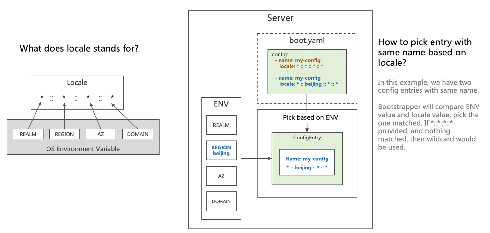
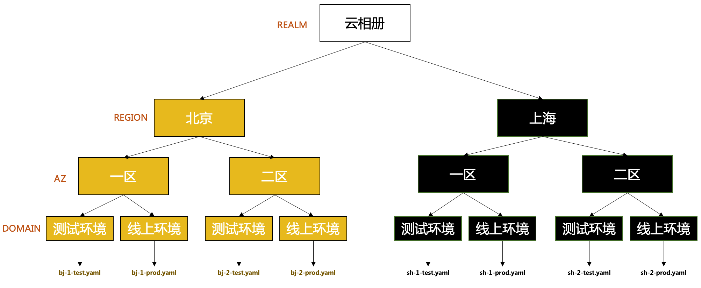

# GoFrame 框架(rk-boot): 基于云原生环境，区分配置文件(Config)

## 介绍
通过一个完整例子，在 **[gogf/gf](https://github.com/gogf/gf)** 框架中，根据环境区分配置文件。也就是如何在【测试】，【线上】等环境中，读取不同的配置文件。

我们将会使用 [rk-boot](https://github.com/rookie-ninja/rk-boot) 来启动 **[gogf/gf](https://github.com/gogf/gf)** 微服务。

请访问如下地址获取完整教程：

- https://rkdocs.netlify.app/cn

## 安装
```go
go get github.com/rookie-ninja/rk-boot/gf
```

## 快速开始
我们会创建 config/beijing.yaml, config/shanghai.yaml, config/default.yaml 三个配置文件，然后根据不同的环境变量读取不同的文件。

rk-boot 使用 REALM，REGION，AZ，DOMAIN 环境变量来区分不同的环境。这也是我们推荐的云原生环境分辨法。
比如，REALM="你的业务"，REGION="北京"，AZ="北京一区"，DOMAIN="测试环境"。

rk-boot 集成了 [viper](https://github.com/spf13/viper) 来处理配置文件。

### 1.创建配置文件
- config/beijing.yaml

```
---
my-region: beijing
```

- config/shanghai.yaml

```
---
my-region: shanghai
```

- config/default.yaml

```
---
my-region: default
```

### 2.创建 boot.yaml
boot.yaml 文件告诉 rk-boot 如何启动 **[gogf/gf](https://github.com/gogf/gf)** 服务。

我们使用 config 作为 boot.yaml 中配置文件的入口，可以提供多个 config 文件路径。

locale 代表 Config 的环境，我们使用 locale 来区分不同的 Config。

> 为什么 config.name 使用同一个名字？
>
> 我们希望使用同一套代码，但是读取不同的文件，并且希望文件的名字也不一样。
> 所以通过 locale 来区分不同文件。我们在后面具体介绍 locale 的逻辑。

```
config:
  # 默认
  - name: my-config
    locale: "*::*::*::*"
    path: config/default.yaml
  # 如果环境变量 REGION=beijing，读取此文件
  - name: my-config
    locale: "*::beijing::*::*"
    path: config/beijing.yaml
  # 如果环境变量 REGION=shanghai，读取此文件
  - name: my-config
    locale: "*::shanghai::*::*"
    path: config/shanghai.yaml
gf:
  - name: greeter
    port: 8080
    enabled: true
```

### 3.创建 main.go
设置环境变量：REGION="beijing"，然后读取配置文件，config/beijing.yaml 会被读取。

```
// Copyright (c) 2021 rookie-ninja
//
// Use of this source code is governed by an Apache-style
// license that can be found in the LICENSE file.
package main

import (
	"context"
	"fmt"
	"github.com/rookie-ninja/rk-boot"
	_ "github.com/rookie-ninja/rk-boot/gf"
	"os"
)

// Application entrance.
func main() {
	// Set REGION=beijing
	os.Setenv("REGION", "beijing")

	// Create a new boot instance.
	boot := rkboot.NewBoot()

	// Load config which is config/beijing.yaml
	fmt.Println(boot.GetConfigEntry("my-config").GetViper().GetString("my-region"))

	// Bootstrap
	boot.Bootstrap(context.Background())

	// Wait for shutdown sig
	boot.WaitForShutdownSig(context.Background())
}

```

### 4.文件夹结构 
```
$ tree
.
├── boot.yaml
├── config
│   ├── beijing.yaml
│   ├── default.yaml
│   └── shanghai.yaml
├── go.mod
├── go.sum
└── main.go
```

### 5.验证

```
$ go run main.go
```

我们会得到如下的输出：

```
beijing
```

### 6.未找到匹配的环境变量
如果 REGION="not-matched"，即未找到匹配的环境变量，则会读取默认的配置文件（config/default.yaml）。因为 config/default.yaml 的 locale 属性为 \*::\*::\*::\*

```
// Application entrance.
func main() {
    // Set REGION=not-matched
    os.Setenv("REGION", "not-matched")
    
    ...
    // Load config which is config/default.yaml
    fmt.Println(boot.GetConfigEntry("my-config").GetViper().GetString("my-region"))
    ...
}
```

我们会得到如下的输出：

```
$ go run main.go
default
```

### 7.环境变量未配置
如果我们没有配置 REGION 环境变量，则会读取 config/default.yaml 文件。

```
// Application entrance.
func main() {
    ...
    // Load config which is config/beijing.yaml
    fmt.Println(boot.GetConfigEntry("my-config").GetViper().GetString("my-region"))
    ...
}
```

我们会得到如下的输出：

```
$ go run main.go
default
```

## 概念


rk-boot 使用 REALM，REGION，AZ，DOMAIN 四个环境变量来区分配置文件。

这四个环境变量可以是任意的值。

## 最佳实践
举个例子，我们有一个【云相册】业务。此业务在不同环境里使用的 MySQL 的 IP 地址不一样，则可以这么配置。

### 架构


假定，我们的业务在【北京】，【上海】都有服务器，同时为了提高服务可用性，在【北京】和【上海】又各开了2个区。

这时候，我们可以机器上配置如下的环境变量，可以通过 Ansible 等工具来批量设置。

| 环境 | 对应环境变量 |
| --- | --- |
| 北京，一区，测试 | REALM="cloud-album"，REGION="bj"，AZ="bj-1"，DOMAIN="test" |
| 北京，一区，线上 | REALM="cloud-album"，REGION="bj"，AZ="bj-1"，DOMAIN="prod" |
| 北京，二区，测试 | REALM="cloud-album"，REGION="bj"，AZ="bj-2"，DOMAIN="test" |
| 北京，二区，线上 | REALM="cloud-album"，REGION="bj"，AZ="bj-2"，DOMAIN="prod" |
| 上海，一区，测试 | REALM="cloud-album"，REGION="sh"，AZ="sh-1"，DOMAIN="test" |
| 上海，一区，线上 | REALM="cloud-album"，REGION="sh"，AZ="sh-1"，DOMAIN="prod" |
| 上海，二区，测试 | REALM="cloud-album"，REGION="sh"，AZ="sh-2"，DOMAIN="test" |
| 上海，二区，线上 | REALM="cloud-album"，REGION="sh"，AZ="sh-2"，DOMAIN="prod" |

同时，如果我们不使用类似 ETCD，Consul 等服务远程拉取配置文件，可以直接在机器中添加如下文件。每个文件都有不同的 MySQL IP 地址。

### 文件夹结构

```
.
├── boot.yaml
├── config
│   ├── bj-1-test.yaml
│   ├── bj-1-prod.yaml
│   ├── bj-2-test.yaml
│   ├── bj-2-prod.yaml
│   ├── sh-1-test.yaml
│   ├── sh-1-prod.yaml
│   ├── sh-2-test.yaml
│   ├── sh-2-prod.yaml
│   └── default.yaml
├── go.mod
├── go.sum
└── main.go
```

### boot.yaml
接下来，我们在 boot.yaml 里添加如下 config 入口。

```
config:
  # 默认入口
  - name: my-config
    locale: "*::*::*::*"
    path: config/default.yaml
  # 北京，一区，测试环境
  - name: my-config
    locale: "cloud-album::bj::bj-1::test"
    path: config/bj-1-test.yaml
  # 北京，一区，线上环境
  - name: my-config
    locale: "cloud-album::bj::bj-1::prod"
    path: config/bj-1-prod.yaml
  # 北京，二区，测试环境
  - name: my-config
    locale: "cloud-album::bj::bj-2::test"
    path: config/bj-2-test.yaml
  # 北京，二区，线上环境
  - name: my-config
    locale: "cloud-album::bj::bj-2::prod"
    path: config/bj-2-prod.yaml
  # 上海，一区，测试环境
  - name: my-config
    locale: "cloud-album::sh::sh-1::test"
    path: config/sh-1-test.yaml
  # 上海，一区，线上环境
  - name: my-config
    locale: "cloud-album::sh::sh-1::prod"
    path: config/sh-1-prod.yaml
  # 上海，二区，测试环境
  - name: my-config
    locale: "cloud-album::sh::sh-2::test"
    path: config/sh-2-test.yaml
  # 上海，二区，线上环境
  - name: my-config
    locale: "cloud-album::sh::sh-2::prod"
    path: config/sh-2-prod.yaml
gf:
  - name: greeter
    port: 8080
    enabled: true
```

### main.go 中读取配置文件。
因为，所有的 Config 都命名为 my-config，在 main.go 中读取的时候，我们可以使用 my-config 获取 ConfigEntry。


```
package main

import (
	"context"
	"fmt"
	"github.com/rookie-ninja/rk-boot"
	"os"
)

// Application entrance.
func main() {
	// Create a new boot instance.
	boot := rkboot.NewBoot()

	// Get viper instance based on environment variable
	boot.GetConfigEntry("my-config").GetViper()

	// Bootstrap
	boot.Bootstrap(context.Background())

	// Wait for shutdown sig
	boot.WaitForShutdownSig(context.Background())
}
```

## 使用环境变量覆盖
rk-boot 集成了 [viper](https://github.com/spf13/viper) 来处理配置文件，所以，自然集成了 [viper](https://github.com/spf13/viper) 自带的所有功能。

其中就包含通过【环境变量】覆盖已有的配置【值】。我们来看个例子。

### 1.config/default.yaml
在 config/default.yaml 文件中，添加一个 K/V。

```yaml
---
endpoint: 8.8.8.8
```

### 2.main.go
在正常情况下，如下代码会得到【8.8.8.8】，不过我们通过环境变量，覆盖了【endpoint】的值。注意，使用环境变量覆盖，环境变量的 Key 需要使用大写英文。

```go
// Copyright (c) 2021 rookie-ninja
//
// Use of this source code is governed by an Apache-style
// license that can be found in the LICENSE file.
package main

import (
	"context"
	"fmt"
	"github.com/rookie-ninja/rk-boot"
	_ "github.com/rookie-ninja/rk-boot/gf"
	"os"
)

// Application entrance.
func main() {
	// Set ENDPOINT=localhost
	os.Setenv("ENDPOINT", "localhost")

	// Create a new boot instance.
	boot := rkboot.NewBoot()

	// Load config which is config/default.yaml
	fmt.Println(boot.GetConfigEntry("my-config").GetViper().GetString("endpoint"))

	// Bootstrap
	boot.Bootstrap(context.Background())

	// Wait for shutdown sig
	boot.WaitForShutdownSig(context.Background())
}
```

### 3.验证
```
$ go run main.go
localhost
```

### 4.使用环境变量前缀
在实际的环境中，有可能出现环境变量冲突的问题。这时候，我们可以在 Viper 里配置一个【环境变量前缀】来标记我们的 Config。

举个例子，假设系统中已经把 HOSTNAME 作为环境变量，初始化到每一个机器中。如果我们强制修改这个值，会遇到不可预测错误。这时候，我们可以添加一个前缀。

例子：

- config/default.yaml

```yaml
---
hostname: my-hostname
```

- boot.yaml
在 config 选项中，添加我们的 ENV 前缀。

```yaml
config:
  - name: my-config
    locale: "*::*::*::*"
    path: config/default.yaml
    envPrefix: rk
gf:
  - name: greeter
    port: 8080
    enabled: true
```

- main.go
这时候，我们在通过环境变量覆盖 HOSTNAME 的时候，添加 [RK_] 作为前缀。

[参考 viper 官方文档](https://github.com/spf13/viper#working-with-environment-variables)

```go
// Copyright (c) 2021 rookie-ninja
//
// Use of this source code is governed by an Apache-style
// license that can be found in the LICENSE file.
package main

import (
	"context"
	"fmt"
	"github.com/rookie-ninja/rk-boot"
	_ "github.com/rookie-ninja/rk-boot/gf"
	"os"
)

// Application entrance.
func main() {
	// Set RK_HOSTNAME=override-hostname
	os.Setenv("RK_HOSTNAME", "override-hostname")

	// Create a new boot instance.
	boot := rkboot.NewBoot()

	// Load config which is config/default.yaml
	fmt.Println(boot.GetConfigEntry("my-config").GetViper().GetString("hostname"))

	// Bootstrap
	boot.Bootstrap(context.Background())

	// Wait for shutdown sig
	boot.WaitForShutdownSig(context.Background())
}
```

- 验证

```
$ go run main.go
override-hostname
```