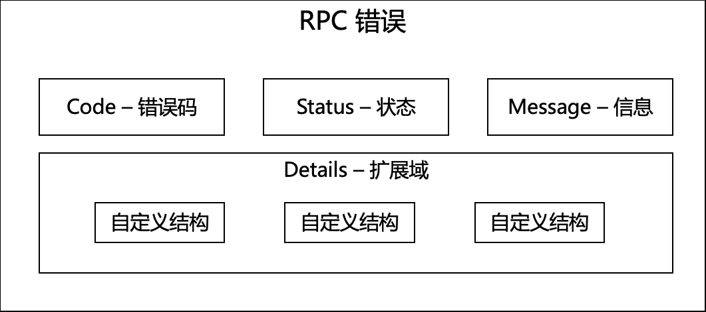

# GoFrame 框架: RPC 错误码设计

## 介绍
本文通过一个完整的例子，介绍如何在 GoFrame 框架下设计合理的 API 错误码。

我们将会使用 [rk-boot](https://github.com/rookie-ninja/rk-boot) 来启动 GoFrame 微服务。

> 请访问如下地址获取完整教程：

- https://rkdocs.netlify.app/cn

## 考虑范围
一个合理的 RPC 错误，需要考虑如下几个方面。

- 包含错误码，错误信息
- 错误信息可扩展
- 考虑可读性
- 可解析性，即，用户可通过代码解析错误码，并采取有效行为
- 避免内部错误益处，例如，Nil point error

## 错误码结构


```json
{
    "error":{
        "code":500,
        "status":"Internal Server Error",
        "message":"Panic manually!",
        "details":[]
    }
}
```

## 安装

```go
go get github.com/rookie-ninja/rk-boot
go get github.com/rookie-ninja/rk-gf
```

## 快速开始
通过 [rk-boot](https://github.com/rookie-ninja/rk-boot) ，用户可以轻松搭建 GoFrame 框架微服务，rk-boot 集成了 Panic 捕捉以及标准错误类型。

**[完整例子](https://github.com/rookie-ninja/rk-demo/tree/master/gf/basic)**

### 1.创建 boot.yaml
boot.yaml 文件描述了 GoFrame 框架启动的元信息，rk-boot 通过读取 boot.yaml 来启动 GoFrame。

```yaml
---
gf:
  - name: greeter
    port: 8080
    enabled: true
```

### 2.创建 main.go
让 /v1/greeter 返回一个错误。

```go
// Copyright (c) 2021 rookie-ninja
//
// Use of this source code is governed by an Apache-style
// license that can be found in the LICENSE file.
package main

import (
	"context"
	"github.com/gogf/gf/v2/net/ghttp"
	"github.com/rookie-ninja/rk-boot"
	"github.com/rookie-ninja/rk-common/error"
	"github.com/rookie-ninja/rk-gf/boot"
	"net/http"
)

// @title RK Swagger for GoFrame
// @version 1.0
// @description This is a greeter service with rk-boot.

// Application entrance.
func main() {
	// Create a new boot instance.
	boot := rkboot.NewBoot()

	// Register handler
	gfEntry := boot.GetEntry("greeter").(*rkgf.GfEntry)
	gfEntry.Server.BindHandler("/v1/greeter", Greeter)

	// Bootstrap
	boot.Bootstrap(context.Background())

	// Wait for shutdown sig
	boot.WaitForShutdownSig(context.Background())
}

// @Summary Greeter service
// @Id 1
// @version 1.0
// @produce application/json
// @Param name query string true "Input name"
// @Success 200 {object} GreeterResponse
// @Router /v1/greeter [get]
func Greeter(ctx *ghttp.Request) {
	err := rkerror.New(
		rkerror.WithHttpCode(http.StatusAlreadyReported),
		rkerror.WithMessage("Trigger manually!"),
		rkerror.WithDetails("This is detail.", false, -1, 0.1))

	ctx.Response.WriteStatus(http.StatusAlreadyReported, err)
}
```

### 3.启动 main.go

```
$ go run main.go
```

### 4.验证

```
$ curl "localhost:8080/v1/greeter?name=rk-dev"
{
    "error":{
        "code":208,
        "status":"Already Reported",
        "message":"Trigger manually!",
        "details":[
            "This is detail.",
            false,
            -1,
            0.1
        ]
    }
}
```

## 捕获 Panic（系统崩溃）
我们还是以 [demo](https://github.com/rookie-ninja/rk-demo/tree/master/gf/basic) 代码为例子。

在 RPC 实现中，我们试着让系统崩溃，看看 rk-boot 会如何自动捕获，并且返回何种信息给用户。

### 1.修改 main.go
```go
// Copyright (c) 2021 rookie-ninja
//
// Use of this source code is governed by an Apache-style
// license that can be found in the LICENSE file.
package main

import (
	"context"
	"github.com/gogf/gf/v2/net/ghttp"
	"github.com/rookie-ninja/rk-boot"
	"github.com/rookie-ninja/rk-gf/boot"
)

// @title RK Swagger for GoFrame
// @version 1.0
// @description This is a greeter service with rk-boot.

// Application entrance.
func main() {
	// Create a new boot instance.
	boot := rkboot.NewBoot()

	// Register handler
	gfEntry := boot.GetEntry("greeter").(*rkgf.GfEntry)
	gfEntry.Server.BindHandler("/v1/greeter", Greeter)

	// Bootstrap
	boot.Bootstrap(context.Background())

	// Wait for shutdown sig
	boot.WaitForShutdownSig(context.Background())
}

// @Summary Greeter service
// @Id 1
// @version 1.0
// @produce application/json
// @Param name query string true "Input name"
// @Success 200 {object} GreeterResponse
// @Router /v1/greeter [get]
func Greeter(ctx *ghttp.Request) {
	panic("Panic manually!")
}
```

### 2.验证

```
$ curl "localhost:8080/v1/greeter?name=rk-dev"
{
    "error":{
        "code":500,
        "status":"Internal Server Error",
        "message":"Panic manually!",
        "details":[]
    }
}
```

## 源代码
rk-boot 里对于错误的处理，实现于 [rk-common/error](https://github.com/rookie-ninja/rk-common/tree/master/error) 中。

## 更多例子
请参考：[rk-demo](https://github.com/rookie-ninja/rk-gf/tree/master/example/interceptor/panic) 获取更多例子。