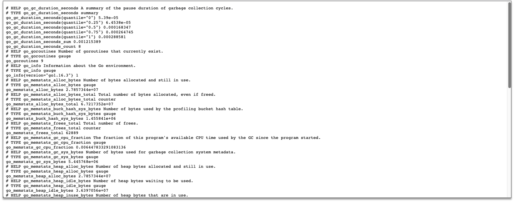
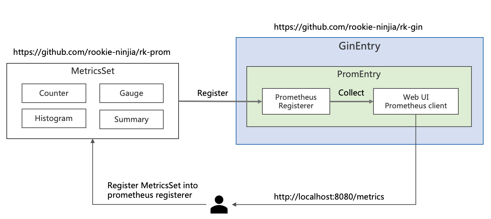
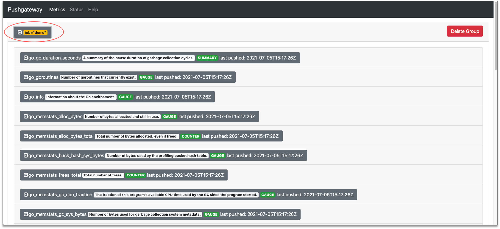

# GoFrame 框架：添加 Prometheus 监控

## 介绍
通过一个完整例子，在基于 GoFrame 框架的微服务中添加 Prometheus 监控。

GoFrame 框架监控中间件，会在后续的文章中介绍。

我们将会使用 [rk-boot](https://github.com/rookie-ninja/rk-boot) 来启动 GoFrame 微服务。

> 请访问如下地址获取完整教程：

- https://rkdocs.netlify.app/cn

## 安装
```go
go get github.com/rookie-ninja/rk-boot
go get github.com/rookie-ninja/rk-gf
```

## 快速开始
### 1.创建 boot.yaml
boot.yaml 文件描述了 GoFrame 框架启动参数，rk-boot 通过读取 boot.yaml 来启动 GoFrame。

```yaml
---
gf:
  - name: greeter
    port: 8080
    enabled: true
    prom:
      enabled: true      # Enable prometheus client
#      path: "metrics"   # Default value is "metrics", set path as needed.
```

### 2.创建 main.go

```go
// Copyright (c) 2021 rookie-ninja
//
// Use of this source code is governed by an Apache-style
// license that can be found in the LICENSE file.
package main

import (
	"context"
	"github.com/rookie-ninja/rk-boot"
	_ "github.com/rookie-ninja/rk-gf/boot"
)

// Application entrance.
func main() {
	// Create a new boot instance.
	boot := rkboot.NewBoot()

	// Bootstrap
	boot.Bootstrap(context.Background())

	// Wait for shutdown sig
	boot.WaitForShutdownSig(context.Background())
}
```

### 3.启动 main.go

```shell script
$ go run main.go
```

### 4.验证
**访问：** http://localhost:8080/metrics



## Prometheus 客户端中添加监控
我们需要先了解 Prometheus 中的如下概念。



| 名字 | 详情 |
| ---- | ---- |
| [MetricsSet](https://github.com/rookie-ninja/rk-prom/blob/master/metrics_set.go) | RK 自定义的结构，通过 MetricsSet 注册 Prometheus 的 Counter，Gauge，Histogram 和 Summary |
| [Prometheus Registerer](https://github.com/prometheus/client_golang/blob/master/prometheus/registry.go) | Prometheus 会通过 Registrerer 来管理 Counter，Gauge，Histogram 和 Summary  |
| [Prometheus Counter](https://prometheus.io/docs/concepts/metric_types/#counter) | Counter 是一个累积度量，表示单个单调增加的计数器，其值只能增加或重置为零 |
| [Prometheus Gauge](https://prometheus.io/docs/concepts/metric_types/#gauge) | Gauge 值可以随意加减 |
| [Prometheus Histogram](https://prometheus.io/docs/concepts/metric_types/#histogram) | Histogram 进行采样（通常是请求持续时间或响应大小之类的内容）并将它们计算在可配置的桶中，同时还提供所有观测值的总和 |
| [Prometheus Summary](https://prometheus.io/docs/concepts/metric_types/#summary) | 与 Histogram 类似，摘要样本观察（通常是请求持续时间和响应大小之类的东西） |
| Prometheus Namespace | Prometheus 监控名格式： namespace_subSystem_metricsName |
| Prometheus SubSystem | Prometheus 监控名格式： namespace_subSystem_metricsName |

### 1.在 main.go 中添加监控项

```go
// Copyright (c) 2021 rookie-ninja
//
// Use of this source code is governed by an Apache-style
// license that can be found in the LICENSE file.
package main

import (
	"context"
	"github.com/rookie-ninja/rk-boot"
	"github.com/rookie-ninja/rk-gf/boot"
	"github.com/rookie-ninja/rk-prom"
)

// Application entrance.
func main() {
	// Create a new boot instance.
	boot := rkboot.NewBoot()

	// Bootstrap
	boot.Bootstrap(context.Background())

	// Create a metrics set into prometheus.Registerer
	set := rkprom.NewMetricsSet("rk", "demo",boot.GetEntry("greeter").(*rkgf.GfEntry).PromEntry.Registerer)

	// Register counter, gauge, histogram, summary
	set.RegisterCounter("my_counter", "label")
	set.RegisterGauge("my_gauge", "label")
	set.RegisterHistogram("my_histogram", []float64{}, "label")
	set.RegisterSummary("my_summary", rkprom.SummaryObjectives, "label")

	// Increase counter, gauge, histogram, summary with label value
	set.GetCounterWithValues("my_counter", "value").Inc()
	set.GetGaugeWithValues("my_gauge", "value").Add(1.0)
	set.GetHistogramWithValues("my_histogram", "value").Observe(0.1)
	set.GetSummaryWithValues("my_summary", "value").Observe(0.1)
	
	// Wait for shutdown sig
	boot.WaitForShutdownSig(context.Background())
}
```

### 2.启动 main.go

```shell script
$ go run main.go
```

### 3.验证

**访问：** http://localhost:8080/metrics

## 推送到 pushgateway
接下来，我们看一下，如何自动把监控数据推送到远程 pushgateway 中。

### 1.boot.yaml 中启动 pusher

```yaml
---
gf:
  - name: greeter
    port: 8080
    enabled: true
    prom:
      enabled: true                         # Enable prometheus client
      pusher:
        enabled : true                      # Enable backend job push metrics to remote pushgateway
        jobName: "demo"                     # Name of current push job
        remoteAddress: "localhost:9091"     # Remote address of pushgateway
        intervalMs: 2000                    # Push interval in milliseconds
#        basicAuth: "user:pass"             # Basic auth of pushgateway
#        cert:
#          ref: "ref"                       # Cert reference defined in CertEntry. Please see advanced user guide for details.
```

### 2.在本地启动 pushgateway
我们使用 docker 启动 pushgateway

```shell script
$ docker run -p 9091:9091 prom/pushgateway
```

### 3.启动 main.go

```shell script
$ go run main.go
```

### 4.验证
**访问：** http://localhost:9091/metrics



# 完整选项
| 名字 | 描述 | 类型 | 默认值 |
| ------ | ------ | ------ | ------ |
| gf.prom.enabled | 启动 prometheus | boolean | false |
| gf.prom.path | Prometheus Web 路径 | string | /metrics |
| gf.prom.pusher.enabled | 启动 prometheus pusher | bool | false |
| gf.prom.pusher.jobName | JobName 将会以标签的形式添加到监控指标，并推送到远程 pushgateway | string | "" |
| gf.prom.pusher.remoteAddress | Pushgateway 远程地址, http://x.x.x.x 或者 x.x.x.x | string | "" |
| gf.prom.pusher.intervalMs | 推送间隔（毫秒） | string | 1000 |
| gf.prom.pusher.basicAuth | 远程 Pushgateway 的 Basic auth。 格式：[user:pass] | string | "" |
| gf.prom.pusher.cert.ref | rkentry.CertEntry 的引用，请参考官网高级指南 | string | "" |