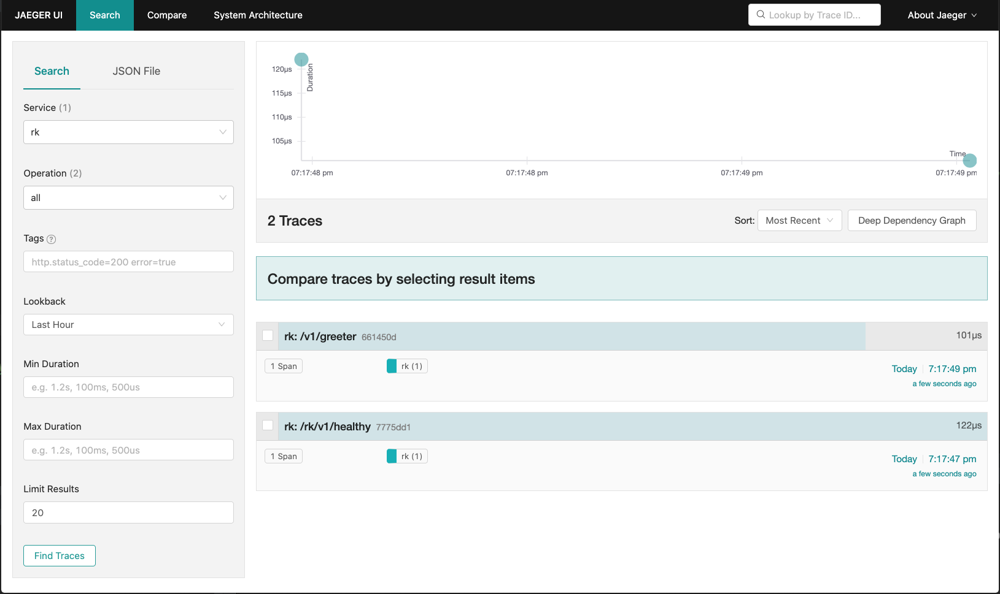
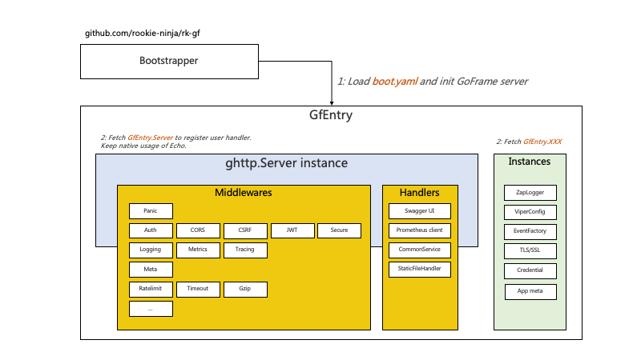

# GoFrame 框架: 添加调用链(Tracing)中间件

## 介绍
通过一个完整例子，在基于 [gogf/gf](https://github.com/gogf/gf) 微服务中添加调用链(Tracing)中间件。

> **什么是调用链(Tracing)中间件？**
>
> 调用链(Tracing)中间件会对每一个 API 请求记录 Tracing 数据，用户可以使用类似 Jaeger 工具查看。

我们将会使用 [rk-boot](https://github.com/rookie-ninja/rk-boot) 来启动 [gogf/gf](https://github.com/gogf/gf) 微服务。
[rk-boot](https://github.com/rookie-ninja/rk-boot) 是一个可通过 YAML 启动多种 Web 服务的框架。请参考本文最后章节，了解 [rk-boot](https://github.com/rookie-ninja/rk-boot) 细节。

请访问如下地址获取完整教程：https://rkdocs.netlify.app/cn

## 安装
```go
go get github.com/rookie-ninja/rk-boot/gf
```

## 快速开始
[rk-boot](https://github.com/rookie-ninja/rk-boot) 默认会使用 [OpenTelemetry-CNCF](https://github.com/open-telemetry) 来处理 Tracing。

### 1.创建 boot.yaml
为了验证，我们启动了如下几个选项：
- **commonService**：commonService 里包含了一系列通用 API。[详情](https://github.com/rookie-ninja/rk-gf#common-service-1)
- **jaeger exporter**：[gogf/gf](https://github.com/gogf/gf) 服务会向本地 jaeger agent 发送数据。

```
---
gf:
  - name: greeter                     # Required
    port: 8080                        # Required
    enabled: true                     # Required
    commonService:
      enabled: true                   # Optional, default: false
    interceptors:
      tracingTelemetry:
        enabled: true                 # Optional, Enable tracing interceptor/middleware
        exporter:
          jaeger:
            agent:
              enabled: true           # Optional, Export to jaeger agent
```

### 2.创建 main.go 
添加 /v1/greeter API。

```
// Copyright (c) 2021 rookie-ninja
//
// Use of this source code is governed by an Apache-style
// license that can be found in the LICENSE file.
package main

import (
	"context"
	"fmt"
	"github.com/gogf/gf/v2/net/ghttp"
	"github.com/rookie-ninja/rk-boot"
	"github.com/rookie-ninja/rk-boot/gf"
	"net/http"
)

// Application entrance.
func main() {
	// Create a new boot instance.
	boot := rkboot.NewBoot()

	// Register handler
	gfEntry := rkbootgf.GetGfEntry("greeter")
	gfEntry.Server.BindHandler("/v1/greeter", func(ctx *ghttp.Request) {
		ctx.Response.WriteHeader(http.StatusOK)
		ctx.Response.WriteJson(&GreeterResponse{
			Message: fmt.Sprintf("Hello %s!", ctx.GetQuery("name")),
		})
	})

	// Bootstrap
	boot.Bootstrap(context.Background())

	// Wait for shutdown sig
	boot.WaitForShutdownSig(context.Background())
}

type GreeterResponse struct {
	Message string
}
```

### 3.文件夹结构 
```
$ tree
.
├── boot.yaml
├── go.mod
├── go.sum
└── main.go

0 directories, 4 files
```

### 4.本地启动 jaeger
```
$ docker run -d --name jaeger \
    -e COLLECTOR_ZIPKIN_HOST_PORT=:9411 \
    -p 5775:5775/udp \
    -p 6831:6831/udp \
    -p 6832:6832/udp \
    -p 5778:5778 \
    -p 16686:16686 \
    -p 14268:14268 \
    -p 14250:14250 \
    -p 9411:9411 \
    jaegertracing/all-in-one:1.23
```

### 5.启动 main.go
```
$ go run main.go
```

### 6.验证
- 发送请求到 CommonService 里的 /rk/v1/healthy API。

```
$ curl -X GET localhost:8080/rk/v1/healthy
{"healthy":true}
```

- 发送请求到 /v1/greeter API。

```
curl -X GET "localhost:8080/v1/greeter?name=rk-dev"
{"Message":"Hello rk-dev!"}
```

- 访问 jaeger 主页: [http://localhost:16686/](http://localhost:16686/)

> 不通过 rkentry.GlobalAppCtx.GetAppInfoEntry().AppName 指定 AppName 的情况下，默认使用 rk 作为 AppName。



## 输出到 Stdout
可以通过修改 boot.yaml 文件来修改输出路径，比如 STDOUT。

- boot.yaml

```
---
gf:
  - name: greeter                     # Required
    port: 8080                        # Required
    enabled: true                     # Required
    commonService:
      enabled: true                   # Optional, default: false
    interceptors:
      tracingTelemetry:
        enabled: true                 # Optional, Enable tracing interceptor/middleware
        exporter:
          file:
            enabled: true
            outputPath: "stdout"      # Optional, Output to stdout
```

## 输出到文件
可以通过修改 boot.yaml 文件来保存 Tracing 信息到文件。

- boot.yaml

```
---
gf:
  - name: greeter                             # Required
    port: 8080                                # Required
    enabled: true                             # Required
    commonService:
      enabled: true                           # Optional, default: false
    interceptors:
      tracingTelemetry:
        enabled: true                         # Optional, Enable tracing interceptor/middleware
        exporter:
          file:
            enabled: true
            outputPath: "logs/tracing.log"    # Optional, Log to files
```

## YAML 选项
| 名字 | 描述 | 类型 | 默认值 |
| ------ | ------ | ------ | ------ |
| gf.interceptors.tracingTelemetry.enabled | 启动调用链拦截器 | boolean | false |
| gf.interceptors.tracingTelemetry.exporter.file.enabled | 启动文件输出| boolean | false |
| gf.interceptors.tracingTelemetry.exporter.file.outputPath | 输出文件路径 | string | stdout |
| gf.interceptors.tracingTelemetry.exporter.jaeger.agent.enabled | jaeger agent 作为数据输出 | boolean | false |
| gf.interceptors.tracingTelemetry.exporter.jaeger.agent.host | jaeger agent 地址 | string | localhost |
| gf.interceptors.tracingTelemetry.exporter.jaeger.agent.port | jaeger agent 端口 | int | 6831 |
| gf.interceptors.tracingTelemetry.exporter.jaeger.collector.enabled | jaeger collector 作为数据输出 | boolean | false |
| gf.interceptors.tracingTelemetry.exporter.jaeger.collector.endpoint | jaeger collector 地址 | string | http://localhost:16368/api/trace |
| gf.interceptors.tracingTelemetry.exporter.jaeger.collector.username | jaeger collector 用户名 | string | "" |
| gf.interceptors.tracingTelemetry.exporter.jaeger.collector.password | jaeger collector 密码 | string | "" |

## rk-boot 介绍
[rk-boot](https://github.com/rookie-ninja/rk-boot) 是一个可通过 YAML 启动多种 Web 服务的框架。
有点类似于 Spring boot。通过集成 rk-xxx 系列库，可以启动多种 Web 框架。当然，用户也可以自定义 rk-xxx 库集成到 rk-boot 中。


## rk-boot 亮点
通过同样格式的 YAML 文件，启动不同 Web 框架。

比如，我们可以通过如下文件，在一个进程中同时启动 gRPC, Gin, Echo, GoFrame 框架。统一团队内部的微服务布局。

- 依赖安装

```
go get github.com/rookie-ninja/rk-boot/grpc
go get github.com/rookie-ninja/rk-boot/gin
go get github.com/rookie-ninja/rk-boot/echo
go get github.com/rookie-ninja/rk-boot/gf
```

- boot.yaml 

```
---
grpc:
  - name: grpc-server
    port: 8080
    enabled: true
    commonService:
      enabled: true
gin:
  - name: gin-server
    port: 8081
    enabled: true
    commonService:
      enabled: true
echo:
  - name: echo-server
    port: 8082
    enabled: true
    commonService:
      enabled: true
gf:
  - name: gf-server
    port: 8083
    enabled: true
    commonService:
      enabled: true
```

- main.go

```go
// Copyright (c) 2021 rookie-ninja
//
// Use of this source code is governed by an Apache-style
// license that can be found in the LICENSE file.
package main

import (
	"context"
	"github.com/rookie-ninja/rk-boot"
	_ "github.com/rookie-ninja/rk-boot/echo"
	_ "github.com/rookie-ninja/rk-boot/gf"
	_ "github.com/rookie-ninja/rk-boot/gin"
	_ "github.com/rookie-ninja/rk-boot/grpc"
)

// Application entrance.
func main() {
	// Create a new boot instance.
	boot := rkboot.NewBoot()

	// Bootstrap
	boot.Bootstrap(context.Background())

	// Wait for shutdown sig
	boot.WaitForShutdownSig(context.Background())
}
```

- 验证

```
# gRPC throuth grpc-gateway
$ curl localhost:8080/rk/v1/healthy
{"healthy":true}

# Gin
$ curl localhost:8081/rk/v1/healthy
{"healthy":true}

# Echo
$ curl localhost:8082/rk/v1/healthy
{"healthy":true}

# GoFrame
$ curl localhost:8083/rk/v1/healthy
{"healthy":true}
```

### rk-boot 支持的 Web 框架
欢迎贡献新的 Web 框架到 rk-boot 系列中。

**参考 [docs](https://rkdev.info/docs/bootstrapper/user-guide/gin-golang/developer/) & [rk-gin](https://github.com/rookie-ninja/rk-gin) 作为例子。**

| 框架 | 开发状态 | 安装 | 依赖 |
| --- | --- | --- | --- |
| [Gin](https://github.com/gin-gonic/gin) | Stable | go get github.com/rookie-ninja/rk-boot/gin | [rk-gin](https://github.com/rookie-ninja/rk-gin) |
| [gRPC](https://grpc.io/)  | Stable | go get github.com/rookie-ninja/rk-boot/grpc | [rk-grpc](https://github.com/rookie-ninja/rk-grpc) |
| [Echo](https://github.com/labstack/echo)  | Stable | go get github.com/rookie-ninja/rk-boot/echo | [rk-echo](https://github.com/rookie-ninja/rk-echo) |
| [GoFrame](https://github.com/gogf/gf)  | Stable | go get github.com/rookie-ninja/rk-boot/gf | [rk-gf](https://github.com/rookie-ninja/rk-gf) |
| [Fiber](https://github.com/gofiber/fiber) | Testing | go get github.com/rookie-ninja/rk-boot/fiber | [rk-fiber](https://github.com/rookie-ninja/rk-fiber) |
| [go-zero](https://github.com/zeromicro/go-zero) | Testing | go get github.com/rookie-ninja/rk-boot/zero | [rk-zero](https://github.com/rookie-ninja/rk-zero) |
| [GorillaMux](https://github.com/gorilla/mux) | Testing | go get github.com/rookie-ninja/rk-boot/mux | [rk-mux](https://github.com/rookie-ninja/rk-mux) |

## rk-gf 介绍
[rk-gf](https://github.com/rookie-ninja/rk-gf) 用于通过 YAML 启动 [gogf/gf](https://github.com/gogf/gf) Web 服务。



### 支持的功能
根据 YAML 文件初始化如下的实例，如果是外部以来，均保持原生用法。

| 实例 | 介绍 |
| --- | --- |
| ghttp.Server | 原生 [gogf/gf](https://github.com/gogf/gf) |
| Config | 原生 [spf13/viper](https://github.com/spf13/viper) 参数实例 |
| Logger | 原生 [uber-go/zap](https://github.com/uber-go/zap) 日志实例 |
| EventLogger | 用于记录 RPC 请求日志，使用 [rk-query](https://github.com/rookie-ninja/rk-query) |
| Credential | 用于从远程服务，例如 ETCD 拉取 Credential |
| Cert | 从远程服务（ETCD 等等）中获取 TLS/SSL 证书，并启动 SSL/TLS |
| Prometheus | 启动 Prometheus 客户端，并根据需要推送到 [pushgateway](https://github.com/prometheus/pushgateway) |
| Swagger | 本地启动 Swagger UI |
| CommonService | 暴露通用 API |
| TV | TV 网页，展示微服务的基本信息 |
| StaticFileHandler | 启动 Web 形式的静态文件下载服务，后台存储支持本地文件系统 和 pkger. |

### 支持的中间件
rk-gf 会根据 YAML 文件初始化中间件。

| Middleware | Description |
| --- | --- |
| Metrics | 收集 RPC Metrics，并启动 [prometheus](https://github.com/prometheus/client_golang) |
| Log | 使用 [rk-query](https://github.com/rookie-ninja/rk-query) 记录每一个 RPC 日志 |
| Trace | 收集 RPC 调用链，并且发送数据到 stdout, 本地文件或者 jaeger [open-telemetry/opentelemetry-go](https://github.com/open-telemetry/opentelemetry-go). |
| Panic | Recover from panic for RPC requests and log it. |
| Meta | 收集服务元信息，添加到返回 Header 中 |
| Auth | 支持 [Basic Auth] & [API Key] 验证中间件 |
| RateLimit | RPC 限速中间件 |
| Timeout | RPC 超时中间件 |
| CORS | CORS 中间件 |
| JWT | JWT 验证 |
| Secure | 服务端安全中间件 |
| CSRF | CSRF 中间件 |

## GoFrame 完整 YAML 配置
```yaml
---
#app:
#  description: "this is description"                      # Optional, default: ""
#  keywords: ["rk", "golang"]                              # Optional, default: []
#  homeUrl: "http://example.com"                           # Optional, default: ""
#  iconUrl: "http://example.com"                           # Optional, default: ""
#  docsUrl: ["http://example.com"]                         # Optional, default: []
#  maintainers: ["rk-dev"]                                 # Optional, default: []
#zapLogger:
#  - name: zap-logger                                      # Required
#    description: "Description of entry"                   # Optional
#eventLogger:
#  - name: event-logger                                    # Required
#    description: "Description of entry"                   # Optional
#cred:
#  - name: "local-cred"                                    # Required
#    provider: "localFs"                                   # Required, etcd, consul, localFs, remoteFs are supported options
#    description: "Description of entry"                   # Optional
#    locale: "*::*::*::*"                                  # Optional, default: *::*::*::*
#    paths:                                                # Optional
#      - "example/boot/full/cred.yaml"
#cert:
#  - name: "local-cert"                                    # Required
#    provider: "localFs"                                   # Required, etcd, consul, localFs, remoteFs are supported options
#    description: "Description of entry"                   # Optional
#    locale: "*::*::*::*"                                  # Optional, default: *::*::*::*
#    serverCertPath: "example/boot/full/server.pem"        # Optional, default: "", path of certificate on local FS
#    serverKeyPath: "example/boot/full/server-key.pem"     # Optional, default: "", path of certificate on local FS
#    clientCertPath: "example/client.pem"                  # Optional, default: "", path of certificate on local FS
#    clientKeyPath: "example/client.pem"                   # Optional, default: "", path of certificate on local FS
#config:
#  - name: rk-main                                         # Required
#    path: "example/boot/full/config.yaml"                 # Required
#    locale: "*::*::*::*"                                  # Required, default: *::*::*::*
#    description: "Description of entry"                   # Optional
gf:
  - name: greeter                                          # Required
    port: 8080                                             # Required
    enabled: true                                          # Required
#    description: "greeter server"                         # Optional, default: ""
#    cert:
#      ref: "local-cert"                                   # Optional, default: "", reference of cert entry declared above
#    sw:
#      enabled: true                                       # Optional, default: false
#      path: "sw"                                          # Optional, default: "sw"
#      jsonPath: ""                                        # Optional
#      headers: ["sw:rk"]                                  # Optional, default: []
#    commonService:
#      enabled: true                                       # Optional, default: false
#    static:
#      enabled: true                                       # Optional, default: false
#      path: "/rk/v1/static"                               # Optional, default: /rk/v1/static
#      sourceType: local                                   # Required, options: pkger, local
#      sourcePath: "."                                     # Required, full path of source directory
#    tv:
#      enabled:  true                                      # Optional, default: false
#    prom:
#      enabled: true                                       # Optional, default: false
#      path: ""                                            # Optional, default: "metrics"
#      pusher:
#        enabled: false                                    # Optional, default: false
#        jobName: "greeter-pusher"                         # Required
#        remoteAddress: "localhost:9091"                   # Required
#        basicAuth: "user:pass"                            # Optional, default: ""
#        intervalMs: 10000                                 # Optional, default: 1000
#        cert:                                             # Optional
#          ref: "local-test"                               # Optional, default: "", reference of cert entry declared above
#    logger:
#      zapLogger:
#        ref: zap-logger                                   # Optional, default: logger of STDOUT, reference of logger entry declared above
#      eventLogger:
#        ref: event-logger                                 # Optional, default: logger of STDOUT, reference of logger entry declared above
#    interceptors:
#      loggingZap:
#        enabled: true                                     # Optional, default: false
#        zapLoggerEncoding: "json"                         # Optional, default: "console"
#        zapLoggerOutputPaths: ["logs/app.log"]            # Optional, default: ["stdout"]
#        eventLoggerEncoding: "json"                       # Optional, default: "console"
#        eventLoggerOutputPaths: ["logs/event.log"]        # Optional, default: ["stdout"]
#      metricsProm:
#        enabled: true                                     # Optional, default: false
#      auth:
#        enabled: true                                     # Optional, default: false
#        basic:
#          - "user:pass"                                   # Optional, default: []
#        ignorePrefix:
#          - "/rk/v1"                                      # Optional, default: []
#        apiKey:
#          - "keys"                                        # Optional, default: []
#      meta:
#        enabled: true                                     # Optional, default: false
#        prefix: "rk"                                      # Optional, default: "rk"
#      tracingTelemetry:
#        enabled: true                                     # Optional, default: false
#        exporter:                                         # Optional, default will create a stdout exporter
#          file:
#            enabled: true                                 # Optional, default: false
#            outputPath: "logs/trace.log"                  # Optional, default: stdout
#          jaeger:
#            agent:
#              enabled: false                              # Optional, default: false
#              host: ""                                    # Optional, default: localhost
#              port: 0                                     # Optional, default: 6831
#            collector:
#              enabled: true                               # Optional, default: false
#              endpoint: ""                                # Optional, default: http://localhost:14268/api/traces
#              username: ""                                # Optional, default: ""
#              password: ""                                # Optional, default: ""
#      rateLimit:
#        enabled: false                                    # Optional, default: false
#        algorithm: "leakyBucket"                          # Optional, default: "tokenBucket"
#        reqPerSec: 100                                    # Optional, default: 1000000
#        paths:
#          - path: "/rk/v1/healthy"                        # Optional, default: ""
#            reqPerSec: 0                                  # Optional, default: 1000000
#      jwt:
#        enabled: true                                     # Optional, default: false
#        signingKey: "my-secret"                           # Required
#        ignorePrefix:                                     # Optional, default: []
#          - "/rk/v1/tv"
#          - "/sw"
#          - "/rk/v1/assets"
#        signingKeys:                                      # Optional
#          - "key:value"
#        signingAlgo: ""                                   # Optional, default: "HS256"
#        tokenLookup: "header:<name>"                      # Optional, default: "header:Authorization"
#        authScheme: "Bearer"                              # Optional, default: "Bearer"
#      secure:
#        enabled: true                                     # Optional, default: false
#        xssProtection: ""                                 # Optional, default: "1; mode=block"
#        contentTypeNosniff: ""                            # Optional, default: nosniff
#        xFrameOptions: ""                                 # Optional, default: SAMEORIGIN
#        hstsMaxAge: 0                                     # Optional, default: 0
#        hstsExcludeSubdomains: false                      # Optional, default: false
#        hstsPreloadEnabled: false                         # Optional, default: false
#        contentSecurityPolicy: ""                         # Optional, default: ""
#        cspReportOnly: false                              # Optional, default: false
#        referrerPolicy: ""                                # Optional, default: ""
#        ignorePrefix: []                                  # Optional, default: []
#      csrf:
#        enabled: true
#        tokenLength: 32                                   # Optional, default: 32
#        tokenLookup: "header:X-CSRF-Token"                # Optional, default: "header:X-CSRF-Token"
#        cookieName: "_csrf"                               # Optional, default: _csrf
#        cookieDomain: ""                                  # Optional, default: ""
#        cookiePath: ""                                    # Optional, default: ""
#        cookieMaxAge: 86400                               # Optional, default: 86400
#        cookieHttpOnly: false                             # Optional, default: false
#        cookieSameSite: "default"                         # Optional, default: "default", options: lax, strict, none, default
#        ignorePrefix: []                                  # Optional, default: []
```
