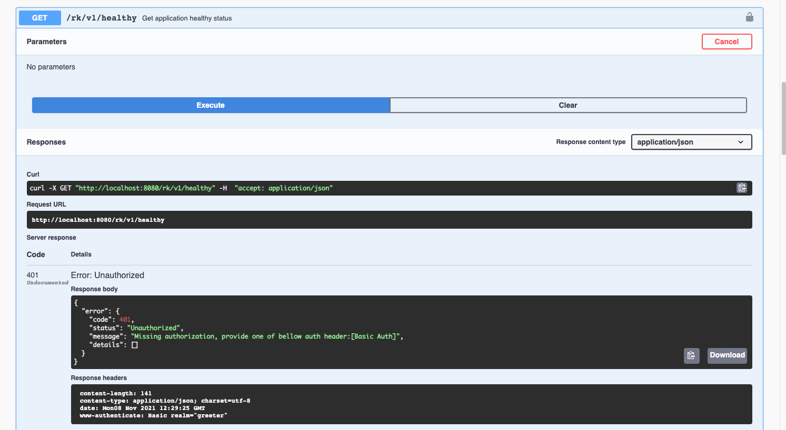
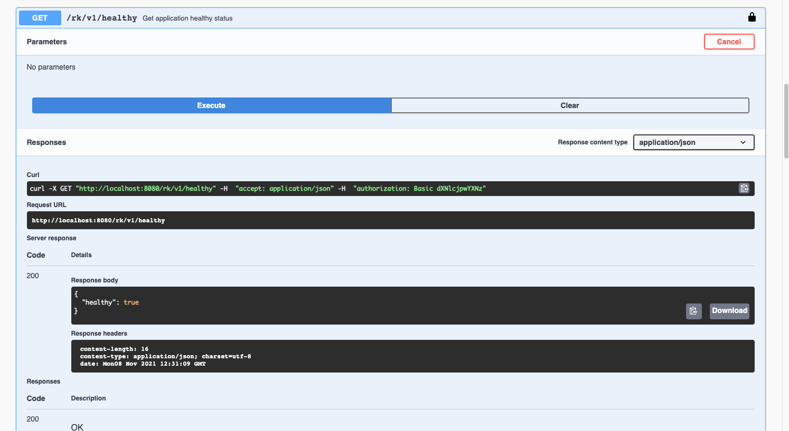
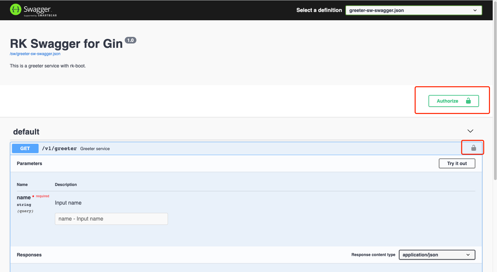

# Gin 框架：添加 HTTP 基本验证中间件

## 介绍
通过一个完整例子，在基于 Gin 框架的微服务中添加  HTTP 基本验证中间件。

> 什么是 HTTP 基本验证中间件？
>
> 验证中间件会对每一个 API 请求进行拦截，并验证 Basic Auth 或者 X-API-Key 的验证。

我们将会使用 [rk-boot](https://github.com/rookie-ninja/rk-boot) 来启动 Gin 框架的微服务。

请访问如下地址获取完整教程：https://rkdocs.netlify.app/cn

## 安装
```
go get github.com/rookie-ninja/rk-boot
```

## 快速开始
boot.yaml 文件描述了 Gin 框架启动的原信息，rk-boot 通过读取 boot.yaml 来启动 Gin。

为了验证，我们启动了 commonService。commonService 里包含了一系列通用 API。
详情: [CommonService](https://github.com/rookie-ninja/rk-gin#common-service-1)

同时启动了 sw 来提供 Swagger UI。

这一步，我们启动 Basic Auth，用户名密码为 user:pass。

```yaml
---
gin:
  - name: greeter                   # Required, name of gin entry
    port: 8080                      # Required, port of gin entry
    enabled: true                   # Required, enable gin entry
    commonService:
      enabled: true                 # Optional, enable common service
    sw:
      enabled: true                 # Optional, enabled Swagger UI
    interceptors:
      auth:
        enabled: true               # Optional, enable auth middleware
        basic: ["user:pass"]        # Optional, basic auth credentials
```

### 2.创建 main.go 
CommonService 的 Swagger Config 文件里默认添加了关于 Basic Auth & API Key 的选项。

如果想要在自己的 API 中添加 Swagger 验证选项，请参考 [swag security](https://github.com/swaggo/swag#how-to-using-security-annotations) 官网，我们会在其他的例子中介绍。

```go
package main

import (
	"context"
	"github.com/rookie-ninja/rk-boot"
)

// Application entrance.
func main() {
	// Create a new boot instance.
	boot := rkboot.NewBoot()

	// Bootstrap
	boot.Bootstrap(context.Background())

	// Wait for shutdown sig
	boot.WaitForShutdownSig(context.Background())
}
```

### 3.文件夹结构 

```
$ tree
.
├── boot.yaml
├── go.mod
├── go.sum
└── main.go

0 directories, 4 files
```

### 4.启动 main.go

```
$ go run main.go
```

### 5.验证
在不提供 Basic Auth 的情况下，我们得到了 401 错误码。

```
$ curl -X GET localhost:8080/rk/v1/healthy
# This is RK style error code if unauthorized
{
    "error":{
        "code":401,
        "status":"Unauthorized",
        "message":"Missing authorization, provide one of bellow auth header:[Basic Auth]",
        "details":[]
    }
}
```

用 Swagger UI 试一下。访问 http://localhost:8080/sw，直接发送请求，我们依然会得到 401 错误。




提供 Basic Auth，出于安全考虑，Request Header 里的 Auth 需要用 Base64 进行编码。我们对 user:pass 字符串进行了 Base64 编码。

```
$ curl localhost:8080/rk/v1/healthy -H "Authorization: Basic dXNlcjpwYXNz"
{
    "healthy":true
}
```

在 Swagger UI 中，点击【锁】按钮，添加 Basic Auth。



## 使用 X-API-Key 授权模式
### 1.修改 boot.yaml
这一步，我们启动 X-API-Key，key 的值为 token。

```yaml
---
gin:
  - name: greeter                   # Required, name of gin entry
    port: 8080                      # Required, port of gin entry
    enabled: true                   # Required, enable gin entry
    commonService:
      enabled: true                 # Optional, enable common service
    sw:
      enabled: true                 # Optional, enabled Swagger UI
    interceptors:
      auth:
        enabled: true               # Optional, enable auth middleware
        apiKey: [ "token" ]         # Optional, enable X-API-Key auth
```

### 2.启动 main.go
```
$ go run main.go
```

### 3.验证
同样的情况，在不提供 X-API-Key 的情况下，我们得到了 401 错误码。

```
$ curl  -X GET localhost:8080/rk/v1/healthy
# This is RK style error code if unauthorized
{
    "error":{
        "code":401,
        "status":"Unauthorized",
        "message":"Missing authorization, provide one of bellow auth header:[X-API-Key]",
        "details":[]
    }
}
```

```
$ curl localhost:8080/rk/v1/healthy -H "X-API-Key: token"
{
    "healthy":true
}
```

## 忽略请求路径
我们可以添加一系列 API 请求路径，让中间件忽略验证这些 API 请求。

```yaml
---
gin:
  - name: greeter                           # Required, name of gin entry
    port: 8080                              # Required, port of gin entry
    enabled: true                           # Required, enable gin entry
    commonService:
      enabled: true                         # Optional, enable common service
    sw:
      enabled: true                         # Optional, enabled Swagger UI
    interceptors:
      auth:
        enabled: true                       # Optional, enable auth middleware
        basic: ["user:pass"]                # Optional, basic auth credentials
        ignorePrefix: ["/rk/v1/healthy"]    # Optional, ignoring path with prefix
```

## 添加 Swag Security Annotation
这次我们看一下如何在 swag 里添加安全相关的 annotation。

在 main() 函数添加如下 annotation，定义 security。

```
// @securityDefinitions.basic BasicAuth
// @securityDefinitions.apikey ApiKeyAuth
// @in header
// @name X-API-Key
```

在 Handler 函数添加如下 annotation。

```
// @Security ApiKeyAuth
// @Security BasicAuth
```

例子如下：

```go
// Copyright (c) 2021 rookie-ninja
//
// Use of this source code is governed by an Apache-style
// license that can be found in the LICENSE file.
package main

import (
	"context"
	"fmt"
	"github.com/gin-gonic/gin"
	"github.com/rookie-ninja/rk-boot"
	"net/http"
)

// @title RK Swagger for Gin
// @version 1.0
// @description This is a greeter service with rk-boot.

// @securityDefinitions.basic BasicAuth

// @securityDefinitions.apikey ApiKeyAuth
// @in header
// @name X-API-Key

// Application entrance.
func main() {
	// Create a new boot instance.
	boot := rkboot.NewBoot()

	// Register handler
	boot.GetGinEntry("greeter").Router.GET("/v1/greeter", Greeter)

	// Bootstrap
	boot.Bootstrap(context.Background())

	// Wait for shutdown sig
	boot.WaitForShutdownSig(context.Background())
}

// @Summary Greeter service
// @Id 1
// @version 1.0
// @produce application/json
// @Param name query string true "Input name"
// @Security ApiKeyAuth
// @Security BasicAuth
// @Success 200 {object} GreeterResponse
// @Router /v1/greeter [get]
func Greeter(ctx *gin.Context) {
	ctx.JSON(http.StatusOK, &GreeterResponse{
		Message: fmt.Sprintf("Hello %s!", ctx.Query("name")),
	})
}

// Response.
type GreeterResponse struct {
	Message string
}
```

用 swag 命令行重新生成 swagger config 文件并启动 main.go。

