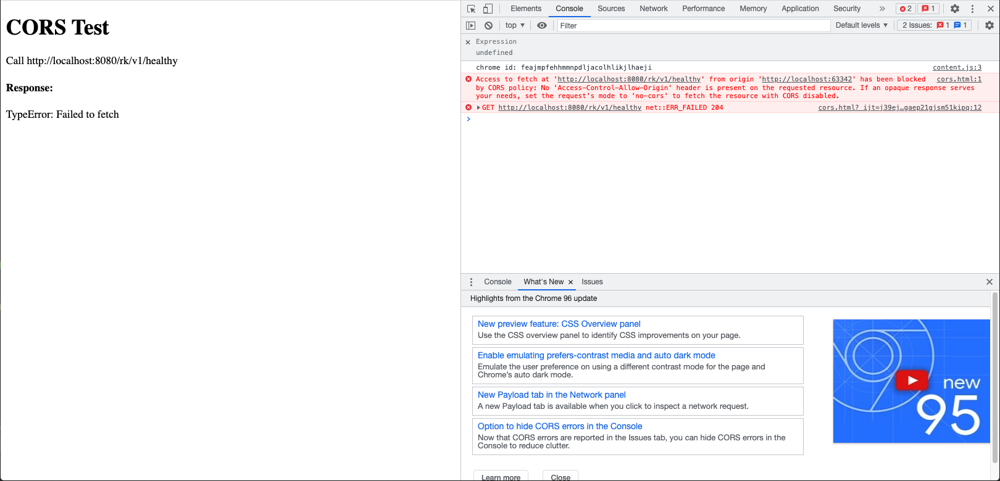

# Gin 安全篇-1: 快速配置服务端 CORS

## 介绍
本文介绍如何通过 [rk-boot](https://github.com/rookie-ninja/rk-boot) 快速配置服务端 CORS。

> **什么是 CORS？** 
> 
> 跨源资源共享 (CORS) （或通俗地译为跨域资源共享）是一种基于HTTP 头的机制，该机制通过允许服务器标示除了它自己以外的其它origin（域，协议和端口），这样浏览器可以访问加载这些资源。

**请访问如下地址获取完整教程：**

- https://rkdocs.netlify.app/cn

## 安装
```go 
go get github.com/rookie-ninja/rk-boot
go get github.com/rookie-ninja/rk-gin
```

## 快速开始
### 1.创建 boot.yaml
boot.yaml 文件会告诉 rk-boot 如何启动 Gin 服务。

在这个例子中，我们只允许 localhost:8080 发送过来的请求，通过验证。

同时，我们开启了 commonService，commonService 提供了 /rk/v1/healthy 等默认 API。[详情](https://github.com/rookie-ninja/rk-gin#common-service-1)

```yaml
---
gin:
  - name: greeter                     # Required
    port: 8080                        # Required
    enabled: true                     # Required
    commonService:
      enabled: true                   # Optional, default: false
    interceptors:
      cors:
        enabled: true                 # Optional, default: false
        # Accept all origins from localhost
        allowOrigins:
          - "http://localhost:8080"   # Optional, default: *
```

### 2.创建 main.go

```go
// Copyright (c) 2021 rookie-ninja
//
// Use of this source code is governed by an Apache-style
// license that can be found in the LICENSE file.
package main

import (
	"context"
	"github.com/rookie-ninja/rk-boot"
	_ "github.com/rookie-ninja/rk-gin/boot"
)

// Application entrance.
func main() {
	// Create a new boot instance.
	boot := rkboot.NewBoot()

	// Bootstrap
	boot.Bootstrap(context.Background())

	// Wait for shutdown sig
	boot.WaitForShutdownSig(context.Background())
}
```

### 3.创建 cors.html
让我们创建一个简单网页，网页里会调用 localhost:8080/rk/v1/healthy，我们通过返回结果来验证 CORS。

```html
<!DOCTYPE html>
<html>
<body>

<h1>CORS Test</h1>

<p>Call http://localhost:8080/rk/v1/healthy</p>

<script type="text/javascript">
    window.onload = function() {
        var apiUrl = 'http://localhost:8080/rk/v1/healthy';
        fetch(apiUrl).then(response => response.json()).then(data => {
            document.getElementById("res").innerHTML = data["healthy"]
        }).catch(err => {
            document.getElementById("res").innerHTML = err
        });
    };
</script>

<h4>Response: </h4>
<p id="res"></p>

</body>
</html>
```

### 4.文件夹结构

```
.
├── boot.yaml
├── cors.html
├── go.mod
├── go.sum
└── main.go

0 directories, 5 files
```

### 5.验证
打开 cors.html，cors.html 会从非 8080 端口发送请求，所以无法通过验证。



### 6.给 CORS 添加白名单
这次，我们把 allowOrigins 配置成 localhost:*，即，让所有从 localhost 发送的请求，均可以通过。

```yaml
---
gin:
  - name: greeter                     # Required
    port: 8080                        # Required
    enabled: true                     # Required
    commonService:
      enabled: true                   # Optional, default: false
    interceptors:
      cors:
        enabled: true                 # Optional, default: false
        # Accept all origins from localhost
        allowOrigins:
          - "http://localhost:*"      # Optional, default: *
```

### 7.验证


## 完整参数
请参考 [gin-cors](https://rkdocs.netlify.app/cn/docs/bootstrapper/user-guide/gin-golang/basic/middleware-cors/) 获取完整参数列表。

| 名字 | 描述 | 类型 | 默认值 |
| ------ | ------ | ------ | ------ |
| gin.interceptors.cors.enabled | 启动 CORS 拦截器 | boolean | false |
| gin.interceptors.cors.allowOrigins | 可通过验证的 Origin 地址。 | []string | * |
| gin.interceptors.cors.allowMethods | 可通过的 http method, 会包含在 OPTIONS 请求的 Header 中。| []string | All http methods |
| gin.interceptors.cors.allowHeaders | 可通过的 http header, 会包含在 OPTIONS 请求的 Header 中。 | []string | Headers from request |
| gin.interceptors.cors.allowCredentials | 会包含在 OPTIONS 请求的 Header 中。 | bool | false |
| gin.interceptors.cors.exposeHeaders | 会包含在 OPTIONS 请求的 Header 中的 Header。 | []string | "" |
| gin.interceptors.cors.maxAge | 会包含在 OPTIONS 请求的 Header 中的 MaxAge。 | int | 0 |