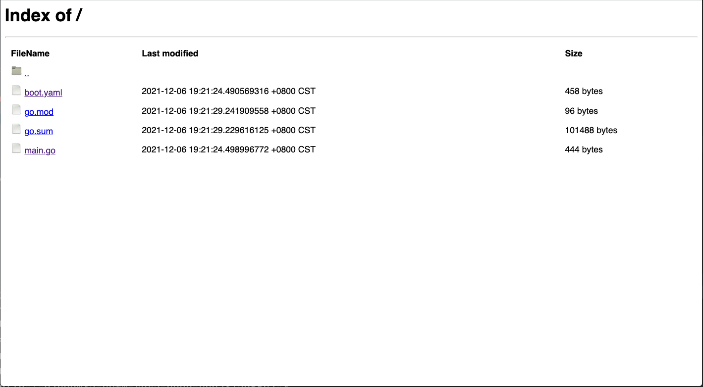
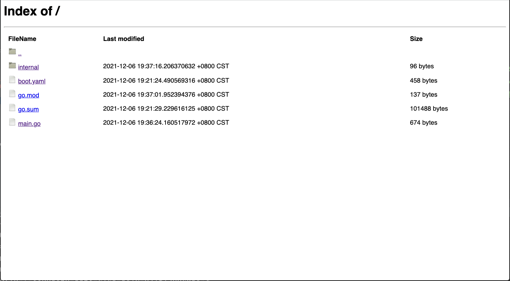
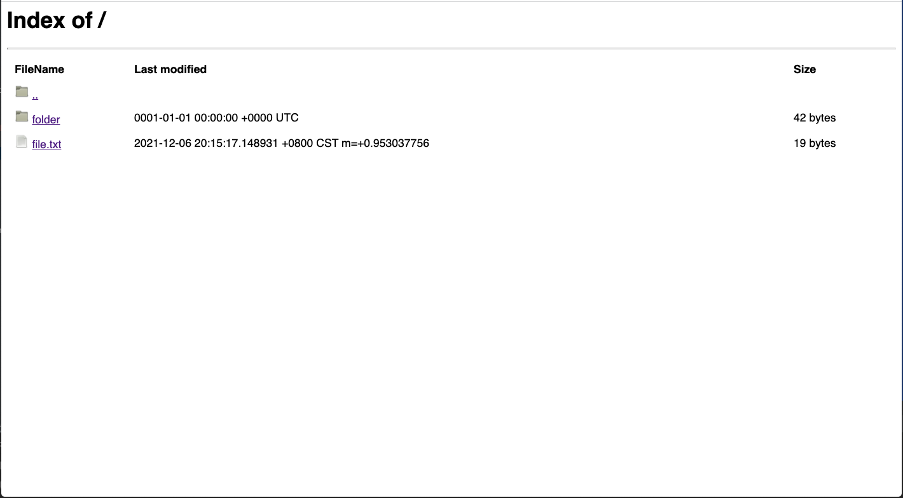

# Gin 框架: 快速创建静态文件下载 Web 服务

## 介绍
本文介绍如何通过 [rk-boot](https://github.com/rookie-ninja/rk-boot) 快速搭建静态文件下载 Web 服务。

> **什么是 静态文件下载 Web UI？** 

通过配置文件，快速搭建可下载文件的 Web 服务。



**请访问如下地址获取完整教程：**

- https://rkdocs.netlify.app/cn

## 安装
```go 
go get github.com/rookie-ninja/rk-boot
```

## 快速开始
rk-boot 提供了一个方便的方法，让用户快速实现网页【浏览和下载】静态文件的功能。

目前，rk-boot 支持如下文件源。如果用户希望支持更多的文件源，可以通过实现 http.FileSystem 接口来实现。

- 本地文件系统
- pkger

### 1.创建 boot.yaml

```yaml
---
gin:
  - name: greeter                     # Required
    port: 8080                        # Required
    enabled: true                     # Required
    static:
      enabled: true                   # Optional, default: false
      path: "/rk/v1/static"           # Optional, default: /rk/v1/static
      sourceType: local               # Required, options: pkger, local
      sourcePath: "."                 # Required, full path of source directory
```

### 2.创建 main.go

```go
// Copyright (c) 2021 rookie-ninja
//
// Use of this source code is governed by an Apache-style
// license that can be found in the LICENSE file.
package main

import (
	"context"
	"github.com/rookie-ninja/rk-boot"
)

// Application entrance.
func main() {
	// Create a new boot instance.
	boot := rkboot.NewBoot()

	// Bootstrap
	boot.Bootstrap(context.Background())

	// Wait for shutdown sig
	boot.WaitForShutdownSig(context.Background())
}
```

### 3.文件夹结构

```
.
├── boot.yaml
├── go.mod
├── go.sum
└── main.go

0 directories, 4 files
```

### 4.验证
访问 http://localhost:8080/rk/v1/static


## 从 pkger 读取文件 (嵌入式静态文件)
[pkger](https://github.com/markbates/pkger) 是一个可以把静态文件，嵌入到 .go 文件的工具。

这个例子中，我们把当前文件夹下的所有文件，都嵌入到 pkger.go 文件中。

这样做的好处就是，在部署的时候，可以不用考虑复制一堆文件夹结构。

### 1.下载 pkger 命令行

```
go get github.com/markbates/pkger/cmd/pkger
```

### 2.创建 boot.yaml
pkger 会使用 module 来区分不同的 package，所以，sourcePath 里，我们添加了相应 module 的前缀。

```yaml
---
gin:
  - name: greeter                                             # Required
    port: 8080                                                # Required
    enabled: true                                             # Required
    static:
      enabled: true                                           # Optional, default: false
      path: "/rk/v1/static"                                   # Optional, default: /rk/v1/static
      sourceType: pkger                                       # Required, options: pkger, local
      sourcePath: "github.com/rookie-ninja/rk-demo:/"         # Required, full path of source directory
```

### 3.创建 main.go
代码中，有两个地方需要注意。

- **pkger.Include("./")**

这段代码不做任何事情，是告诉 pkger 命令行打包哪些文件。

- **_ “github.com/rookie-ninja/rk-demo/internal”**

一定要这么引入，因为我们会把 pkger.go 文件放到 internal/pkger.go 中，pkger.go 文件里定一个一个 variable，只有这么引入，才可以在编译 main.go 的时候，顺利引入 variable。

```go
// Copyright (c) 2021 rookie-ninja
//
// Use of this source code is governed by an Apache-style
// license that can be found in the LICENSE file.
package main

import (
	"context"
	"github.com/markbates/pkger"
	"github.com/rookie-ninja/rk-boot"
	// Must be present in order to make pkger load embedded files into memory.
	_ "github.com/rookie-ninja/rk-demo/internal"
)

func init() {
	// This is used while running pkger CLI
	pkger.Include("./")
}

// Application entrance.
func main() {
	// Create a new boot instance.
	boot := rkboot.NewBoot()

	// Bootstrap
	boot.Bootstrap(context.Background())

	// Wait for shutdown sig
	boot.WaitForShutdownSig(context.Background())
}
```

### 4.生成 pkger.go
```
pkger -o internal
```

### 5.文件夹结构

```
.
├── boot.yaml
├── go.mod
├── go.sum
├── internal
│   └── pkged.go
└── main.go

1 directory, 5 files
```

### 6.验证
访问 http://localhost:8080/rk/v1/static



## 自定义文件源
我们将使用 afero package 里面的 memFs 作为例子。

如果想要从类似 AWS S3 中读取，用户可以实现一个属于自己的 http.FileSystem。

rk-boot 会在后续的更新中，逐渐实现这些功能。

### 1.创建 boot.yaml

```yaml
---
gin:
  - name: greeter                     # Required
    port: 8080                        # Required
    enabled: true                     # Required
```

### 2.创建 main.go
我们在 memFs 中创建了一个 /folder 文件夹和 一个 /file.txt 文件。

```go
// Copyright (c) 2021 rookie-ninja
//
// Use of this source code is governed by an Apache-style
// license that can be found in the LICENSE file.
package main

import (
	"context"
	"github.com/rookie-ninja/rk-boot"
	"github.com/rookie-ninja/rk-gin/boot"
	"github.com/spf13/afero"
	"os"
)

// Application entrance.
func main() {
	// Create a new boot instance.
	boot := rkboot.NewBoot()

	// Create a memory fs
	fs := afero.NewHttpFs(afero.NewMemMapFs())

	// Add folder and file.txt into memory fs
	fs.MkdirAll("/folder", os.ModePerm)
	f, _ := fs.Create("/file.txt")
	f.Write([]byte("this is my content!"))
	f.Close()

	// Set StaticFileEntry
	ginEntry := boot.GetGinEntry("greeter")
	ginEntry.StaticFileEntry = rkgin.NewStaticFileHandlerEntry(
		rkgin.WithPathStatic("/rk/v1/static"),
		rkgin.WithFileSystemStatic(fs))

	// Bootstrap
	boot.Bootstrap(context.Background())

	// Wait for shutdown sig
	boot.WaitForShutdownSig(context.Background())
}
```

### 3.验证
访问 http://localhost:8080/rk/v1/static

