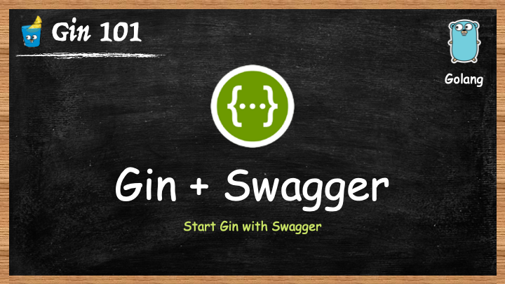
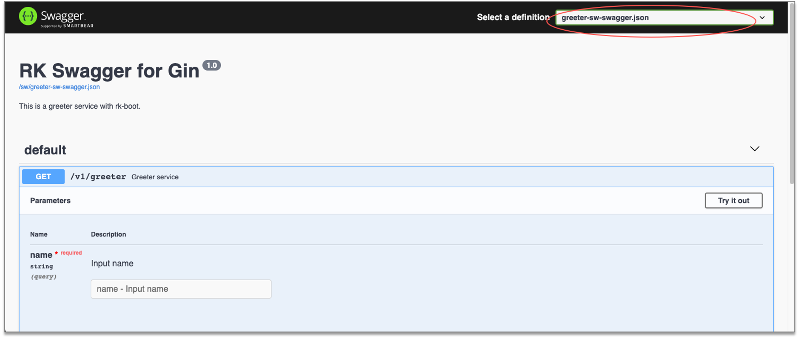

# Gin 框架: 添加 Swagger UI



## 介绍
本文将介绍如何在 [Gin](https://github.com/gin-gonic/gin) 框架之上提供 Swagger UI。

> 请访问如下地址获取完整 Gin 教程：
>
- https://rkdocs.netlify.app/cn

## 先决条件
[Gin](https://github.com/gin-gonic/gin) 没有自带生成 Swagger UI 配置文件的功能。

我们需要安装 [swag](https://github.com/swaggo/swag) 命令行工具来生成 Swagger UI 配置文件。

> 安装选项 1：通过 [RK 命令行](https://github.com/rookie-ninja/rk)

```
# Install RK CMD
$ go get -u github.com/rookie-ninja/rk/cmd/rk

# Install swag with rk
$ rk install swag
```

> 安装选项 2：通过 [swag](https://github.com/swaggo/swag) 官网

```
$ go get -u github.com/swaggo/swag/cmd/swag
```

## 安装 rk-boot
我们介绍 [rk-boot](https://github.com/rookie-ninja/rk-boot) 库，用户可以快速搭建基于 Gin 框架的微服务。

- [文档](https://rkdocs.netlify.app/cn/)
- [源代码](https://github.com/rookie-ninja/rk-boot)
- [例子](https://rkdocs.netlify.app/cn/docs/bootstrapper/user-guide/gin-golang/basic/swagger-ui/)

```go
go get github.com/rookie-ninja/rk-boot
```

## 快速开始
### 1.创建 boot.yaml
boot.yaml 文件会告诉 [rk-boot](https://github.com/rookie-ninja/rk-boot) 如何启动 Gin 服务，下面的例子中，我们指定了端口，Swagger UI 的 json 文件路径。

```
---
gin:
  - name: greeter
    port: 8080
    enabled: true
    sw:
      enabled: true
      jsonPath: "docs"
#      path: "sw"        # Default value is "sw", change it as needed
#      headers: []       # Headers that will be set while accessing swagger UI main page.
```

### 2.创建 main.go 
为了能让 [swag](https://github.com/swaggo/swag) 命令行生成 Swagger UI 参数文件，我们需要在代码中写注释。

详情可参考 [swag](https://github.com/swaggo/swag) 官方文档。

```
package main

import (
	"context"
	"fmt"
	"github.com/gin-gonic/gin"
	"github.com/rookie-ninja/rk-boot"
	"net/http"
)

// @title RK Swagger for Gin
// @version 1.0
// @description This is a greeter service with rk-boot.
func main() {
	// Create a new boot instance.
	boot := rkboot.NewBoot()

	// Register handler
	boot.GetGinEntry("greeter").Router.GET("/v1/greeter", Greeter)

	// Bootstrap
	boot.Bootstrap(context.Background())

	// Wait for shutdown sig
	boot.WaitForShutdownSig(context.Background())
}

// @Summary Greeter service
// @Id 1
// @version 1.0
// @produce application/json
// @Param name query string true "Input name"
// @Success 200 {object} GreeterResponse
// @Router /v1/greeter [get]
func Greeter(ctx *gin.Context) {
	ctx.JSON(http.StatusOK, &GreeterResponse{
		Message: fmt.Sprintf("Hello %s!", ctx.Query("name")),
	})
}

// Response.
type GreeterResponse struct {
	Message string
}
```

### 3.生成 swagger 参数文件
默认会在 docs 文件夹里面创建三个文件。rk-boot 会使用 swagger.json 来初始化 Swagger UI 界面。

```
$ swag init

$ tree
.
├── boot.yaml
├── docs
│   ├── docs.go
│   ├── swagger.json
│   └── swagger.yaml
├── go.mod
├── go.sum
└── main.go

1 directory, 7 files
```

### 4.验证 
访问：[localhost:8080/sw](http://localhost:8080/sw)

