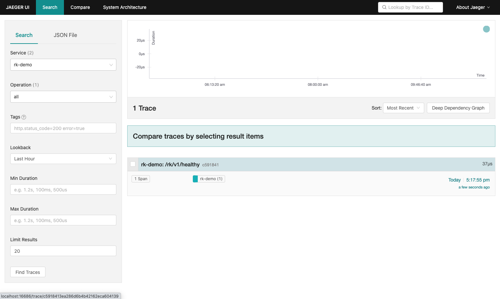

# Gin 框架: 添加调用链(Tracing)中间件

## 介绍
通过一个完整例子，在基于 Gin 框架的微服务中添加调用链(Tracing)中间件。

> **什么是调用链(Tracing)中间件？**
>
> 调用链(Tracing)中间件会对每一个 API 请求记录 Tracing 数据，用户可以使用类似 Jaeger 工具查看。

我们将会使用 [rk-boot](https://github.com/rookie-ninja/rk-boot) 来启动 Gin 框架的微服务。

请访问如下地址获取完整教程：https://rkdocs.netlify.app/cn

## 安装
```go
go get github.com/rookie-ninja/rk-boot
```

## 快速开始
[rk-boot](https://github.com/rookie-ninja/rk-boot) 默认会使用 [OpenTelemetry-CNCF](https://github.com/open-telemetry) 来处理 Tracing。

### 1.创建 boot.yaml
为了验证，我们启动了如下几个选项：
- **commonService**：commonService 里包含了一系列通用 API。[详情](https://github.com/rookie-ninja/rk-gin#common-service-1)
- **jaeger exporter**：Gin 服务会向本地 jaeger agent 发送数据。

```
---
gin:
  - name: greeter                     # Required
    port: 8080                        # Required
    enabled: true                     # Required
    commonService:
      enabled: true                   # Optional, default: false
    interceptors:
      tracingTelemetry:
        enabled: true                 # Optional, Enable tracing interceptor/middleware
        exporter:
          jaeger:
            agent:
              enabled: true           # Optional, Export to jaeger agent
```

### 2.创建 main.go 
```
package main

import (
	"context"
	"github.com/rookie-ninja/rk-boot"
)

// Application entrance.
func main() {
	// Create a new boot instance.
	boot := rkboot.NewBoot()

	// Bootstrap
	boot.Bootstrap(context.Background())

	// Wait for shutdown sig
	boot.WaitForShutdownSig(context.Background())
}
```

### 3.文件夹结构 
```
$ tree
.
├── boot.yaml
├── go.mod
├── go.sum
└── main.go

0 directories, 4 files
```

### 4.本地启动 jaeger
```
$ docker run -d --name jaeger \
    -e COLLECTOR_ZIPKIN_HOST_PORT=:9411 \
    -p 5775:5775/udp \
    -p 6831:6831/udp \
    -p 6832:6832/udp \
    -p 5778:5778 \
    -p 16686:16686 \
    -p 14268:14268 \
    -p 14250:14250 \
    -p 9411:9411 \
    jaegertracing/all-in-one:1.23
```

### 5.启动 main.go
```
$ go run main.go
```

### 6.验证
- 发送请求

```
$ curl -X GET localhost:8080/rk/v1/healthy
{"healthy":true}
```

- 访问 jaeger 主页: http://localhost:16686/

> rk-boot 会使用 go.mod 文件中的 module 后缀来命名 Service。
> 
> 举例: 如果你的 go.mod 文件内容如下，则 Service 名字就是 rk-demo
> 

```
module github.com/rookie-ninja/rk-demo

go 1.16

require (
	github.com/alecthomas/template v0.0.0-20190718012654-fb15b899a751
	github.com/gin-gonic/gin v1.7.2
	github.com/rookie-ninja/rk-boot v1.3.0
	github.com/swaggo/swag v1.7.0
)
```



## 输出到 Stdout
可以通过修改 boot.yaml 文件来修改输出路径，比如 STDOUT。

- boot.yaml

```
---
gin:
  - name: greeter                     # Required
    port: 8080                        # Required
    enabled: true                     # Required
    commonService:
      enabled: true                   # Optional, default: false
    interceptors:
      tracingTelemetry:
        enabled: true                 # Optional, Enable tracing interceptor/middleware
        exporter:
          file:
            enabled: true
            outputPath: "stdout"      # Optional, Output to stdout
```

## 输出到文件
可以通过修改 boot.yaml 文件来保存 Tracing 信息到文件。

- boot.yaml

```
---
gin:
  - name: greeter                             # Required
    port: 8080                                # Required
    enabled: true                             # Required
    commonService:
      enabled: true                           # Optional, default: false
    interceptors:
      tracingTelemetry:
        enabled: true                         # Optional, Enable tracing interceptor/middleware
        exporter:
          file:
            enabled: true
            outputPath: "logs/tracing.log"    # Optional, Log to files
```

## 选项
| 名字 | 描述 | 类型 | 默认值 |
| ------ | ------ | ------ | ------ |
| gin.interceptors.tracingTelemetry.enabled | 启动调用链拦截器 | boolean | false |
| gin.interceptors.tracingTelemetry.exporter.file.enabled | 启动文件输出| boolean | false |
| gin.interceptors.tracingTelemetry.exporter.file.outputPath | 输出文件路径 | string | stdout |
| gin.interceptors.tracingTelemetry.exporter.jaeger.agent.enabled | jaeger agent 作为数据输出 | boolean | false |
| gin.interceptors.tracingTelemetry.exporter.jaeger.agent.host | jaeger agent 地址 | string | localhost |
| gin.interceptors.tracingTelemetry.exporter.jaeger.agent.port | jaeger agent 端口 | int | 6831 |
| gin.interceptors.tracingTelemetry.exporter.jaeger.collector.enabled | jaeger collector 作为数据输出 | boolean | false |
| gin.interceptors.tracingTelemetry.exporter.jaeger.collector.endpoint | jaeger collector 地址 | string | http://localhost:16368/api/trace |
| gin.interceptors.tracingTelemetry.exporter.jaeger.collector.username | jaeger collector 用户名 | string | "" |
| gin.interceptors.tracingTelemetry.exporter.jaeger.collector.password | jaeger collector 密码 | string | "" |