# Gin 框架: 通过 Web 获取服务元信息

## 介绍
通过一个完整例子，在 Gin 框架中嵌入 Web UI 获取服务元信息。

| 名称 | 详情 |
| ---- | ---- |
| README | 如果本地有 README.md 文件，会展示 |
| 进程信息 | 显示进程信息 |
| API 列表 | 获取 API 列表 |
| Entry 列表 | Entry 列表，请参考[详情](https://github.com/rookie-ninja/rk-entry) |
| Config 列表 | 列出 Config 文件信息 |
| CA 证书 ｜ 列出 TLS/SSL 证书信息 |
| 依赖 | 列出 go.mod 信息 |
| LICENSE | 如果本地有 LICENSE 文件，会展示 |
| OS 信息 | 当前 OS 信息 |
| Go Env 信息 | Go 环境信息 |
| Git 信息 | 如果是 Git 工程，会展示 |
| Log 信息 | 展示 Log 原信息 |
| Metrics | 展示 Prometheus Metrics |

我们将会使用 [rk-boot](https://github.com/rookie-ninja/rk-boot) 来启动 Gin 服务。

> **请访问如下地址获取完整教程：**

- https://rkdocs.netlify.app/cn

## 安装
```go
go get github.com/rookie-ninja/rk-boot
```

## 快速开始
为了完整展示，我们使用一个 git 工程，并且添加 API。

### 1.创建 boot.yaml
除了开启 **gin.tv.enabled**，我们还开启了其他服务，这样就可以验证完整 TV 页面。

请参考专栏里其他文章来获取每个选项的详细信息。

或者访问：[rk-boot](https://rkdocs.netlify.app/cn) 官方文档。

```yaml
---
gin:
  - name: greeter                   # Required
    port: 8080                      # Required
    enabled: true                   # Required
    commonService:
      enabled: true                 # Optional, enable common service
    tv:
      enabled: true                 # Optional, enable TV
    sw:
      enabled: true                 # Optional, enable swagger UI
    interceptors:
      metricsProm:
        enabled: true
```

### 2.创建 main.go

```go
// Copyright (c) 2021 rookie-ninja
//
// Use of this source code is governed by an Apache-style
// license that can be found in the LICENSE file.

package main

import (
	"context"
	"github.com/rookie-ninja/rk-boot"
)

// Application entrance.
func main() {
	// Create a new boot instance.
	boot := rkboot.NewBoot()

	// Bootstrap
	boot.Bootstrap(context.Background())

	// Wait for shutdown sig
	boot.WaitForShutdownSig(context.Background())
}
```

### 3.文件夹结构

```
.
├── LICENSE
├── README.md
├── boot.yaml
├── go.mod
├── go.sum
└── main.go
```

### 4.验证

```
$ go run main.go
```

**访问** [localhost:8080/rk/v1/tv](http://localhost:8080/rk/v1/tv)

#### 5.1 README
rk-boot 会读取本地 README.md 文件，并展示在 TV 页面中。

如果是打包编译的情况，rk-boot 会寻找 .rk/README.md 路径，可以通过 **RK 命令行**，方便编译。
请参考：[例子](https://github.com/rookie-ninja/rk-demo/blob/master/standard/go-gin/README_CN.md#%E6%9C%AC%E5%9C%B0%E6%89%93%E5%8C%85)

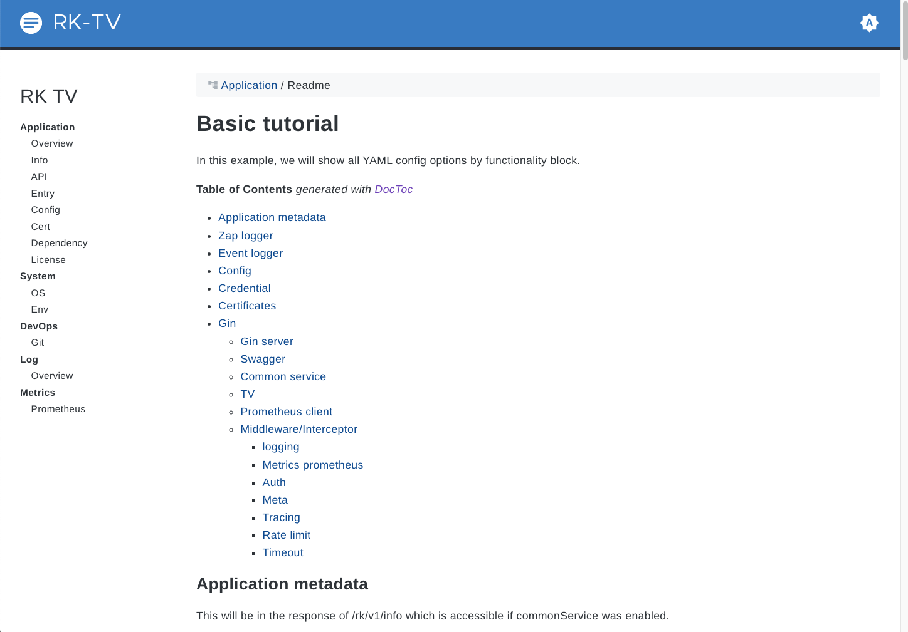

#### 5.2 进程元信息
rk-boot 会读取本地进程信息。

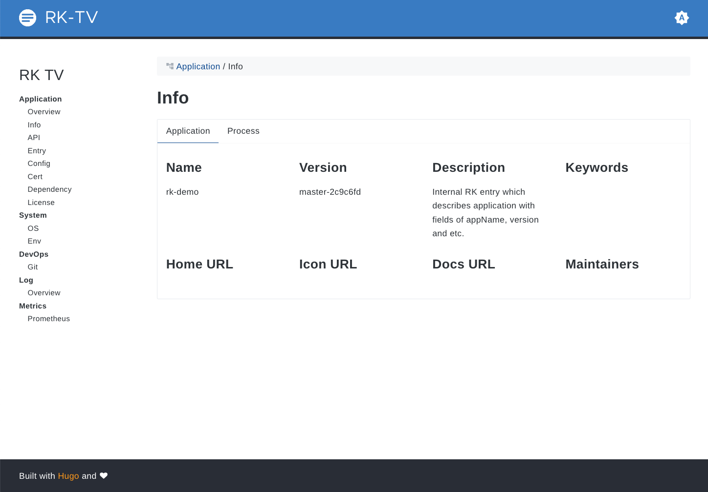

#### 5.3 API 列表
rk-boot 会读取 Gin 内部所有 API 列表。

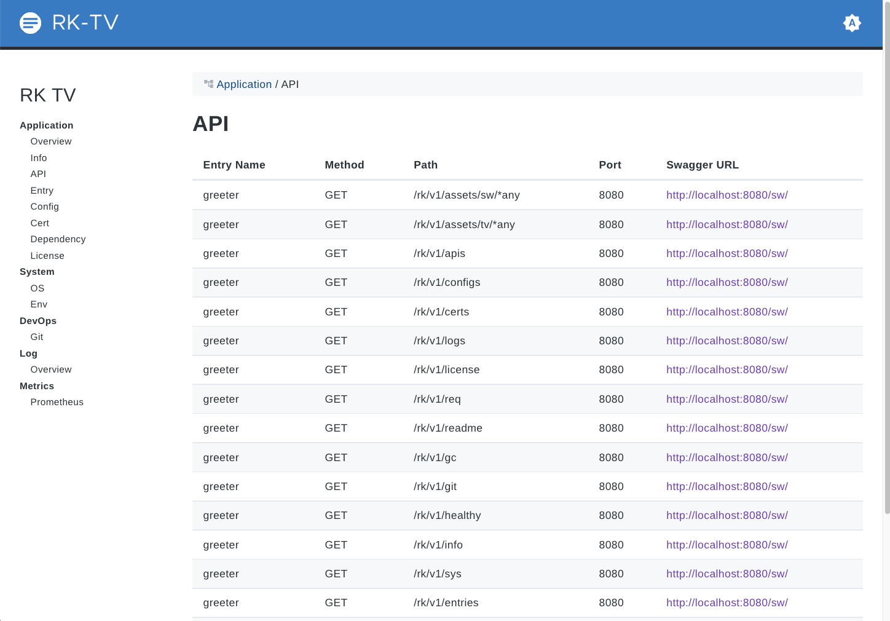

#### 5.4 Entry 列表
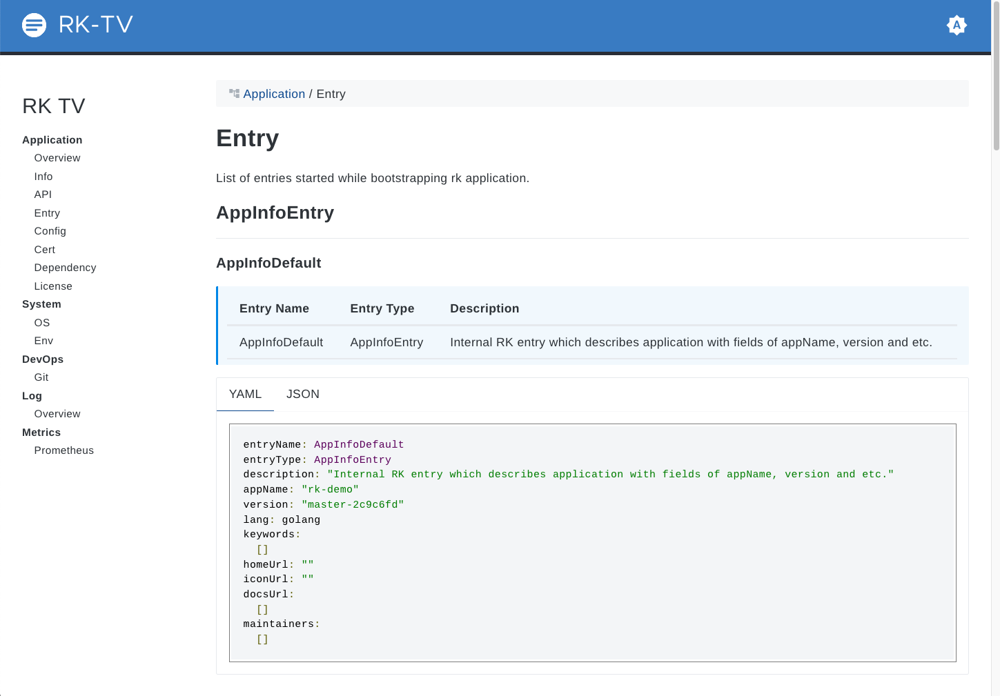

#### 5.5 Config 列表
如果 boot.yaml 里有 config 入口，会显示在这里。

下面的图只是个例子截图，上面的代码不会有 Config，因为我们没有加入 Config。

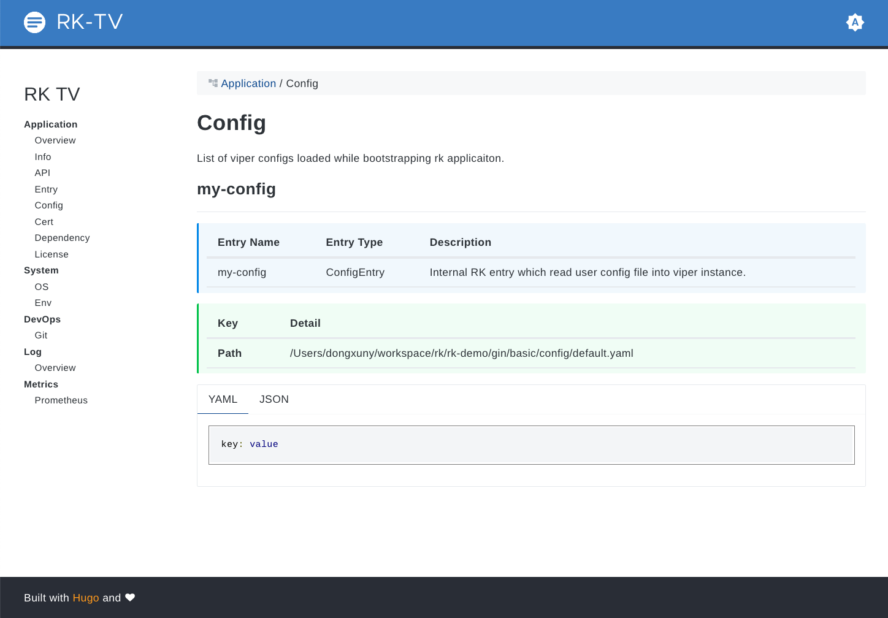

#### 5.6 证书
如果 boot.yaml 里有 cert 入口，会显示在这里。

下面的图只是个例子截图，上面的代码不会有 Cert，因为我们没有加入 Cert。

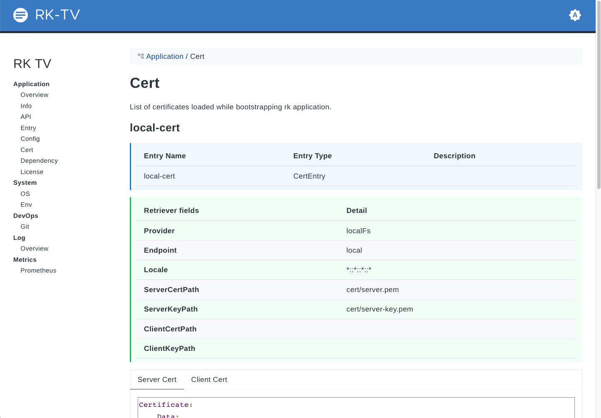

#### 5.7 依赖
rk-boot 会读取本地 go.mod 文件，并展示在 TV 页面中。

如果是打包编译的情况，rk-boot 会寻找 .rk/go.mod 路径，可以通过 **RK 命令行**，方便编译。
请参考：[例子](https://github.com/rookie-ninja/rk-demo/blob/master/standard/go-gin/README_CN.md)

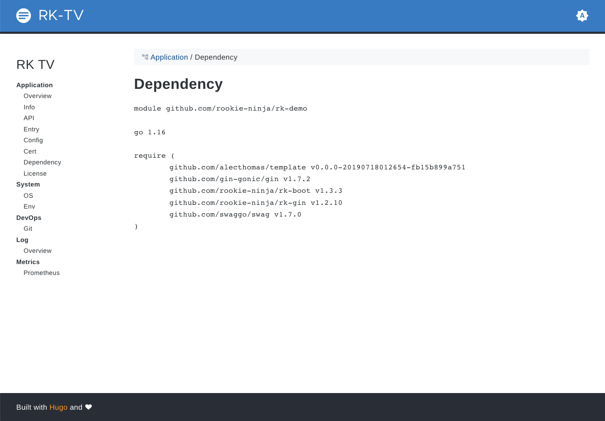

#### 5.8 OS 信息
rk-boot 会收集本地 OS 信息。

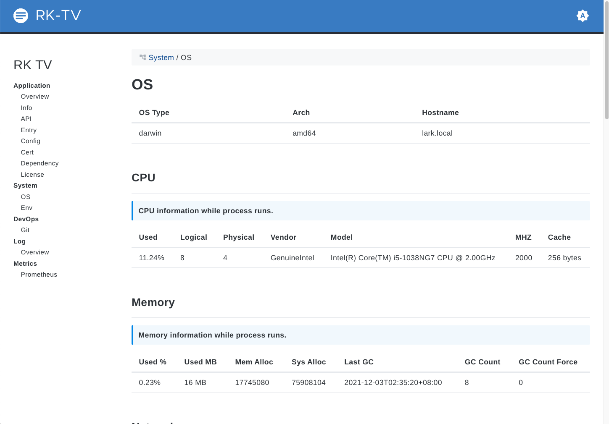

#### 5.9 Go Env 信息
rk-boot 会收集本地 Go Env 信息。

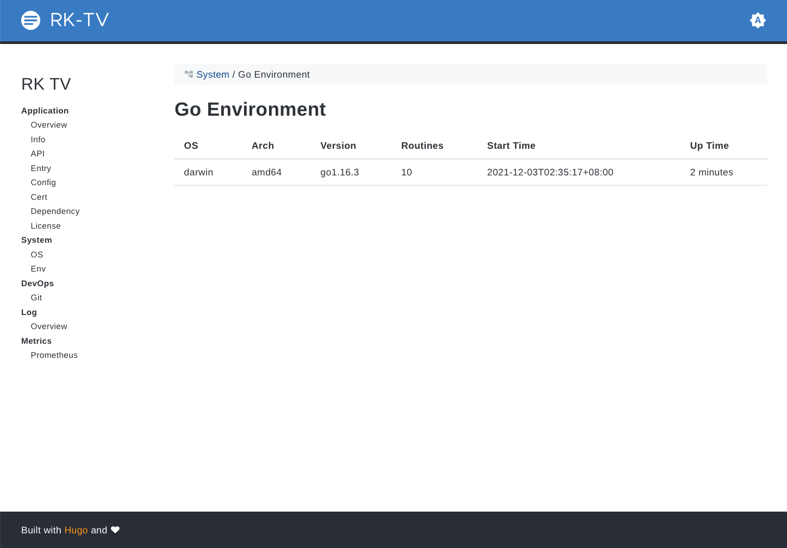

#### 5.10 Git 信息
rk-boot 会读取本地 .git 文件，并展示在 TV 页面中。

如果是打包编译的情况，rk-boot 会寻找 .rk/rk.yaml 路径，里面包含了 git 信息。可以通过 RK 命令行，方便编译。
请参考：[例子](https://github.com/rookie-ninja/rk-demo/blob/master/standard/go-gin/README_CN.md)

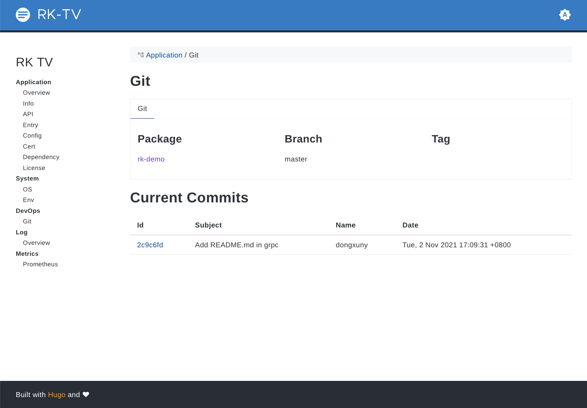

#### 5.11 Log 信息
rk-boot 会显示目前在进程中的所有 Log 实例信息。

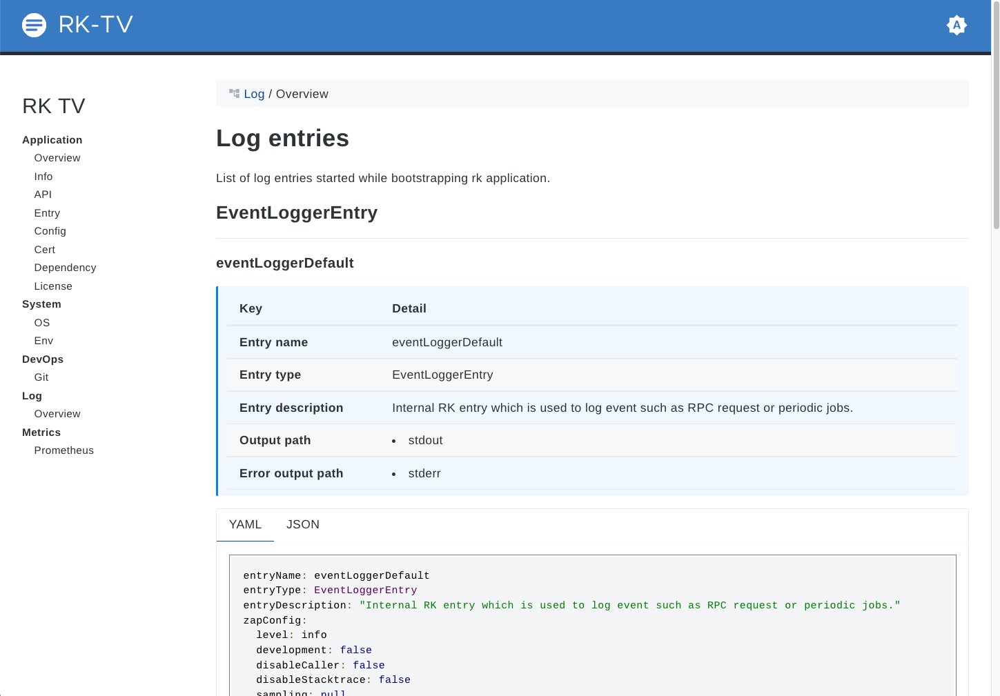

#### 5.13 Prometheus Metrics
rk-boot 如果开启了 Prometheus 中间件，我们可以在这个页面中看到 API 的基本监控信息。

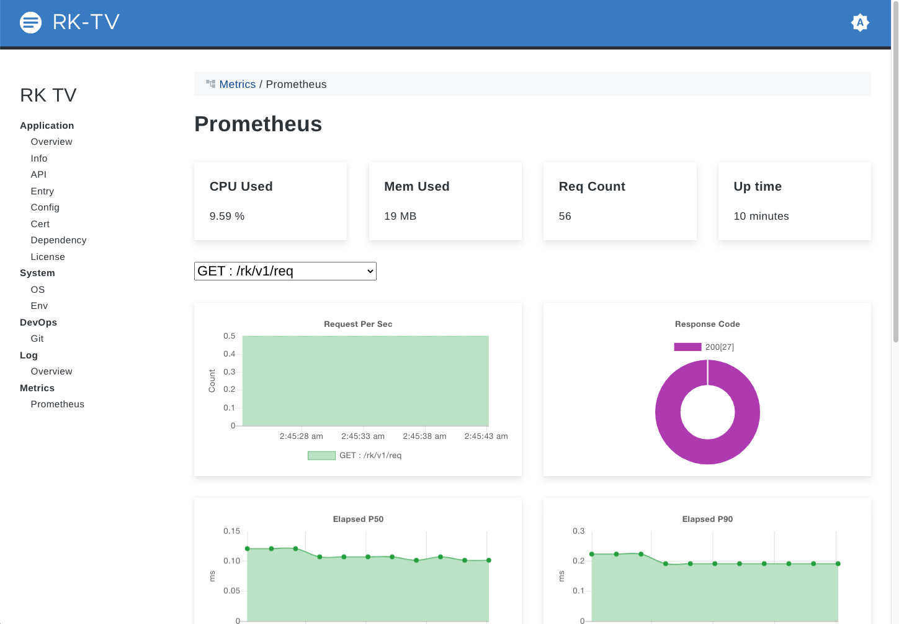

