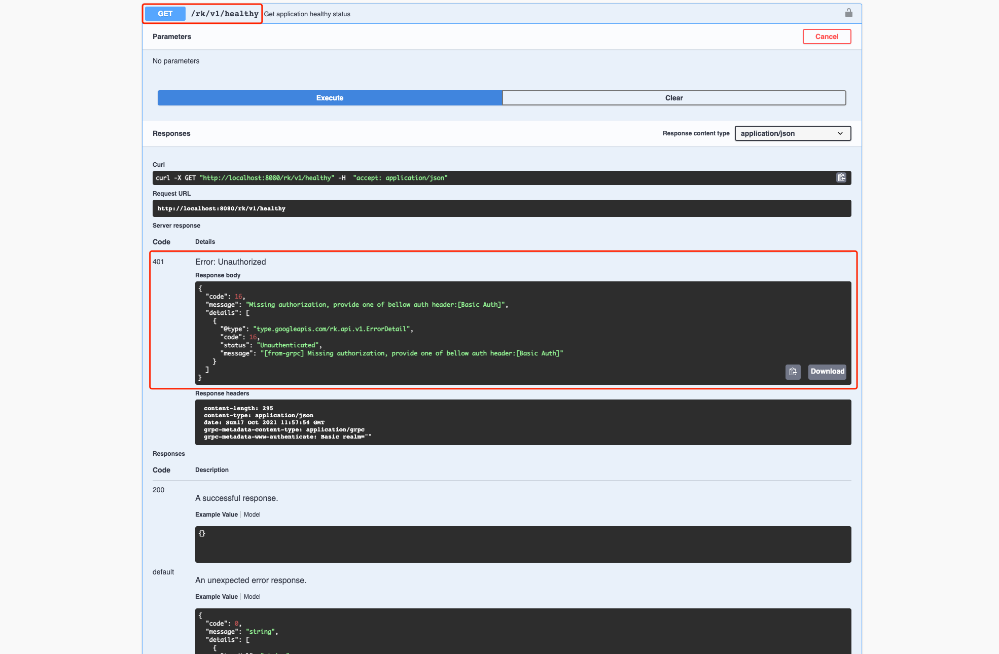
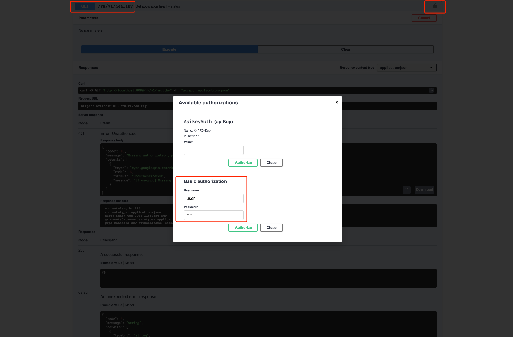

# gRPC: How to add HTTP Basic Auth in gRPC?

## Introduction
Add HTTP Basic Auth interceptor/middleware in gRPC micro-service easily with [rk-boot](https://github.com/rookie-ninja/rk-boot).

> What is HTTP Basic Auth interceptor/middleware?
>
> Auth interceptor/middleware will intercept API request and validate auth.

## Introduce rk-boot
We introduce [rk-boot](https://github.com/rookie-ninja/rk-boot) which is a library can be used to create golang microservice with grpc in a convenient way.
- [Docs](https://rkdev.info/docs/bootstrapper/getting-started/grpc-golang/)
- [Source code](https://github.com/rookie-ninja/rk-boot)
- [Example](https://github.com/rookie-ninja/rk-demo/tree/master/grpc/getting-started)

## Install rk-boot
```go
go get github.com/rookie-ninja/rk-boot
```

## Quick start
Please visit rkdev.info for detailed document.

### I. Create boot.yaml
We enabled commonService which contains a couple commonly used API like /rk/v1/healthy.

**By default, rk-boot will enable grpc-gateway automatically.**

```
---
grpc:
  - name: greeter
    port: 8080
    enabled: true
    commonService:
      enabled: true          # Enable common service for testing
    sw:
      enabled: true
    interceptors:
      auth:
        enabled: true        # Enable auth interceptor/middleware
        basic: ["user:pass"] # Enable basic auth
```

### II. Create main.go 
```
package main

import (
	"context"
	"github.com/rookie-ninja/rk-boot"
)

// Application entrance.
func main() {
	// Create a new boot instance.
	boot := rkboot.NewBoot()

	// Bootstrap
	boot.Bootstrap(context.Background())

	// Wait for shutdown sig
	boot.WaitForShutdownSig(context.Background())
}
```

### III. Start main.go
```
$ go run main.go
```

### IV. Validate
We will receive 401 without basic auth header in request.

```
$ curl  -X GET localhost:8080/rk/v1/healthy
# This is RK style error code if unauthorized
{
    "error":{
        "code":401,
        "status":"Unauthorized",
        "message":"Missing authorization, provide one of bellow auth header:[Basic Auth]",
        "details":[
            {
                "code":16,
                "status":"Unauthenticated",
                "message":"[from-grpc] Missing authorization, provide one of bellow auth header:[Basic Auth]"
            }
        ]
    }
}
```

The same case happens with swagger UI by accessing http://localhost:8080/sw



For security reason, the basic auth needs to be encoded with Base64.

We will encode user:pass to Base64.

```
$ curl localhost:8080/rk/v1/healthy -H "Authorization: Basic dXNlcjpwYXNz"
{
    "healthy":true
}
```

Click [Lock] icon to add Basic Auth.



## With X-API-Key auth type 
### I. Modify boot.yaml

> Attention！
>
> grpc-gateway won't pass X-API-Key header to gRPC server.
>
> As a result, we need to enable [enableRkGwOption] option to achieve this.

```
---
grpc:
  - name: greeter
    port: 8080
    enabled: true
    enableRkGwOption: true   # Enable rk style grpc-gateway option
    commonService:
      enabled: true          # Enable common service for testing
    sw:
      enabled: true
    interceptors:
      auth:
        enabled: true        # Enable auth interceptor/middleware
        apiKey: ["token"]    # Enable X-API-Key auth
```

### II. Start main.go
```
$ go run main.go
```

### III. Validate
We will receive 401 without X-API-Key header in request.

```
$ curl  -X GET localhost:8080/rk/v1/healthy
# This is RK style error code if unauthorized
{
  "code": 16,
  "message": "Missing authorization, provide one of bellow auth header:[X-API-Key]",
  "details": [
    {
      "@type": "type.googleapis.com/rk.api.v1.ErrorDetail",
      "code": 16,
      "status": "Unauthenticated",
      "message": "[from-grpc] Missing authorization, provide one of bellow auth header:[X-API-Key]"
    }
  ]
}
```

```
$ curl localhost:8080/rk/v1/healthy -H "X-API-Key: token"
{
    "healthy":true
}
```

## Ignore paths
We could add API paths to ignore authentication.

> Attention!
>
> The paths should be gRPC paths, not Restful API.

```
---
grpc:
  - name: greeter
    port: 8080
    enabled: true
    commonService:
      enabled: true          # Enable common service for testing
    sw:
      enabled: true
    interceptors:
      auth:
        enabled: true        # Enable auth interceptor/middleware
        basic: ["user:pass"] # Enable basic auth
        ignorePrefix: ["/rk.api.v1.RkCommonService/Healthy"]  # Ignoring path with prefix
```

