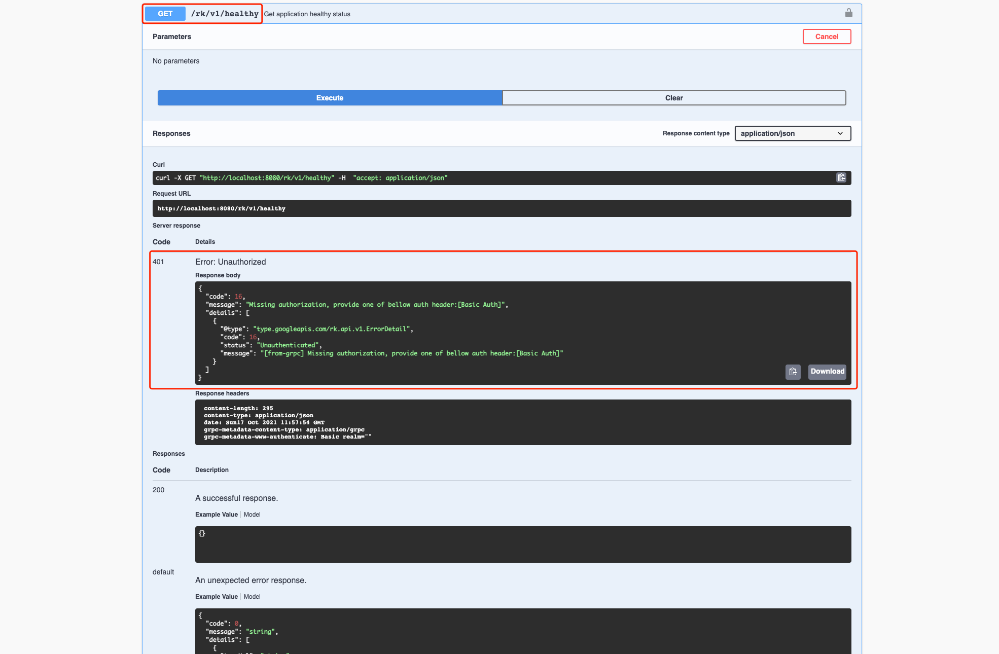
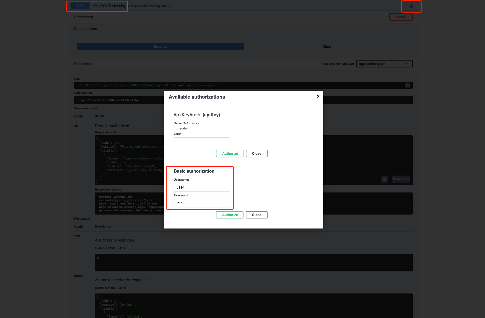

# GRPC: 如何在 gRPC 服务中添加 HTTP 基本验证？

## 介绍
本文将介绍如何在 gRPC 微服务中添加 API Auth。我们将介绍 Basic Auth，X-API-Key 两种 API Auth 模式。

我们将会使用 [rk-boot](https://github.com/rookie-ninja/rk-boot) 来启动 gRPC 服务。

> 请访问如下地址获取完整教程：
> - https://rkdev.info/cn
> - https://rkdocs.netlify.app/cn (备用)

## 安装
```go
go get github.com/rookie-ninja/rk-boot
```

## 快速开始
详细文档可参考：
- [官方文档](https://rkdocs.netlify.app/cn/docs/bootstrapper/user-guide/grpc-golang/basic/interceptor-auth/)
- 或者，[Github](https://github.com/rookie-ninja/rk-docs/blob/master/content/cn/docs/Bootstrapper/User%20guide/grpc-golang/Basic/interceptor-auth.md)

### 1.创建 boot.yaml
为了验证，我们启动了 commonService，commonService 里包含了一系列常用 API，例如 /rk/v1/healthy，并且启动了 sw 来提供 Swagger UI。

这一步，我们启动 Basic Auth，用户名密码为 user:pass。

```
---
grpc:
  - name: greeter
    port: 8080
    enabled: true
    commonService:
      enabled: true          # Enable common service for testing
    sw:
      enabled: true
    interceptors:
      auth:
        enabled: true        # Enable auth interceptor/middleware
        basic: ["user:pass"] # Enable basic auth
```

### 2.创建 main.go
```
package main

import (
	"context"
	"github.com/rookie-ninja/rk-boot"
)

// Application entrance.
func main() {
	// Create a new boot instance.
	boot := rkboot.NewBoot()

	// Bootstrap
	boot.Bootstrap(context.Background())

	// Wait for shutdown sig
	boot.WaitForShutdownSig(context.Background())
}
```

### 3.启动 main.go
```
$ go run main.go
```

### 4.验证
在不提供 Basic Auth 的情况下，我们得到了 401 错误码。

```
$ curl  -X GET localhost:8080/rk/v1/healthy
# This is RK style error code if unauthorized
{
    "error":{
        "code":401,
        "status":"Unauthorized",
        "message":"Missing authorization, provide one of bellow auth header:[Basic Auth]",
        "details":[
            {
                "code":16,
                "status":"Unauthenticated",
                "message":"[from-grpc] Missing authorization, provide one of bellow auth header:[Basic Auth]"
            }
        ]
    }
}
```

用 Swagger UI 试一下。访问 http://localhost:8080/sw，直接发送请求，我们依然会得到 401 错误。




提供 Basic Auth，出于安全考虑，Request Header 里的 Auth 需要用 Base64 进行编码。我们对 user:pass 字符串进行了 Base64 编码。

```
$ curl localhost:8080/rk/v1/healthy -H "Authorization: Basic dXNlcjpwYXNz"
{
    "healthy":true
}
```

在 Swagger UI 中，点击【锁】按钮，添加 Basic Auth。



## 使用 X-API-Key 授权模式
### 1.修改 boot.yaml
为了验证，我们启动了 commonService，commonService 里包含了一系列常用 API，例如 /rk/v1/healthy，并且启动了 sw 来提供 Swagger UI。

> 注意！
>
> grpc-gateway 默认是不会把 X-API-Key header 传到 gRPC 服务侧的，因此，我们需要启动 enableRkGwOption，这个选项能让 X-API-Key header 传到 gRPC 后端。

这一步，我们启动 X-API-Key，key 的值为 token。

```
---
grpc:
  - name: greeter
    port: 8080
    enabled: true
    enableRkGwOption: true   # Enable rk style grpc-gateway option
    commonService:
      enabled: true          # Enable common service for testing
    sw:
      enabled: true
    interceptors:
      auth:
        enabled: true        # Enable auth interceptor/middleware
        apiKey: ["token"]    # Enable X-API-Key auth
```

### 2.启动 main.go
```
$ go run main.go
```

### 3.验证
同样的情况，在不提供 X-API-Key 的情况下，我们得到了 401 错误码。

```
$ curl  -X GET localhost:8080/rk/v1/healthy
# This is RK style error code if unauthorized
{
  "code": 16,
  "message": "Missing authorization, provide one of bellow auth header:[X-API-Key]",
  "details": [
    {
      "@type": "type.googleapis.com/rk.api.v1.ErrorDetail",
      "code": 16,
      "status": "Unauthenticated",
      "message": "[from-grpc] Missing authorization, provide one of bellow auth header:[X-API-Key]"
    }
  ]
}
```

```
$ curl localhost:8080/rk/v1/healthy -H "X-API-Key: token"
{
    "healthy":true
}
```

## 忽略请求路径
我们可以添加一系列 API 请求路径，让后段忽略授权这些 API 请求。

> 注意！
>
> 这里要写 gRPC 的路径，而不是 Restful API 的路径。

```
---
grpc:
  - name: greeter
    port: 8080
    enabled: true
    commonService:
      enabled: true          # Enable common service for testing
    sw:
      enabled: true
    interceptors:
      auth:
        enabled: true        # Enable auth interceptor/middleware
        basic: ["user:pass"] # Enable basic auth
        ignorePrefix: ["/rk.api.v1.RkCommonService/Healthy"]  # Ignoring path with prefix
```