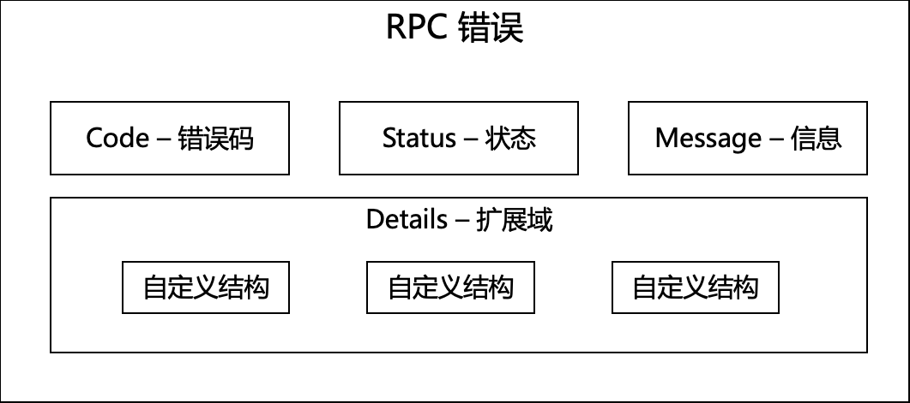
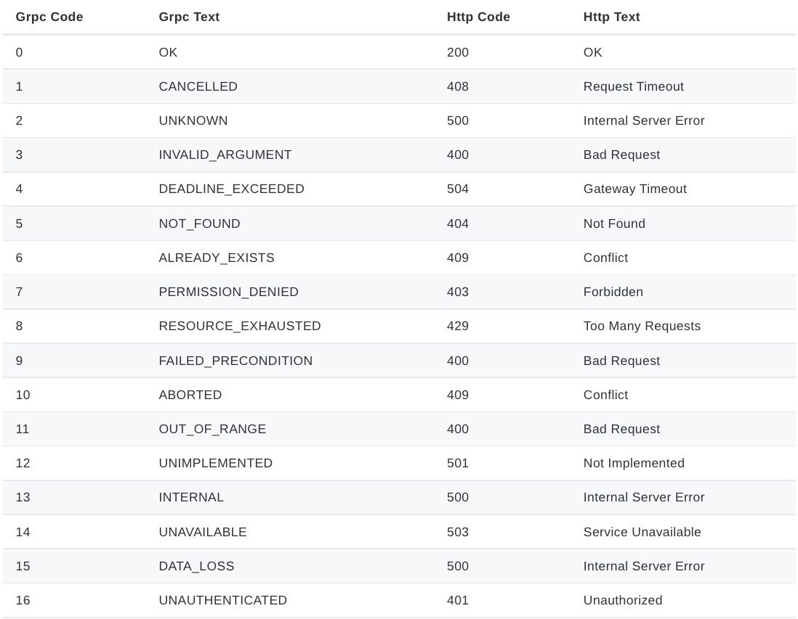

# GRPC: 如何设计 RPC 错误码？

设计一个合理的 API 是一件不容易的事情，同时，API 还会产生各种不同的错误。

为了能让 API 使用者对于 API 的错误有一个清晰的视图，定义一个标准的 RPC 错误类型是非常重要的事情。

## 考虑范围
一个合理的 RPC 错误，需要考虑如下几个方面。

- 包含错误码，错误信息
- 错误信息可扩展
- 考虑可读性
- 可解析性，即，用户可通过代码解析错误码，并采取有效行为
- 避免内部错误益处，例如，Nil point error

## RPC 错误码结构


```json
{
    "error":{
        "code":500,
        "status":"Internal Server Error",
        "message":"Panic manually!",
        "details":[]
    }
}
```

## 例子
我们介绍 [rk-boot](https://github.com/rookie-ninja/rk-boot) 库，一个快速启动 GRPC 的企业级 golang 微服务框架。

通过 [rk-boot](https://github.com/rookie-ninja/rk-boot) ，用户可以轻松搭建 GRPC 微服务，里面同时集成了 Panic 捕捉以及标准错误类型。

### 返回自定义错误
在 GRPC 中，一般会配合 grpc-gateway 一起使用，这时候，会出现一个问题，GRPC 和 grpc-gateway 的错误映射。
我们要做到的是，让 grpc-gateway 始终对 GRPC 的错误保持一致的错误映射。

我们以 [demo](https://github.com/rookie-ninja/rk-demo/tree/master/grpc/basic) 代码为例子，在这个 demo 中，我们已经集成了 rk-boot。

注意，这里，在 boot.yaml 中需要开启 enableRkGwOption，才可以把 GRPC 错误映射成 grpc-gateway 错误。

- boot.yaml
```yaml
---
grpc:
  - name: greeter                   # Name of grpc entry
    port: 8080                      # Port of grpc entry
    enabled: true                   # Enable grpc entry
    enableReflection: true
    enableRkGwOption: true
```

- main.go
```go
// Copyright (c) 2021 rookie-ninja
//
// Use of this source code is governed by an Apache-style
// license that can be found in the LICENSE file.
package main

import (
	"context"
	"errors"
	"github.com/rookie-ninja/rk-boot"
	"github.com/rookie-ninja/rk-common/error"
	"github.com/rookie-ninja/rk-demo/api/gen/v1"
	"google.golang.org/grpc"
)

// Application entrance.
func main() {
	// Create a new boot instance.
	boot := rkboot.NewBoot()

	// Get grpc entry with name
	grpcEntry := boot.GetGrpcEntry("greeter")
	grpcEntry.AddRegFuncGrpc(registerGreeter)
	grpcEntry.AddRegFuncGw(greeter.RegisterGreeterHandlerFromEndpoint)

	// Bootstrap
	boot.Bootstrap(context.Background())

	// Wait for shutdown sig
	boot.WaitForShutdownSig(context.Background())
}

func registerGreeter(server *grpc.Server) {
	greeter.RegisterGreeterServer(server, &GreeterServer{})
}

type GreeterServer struct{}

func (server *GreeterServer) Greeter(ctx context.Context, request *greeter.GreeterRequest) (*greeter.GreeterResponse, error) {
	// Return error to client
	return nil, rkerror.InvalidArgument("Invalid argument, triggered manually", errors.New("this is detail")).Err()
}
```

```
$ go run main.go
```

- 给 grpc-gateway 发送请求

> 我们可以看到，针对于 grpc-gateway 的请求，rk-boot 把 GRPC 的错误，映射成了 400 错误。
> 
> 同时，Details 里，添加了两条信息。
> - GRPC 错误
> - 我们自行添加的错误（这里，rk-boot 会默认把错误代码设置成 Unknown）
```
curl "localhost:8080/v1/greeter?name=rk-dev"
{
    "error":{
        "code":400,
        "status":"Bad Request",
        "message":"Invalid argument, triggered manually",
        "details":[
            {
                "code":3,
                "status":"InvalidArgument",
                "message":"[from-grpc] Invalid argument, triggered manually"
            },
            {
                "code":2,
                "status":"Unknown",
                "message":"this is detail"
            }
        ]
    }
}
```

- 给 GRPC 发送请求

> Details 里，添加了两条信息。
> - GRPC 错误
> - 我们自行添加的错误（这里，rk-boot 会默认把错误代码设置成 Unknown）

```
$ grpcurl -plaintext localhost:8080 api.v1.Greeter.Greeter
ERROR:
  Code: InvalidArgument
  Message: Invalid argument, triggered manually
  Details:
  1)    {"@type":"type.googleapis.com/rk.api.v1.ErrorDetail","code":3,"message":"[from-grpc] Invalid argument, triggered manually","status":"InvalidArgument"}
  2)    {"@type":"type.googleapis.com/rk.api.v1.ErrorDetail","code":2,"message":"this is detail","status":"Unknown"}
```

### 捕获 Panic（系统崩溃）
我们还是以 [demo](https://github.com/rookie-ninja/rk-demo/tree/master/grpc/basic) 代码为例子。

在 RPC 实现中，我们试着让系统崩溃，看看 rk-boot 会如何自动捕获，并且返回何种信息给用户。

注意，这里，在 boot.yaml 中需要开启 enableRkGwOption，才可以把 GRPC 错误映射成 grpc-gateway 错误。

- boot.yaml
```yaml
---
grpc:
  - name: greeter                   # Name of grpc entry
    port: 8080                      # Port of grpc entry
    enabled: true                   # Enable grpc entry
    enableReflection: true
    enableRkGwOption: true
```

- main.go
```go
// Copyright (c) 2021 rookie-ninja
//
// Use of this source code is governed by an Apache-style
// license that can be found in the LICENSE file.
package main

import (
	"context"
	"fmt"
	"github.com/rookie-ninja/rk-boot"
	"github.com/rookie-ninja/rk-demo/api/gen/v1"
	"google.golang.org/grpc"
)

// Application entrance.
func main() {
	// Create a new boot instance.
	boot := rkboot.NewBoot()

	// Get grpc entry with name
	grpcEntry := boot.GetGrpcEntry("greeter")
	grpcEntry.AddRegFuncGrpc(registerGreeter)
	grpcEntry.AddRegFuncGw(greeter.RegisterGreeterHandlerFromEndpoint)

	// Bootstrap
	boot.Bootstrap(context.Background())

	// Wait for shutdown sig
	boot.WaitForShutdownSig(context.Background())
}

func registerGreeter(server *grpc.Server) {
	greeter.RegisterGreeterServer(server, &GreeterServer{})
}

type GreeterServer struct{}

func (server *GreeterServer) Greeter(ctx context.Context, request *greeter.GreeterRequest) (*greeter.GreeterResponse, error) {
	panic("Panic manually!")

	return &greeter.GreeterResponse{
		Message: fmt.Sprintf("Hello %s!", request.Name),
	}, nil
}
```

```
$ go run main.go
```

- 给 grpc-gateway 发送请求

> 我们可以看到，针对于 grpc-gateway 的请求，rk-boot 把 GRPC 的错误，映射成了 500 错误。

```
curl "localhost:8080/v1/greeter?name=rk-dev"
{
    "error":{
        "code":500,
        "status":"Internal Server Error",
        "message":"Panic manually!",
        "details":[]
    }
}
```

- 给 GRPC 发送请求

```
$ grpcurl -plaintext localhost:8080 api.v1.Greeter.Greeter
ERROR:
  Code: Internal
  Message: Panic manually!
```

## GRPC 对应 grpc-gateway 错误映射
可参考：https://github.com/googleapis/googleapis/blob/master/google/rpc/code.proto



## 源代码
rk-boot 里对于错误的处理，实现在了 [rk-common/error](https://github.com/rookie-ninja/rk-common/tree/master/error) 中。

## 更多例子
请参考：https://github.com/rookie-ninja/rk-grpc/tree/master/example/interceptor/panic/client 获取更多例子。