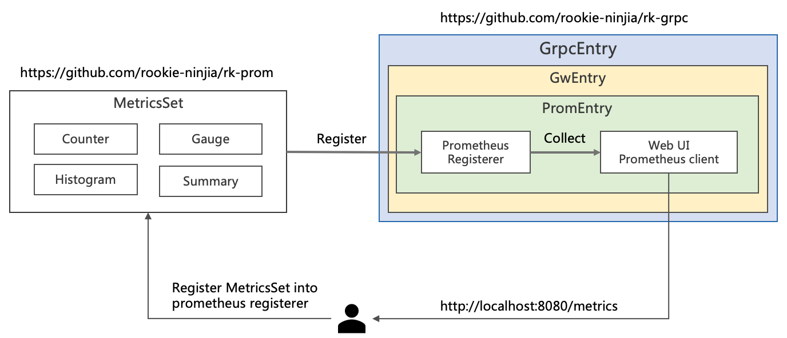
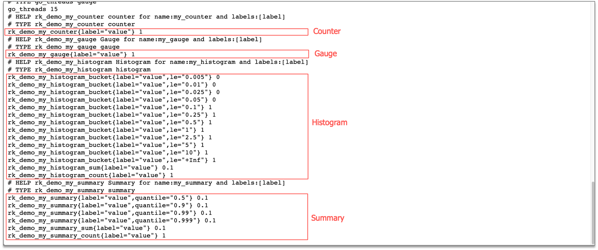

# gRPC: How to add prometheus metrics in gRPC server?

## Introduction
Add prometheus metrics in gRPC micro-service easily with [rk-boot](https://github.com/rookie-ninja/rk-boot) and [rk-prom](https://github.com/rookie-ninja/rk-prom).

## Introduce rk-boot
We introduce [rk-boot](https://github.com/rookie-ninja/rk-boot) which is a library can be used to create golang microservice with grpc in a convenient way.
- [Docs](https://rkdev.info/docs/bootstrapper/getting-started/grpc-golang/)
- [Source code](https://github.com/rookie-ninja/rk-boot)
- [Example](https://github.com/rookie-ninja/rk-demo/tree/master/grpc/getting-started)

## Install rk-boot
```go
go get github.com/rookie-ninja/rk-boot
```

## Quick start
Please visit rkdev.info for detailed document.

### 1.Create boot.yaml 
```
---
grpc:
  - name: greeter                   # Name of grpc entry
    port: 8080                      # Port of grpc entry
    enabled: true                   # Enable grpc entry
    prom:
      enabled: true                 # Enable prometheus client
#      path: "metrics"              # Default value is "metrics", set path as needed.
```

### 2.Create main.go
```
package main

import (
	"context"
	"github.com/rookie-ninja/rk-boot"
)

// Application entrance.
func main() {
	// Create a new boot instance.
	boot := rkboot.NewBoot()

	// Bootstrap
	boot.Bootstrap(context.Background())

	// Wait for shutdown sig
	boot.WaitForShutdownSig(context.Background())
}
```

### 3.Start main.go
```
$ go run main.go
```

### 4.Validate
> Visit：http://localhost:8080/metrics


## Add value to prometheus client
In order to add custom metrics into current prometheus client, we need to clarify bellow concept.



| Name | Description |
| ---- | ---- |
| [MetricsSet](https://github.com/rookie-ninja/rk-prom/blob/master/metrics_set.go) | RK defined data structure could be used register Counter, Gauge, Histogram and Summary |
| [Prometheus Registerer](https://github.com/prometheus/client_golang/blob/master/prometheus/registry.go) | User need to register MetricsSet into registerer |
| [Prometheus Counter](https://prometheus.io/docs/concepts/metric_types/#counter) | A counter is a cumulative metric that represents a single monotonically increasing counter whose value can only increase or be reset to zero on restart. |
| [Prometheus Gauge](https://prometheus.io/docs/concepts/metric_types/#gauge) | A gauge is a metric that represents a single numerical value that can arbitrarily go up and down. |
| [Prometheus Histogram](https://prometheus.io/docs/concepts/metric_types/#histogram) | A histogram samples observations (usually things like request durations or response sizes) and counts them in configurable buckets. It also provides a sum of all observed values. |
| [Prometheus Summary](https://prometheus.io/docs/concepts/metric_types/#summary) | Similar to a histogram, a summary samples observations (usually things like request durations and response sizes). |
| Prometheus Namespace | Prometheus metrics was consist of namespace_subSystem_metricsName |
| Prometheus SubSystem | Prometheus metrics was consist of namespace_subSystem_metricsName |

### 1.Add metrics value in main.go
```
package main

import (
	"context"
	"github.com/rookie-ninja/rk-boot"
	"github.com/rookie-ninja/rk-prom"
)

// Application entrance.
func main() {
	// Create a new boot instance.
	boot := rkboot.NewBoot()

	// Bootstrap
	boot.Bootstrap(context.Background())

	// Create a metrics set into prometheus.Registerer
	set := rkprom.NewMetricsSet("rk", "demo", boot.GetGrpcEntry("greeter").GwEntry.PromEntry.Registerer)

	// Register counter, gauge, histogram, summary
	set.RegisterCounter("my_counter", "label")
	set.RegisterGauge("my_gauge", "label")
	set.RegisterHistogram("my_histogram", []float64{}, "label")
	set.RegisterSummary("my_summary", rkprom.SummaryObjectives, "label")

	// Increase counter, gauge, histogram, summary with label value
	set.GetCounterWithValues("my_counter", "value").Inc()
	set.GetGaugeWithValues("my_gauge", "value").Add(1.0)
	set.GetHistogramWithValues("my_histogram", "value").Observe(0.1)
	set.GetSummaryWithValues("my_summary", "value").Observe(0.1)

	// Wait for shutdown sig
	boot.WaitForShutdownSig(context.Background())
}
```

### 2.Start main.go
```
$ go run main.go
```

### 3.Validate
> Visit：http://localhost:8080/metrics



## Send metrics to prometheus pushgateway
### 1.Enable pusher in boot.yaml
```
---
grpc:
  - name: greeter                             # Name of grpc entry
    port: 8080                                # Port of grpc entry
    enabled: true                             # Enable grpc entry
    prom:
      enabled: true                           # Enable prometheus client
      pusher:
        enabled : true                        # Enable backend job push metrics to remote pushgateway
        jobName: "demo"                       # Name of current push job
        remoteAddress: "localhost:9091"       # Remote address of pushgateway
        intervalMs: 2000                      # Push interval in milliseconds
#        basicAuth: "user:pass"               # Basic auth of pushgateway
#        cert:
#          ref: "ref"                         # Cert reference defined in CertEntry. Please see advanced user guide for details.
```

### 2.Start pushgateway with docker
```
$ docker run prom/pushgateway -p 9091:9091
```

### 3.Start main.go
```
$ go run main.go
```

### 4.Validate
> Visit：http://localhost:9091/metrics


