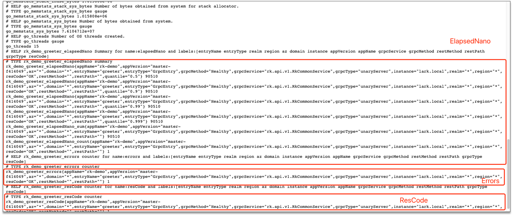
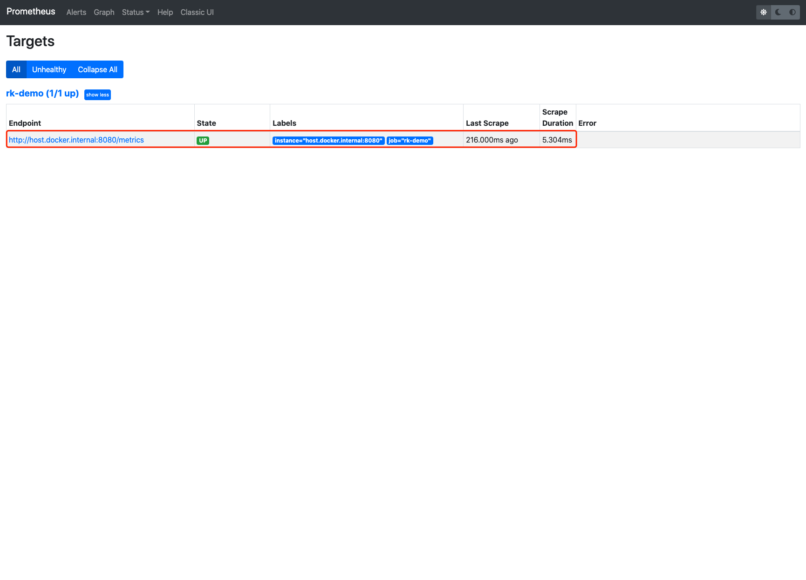
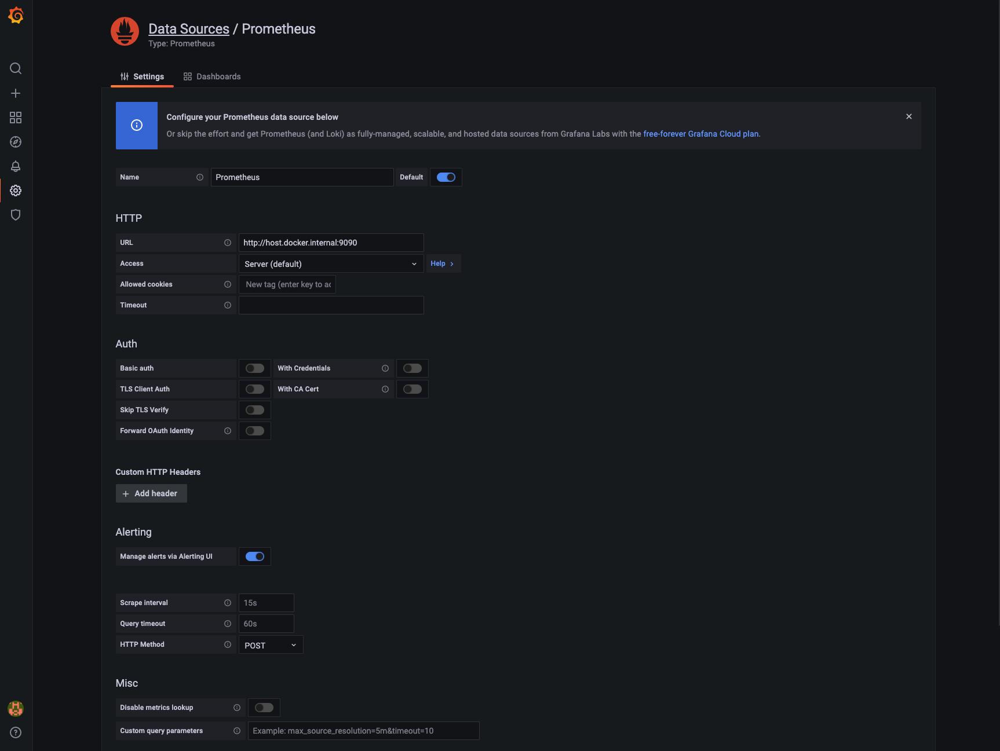
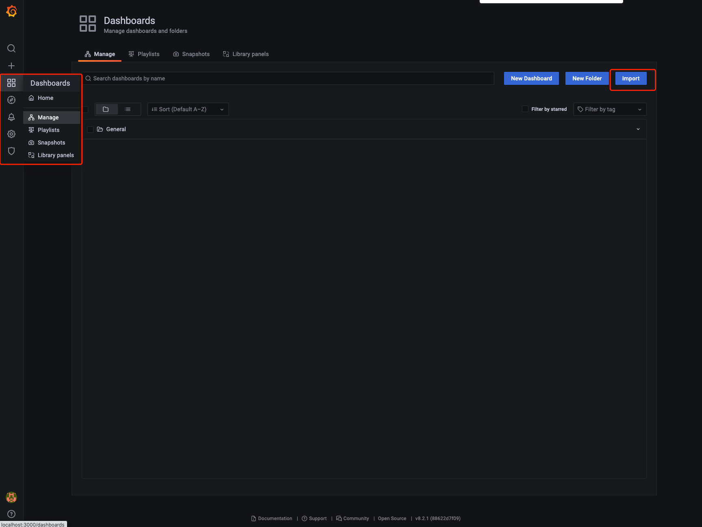
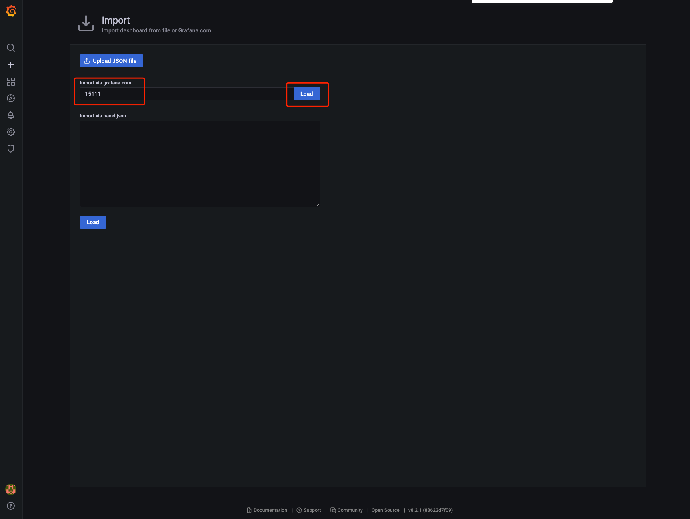

# gRPC: How to add prometheus interceptor/middleware in gRPC?

## Introduction
Add prometheus metrics interceptor/middleware in gRPC micro-service easily with [rk-boot](https://github.com/rookie-ninja/rk-boot) and [rk-grpc](https://github.com/rookie-ninja/rk-grpc).

> What is prometheus interceptor/middleware?
>
> Prometheus interceptor/middleware will intercept API request and record request metadata into metrics.

## Introduce rk-boot
We introduce [rk-boot](https://github.com/rookie-ninja/rk-boot) which is a library can be used to create golang microservice with grpc in a convenient way.
- [Docs](https://rkdev.info/docs/bootstrapper/getting-started/grpc-golang/)
- [Source code](https://github.com/rookie-ninja/rk-boot)
- [Example](https://github.com/rookie-ninja/rk-demo/tree/master/grpc/getting-started)

## Install rk-boot
```go
go get github.com/rookie-ninja/rk-boot
```
## Quick start
Please visit rkdev.info for detailed document.

[rk-boot](https://github.com/rookie-ninja/rk-boot) integrate two open source libraries while collecting prometheus metrics from gRPC API.
 
- [rk-prom](https://github.com/rookie-ninja/rk-prom) as prometheus client.
- [rk-grpc](https://github.com/rookie-ninja/rk-grpc) as grpc server framework.

> Attention! In order to go through this demo smoothly, please make sure the suffix of module in go.mod file is rk-demo.
> 
> eg: module github.com/your-repo/rk-demo

### 1.Create boot.yaml
In order to validate prometheus metrics, we enabled bellow functionalities in boot.yaml.

- **commonService**: Contains a couple of utility APIs, [details](https://github.com/rookie-ninja/rk-grpc#common-service-1).
- **prom**: Prometheus client which listens for port of 8080.
- **grpc-gateway**: rk-boot will enable grpc-gateway automatically without any configuration.
- **prometheus interceptor**: Enable prometheus interceptor/middleware.

```
---
grpc:
  - name: greeter                   # Name of grpc entry
    port: 8080                      # Port of grpc entry
    enabled: true                   # Enable grpc entry
    commonService:
      enabled: true                 # Enable common service for testing
    prom:
      enabled: true                 # Enable prometheus client
    interceptors:
      metricsProm:
        enabled: true               # Enable prometheus interceptor
```

### 2.Create main.go 
```
package main

import (
	"context"
	"github.com/rookie-ninja/rk-boot"
)

// Application entrance.
func main() {
	// Create a new boot instance.
	boot := rkboot.NewBoot()

	// Bootstrap
	boot.Bootstrap(context.Background())

	// Wait for shutdown sig
	boot.WaitForShutdownSig(context.Background())
}
```

### 3.Directory hierarchy
```
$ tree
.
├── boot.yaml
├── go.mod
├── go.sum
└── main.go

0 directories, 4 files
```

### 4.Validate
```
$ go run main.go
```

> Send request

```
$ curl -X GET localhost:8080/rk/v1/healthy
{"healthy":true}
```

> Access Prometheus client: http://localhost:8080/metrics



## Visualize metrics
We started prometheus interceptor in our process already. The next step is to visualize them from a beautiful website.

Let's select the simple, popular and free way to achieve this goal which is prometheus + grafana.


### Architecture
Let's go through the architecture first.

The workflow is simple although. 

- 1. Interceptor intercepts API requests and record information like duration, error code and etc.
- 2. Configure Prometheus server scrap data from your process.
- 3. Configure Grafana pull data from Prometheus to visualize metrics.


### Quick start
#### 1.Create prometheus.yml
> Let's create prometheus.yml file in order to make prometheus server scrap metrics data from your process(localhost:8080/metrics) periodically.
>
> We did not configure /metrics as target path because the default configuration is /metrics.
>
> Attention! We configure the target as host.docker.internal:8080 instead of localhost:8080. This is because prometheus server we plan to start
> is in the container. This is a convenient way to establish connection between process in the container and localhost.
> 
> [Explanation](https://stackoverflow.com/questions/24319662/from-inside-of-a-docker-container-how-do-i-connect-to-the-localhost-of-the-mach)

```
global:
  scrape_interval: 1s # Make scrape interval to 1s for testing.

# A scrape configuration containing exactly one endpoint to scrape:
# Here it's Prometheus itself.
scrape_configs:
  - job_name: 'rk-demo'
    scrape_interval: 1s
    static_configs:
      - targets: ['host.docker.internal:8080']
```

#### 2.Start Prometheus
> Let's use [docker](https://docs.docker.com/get-docker/) to start prometheus at port of 9090.

```
$ docker run \
      -p 9090:9090 \
      -v /<your path>/prometheus.yml:/etc/prometheus/prometheus.yml \
      prom/prometheus
```

#### 3.Validate Prometheus
> Please start main.go follow steps introduced previously and send request to /rk/v1/healthy which prometheus client will collect related metrics.
>
> Access: localhost:9090
>
> Search: rk_demo_greeter_resCode


> Access localhost:9090/targets where we could see target which is our process.



#### 4.Start Grafana
> Grafana listens port of 3000. 

```
$ docker run -p 3000:3000 --name grafana grafana/grafana
```

> Access: localhost:3000 
>
> Provide bellow username and password.
>
> username: admin
> password: admin


#### 5.Add prometheus as datasource in Grafana
Grafana is a Web UI tool to visualize metrics. As a result, we need to configure data source.


> Configure prometheus address as host.docker.internal:9090.
> 
> Attention! Please do not configure the address as localhost:9090 because grafana and prometheus is in container.



#### 6.Import Dashboard
In order to visualize metrics, we need to make a dashboard which is not an easy work.

Fortunately, we provide a demo dashboard which is fit for process started with rk-boot.

> Attention!  The dashboard imported in this example will work only if you follow steps we described in this article.
>
> Why? This is because rk-boot will define prometheus metrics name as <AppName>_<EntryName>_xxx.
> 
> If user define different module name in go.mod or Entry name rather than rk-demo and greeter, then the variables in the dashboard won't work.
>
> We will introduce how to make grafana dashboard in later article.



> Import 15111 which defined [here](https://grafana.com/grafana/dashboards/15111).



> Configure Prometheus as data source.


> Attention! Please send more requests to your process in order to check metrics.


## Concept
By default, metrics interceptor/middleware will record bellow metrics.

| Metrics name | Metrics type | Description |
| ---- | ---- | ---- |
| elapsedNano | Summary | The time elapsed for RPC.|
| resCode | Counter | The counter of RPC with resCode. |
| errors | Counter | The counter of RPC with errors if occurs. |

All of three metrics have the same labels as bellow:

| Label name | Description |
| ---- | ---- |
| entryName | gRPC entry name |
| entryType | gRPC entry type |
| realm | OS environment variable: REALM, eg: rk |
| region | OS environment variable: REGION, eg: beijing |
| az | OS environment variable: AZ, eg: beijing-1 |
| domain | OS environment variable: DOMAIN, eg: prod |
| instance | Hostname |
| appVersion | Retrieved from [AppInfoEntry](https://github.com/rookie-ninja/rk-entry#appinfoentry) |
| appName | Retrieved from [AppInfoEntry](https://github.com/rookie-ninja/rk-entry#appinfoentry) |
| restMethod | Restful API method, eg: GET |
| restPath | Restful API path, eg: /rk/v1/healthy |
| type | Entry type, eg: grpc |
| resCode | Response code, eg: OK |


