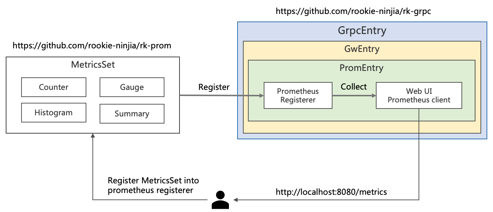
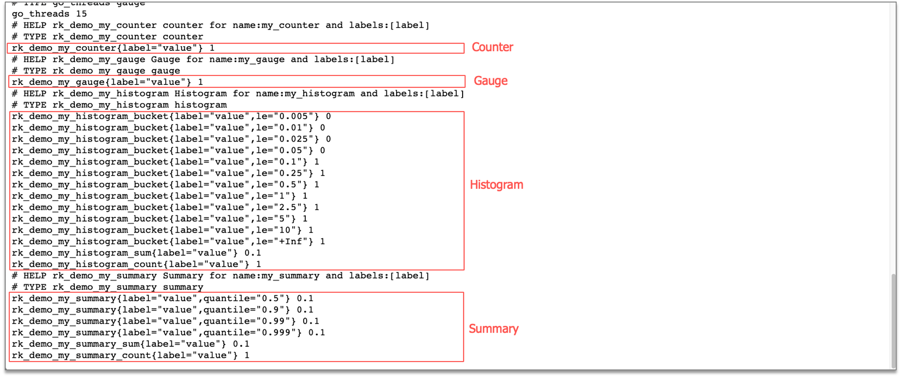

# GRPC: 如何在 gRPC 服务中加入 Prometheus 监控？

## 介绍
本文将介绍如何在 gRPC 微服务中，加入 Prometheus 监控。

gRPC 函数的自动监控，将会在后续的文章中介绍，这里我们只介绍如何在 gRPC 代码中，实现 prometheus 监控。

- 我们将会使用 [rk-boot](https://github.com/rookie-ninja/rk-boot) 来启动 gRPC 服务。
- 我们将会使用 [rk-prom](https://github.com/rookie-ninja/rk-prom) 来启动 prometheus 客户端。

> 请访问如下地址获取完整教程：
> - https://rkdev.info/cn
> - https://rkdocs.netlify.app/cn (备用)

## 安装
```go
go get github.com/rookie-ninja/rk-boot
```

## 快速开始
详细文档可参考：
- [官方文档](https://rkdev.info/cn/docs/bootstrapper/user-guide/grpc-golang/basic/prometheus-client/)
- 或者，[Github](https://github.com/rookie-ninja/rk-docs/blob/master/content/cn/docs/Bootstrapper/User%20guide/grpc-golang/Basic/prometheus-client.md)

### 1.创建 boot.yaml
```
---
grpc:
  - name: greeter                   # Name of grpc entry
    port: 8080                      # Port of grpc entry
    enabled: true                   # Enable grpc entry
    prom:
      enabled: true                 # Enable prometheus client
#      path: "metrics"              # Default value is "metrics", set path as needed.
```

### 2.创建 main.go
```
package main

import (
	"context"
	"github.com/rookie-ninja/rk-boot"
)

// Application entrance.
func main() {
	// Create a new boot instance.
	boot := rkboot.NewBoot()

	// Bootstrap
	boot.Bootstrap(context.Background())

	// Wait for shutdown sig
	boot.WaitForShutdownSig(context.Background())
}
```

### 3.启动 main.go
```
$ go run main.go
```

### 4.验证
> 访问：http://localhost:8080/metrics


## Prometheus 客户端中添加监控
我们需要先了解 Prometheus 中的如下概念。



| 名字 | 详情 |
| ---- | ---- |
| [MetricsSet](https://github.com/rookie-ninja/rk-prom/blob/master/metrics_set.go) | RK 自定义的结构，通过 MetricsSet 注册 Prometheus 的 Counter，Gauge，Histogram 和 Summary |
| [Prometheus Registerer](https://github.com/prometheus/client_golang/blob/master/prometheus/registry.go) | Prometheus 会通过 Registrerer 来管理 Counter，Gauge，Histogram 和 Summary  |
| [Prometheus Counter](https://prometheus.io/docs/concepts/metric_types/#counter) | Counter 是一个累积度量，表示单个单调增加的计数器，其值只能增加或重置为零 |
| [Prometheus Gauge](https://prometheus.io/docs/concepts/metric_types/#gauge) | Gauge 值可以随意加减 |
| [Prometheus Histogram](https://prometheus.io/docs/concepts/metric_types/#histogram) | Histogram 进行采样（通常是请求持续时间或响应大小之类的内容）并将它们计算在可配置的桶中，同时还提供所有观测值的总和 |
| [Prometheus Summary](https://prometheus.io/docs/concepts/metric_types/#summary) | 与 Histogram 类似，摘要样本观察（通常是请求持续时间和响应大小之类的东西） |
| Prometheus Namespace | Prometheus 监控名格式： namespace_subSystem_metricsName |
| Prometheus SubSystem | Prometheus 监控名格式： namespace_subSystem_metricsName |

### 1.在 main.go 中添加监控项
```
package main

import (
	"context"
	"github.com/rookie-ninja/rk-boot"
	"github.com/rookie-ninja/rk-prom"
)

// Application entrance.
func main() {
	// Create a new boot instance.
	boot := rkboot.NewBoot()

	// Bootstrap
	boot.Bootstrap(context.Background())

	// Create a metrics set into prometheus.Registerer
	set := rkprom.NewMetricsSet("rk", "demo", boot.GetGrpcEntry("greeter").GwEntry.PromEntry.Registerer)

	// Register counter, gauge, histogram, summary
	set.RegisterCounter("my_counter", "label")
	set.RegisterGauge("my_gauge", "label")
	set.RegisterHistogram("my_histogram", []float64{}, "label")
	set.RegisterSummary("my_summary", rkprom.SummaryObjectives, "label")

	// Increase counter, gauge, histogram, summary with label value
	set.GetCounterWithValues("my_counter", "value").Inc()
	set.GetGaugeWithValues("my_gauge", "value").Add(1.0)
	set.GetHistogramWithValues("my_histogram", "value").Observe(0.1)
	set.GetSummaryWithValues("my_summary", "value").Observe(0.1)

	// Wait for shutdown sig
	boot.WaitForShutdownSig(context.Background())
}
```

### 2.启动 main.go
```
$ go run main.go
```

### 3.验证
> 访问：http://localhost:8080/metrics



## 推送到 prometheus pushgateway
接下来，我们看一下，如何让 gRPC 服务，自动把监控数据推送到远程 Pushgateway 中。

### 1.boot.yaml 中启动 pusher
```
---
grpc:
  - name: greeter                             # Name of grpc entry
    port: 8080                                # Port of grpc entry
    enabled: true                             # Enable grpc entry
    prom:
      enabled: true                           # Enable prometheus client
      pusher:
        enabled : true                        # Enable backend job push metrics to remote pushgateway
        jobName: "demo"                       # Name of current push job
        remoteAddress: "localhost:9091"       # Remote address of pushgateway
        intervalMs: 2000                      # Push interval in milliseconds
#        basicAuth: "user:pass"               # Basic auth of pushgateway
#        cert:
#          ref: "ref"                         # Cert reference defined in CertEntry. Please see advanced user guide for details.
```

### 2.在本地启动 pushgateway
我们使用 docker 启动 pushgateway

```
$ docker run prom/pushgateway -p 9091:9091
```

### 3.启动 main.go
```
$ go run main.go
```

### 4.验证
> 访问：http://localhost:9091/metrics


