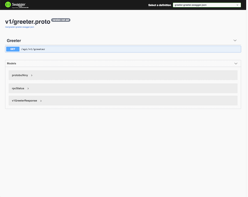

# GRPC: How to add swagger UI on gRPC?

## Introduction
In order to add swagger UI on gRPC microservice , we need enable [grpc-gateway](https://github.com/grpc-ecosystem/grpc-gateway) first.
Also, [protoc-gen-openapiv2](https://github.com/grpc-ecosystem/grpc-gateway) is required to compile .proto files into swagger config fiels.

## Use rk-boot
We introduce [rk-boot](https://github.com/rookie-ninja/rk-boot) which is a library can be used to create golang microservice with grpc in a convenient way.
- [Docs](https://rkdev.info/docs/bootstrapper/getting-started/grpc-golang/)
- [Source code](https://github.com/rookie-ninja/rk-boot)
- [Example](https://github.com/rookie-ninja/rk-demo/tree/master/grpc/getting-started)

### Requisition
In order to compile *.proto files to *.go files, we need couple of command line tools.

For example, in golang, we need at least 4 different command line tools for gRpc microservice.

| Tool | Description | Installation |
| ---- | ---- | ---- |
| [protobuf](https://github.com/protocolbuffers/protobuf) | protocol buffer | [Install](http://google.github.io/proto-lens/installing-protoc.html) |
| [protoc-gen-go](https://github.com/golang/protobuf/tree/master/protoc-gen-go) | Plugin for the Google protocol buffer compiler to generate Go code.. | [Install](https://grpc.io/docs/languages/go/quickstart/) |
| [protoc-gen-go-grpc](https://github.com/grpc/grpc-go) | This project aims to provide that HTTP+JSON interface to your gRPC service. | [Install](https://grpc.io/docs/languages/go/quickstart/) |
| [protoc-gen-grpc-gateway](https://github.com/grpc-ecosystem/grpc-gateway) | plugin for Google protocol buffer compiler to generate a reverse-proxy, which converts incoming RESTful HTTP/1 requests gRPC invocation. | [Install](https://github.com/grpc-ecosystem/grpc-gateway#installation) |
| [protoc-gen-openapiv2](https://github.com/grpc-ecosystem/grpc-gateway) | plugin for Google protocol buffer compiler to generate open API config file. | [Install](https://github.com/grpc-ecosystem/grpc-gateway#installation) |

> Please refer to my previous article: GRPC: How to compile proto files with buf quickly and safely.
> or visit: https://rkdev.info/docs/bootstrapper/user-guide/grpc-golang/basic/grpc-gateway/

### Quick start
#### 1.Create api/v1/greeter.proto
```
syntax = "proto3";

package api.v1;

option go_package = "api/v1/greeter";

service Greeter {
  rpc Greeter (GreeterRequest) returns (GreeterResponse) {}
}

message GreeterRequest {
  string name = 1;
}

message GreeterResponse {
  string message = 1;
}
```

#### 2.Create api/v1/gw_mapping.yaml
```
type: google.api.Service
config_version: 3

# Please refer google.api.Http in https://github.com/googleapis/googleapis/blob/master/google/api/http.proto file for details.
http:
  rules:
    - selector: api.v1.Greeter.Greeter
      get: /api/v1/greeter
```

#### 3.Create buf.yaml
```
version: v1beta1
name: github.com/rk-dev/rk-demo
build:
  roots:
    - api
```

#### 4.Create buf.gen.yaml
```
version: v1beta1
plugins:
  # protoc-gen-go needs to be installed, generate go files based on proto files
  - name: go
    out: api/gen
    opt:
     - paths=source_relative
  # protoc-gen-go-grpc needs to be installed, generate grpc go files based on proto files
  - name: go-grpc
    out: api/gen
    opt:
      - paths=source_relative
      - require_unimplemented_servers=false
  # protoc-gen-grpc-gateway needs to be installed, generate grpc-gateway go files based on proto files
  - name: grpc-gateway
    out: api/gen
    opt:
      - paths=source_relative
      - grpc_api_configuration=api/v1/gw_mapping.yaml
  # protoc-gen-openapiv2 needs to be installed, generate swagger config files based on proto files
  - name: openapiv2
    out: api/gen
    opt:
      - grpc_api_configuration=api/v1/gw_mapping.yaml
```

#### 5.Compile proto file
```
$ buf generate
```

> There will be bellow files generated.
```
$ tree api/gen 
api/gen
└── v1
    ├── greeter.pb.go
    ├── greeter.pb.gw.go
    ├── greeter.swagger.json
    └── greeter_grpc.pb.go
 
1 directory, 4 files
```

#### 6.Create boot.yaml

```
grpc:
  - name: greeter                   # Name of grpc entry
    port: 8080                      # Port of grpc entry
    enabled: true                   # Enable grpc entry
    sw:
      enabled: true                 # Enable swagger
      jsonPath: "api/gen/v1"        # Provide swagger config file path
```

#### 7. Create main.go
```
package main

import (
	"context"
	"fmt"
	"github.com/rookie-ninja/rk-boot"
	"github.com/rookie-ninja/rk-demo/api/gen/v1"
	"google.golang.org/grpc"
)

// Application entrance.
func main() {
    // Create a new boot instance.
    boot := rkboot.NewBoot()

    // ***************************************
    // ******* Register GRPC & Gateway *******
    // ***************************************

    // Get grpc entry with name
    grpcEntry := boot.GetGrpcEntry("greeter")
    // Register grpc registration function
    grpcEntry.AddRegFuncGrpc(registerGreeter)
    // Register grpc-gateway registration function
    grpcEntry.AddRegFuncGw(greeter.RegisterGreeterHandlerFromEndpoint)

    // Bootstrap
    boot.Bootstrap(context.Background())

    // Wait for shutdown sig
    boot.WaitForShutdownSig(context.Background())
}

// Implementation of [type GrpcRegFunc func(server *grpc.Server)]
func registerGreeter(server *grpc.Server) {
    greeter.RegisterGreeterServer(server, &GreeterServer{})
}

// Implementation of grpc service defined in proto file
type GreeterServer struct{}

func (server *GreeterServer) Greeter(ctx context.Context, request *greeter.GreeterRequest) (*greeter.GreeterResponse, error) {
    return &greeter.GreeterResponse{
        Message: fmt.Sprintf("Hello %s!", request.Name),
    }, nil
}
```

#### 8.Full structure
```
$ tree
.
├── api
│   ├── gen
│   │   └── v1
│   │       ├── greeter.pb.go
│   │       ├── greeter.pb.gw.go
│   │       ├── greeter.swagger.json
│   │       └── greeter_grpc.pb.go
│   └── v1
│       ├── greeter.proto
│       └── gw_mapping.yaml
├── boot.yaml
├── buf.gen.yaml
├── buf.yaml
├── go.mod
├── go.sum
└── main.go

4 directories, 12 files
```

#### 9.Validate
```
$ go run main.go
```

> Access Swagger: http://localhost:8080/sw


