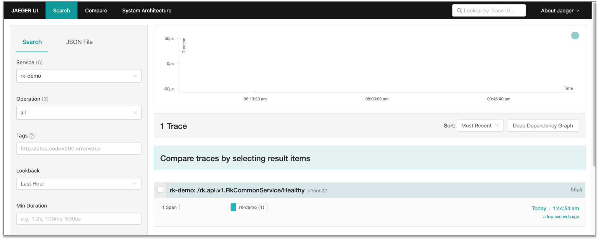

# gRPC: How to add API Tracing in gRPC?

## Introduction
Add API tracing interceptor/middleware in gRPC micro-service easily with [rk-boot](https://github.com/rookie-ninja/rk-boot).

> What is API tracing interceptor/middleware?
>
> Tracing interceptor/middleware will intercept API request and record tracing info and export them to jaeger/stdout/files.

## Introduce rk-boot
We introduce [rk-boot](https://github.com/rookie-ninja/rk-boot) which is a library can be used to create golang microservice with grpc in a convenient way.
- [Docs](https://rkdev.info/docs/bootstrapper/getting-started/grpc-golang/)
- [Source code](https://github.com/rookie-ninja/rk-boot)
- [Example](https://github.com/rookie-ninja/rk-demo/tree/master/grpc/getting-started)

## Install rk-boot
```go
go get github.com/rookie-ninja/rk-boot
```

## Quick start
Please visit rkdev.info for detailed document.

[rk-boot](https://github.com/rookie-ninja/rk-boot) integrates [OpenTelemetry-CNCF](https://github.com/open-telemetry) process tracing logic.

### I. Create boot.yaml
We enabled commonService which contains a couple commonly used API like /rk/v1/healthy.

**By default, rk-boot will enable grpc-gateway automatically.**

```
---
grpc:
  - name: greeter                   # Name of grpc entry
    port: 8080                      # Port of grpc entry
    enabled: true                   # Enable grpc entry
    commonService:
      enabled: true                 # Enable common service for testing
    interceptors:
      tracingTelemetry:
        enabled: true               # Enable tracing interceptor/middleware
        exporter:
          jaeger:
            agent:
              enabled: true         # Export to jaeger agent
```

### II. Create main.go 
```
package main

import (
	"context"
	"github.com/rookie-ninja/rk-boot"
)

// Application entrance.
func main() {
	// Create a new boot instance.
	boot := rkboot.NewBoot()

	// Bootstrap
	boot.Bootstrap(context.Background())

	// Wait for shutdown sig
	boot.WaitForShutdownSig(context.Background())
}
```

### III. Directory hierarchy
```
$ tree
.
├── boot.yaml
├── go.mod
├── go.sum
└── main.go

0 directories, 4 files
```

### IV. Start jaeger
```
$ docker run -d --name jaeger \
    -e COLLECTOR_ZIPKIN_HOST_PORT=:9411 \
    -p 5775:5775/udp \
    -p 6831:6831/udp \
    -p 6832:6832/udp \
    -p 5778:5778 \
    -p 16686:16686 \
    -p 14268:14268 \
    -p 14250:14250 \
    -p 9411:9411 \
    jaegertracing/all-in-one:1.23
```

### V. Start main.go
```
$ go run main.go
```

### VI. Validate
- Send request

```
$ curl -X GET localhost:8080/rk/v1/healthy
{"healthy":true}
```

- Access jaeger: http://localhost:16686

> rk-boot will export service name from suffix of module in go.mod file.
>
> E.g: The Service name will be rk-demo if your go.mod file looks as bellow.

```
module github.com/rookie-ninja/rk-demo

go 1.16

require (
	github.com/grpc-ecosystem/grpc-gateway/v2 v2.5.0
	github.com/rookie-ninja/rk-boot v1.2.6
	github.com/rookie-ninja/rk-grpc v1.2.6
	google.golang.org/grpc v1.38.0
	google.golang.org/protobuf v1.26.0
)
```



## Export to Stdout
We can modify boot.yaml to export tracing info to Stdout.

```
---
grpc:
  - name: greeter                   # Name of grpc entry
    port: 8080                      # Port of grpc entry
    enabled: true                   # Enable grpc entry
    commonService:
      enabled: true                 # Enable common service for testing
    interceptors:
      tracingTelemetry:
        enabled: true
        exporter:
          file:
            enabled: true
            outputPath: "stdout"    # Output to stdout
```

## Export to file
We can modify boot.yaml to export tracing info to files.

```
---
grpc:
  - name: greeter                             # Name of grpc entry
    port: 8080                                # Port of grpc entry
    enabled: true                             # Enable grpc entry
    commonService:
      enabled: true                           # Enable common service for testing
    interceptors:
      tracingTelemetry:
        enabled: true
        exporter:
          file:
            enabled: true
            outputPath: "logs/tracing.log"    # Log to files
```

## Options
| name | description | type | default value |
| ------ | ------ | ------ | ------ |
| grpc.interceptors.tracingTelemetry.enabled | Enable tracing interceptor | boolean | false |
| grpc.interceptors.tracingTelemetry.exporter.file.enabled | Enable file exporter | boolean | false |
| grpc.interceptors.tracingTelemetry.exporter.file.outputPath | Export tracing info to files | string | stdout |
| grpc.interceptors.tracingTelemetry.exporter.jaeger.agent.enabled | Export tracing info to jaeger agent | boolean | false |
| grpc.interceptors.tracingTelemetry.exporter.jaeger.agent.host | As name described | string | localhost |
| grpc.interceptors.tracingTelemetry.exporter.jaeger.agent.port | As name described | int | 6831 |
| grpc.interceptors.tracingTelemetry.exporter.jaeger.collector.enabled | Export tracing info to jaeger collector | boolean | false |
| grpc.interceptors.tracingTelemetry.exporter.jaeger.collector.endpoint | As name described | string | http://localhost:16368/api/trace |
| grpc.interceptors.tracingTelemetry.exporter.jaeger.collector.username | As name described | string | "" |
| grpc.interceptors.tracingTelemetry.exporter.jaeger.collector.password | As name described | string | "" |

