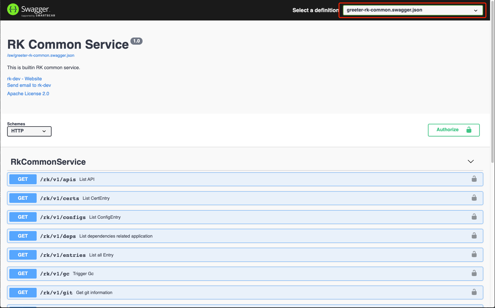
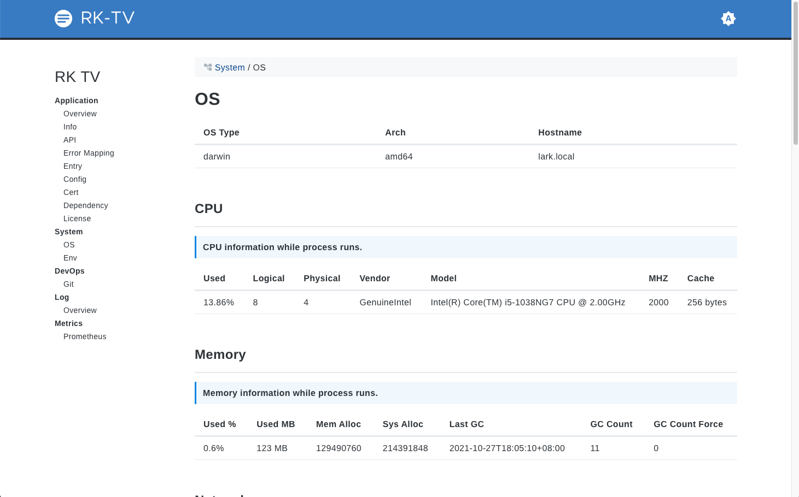

# gRPC: 快速配置通用 API 获取进程元信息

## 介绍

本文将介绍通过 rk-boot 快速配置通用 API，并获取进程元信息。

> **什么是进程元信息？**

进程元信息包含如下内容：

| 名称 | 详情 |
| ---- | ---- |
| API 列表 | 获取 API 列表 |
| gRPC 错误信息 | gRPC 对应 grpc-gateway 错误信息 |
| OS 信息 | 当前 OS 信息 |
| 进程信息 | 显示进程元信息 |
| Go Env 信息 | Go 环境信息 |
| Config 列表 | 列出 Config 文件信息 |
| Log 信息 | 展示 Log 原信息 |
| Metrics | 展示 Prometheus Metrics |
| Entry 列表 | Entry 列表，请参考[详情](https://github.com/rookie-ninja/rk-entry) |
| README | 如果本地有 README.md 文件，会展示 |
| CA 证书 | 列出 TLS/SSL 证书信息 |
| 依赖 | 列出 go.mod 信息 |
| LICENSE | 如果本地有 LICENSE 文件，会展示 |
| Git 信息 | 如果是 Git 工程，会展示 |

我们将会使用 [rk-boot](https://github.com/rookie-ninja/rk-boot) 来启动 gRPC 服务。

> **请访问如下地址获取完整教程：**

- https://rkdocs.netlify.app/cn

## 安装
```go
go get github.com/rookie-ninja/rk-boot
go get github.com/rookie-ninja/rk-grpc
```

## 快速开始
### 1.创建 boot.yaml
boot.yaml 会告诉 rk-boot 如何启动 gRPC 服务。为了 Demo，除了开启 commonService，我们还开启了如下服务。

> 也可以不开启下面的选项，则只能通过 Restful API 访问。

- **prom:** 启动 prometheus client，为了能够验证 /rk/v1/req 请求

- **interceptors.metricsProm:** 启动 Prometheus 中间件，为了验证 /rk/v1/req 请求

- **sw:** 启动 Swagger UI，为了能够通过 Swagger UI 验证 commonService API

- **tv:** 启动 RK TV，为了通过 Web UI 验证 commonService 数据

```yaml
---
grpc:
  - name: greeter                   # Required, Name of grpc entry
    port: 8080                      # Required, Port of grpc entry
    enabled: true                   # Required, Enable grpc entry
    commonService:
      enabled: true                 # Optional, Enable common service, default: false
    prom:
      enabled: true                 # Enable prometheus client
    sw:
      enabled: true                 # Optional, Enable swagger, default: false
    tv:
      enabled: true                 # Optional, Enable Rk TV, default: false
    interceptors:
      metricsProm:
        enabled: true               # Optional, Enable prometheus metrics
```

### 2.创建 main.go

```go
// Copyright (c) 2021 rookie-ninja
//
// Use of this source code is governed by an Apache-style
// license that can be found in the LICENSE file.
package main

import (
	"context"
	"github.com/rookie-ninja/rk-boot"
	_ "github.com/rookie-ninja/rk-grpc/boot"
)

// Application entrance.
func main() {
	// Create a new boot instance.
	boot := rkboot.NewBoot()

	// Bootstrap
	boot.Bootstrap(context.Background())

	// Wait for shutdown sig
	boot.WaitForShutdownSig(context.Background())
}
```

### 3.文件夹结构

```shell
.
├── boot.yaml
├── go.mod
├── go.sum
└── main.go
```

### 4.验证

```shell
$ go run main.go
```

#### 4.1 API 列表
每个 API 的详细解释，请参考下面的 【API 详解】。

| gRPC Method | Restful API | 介绍 |
| --- | --- | --- |
| rk.api.v1.RkCommonService.Healthy | GET /rk/v1/healthy | 返回进程健康状态 |
| rk.api.v1.RkCommonService.Gc | GET /rk/v1/gc | 触发 Golang 垃圾回收，并返回 GC 前后的内存使用情况 |
| rk.api.v1.RkCommonService.Info | GET /rk/v1/info | 返回进程元信息 |
| rk.api.v1.RkCommonService.Configs | GET /rk/v1/configs | 返回静态 Config Entry 内容信息 |
| rk.api.v1.RkCommonService.Apis | GET /rk/v1/apis | 返回所有注册到 RPC 中的 API 列表 |
| rk.api.v1.RkCommonService.Sys | GET /rk/v1/sys | 返回 OS 信息 |
| rk.api.v1.RkCommonService.Entries | GET /rk/v1/entries | 返回进程内部的所有 Entry 信息 |
| rk.api.v1.RkCommonService.Req | GET /rk/v1/req | 如果开启了 Prometheus 中间件，返回请求的监控信息 |
| rk.api.v1.RkCommonService.Logs | GET /rk/v1/logs | 返回进程日志元信息，包括日志路径等等 |
| rk.api.v1.RkCommonService.Certs | GET /rk/v1/certs | 如果使用了 TLS/SSL，返回证书信息 |
| rk.api.v1.RkCommonService.GwErrorMapping | GET /rk/v1/gwErrorMapping | 返回 grpc-gateway 到 gRPC 的错误码映射 |
| rk.api.v1.RkCommonService.Deps | GET /rk/v1/deps | 返回 go.mod 信息 |
| rk.api.v1.RkCommonService.License | GET /rk/v1/license | 返回 License 文件信息 |
| rk.api.v1.RkCommonService.Readme | GET /rk/v1/readme | 返回 README.md 文件信息 |
| rk.api.v1.RkCommonService.Git | GET /rk/v1/git | 如果使用 rk 命令行进行编译，则会返回当前工程的 git 元信息 |

#### 4.2 通过 API 访问
直接访问 boot.yaml 定义的端口来访问。commonService 默认使用 /rk/v1 作为路径前缀。

```
$ curl -X GET localhost:8080/rk/v1/healthy
{
    "healthy":true
}
```

#### 4.3 通过 Swagger UI 访问
访问 [http://localhost:8080/sw](http://localhost:8080/sw)



#### 4.4 通过 RK TV 访问
访问 [http://localhost:8080/rk/v1/tv](http://localhost:8080/rk/v1/tv)



### 5 API 详解
#### 5.1 /rk/v1/healthy
只要进程仍在运行，并且 RPC 服务没有出现什么错误，那么始终会返回 true。

> 注意，绝大部分情况下，通过 /rk/v1/healthy 可以胜任服务【健康检查】的责任，但是有些特殊情况除外。
>
> 比如，进程仍然是活着的，不过服务内部出现问题，处于【非正常】状态。这种情况，建议用户自己根据需要实现一个【健康检查】的 API。

```
$ curl -X GET localhost:8080/rk/v1/healthy
{
    "healthy":true
}
```

#### 5.2 /rk/v1/gc
强制 go 进程进行一次垃圾回收，并返回 GC 前后的内存变化。

> 在 DEBUG 问题的时候有用，线上服务不推荐使用。

```
$ curl -X GET localhost:8080/rk/v1/gc 
{
    "memStatAfterGc":{
        "forceGcCount":1,
        "gcCountTotal":8,
        "lastGcTimestamp":"2021-12-16T00:35:02+08:00",
        "memAllocByte":6801880,
        "memUsedMb":6,
        "memUsedPercentage":0.09,
        "sysAllocByte":75645960
    },
    "memStatBeforeGc":{
        "forceGcCount":0,
        "gcCountTotal":6,
        "lastGcTimestamp":"2021-12-16T00:32:50+08:00",
        "memAllocByte":6873512,
        "memUsedMb":6,
        "memUsedPercentage":0.09,
        "sysAllocByte":75645960
    }
}
```

#### 5.3 /rk/v1/info
返回进程元信息。

```
$ curl -X GET localhost:8080/rk/v1/info
{
    "appName":"rk",
    "az":"",
    "description":"Internal RK entry which describes application with fields of appName, version and etc.",
    "docsUrl":[],
    "domain":"",
    "gid":"20",
    "homeUrl":"",
    "iconUrl":"",
    "keywords":[],
    "maintainers":[],
    "realm":"",
    "region":"",
    "startTime":"2021-12-16T00:28:24+08:00",
    "uid":"501",
    "upTimeSec":566,
    "upTimeStr":"9 minutes",
    "username":"Dongxun Yin",
    "version":""
}
```

我们可以发现上面的返回值中，有些 Fields 是空的。

| Field | 如何配置 |
| --- | --- |
| appName | 从当前 working directory 中寻找 .rk/rk.yaml 文件，并读取 appName，如果 rk.yaml 不存在，则返回默认值：rk |
| version | 从当前 working directory 中寻找 .rk/rk.yaml 文件，并读取 version 如果 rk.yaml 不存在，则返回默认值："" |
| realm | 从环境变量里读取 Key 为 REALM 的值 |
| region | 从环境变量里读取 Key 为 REGION 的值 |
| az | 从环境变量里读取 Key 为 AZ 的值 |
| DOMAIN | 从环境变量里读取 Key 为 DOMAIN 的值 |
| description | 从 boot.yaml 里读取，下面会给出例子 |
| keywords | 从 boot.yaml 里读取，下面会给出例子 |
| homeUrl | 从 boot.yaml 里读取，下面会给出例子 |
| iconUrl | 从 boot.yaml 里读取，下面会给出例子 |
| docsUrl | 从 boot.yaml 里读取，下面会给出例子 |
| maintainers | 从 boot.yaml 里读取，下面会给出例子 |

看起来比较麻烦，我们给以个完整的例子，让 /rk/v1/info 返回完整信息。还是使用上面的工程，我们做两个改动。

- 在 boot.yaml 里添加 app
- 增加 REALM, REGION, AZ, DOMAIN 环境变量

appName & version 的配置请参考：[demo](https://github.com/rookie-ninja/rk-demo/tree/master/standard/go-grpc)

**boot.yaml**

```yaml
---
# Add app related fields for demonstration!
app:
  description: "This is description for introducing common API."
  keywords: ["rk", "common API"]
  homeUrl: "https://rkdev.info"
  iconUrl: "https://rkdev.info"
  docsUrl: ["https://rkdev.info"]
  maintainers: ["Tony Stark", "Thor"]
grpc:
  - name: greeter                     # Required
    port: 8080                        # Required
    enabled: true                     # Required
    commonService:
      enabled: true                   # Optional, default: false
    tv:
      enabled: true                   # Optional, default: false
    sw:
      enabled: true                   # Optional, default: false
    prom:
      enabled: true                   # Optional, default: false
    interceptors:
      metricsProm:
        enabled: true                 # Optional, default: false
```

**main.go**

```go
// Copyright (c) 2021 rookie-ninja
//
// Use of this source code is governed by an Apache-style
// license that can be found in the LICENSE file.
package main

import (
	"context"
	"github.com/rookie-ninja/rk-boot"
	_ "github.com/rookie-ninja/rk-grpc/boot"
	"os"
)

// Application entrance.
func main() {
	os.Setenv("REALM", "rk-realm")
	os.Setenv("REGION", "rk-region")
	os.Setenv("AZ", "rk-az")
	os.Setenv("DOMAIN", "rk-domain")

	// Create a new boot instance.
	boot := rkboot.NewBoot()

	// Bootstrap
	boot.Bootstrap(context.Background())

	// Wait for shutdown sig
	boot.WaitForShutdownSig(context.Background())
}
```

**output**

```
$ curl -X GET localhost:8080/rk/v1/info
{
    "appName":"rk",
    "az":"rk-az",
    "description":"This is description for introducing common API.",
    "docsUrl":[
        "https://rkdev.info"
    ],
    "domain":"rk-domain",
    "gid":"20",
    "homeUrl":"https://rkdev.info",
    "iconUrl":"https://rkdev.info",
    "keywords":[
        "rk",
        "common API"
    ],
    "maintainers":[
        "Tony Stark",
        "Thor"
    ],
    "realm":"rk-realm",
    "region":"rk-region",
    "startTime":"2021-12-16T01:38:31+08:00",
    "uid":"501",
    "upTimeSec":25,
    "upTimeStr":"25 seconds",
    "username":"Dongxun Yin",
    "version":""
}
```

#### 5.4 /rk/v1/configs
读取进程里的 Config Entry。必须在 boot.yaml 里配置 Config 才会显示。

如何在代码里读取 Config， 可参考 [gRPC: 基于云原生环境，区分配置文件](https://my.oschina.net/u/4955601/blog/5286930)

还是使用上面的工程，我们做一个改动。

- 添加 config/config.yaml 文件
- 在 boot.yaml 里添加 config 入口

**boot.yaml**

```yaml
---
# Add config related fields for demonstration!
config:
  - name: my-config                   # Required
    locale: "*::*::*::*"              # Required
    path: config/config.yaml         # Required
grpc:
  - name: greeter                     # Required
    port: 8080                        # Required
    enabled: true                     # Required
    commonService:
      enabled: true                   # Optional, default: false
    tv:
      enabled: true                   # Optional, default: false
    sw:
      enabled: true                   # Optional, default: false
    prom:
      enabled: true                   # Optional, default: false
    interceptors:
      metricsProm:
        enabled: true                 # Optional, default: false
```

**main.go**

```go
// Copyright (c) 2021 rookie-ninja
//
// Use of this source code is governed by an Apache-style
// license that can be found in the LICENSE file.
package main

import (
	"context"
	"github.com/rookie-ninja/rk-boot"
	_ "github.com/rookie-ninja/rk-grpc/boot"
)

// Application entrance.
func main() {
	// Create a new boot instance.
	boot := rkboot.NewBoot()

	// Bootstrap
	boot.Bootstrap(context.Background())

	// Wait for shutdown sig
	boot.WaitForShutdownSig(context.Background())
}
```

**output**

```
$ tree
.
├── boot.yaml
├── config
│   └── config.yaml
├── go.mod
├── go.sum
└── main.go
  
1 directory, 5 files

$ curl -X GET localhost:8080/rk/v1/configs
{
    "entries":[
        {
            "entryDescription":"Internal RK entry which read user config file into viper instance.",
            "entryMeta":{
                "key":"value"
            },
            "entryName":"my-config",
            "entryType":"ConfigEntry",
            "path":"/Users/dongxuny/workspace/rk/rk-demo/grpc/demo/config/config.yaml"
        }
    ]
}
```

#### 5.5 /rk/v1/apis
列出注册到 RPC 服务中的所有 API。

```
$ curl -X GET localhost:8080/rk/v1/apis 
{
    "entries":[
        {
            "entryName":"greeter",
            "grpc":{
                "gw":{
                    "method":"GET",
                    "pattern":"/rk/v1/apis",
                    "port":8080,
                    "swUrl":"http://127.0.0.1:8080/sw/"
                },
                "method":"Apis",
                "port":8080,
                "service":"rk.api.v1.RkCommonService",
                "type":"Unary"
            },
            "rest":null
        },
        ...
    ]
}
```

#### 5.6 /rk/v1/sys
```
$ curl -X GET localhost:8080/rk/v1/sys
{
    "cpuInfo":{
        "cacheSize":256,
        "cpuUsedPercentage":21.63,
        "logicalCoreCount":8,
        "mhz":2000,
        "modelName":"Intel(R) Core(TM) i5-1038NG7 CPU @ 2.00GHz",
        "physicalCoreCount":4,
        "vendorId":"GenuineIntel"
    },
    "goEnvInfo":{
        "goArch":"amd64",
        "goos":"darwin",
        "routinesCount":16,
        "startTime":"2021-12-16T01:48:50+08:00",
        "upTimeSec":222,
        "upTimeStr":"3 minutes",
        "version":"go1.16.3"
    },
    "memInfo":{
        "forceGcCount":0,
        "gcCountTotal":5,
        "lastGcTimestamp":"2021-12-16T01:51:11+08:00",
        "memAllocByte":7367384,
        "memUsedMb":7,
        "memUsedPercentage":0.1,
        "sysAllocByte":75645960
    },
    "netInfo":{
        "netInterface":[
            {
                "addrs":[
                    "127.0.0.1/8",
                    "::1/128",
                    "fe80::1/64"
                ],
                "flags":[
                    "up",
                    "loopback",
                    "multicast"
                ],
                "hardwareAddr":"",
                "mtu":16384,
                "multicastAddrs":[
                    "ff02::fb",
                    "224.0.0.251",
                    "ff02::2:ff33:9cc0",
                    "ff01::1",
                    "ff02::1",
                    "ff02::1:ff00:1",
                    "224.0.0.1"
                ],
                "name":"lo0"
            },
            ...
        ]
    },
    "osInfo":{
        "arch":"amd64",
        "hostname":"lark.local",
        "os":"darwin"
    }
}
```

#### 5.7 /rk/v1/entries
列出进程里所有的 Entry。

```
$ curl -X GET localhost:8080/rk/v1/entries
{
    "entries":{
        "AppInfoEntry":[
            Object{...}
        ],
        "ConfigEntry":[
            Object{...}
        ],
        "EventLoggerEntry":[
            Object{...}
        ],
        "GrpcEntry":[
            Object{...}
        ],
        "ZapLoggerEntry":[
            Object{...}
        ]
    }
}
```

#### 5.8 /rk/v1/req
返回 API Prometheus 监控数据。必须开启 prometheus client & prometheus 中间件。

```
$ curl -X GET localhost:8080/rk/v1/req
{
    "metrics":[
        {
            "count":1,
            "elapsedNanoP50":724285,
            "elapsedNanoP90":724285,
            "elapsedNanoP99":724285,
            "elapsedNanoP999":724285,
            "grpcMethod":"Sys",
            "grpcService":"rk.api.v1.RkCommonService",
            "resCode":Array[1],
            "restMethod":"",
            "restPath":""
        },
        Object{...},
        ...
    ]
}
```

#### 5.9 /rk/v1/logs
返回 Log Entry 信息，如果在 boot.yaml 里配置了 log entry，则会展示。

请参考 [gRPC: 如何合理管理日志配置？](https://my.oschina.net/u/4955601/blog/5283316) 添加日志配置。

```
$ curl -X GET localhost:8080/rk/v1/logs
{
    "entries":{
        "EventLoggerEntry":[
            {
                "entryDescription":"Internal RK entry which is used to log event such as RPC request or periodic jobs.",
                "entryMeta":Object{...},
                "entryName":"eventLoggerDefault",
                "entryType":"EventLoggerEntry",
                "errorOutputPaths":[
                    "stderr"
                ],
                "outputPaths":[
                    "stdout"
                ]
            }
        ],
        "ZapLoggerEntry":Array[1]
    }
}
```

#### 5.10 /rk/v1/certs
如果使用了 TLS/SSL，返回证书信息。

请参考 [gRPC: 如何开启 TLS/SSL？](https://my.oschina.net/u/4955601/blog/5287645)

#### 5.11 /rk/v1/gwErrorMapping
请参考 [gRPC: 如何让 gRPC 提供 Restful API 服务?](https://my.oschina.net/u/4955601/blog/5275257)

#### 5.12 /rk/v1/deps, /rk/v1/license, /rk/v1/readme, /rk/v1/git
rk-boot 会读取当前 working directory 当中的 .rk/rk.yaml 文件读取具体文件路径。

此功能在使用 [rk](https://github.com/rookie-ninja/rk) 命令行进行编译，打包的时候，才有用。
当然，用户可以自行配置 .rk/rk.yaml 文件，不过会很繁琐。请参考[demo](https://github.com/rookie-ninja/rk-demo/tree/master/standard/go-grpc)

```
$ rk build
[1/8] Clearing target folder
------------------------------------[OK]
[2/8] Execute user command before
- buf generate --path api/v1

------------------------------------[OK]
[3/8] Execute user script before
- No user scripts found!
------------------------------------[OK]
[4/8] Build go file
- go build -o target/bin/demo main.go
- cp -r boot.yaml target
- cp -r README.md target/.rk/README.md
- cp -r LICENSE target/.rk/LICENSE
- cp -r go.mod target/.rk/dep/go.mod
- cp -r cov.html target/.rk/ut/cov.html
cp: cov.html: No such file or directory
------------------------------------[OK]
[5/8] Copy to target folder
- cp -r api target/
------------------------------------[OK]
[6/8] Generate rk meta from on local
- Write files to target/.rk/rk.yaml
------------------------------------[OK]
[7/8] Execute user script after
- No user scripts found!
------------------------------------[OK]
[8/8] Execute user command after
- No user commands found!
------------------------------------[OK]

$ tree target/.rk 
target/.rk
├── LICENSE
├── README.md
├── dep
│   └── go.mod
├── rk.yaml
└── ut
  
2 directories, 4 files

$ cat target/.rk/rk.yaml 
git:
  branch: master
  commit:
    committer:
      email: dongxuny@gmail.com
      name: dongxuny
    date: Sun Dec 12 00:44:25 2021 +0800
    id: 04ae4f58a6f6c45614bfeae8c950becf247d06a2
    idAbbr: 04ae4f5
    sub: |
      Bump up rk-boot to v1.4.0
  tag: ""
  url: https://github.com/rookie-ninja/rk-demo
name: demo
version: master-04ae4f5
```

