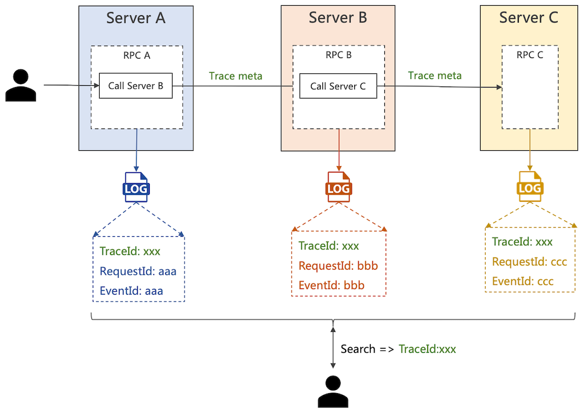

# GRPC: 如何实现分布式日志跟踪？

## 介绍

本文将介绍如何在 gRPC 分布式场景中，实现 API 的日志追踪。

> 什么是 API 日志追踪？
>
> 一个 API 请求会跨多个微服务，我们希望通过一个唯一的 ID 检索到整个链路的日志。



我们将会使用 [rk-boot](https://github.com/rookie-ninja/rk-boot) 来启动 gRPC 服务。

> 请访问如下地址获取完整教程：
>
> - https://rkdev.info/cn
>
> - https://rkdocs.netlify.app/cn (备用)

## 安装
```go
go get github.com/rookie-ninja/rk-boot
```

## 快速开始
[rk-boot](https://github.com/rookie-ninja/rk-boot) 默认集成了 grpc-gateway，并且会默认启动。

我们会创建 /api/v1/greeter API 进行验证，同时开启 logging, meta 和 tracing 拦截器以达到目的。

### 1. 创建 api/v1/greeter.proto 
```
syntax = "proto3";

package api.v1;

option go_package = "api/v1/greeter";

service Greeter {
  rpc Greeter (GreeterRequest) returns (GreeterResponse) {}
}

message GreeterRequest {
  string name = 1;
}

message GreeterResponse {
  string message = 1;
}
```

### 2. 创建 api/v1/gw_mapping.yaml 
```
type: google.api.Service
config_version: 3

# Please refer google.api.Http in https://github.com/googleapis/googleapis/blob/master/google/api/http.proto file for details.
http:
  rules:
    - selector: api.v1.Greeter.Greeter
      get: /api/v1/greeter
```

### 3. 创建 buf.yaml
```
version: v1beta1
name: github.com/rk-dev/rk-demo
build:
  roots:
    - api
```

### 4. 创建 buf.gen.yaml
```
version: v1beta1
plugins:
  # protoc-gen-go needs to be installed, generate go files based on proto files
  - name: go
    out: api/gen
    opt:
     - paths=source_relative
  # protoc-gen-go-grpc needs to be installed, generate grpc go files based on proto files
  - name: go-grpc
    out: api/gen
    opt:
      - paths=source_relative
      - require_unimplemented_servers=false
  # protoc-gen-grpc-gateway needs to be installed, generate grpc-gateway go files based on proto files
  - name: grpc-gateway
    out: api/gen
    opt:
      - paths=source_relative
      - grpc_api_configuration=api/v1/gw_mapping.yaml
  # protoc-gen-openapiv2 needs to be installed, generate swagger config files based on proto files
  - name: openapiv2
    out: api/gen
    opt:
      - grpc_api_configuration=api/v1/gw_mapping.yaml
```

### 5. 编译 proto file 
```
$ buf generate
```

> 如下的文件会被创建。

```
$ tree api/gen 
api/gen
└── v1
    ├── greeter.pb.go
    ├── greeter.pb.gw.go
    ├── greeter.swagger.json
    └── greeter_grpc.pb.go
 
1 directory, 4 files
```

### 6. 创建 bootA.yaml & serverA.go
Server-A 监听 1949 端口，并且发送请求给 Server-B。

我们通过 rkgrpcctx.InjectSpanToNewContext() 方法把 Tracing 信息注入到 Context 中，发送给 Server-B。 

```
---
grpc:
  - name: greeter                   # Name of grpc entry
    port: 1949                      # Port of grpc entry
    enabled: true                   # Enable grpc entry
    interceptors:
      loggingZap:
        enabled: true
      meta:
        enabled: true
      tracingTelemetry:
        enabled: true
```

```
package main

import (
	"context"
	"demo/api/gen/v1"
	"fmt"
	"github.com/rookie-ninja/rk-boot"
	"github.com/rookie-ninja/rk-grpc/interceptor/context"
	"google.golang.org/grpc"
)

// Application entrance.
func main() {
	// Create a new boot instance.
	boot := rkboot.NewBoot(rkboot.WithBootConfigPath("bootA.yaml"))

	// Get grpc entry with name
	grpcEntry := boot.GetGrpcEntry("greeter")
	grpcEntry.AddRegFuncGrpc(registerGreeter)
	grpcEntry.AddRegFuncGw(greeter.RegisterGreeterHandlerFromEndpoint)

	// Bootstrap
	boot.Bootstrap(context.Background())

	// Wait for shutdown sig
	boot.WaitForShutdownSig(context.Background())
}

func registerGreeter(server *grpc.Server) {
	greeter.RegisterGreeterServer(server, &GreeterServer{})
}

type GreeterServer struct{}

func (server *GreeterServer) Greeter(ctx context.Context, request *greeter.GreeterRequest) (*greeter.GreeterResponse, error) {
	// Call serverB at 2008 with grpc client
	opts := []grpc.DialOption{
		grpc.WithBlock(),
		grpc.WithInsecure(),
	}
	conn, _ := grpc.Dial("localhost:2008", opts...)
	defer conn.Close()
	client := greeter.NewGreeterClient(conn)

	// Inject current trace information into context
	newCtx := rkgrpcctx.InjectSpanToNewContext(ctx)
	client.Greeter(newCtx, &greeter.GreeterRequest{Name: "A"})

	return &greeter.GreeterResponse{
		Message: fmt.Sprintf("Hello %s!", request.Name),
	}, nil
}
```

### 7. 创建 bootB.yaml & serverB.go
Server-B 监听 2008 端口。

```
---
grpc:
  - name: greeter                   # Name of grpc entry
    port: 2008                      # Port of grpc entry
    enabled: true                   # Enable grpc entry
    interceptors:
      loggingZap:
        enabled: true
      meta:
        enabled: true
      tracingTelemetry:
        enabled: true
```

```
package main

import (
	"context"
	"demo/api/gen/v1"
	"fmt"
	"github.com/rookie-ninja/rk-boot"
	"google.golang.org/grpc"
)

// Application entrance.
func main() {
	// Create a new boot instance.
	boot := rkboot.NewBoot(rkboot.WithBootConfigPath("bootB.yaml"))

	// Get grpc entry with name
	grpcEntry := boot.GetGrpcEntry("greeter")
	grpcEntry.AddRegFuncGrpc(registerGreeterB)
	grpcEntry.AddRegFuncGw(greeter.RegisterGreeterHandlerFromEndpoint)

	// Bootstrap
	boot.Bootstrap(context.Background())

	// Wait for shutdown sig
	boot.WaitForShutdownSig(context.Background())
}

func registerGreeterB(server *grpc.Server) {
	greeter.RegisterGreeterServer(server, &GreeterServerB{})
}

type GreeterServerB struct{}

func (server *GreeterServerB) Greeter(ctx context.Context, request *greeter.GreeterRequest) (*greeter.GreeterResponse, error) {
	return &greeter.GreeterResponse{
		Message: fmt.Sprintf("Hello %s!", request.Name),
	}, nil
}
```

### 8. 文件夹结构

```
├── api
│   ├── gen
│   │   └── v1
│   │     ├── greeter.pb.go
│   │     ├── greeter.pb.gw.go
│   │     ├── greeter.swagger.json
│   │     └── greeter_grpc.pb.go
│   └── v1
│       ├── greeter.proto
│       └── gw_mapping.yaml
├── bootA.yaml
├── bootB.yaml
├── buf.gen.yaml
├── buf.yaml
├── go.mod
├── go.sum
├── serverA.go
└── serverB.go
```

### 9. 启动 ServerA & ServerB

```
$ go run serverA.go
$ go run serverB.go
```

### 10. 往 ServerA 发送请求

```
$ curl "localhost:1949/api/v1/greeter?name=rk-dev"
```

### 11. 验证日志
两个服务的日志中，会有同样的 traceId，不同的 requestId。

我们可以通过 grep traceId 来追踪 RPC。

- ServerA

```
------------------------------------------------------------------------
endTime=2021-10-20T00:02:21.739688+08:00
...
ids={"eventId":"0d145356-998a-4999-ab62-6f1b805274a0","requestId":"0d145356-998a-4999-ab62-6f1b805274a0","traceId":"c36a45eb076066df39fa407174012369"}
...
operation=/api.v1.Greeter/Greeter
resCode=OK
eventStatus=Ended
EOE
```

- ServerB
```
------------------------------------------------------------------------
endTime=2021-10-20T00:02:21.739125+08:00
...
ids={"eventId":"8858a6eb-e953-42ad-bdc3-c466bbbd798e","requestId":"8858a6eb-e953-42ad-bdc3-c466bbbd798e","traceId":"c36a45eb076066df39fa407174012369"}
...
operation=/api.v1.Greeter/Greeter
resCode=OK
eventStatus=Ended
EOE
```

## 概念
当我们没有使用例如 jaeger 调用链服务的时候，我们希望通过日志来追踪分布式系统里的 RPC 请求。

rk-boot 的拦截器会通过 openTelemetry 库来向日志写入 traceId 来追踪 RPC。

当启动了日志拦截器，原数据拦截器，调用链拦截器的时候，拦截器会往日志里写入如下三种 ID。

### EventId
当启动了日志拦截器，EventId 会自动生成。

```
---
grpc:
  - name: greeter                   # Name of grpc entry
    port: 1949                      # Port of grpc entry
    enabled: true                   # Enable grpc entry
    interceptors:
      loggingZap:
        enabled: true
```

```
------------------------------------------------------------------------
...
ids={"eventId":"cd617f0c-2d93-45e1-bef0-95c89972530d"}
...
```

### RequestId
当启动了日志拦截器和原数据拦截器，RequestId 和 EventId 会自动生成，并且这两个 ID 会一致。

```
---
grpc:
  - name: greeter                   # Name of grpc entry
    port: 1949                      # Port of grpc entry
    enabled: true                   # Enable grpc entry
    interceptors:
      loggingZap:
        enabled: true
      meta:
        enabled: true
```

```
------------------------------------------------------------------------
...
ids={"eventId":"8226ba9b-424e-4e19-ba63-d37ca69028b3","requestId":"8226ba9b-424e-4e19-ba63-d37ca69028b3"}
...
```

> 即使用户覆盖了 RequestId，EventId 也会保持一致。

```
rkgrpcctx.AddHeaderToClient(ctx, rkgrpcctx.RequestIdKey, "overridden-request-id")
```

```
------------------------------------------------------------------------
...
ids={"eventId":"overridden-request-id","requestId":"overridden-request-id"}
...
```

### TraceId
当启动了调用链拦截器，traceId 会自动生成。

```
---
grpc:
  - name: greeter                   # Name of grpc entry
    port: 1949                      # Port of grpc entry
    enabled: true                   # Enable grpc entry
    interceptors:
      loggingZap:
        enabled: true
      meta:
        enabled: true
      tracingTelemetry:
        enabled: true
```

```
------------------------------------------------------------------------
...
ids={"eventId":"dd19cf9a-c7be-486c-b29d-7af777a78ebe","requestId":"dd19cf9a-c7be-486c-b29d-7af777a78ebe","traceId":"316a7b475ff500a76bfcd6147036951c"}
...
```


