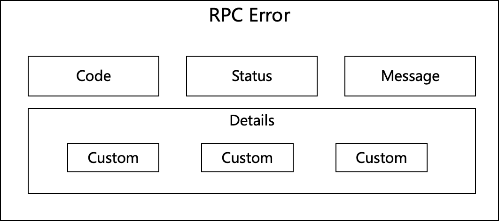
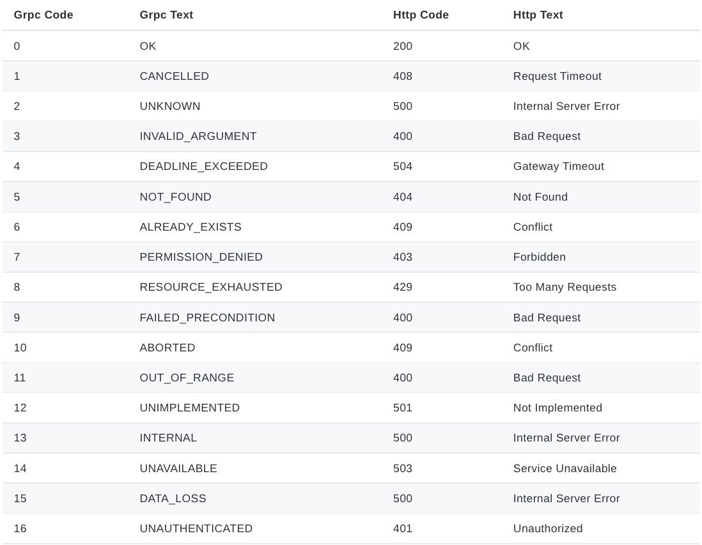

# GRPC: How to design error handling？

Designing API is not an easy job. However, designing error handling logic while making API is really critical issues.

## Consideration
A reasonable error handling should consider bellow factors:

- Includes error code and message
- Error message should be scalable
- Readability
- Error should be able to parsed from client side by code
- Tolerate panic

## RPC error architecture


```json
{
    "error":{
        "code":500,
        "status":"Internal Server Error",
        "message":"Panic manually!",
        "details":[]
    }
}
```

## Example
Introducing [rk-boot](https://github.com/rookie-ninja/rk-boot) library which could be used to start a golang grpc microservice in convenient way.

[rk-boot](https://github.com/rookie-ninja/rk-boot) includes standard error handling logic and panic interceptor/middleware in it.

### Return error
grpc-gateway will be used with GRPC in the same place which introduce another issue. The error mapping between GRPC and grpc-gateway.

What we aims to do is make sure error mapping is always work and unique.

Let's start with [demo](https://github.com/rookie-ninja/rk-demo/tree/master/grpc/basic) , which integrate rk-boot already.

Make sure enable enableRkGwOption option here!

- boot.yaml
```yaml
---
grpc:
  - name: greeter                   # Name of grpc entry
    port: 8080                      # Port of grpc entry
    enabled: true                   # Enable grpc entry
    enableReflection: true
    enableRkGwOption: true
```

- main.go
```go
// Copyright (c) 2021 rookie-ninja
//
// Use of this source code is governed by an Apache-style
// license that can be found in the LICENSE file.
package main

import (
	"context"
	"errors"
	"github.com/rookie-ninja/rk-boot"
	"github.com/rookie-ninja/rk-common/error"
	"github.com/rookie-ninja/rk-demo/api/gen/v1"
	"google.golang.org/grpc"
)

// Application entrance.
func main() {
	// Create a new boot instance.
	boot := rkboot.NewBoot()

	// Get grpc entry with name
	grpcEntry := boot.GetGrpcEntry("greeter")
	grpcEntry.AddRegFuncGrpc(registerGreeter)
	grpcEntry.AddRegFuncGw(greeter.RegisterGreeterHandlerFromEndpoint)

	// Bootstrap
	boot.Bootstrap(context.Background())

	// Wait for shutdown sig
	boot.WaitForShutdownSig(context.Background())
}

func registerGreeter(server *grpc.Server) {
	greeter.RegisterGreeterServer(server, &GreeterServer{})
}

type GreeterServer struct{}

func (server *GreeterServer) Greeter(ctx context.Context, request *greeter.GreeterRequest) (*greeter.GreeterResponse, error) {
	// Return error to client
	return nil, rkerror.InvalidArgument("Invalid argument, triggered manually", errors.New("this is detail")).Err()
}
```

```
$ go run main.go
```

- Send request to grpc-gateway

> As we can see, rk-boot convert GRPC error into 400 according to mapping rules.

```
curl "localhost:8080/v1/greeter?name=rk-dev"
{
    "error":{
        "code":400,
        "status":"Bad Request",
        "message":"Invalid argument, triggered manually",
        "details":[
            {
                "code":3,
                "status":"InvalidArgument",
                "message":"[from-grpc] Invalid argument, triggered manually"
            },
            {
                "code":2,
                "status":"Unknown",
                "message":"this is detail"
            }
        ]
    }
}
```

- Send request to GRPC

> There are two kinds of details included.
> - GRPC error
> - Custom error（rk-boot will convert the error to Unknown unless it recognizes it）

```
$ grpcurl -plaintext localhost:8080 api.v1.Greeter.Greeter
ERROR:
  Code: InvalidArgument
  Message: Invalid argument, triggered manually
  Details:
  1)    {"@type":"type.googleapis.com/rk.api.v1.ErrorDetail","code":3,"message":"[from-grpc] Invalid argument, triggered manually","status":"InvalidArgument"}
  2)    {"@type":"type.googleapis.com/rk.api.v1.ErrorDetail","code":2,"message":"this is detail","status":"Unknown"}
```

### Tolerate panic
Let's start with [demo](https://github.com/rookie-ninja/rk-demo/tree/master/grpc/basic) .

We will manually trigger panic and check what kind of error response will be sent to user.

Make sure enable enableRkGwOption option here!

- boot.yaml
```yaml
---
grpc:
  - name: greeter                   # Name of grpc entry
    port: 8080                      # Port of grpc entry
    enabled: true                   # Enable grpc entry
    enableReflection: true
    enableRkGwOption: true
```

- main.go
```go
// Copyright (c) 2021 rookie-ninja
//
// Use of this source code is governed by an Apache-style
// license that can be found in the LICENSE file.
package main

import (
	"context"
	"fmt"
	"github.com/rookie-ninja/rk-boot"
	"github.com/rookie-ninja/rk-demo/api/gen/v1"
	"google.golang.org/grpc"
)

// Application entrance.
func main() {
	// Create a new boot instance.
	boot := rkboot.NewBoot()

	// Get grpc entry with name
	grpcEntry := boot.GetGrpcEntry("greeter")
	grpcEntry.AddRegFuncGrpc(registerGreeter)
	grpcEntry.AddRegFuncGw(greeter.RegisterGreeterHandlerFromEndpoint)

	// Bootstrap
	boot.Bootstrap(context.Background())

	// Wait for shutdown sig
	boot.WaitForShutdownSig(context.Background())
}

func registerGreeter(server *grpc.Server) {
	greeter.RegisterGreeterServer(server, &GreeterServer{})
}

type GreeterServer struct{}

func (server *GreeterServer) Greeter(ctx context.Context, request *greeter.GreeterRequest) (*greeter.GreeterResponse, error) {
	panic("Panic manually!")

	return &greeter.GreeterResponse{
		Message: fmt.Sprintf("Hello %s!", request.Name),
	}, nil
}
```

```
$ go run main.go
```

- Send request to grpc-gateway

> As we can see, rk-boot convert GRPC error into 500 according to mapping rules.

```
curl "localhost:8080/v1/greeter?name=rk-dev"
{
    "error":{
        "code":500,
        "status":"Internal Server Error",
        "message":"Panic manually!",
        "details":[]
    }
}
```

- Send request to GRPC

```
$ grpcurl -plaintext localhost:8080 api.v1.Greeter.Greeter
ERROR:
  Code: Internal
  Message: Panic manually!
```

## GRPC and grpc-gateway error mapping
Reference：https://github.com/googleapis/googleapis/blob/master/google/rpc/code.proto



## Source code
rk-boot depends on [rk-common/error](https://github.com/rookie-ninja/rk-common/tree/master/error) while handling errors.

## More examples
https://github.com/rookie-ninja/rk-grpc/tree/master/example/interceptor/panic/client