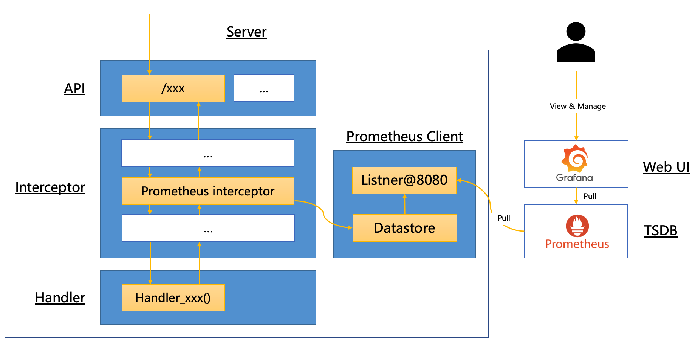
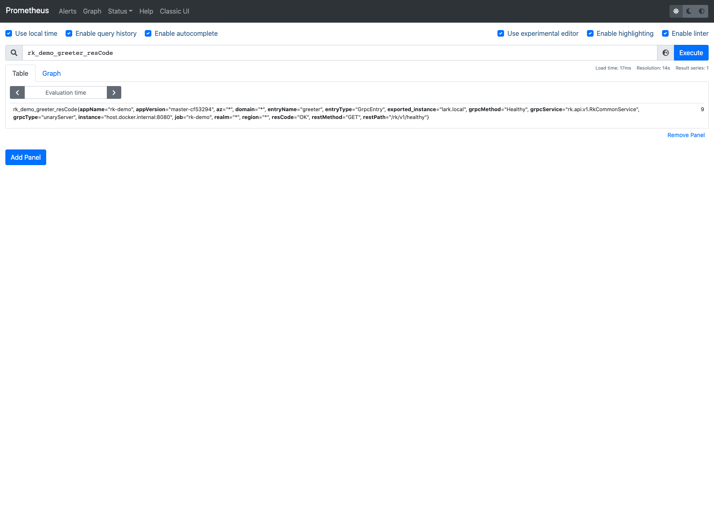
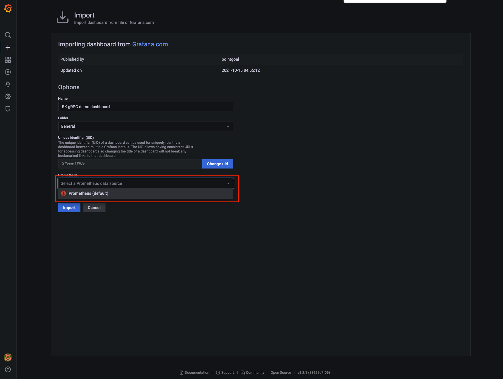
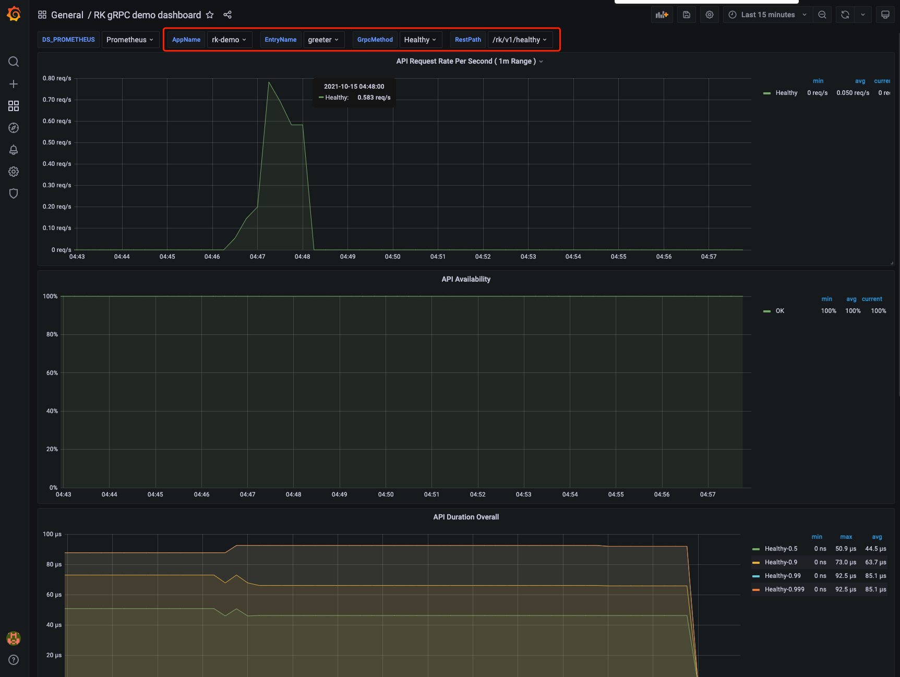

# GRPC: 如何添加 API Prometheus 监控拦截器/中间件？

## 介绍

本文将介绍如何在 gRPC 微服务中添加 API Prometheus(普罗米修斯)拦截器/中间件。也就是可以在 Grafana 里做的 API 监控。

> 什么是 API Prometheus(普罗米修斯)拦截器/中间件？
>
> Prometheus(普罗米修斯)拦截器会对每一个 API 请求记录 Prometheus(普罗米修斯)监控。

我们将会使用 [rk-boot](https://github.com/rookie-ninja/rk-boot) 来启动 gRPC 服务。

> 请访问如下地址获取完整教程：
> - https://rkdev.info/cn
> - https://rkdocs.netlify.app/cn (备用)

## 安装
```go
go get github.com/rookie-ninja/rk-boot
```

## 快速开始
[rk-boot](https://github.com/rookie-ninja/rk-boot) 默认集成如下两个开源库。
 
- [rk-prom](https://github.com/rookie-ninja/rk-prom) 作为普罗米修斯(Prometheus)客户端启动库。

> 注意！为了例子能够顺滑进行，请务必在 go.mod 文件里，module 的后缀设置成 rk-demo。
> 
> 例如：module github.com/your-repo/rk-demo

### 1.创建 boot.yaml
为了验证，我们启动了如下几个选项：
- **commonService**：commonService 里包含了一系列通用 API。[详情](https://github.com/rookie-ninja/rk-grpc#common-service-1)
- **prom**：Prometheus(普罗米修斯)客户端。
- **grpc-gateway**：grpc 默认会启动 grpc-gateway 来提供 Restful API 服务。在验证的时候，我们可以直接发送 Restful 请求。
- **prometheus 中间件**：启动 prometheus 中间件。

```
---
grpc:
  - name: greeter                   # Name of grpc entry
    port: 8080                      # Port of grpc entry
    enabled: true                   # Enable grpc entry
    commonService:
      enabled: true                 # Enable common service for testing
    prom:
      enabled: true                 # Enable prometheus client
    interceptors:
      metricsProm:
        enabled: true               # Enable prometheus interceptor
```

### 2.创建 main.go 
```
package main

import (
	"context"
	"github.com/rookie-ninja/rk-boot"
)

// Application entrance.
func main() {
	// Create a new boot instance.
	boot := rkboot.NewBoot()

	// Bootstrap
	boot.Bootstrap(context.Background())

	// Wait for shutdown sig
	boot.WaitForShutdownSig(context.Background())
}
```

### 3.文件夹结构 
```
$ tree
.
├── boot.yaml
├── go.mod
├── go.sum
└── main.go

0 directories, 4 files
```

### 3.验证
```
$ go run main.go
```

> 发送请求

```
$ curl -X GET localhost:8080/rk/v1/healthy
{"healthy":true}
```

> 访问 Prometheus 客户端: http://localhost:8080/metrics


## 可视化监控
我们已经在本地进程里启动了 prometheus 监控，剩下的事情就是如何在一个【漂亮】的网页里查看监控了。

市面上有很多工具，不过我们选择【简单】，【流行】，【免费】的方式，也就是 Prometheus + Grafana。

### 架构图
先来看看整个流程是什么样的。

其实原理很简单，就是【劫持】API 请求，并且记录【时间】，【错误码】等信息。之后，让 Prometheus 服务主动从【创建的服务】里，拉取数据。最后，让 Grafana 服务从 Prometheus 中拉取数据，显示数据表。



### 快速开始
#### 1. 创建 prometheus.yml
> 我们先创建 prometheus.yml 配置文件，让 prometheus 服务能够从 localhost:8080/metrics 拉取数据。
>
> 下面的配置中，我们没有指定 /metrics，因为 prometheus默认会使用 /metrics 来拉取数据。
>
> 注意！我们把 targets 设置成了 host.docker.internal:8080 而不是 localhost:8080，这是因为 prometheus 在容器里面，我们服务在本地里。
>
> 想要从容器里访问本地机器的端口，这是一种便捷的方法。[解释](https://stackoverflow.com/questions/24319662/from-inside-of-a-docker-container-how-do-i-connect-to-the-localhost-of-the-mach)

```
global:
  scrape_interval: 1s # Make scrape interval to 1s for testing.

# A scrape configuration containing exactly one endpoint to scrape:
# Here it's Prometheus itself.
scrape_configs:
  - job_name: 'rk-demo'
    scrape_interval: 1s
    static_configs:
      - targets: ['host.docker.internal:8080']
```

#### 2.启动 Prometheus
> 我们使用 [docker](https://docs.docker.com/get-docker/) 来启动。
>
> Prometheus 默认使用 9090 端口。

```
$ docker run \
      -p 9090:9090 \
      -v /<your path>/rk-demo/prometheus.yml:/etc/prometheus/prometheus.yml \
      prom/prometheus
```

#### 3.验证 Prometheus
> 请按照上面的【验证】，启动 main.go，并且发送一个 /rk/v1/healthy 请求。
>
> 然后，我们来看一下 prometheus 服务里面的数据。
>
> 访问：localhost:9090，并且搜索 rk_demo_greeter_resCode，我们可以看到数据已经在 prometheus 里面了。



> 访问：localhost:9090/targets，我们可以看到，prometheus 已经每隔一秒拉取数据了。


#### 4.启动 Grafana
> Grafana 默认使用 3000 端口。

```
$ docker run -p 3000:3000 --name grafana grafana/grafana
```

> 访问：localhost:3000
>
> 这时候，grafana 会让你登陆，默认的用户名密码如下。
>
> 用户名：admin
> 密码：admin


#### 5.在 Grafana 里添加 Prometheus 数据源
Grafana 只是一个 Web UI 工具，为了能看到数据报表，我们告诉 Grafana 在哪里寻找 Prometheus。

> 选择 Prometheus 作为数据源。


> 填写 Prometheus 地址，跟上面一样的道理，因为 Grafana 运行在 Docker 中，所以，我们不使用 localhost:9090，而是，host.docker.internal:9090。


#### 6.导入 Dashboard
我们可以自行编辑 Grafana Dashboard，不过，这个并不是个容易的事儿。针对于使用 rk-boot 启动的服务，我们提供了默认【免费】的 Grafana Dashboard 模版。

> 注意，这里导入的 Dashboard 只匹配【按照上述逻辑创建的服务】。
>
> Why? 因为 rk-boot 默认会使用 <App 名字>_<Entry 名字>_xxx 作为 prometheus 的 metrics 名字。
>
> 如果用户使用了不同的 module，或者不同的 Entry 名字，则需要改变 Dashboard 里的 Variable。我们会在后续的文章中，介绍如何使用 Grafana。

> 移动到 Dashboard 导入页面


> 导入 15111 号 Dashboard，定义在了：https://grafana.com/grafana/dashboards/15111


> 指定 Prometheus 数据源，这个数据源就是我们在上面配置的 Prometheus。



> 开始监控
>
> 注意！如果请求数太少，则会显示成 0，请多发几个请求。



### 概念
我们已经可以从 Grafana 里得到监控数据了，现在看看 rk-boot 里的中间件，添加了什么类型的监控数据。

监控拦截器会默认记录如下监控。

| 监控项 | 数据类型 | 详情 |
| ---- | ---- | ---- |
| elapsedNano | Summary | RPC 耗时 |
| resCode | Counter | 基于 RPC 返回码的计数器 |
| errors | Counter | 基于 RPC 错误的计数器 |

上述三项监控，都有如下的标签。

| 标签 | 详情 |
| ---- | ---- |
| entryName | Gin entry 名字 |
| entryType | Gin entry 类型 |
| realm | 环境变量: REALM, eg: rk |
| region | 环境变量: REGION, eg: beijing |
| az | 环境变量: AZ, eg: beijing-1 |
| domain | 环境变量: DOMAIN, eg: prod |
| instance | 本地 Hostname |
| appVersion | 从 [AppInfoEntry](https://github.com/rookie-ninja/rk-entry#appinfoentry) 获取 |
| appName | 从 [AppInfoEntry](https://github.com/rookie-ninja/rk-entry#appinfoentry) 获取 |
| restMethod | 如果启动了 grpc-gateway，并且请求是以 http 形式发过来的，则会记录当中。 eg: GET |
| restPath | 如果启动了 grpc-gateway，并且请求是以 http 形式发过来的，则会记录当中。 eg: /rk/v1/healthy |
| grpcService | GRPC 服务名称。eg: rk.api.v1.RkCommonService |
| grpcMethod | GRPC 方法名称。eg: Healthy |
| grpcType | GRPC 类型。eg: UnaryServer |
| resCode | 返回码, eg: OK |


