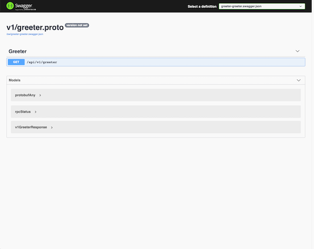

# GRPC: 如何让 gRPC 提供 Swagger UI?

## 介绍
本文将介绍如何让一个 gRPC 服务之上提供 Swagger UI。

为了能提供 Swagger UI，我们首先要让 gRPC 提供 Restful API，然后，Swagger UI 才可以访问后台。

- 为了能让 gRPC 提供 REST API，我们需要使用 [grpc-gateway](https://github.com/grpc-ecosystem/grpc-gateway)
- 我们需要使用 [protoc-gen-openapiv2](https://github.com/grpc-ecosystem/grpc-gateway) 从 proto 文件，创建 Swagger UI 所需要的文件

> 请访问如下地址获取完整教程：
> - https://rkdev.info/cn
> - https://rkdocs.netlify.app/cn (备用)

### 先决条件
使用过 GRPC 的用户都应该知道，protocol buffer 文件需要使用相关的命令行，把 *.proto 文件编译成 *.go 文件。

根据不同需要，会使用到不同的命令行文件。以 Go 语言为例，我们需要大致如下几个命令行文件。

| 工具 | 介绍 | 安装 |
| ---- | ---- | ---- |
| [protobuf](https://github.com/protocolbuffers/protobuf) | protocol buffer 编译所需的命令行 | [Install](http://google.github.io/proto-lens/installing-protoc.html) |
| [protoc-gen-go](https://github.com/golang/protobuf/tree/master/protoc-gen-go) | 从 proto 文件，生成 .go 文件 | [Install](https://grpc.io/docs/languages/go/quickstart/) |
| [protoc-gen-go-grpc](https://github.com/grpc/grpc-go) | 从 proto 文件，生成 GRPC 相关的 .go 文件 | [Install](https://grpc.io/docs/languages/go/quickstart/) |
| [protoc-gen-grpc-gateway](https://github.com/grpc-ecosystem/grpc-gateway) | 从 proto 文件，生成 grpc-gateway 相关的 .go 文件 | [Install](https://github.com/grpc-ecosystem/grpc-gateway#installation) |
| [protoc-gen-openapiv2](https://github.com/grpc-ecosystem/grpc-gateway) | 从 proto 文件，生成 swagger 界面所需的参数文件 | [Install](https://github.com/grpc-ecosystem/grpc-gateway#installation) |

除了安装上述命令行，我们还需要根据需要，运行至少4种不同命令来编译 *.proto 文件，非常晦涩难懂。

> 具体操作方式可参考我的前一篇文章：【GRPC: 使用 Buf 快速编译 GRPC proto 文件】
> 或者访问：【https://rkdev.info/cn/docs/bootstrapper/user-guide/grpc-golang/basic/grpc-gateway/】

### 安装
```go
go get github.com/rookie-ninja/rk-boot
```

### 快速开始
#### 1.创建 api/v1/greeter.proto 
```
syntax = "proto3";

package api.v1;

option go_package = "api/v1/greeter";

service Greeter {
  rpc Greeter (GreeterRequest) returns (GreeterResponse) {}
}

message GreeterRequest {
  string name = 1;
}

message GreeterResponse {
  string message = 1;
}
```

#### 2.创建 api/v1/gw_mapping.yaml 
```
type: google.api.Service
config_version: 3

# Please refer google.api.Http in https://github.com/googleapis/googleapis/blob/master/google/api/http.proto file for details.
http:
  rules:
    - selector: api.v1.Greeter.Greeter
      get: /api/v1/greeter
```

#### 3.创建 buf.yaml
```
version: v1beta1
name: github.com/rk-dev/rk-demo
build:
  roots:
    - api
```

#### 4.创建 buf.gen.yaml
```
version: v1beta1
plugins:
  # protoc-gen-go needs to be installed, generate go files based on proto files
  - name: go
    out: api/gen
    opt:
     - paths=source_relative
  # protoc-gen-go-grpc needs to be installed, generate grpc go files based on proto files
  - name: go-grpc
    out: api/gen
    opt:
      - paths=source_relative
      - require_unimplemented_servers=false
  # protoc-gen-grpc-gateway needs to be installed, generate grpc-gateway go files based on proto files
  - name: grpc-gateway
    out: api/gen
    opt:
      - paths=source_relative
      - grpc_api_configuration=api/v1/gw_mapping.yaml
  # protoc-gen-openapiv2 needs to be installed, generate swagger config files based on proto files
  - name: openapiv2
    out: api/gen
    opt:
      - grpc_api_configuration=api/v1/gw_mapping.yaml
```

#### 5.编译 proto file 
```
$ buf generate
```

> 如下的文件会被创建。

```
$ tree api/gen 
api/gen
└── v1
    ├── greeter.pb.go
    ├── greeter.pb.gw.go
    ├── greeter.swagger.json
    └── greeter_grpc.pb.go
 
1 directory, 4 files
```

#### 6.创建 boot.yaml
```
grpc:
  - name: greeter                   # Name of grpc entry
    port: 8080                      # Port of grpc entry
    enabled: true                   # Enable grpc entry
    sw:
      enabled: true                 # Enable swagger
      jsonPath: "api/gen/v1"        # Provide swagger config file path
```

#### 7. 创建 main.go
```
package main

import (
	"context"
	"fmt"
	"github.com/rookie-ninja/rk-boot"
	"github.com/rookie-ninja/rk-demo/api/gen/v1"
	"google.golang.org/grpc"
)

// Application entrance.
func main() {
    // Create a new boot instance.
    boot := rkboot.NewBoot()

    // ***************************************
    // ******* Register GRPC & Gateway *******
    // ***************************************

    // Get grpc entry with name
    grpcEntry := boot.GetGrpcEntry("greeter")
    // Register grpc registration function
    grpcEntry.AddRegFuncGrpc(registerGreeter)
    // Register grpc-gateway registration function
    grpcEntry.AddRegFuncGw(greeter.RegisterGreeterHandlerFromEndpoint)

    // Bootstrap
    boot.Bootstrap(context.Background())

    // Wait for shutdown sig
    boot.WaitForShutdownSig(context.Background())
}

// Implementation of [type GrpcRegFunc func(server *grpc.Server)]
func registerGreeter(server *grpc.Server) {
    greeter.RegisterGreeterServer(server, &GreeterServer{})
}

// Implementation of grpc service defined in proto file
type GreeterServer struct{}

func (server *GreeterServer) Greeter(ctx context.Context, request *greeter.GreeterRequest) (*greeter.GreeterResponse, error) {
    return &greeter.GreeterResponse{
        Message: fmt.Sprintf("Hello %s!", request.Name),
    }, nil
}
```

#### 8.文件夹结构 
```
$ tree
.
├── api
│   ├── gen
│   │   └── v1
│   │       ├── greeter.pb.go
│   │       ├── greeter.pb.gw.go
│   │       ├── greeter.swagger.json
│   │       └── greeter_grpc.pb.go
│   └── v1
│       ├── greeter.proto
│       └── gw_mapping.yaml
├── boot.yaml
├── buf.gen.yaml
├── buf.yaml
├── go.mod
├── go.sum
└── main.go

4 directories, 12 files
```

#### 9.验证
> 访问 Swagger：http://localhost:8080/sw



