# gRPC: 通过 Web 获取服务原信息

## 介绍

本文将介绍如何在 gRPC 微服务中嵌入 Web UI 获取服务原信息。

| 名称 | 详情 |
| ---- | ---- |
| README | 如果本地有 README.md 文件，会展示 |
| 进程信息 | 显示进程信息 |
| API 列表 | 获取 API 列表 |
| gRPC 错误信息 | gRPC 对应 grpc-gateway 错误信息 |
| Entry 列表 | Entry 列表，请参考[详情](https://github.com/rookie-ninja/rk-entry) |
| Config 列表 | 列出 Config 文件信息 |
| CA 证书 ｜ 列出 TLS/SSL 证书信息 |
| 依赖 | 列出 go.mod 信息 |
| LICENSE | 如果本地有 LICENSE 文件，会展示 |
| OS 信息 | 当前 OS 信息 |
| Go Env 信息 | Go 环境信息 |
| Git 信息 | 如果是 Git 工程，会展示 |
| Log 信息 | 展示 Log 原信息 |
| Metrics | 展示 Prometheus Metrics |

我们将会使用 [rk-boot](https://github.com/rookie-ninja/rk-boot) 来启动 gRPC 服务。

> **请访问如下地址获取完整教程：**

- https://rkdocs.netlify.app/cn

## 安装
```go
go get github.com/rookie-ninja/rk-boot
```

## 快速开始
为了完整展示，我们使用一个 git 工程，并且添加 API。

### 1.创建 protobuf 相关文件
我们使用 buf 命令行来编译 protobuf，需要创建如下几个文件。

| 文件名 | 描述 |
| ---- | ---- |
| api/v1/greeter.proto | protobuf 文件 |
| api/v1/gw_mapping.yaml | gRPC 对应 Restful API |
| buf.yaml | 告诉 buf 命令行在哪里寻找 protobuf 文件 |
| buf.gen.yaml | 告诉 buf 命令行如何编译 protobuf 文件 |

- **api/v1/greeter.proto**

```protobuf
syntax = "proto3";

package api.v1;

option go_package = "api/v1/greeter";

service Greeter {
  rpc Greeter (GreeterRequest) returns (GreeterResponse) {}
}

message GreeterRequest {
  string name = 1;
}

message GreeterResponse {
  string message = 1;
}
```

- **api/v1/gw_mapping.yaml**

```yaml
type: google.api.Service
config_version: 3

# Please refer google.api.Http in https://github.com/googleapis/googleapis/blob/master/google/api/http.proto file for details.
http:
  rules:
    - selector: api.v1.Greeter.Greeter
      get: /api/v1/greeter
```

- **buf.yaml**

```yaml
version: v1beta1
name: github.com/rk-dev/rk-demo
build:
  roots:
    - api
```

- **buf.gen.yaml**

```yaml
version: v1beta1
plugins:
  # protoc-gen-go needs to be installed, generate go files based on proto files
  - name: go
    out: api/gen
    opt:
     - paths=source_relative
  # protoc-gen-go-grpc needs to be installed, generate grpc go files based on proto files
  - name: go-grpc
    out: api/gen
    opt:
      - paths=source_relative
      - require_unimplemented_servers=false
  # protoc-gen-grpc-gateway needs to be installed, generate grpc-gateway go files based on proto files
  - name: grpc-gateway
    out: api/gen
    opt:
      - paths=source_relative
      - grpc_api_configuration=api/v1/gw_mapping.yaml
  # protoc-gen-openapiv2 needs to be installed, generate swagger config files based on proto files
  - name: openapiv2
    out: api/gen
    opt:
      - grpc_api_configuration=api/v1/gw_mapping.yaml
```

- **编译 protobuf 文件**

```shell
$ buf generate
```

### 2.创建 boot.yaml
除了开启 **grpc.tv.enabled**，我们还开启了其他服务，这样就可以验证完整 TV 页面。

请参考专栏里其他系列文章来获取每个选项的详细信息。或者访问：[rk-boot](https://rkdocs.netlify.app/cn) 官方文档。

```yaml
---
grpc:
  - name: greeter                   # Required, Name of grpc entry
    port: 8080                      # Required, Port of grpc entry
    enabled: true                   # Required, Enable grpc entry
    commonService:
      enabled: true                 # Optional, Enable common service, default: false
    gwMappingFilePaths:
      - "api/v1/gw_mapping.yaml"    # Boot will look for gateway mapping files and load information into memory
    prom:
      enabled: true                 # Enable prometheus client
    sw:
      enabled: true                 # Optional, Enable swagger, default: false
      jsonPath: "api/gen/v1"        # Optional, The directory where swagger json file located, default: ""
    tv:
      enabled: true                 # Optional, Enable Rk TV, default: false
    interceptors:
      metricsProm:
        enabled: true
```

### 3.创建 main.go

```go
// Copyright (c) 2021 rookie-ninja
//
// Use of this source code is governed by an Apache-style
// license that can be found in the LICENSE file.

package main

import (
	"context"
	"fmt"
	"github.com/rookie-ninja/rk-boot"
	"google.golang.org/grpc"
	"rookie-ninja/demo/api/gen/v1"
)

// Application entrance.
func main() {
	// Create a new boot instance.
	boot := rkboot.NewBoot()

	// Get grpc entry with name
	grpcEntry := boot.GetGrpcEntry("greeter")
	// Register grpc server into GrpcEntry
	grpcEntry.AddRegFuncGrpc(registerGreeter)
	// Register grpc gateway into GrpcEntry
	grpcEntry.AddRegFuncGw(greeter.RegisterGreeterHandlerFromEndpoint)

	// Bootstrap
	boot.Bootstrap(context.Background())

	// Wait for shutdown sig
	boot.WaitForShutdownSig(context.Background())
}

func registerGreeter(server *grpc.Server) {
	greeter.RegisterGreeterServer(server, &GreeterServer{})
}

// GreeterServer Implementation of greeter.UnimplementedGreeterServer
type GreeterServer struct{}

// Greeter Handles Greeter request
func (server *GreeterServer) Greeter(ctx context.Context, request *greeter.GreeterRequest) (*greeter.GreeterResponse, error) {
	return &greeter.GreeterResponse{
		Message: fmt.Sprintf("Hello %s!", request.Name),
	}, nil
}
```

### 4.文件夹结构

```shell
.
├── LICENSE
├── README.md
├── api
│   ├── gen
│   │   └── v1
│   │       ├── greeter.pb.go
│   │       ├── greeter.pb.gw.go
│   │       ├── greeter.swagger.json
│   │       └── greeter_grpc.pb.go
│   └── v1
│       ├── greeter.proto
│       └── gw_mapping.yaml
├── boot.yaml
├── buf.gen.yaml
├── buf.yaml
├── go.mod
├── go.sum
└── main.go
```

### 5.验证

```shell
$ go run main.go
```

**访问** [localhost:8080/rk/v1/tv](http://localhost:8080/rk/v1/tv)

#### 5.1 README
rk-boot 会读取本地 README.md 文件，并展示在 TV 页面中。

如果是打包编译的情况，rk-boot 会寻找 .rk/README.md 路径，可以通过 **RK 命令行**，方便编译。
请参考：[例子](https://github.com/rookie-ninja/rk-demo/blob/master/standard/go-grpc/README_CN.md#%E6%9C%AC%E5%9C%B0%E6%89%93%E5%8C%85)

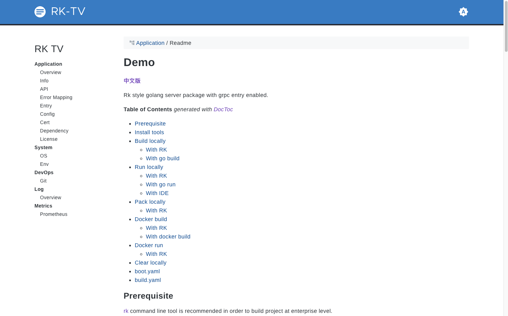

#### 5.2 进程原信息
rk-boot 会读取本地进程信息。

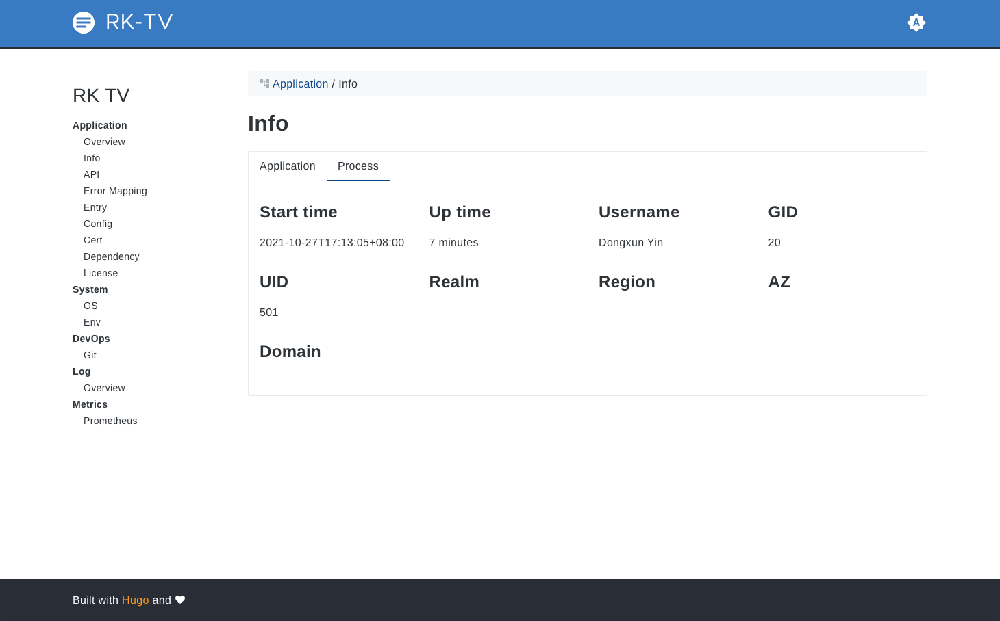

#### 5.3 API 列表
rk-boot 会读取 gRPC 内部所有 API 列表。只有在下面的配置加入到了 boot.yaml 里面时，才会显示 grpc-gateway 的对应 Pattern。

```yaml
gwMappingFilePaths:
  - "api/v1/gw_mapping.yaml"
```

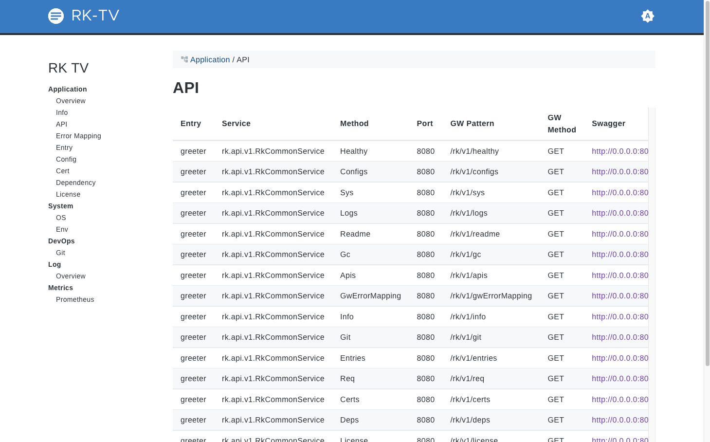

#### 5.4 错误映射
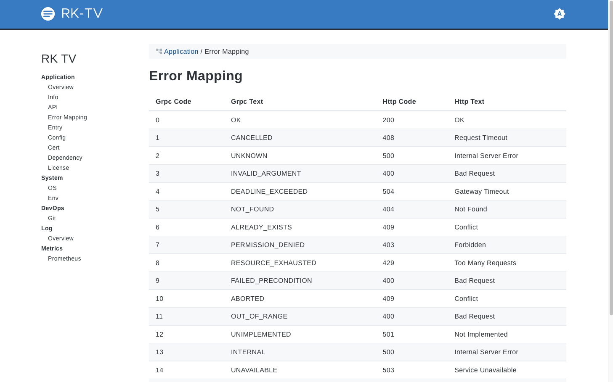

#### 5.5 Entry 列表
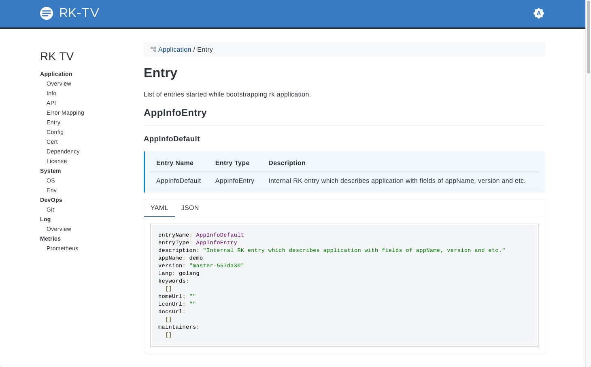

#### 5.6 Config 列表
如果 boot.yaml 里有 config 入口，会显示在这里。

下面的图只是个例子截图，上面的代码不会有 Config，因为我们没有加入 Config。

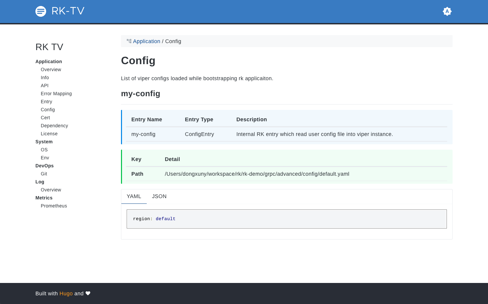

#### 5.7 证书
如果 boot.yaml 里有 cert 入口，会显示在这里。

下面的图只是个例子截图，上面的代码不会有 Cert，因为我们没有加入 Cert。

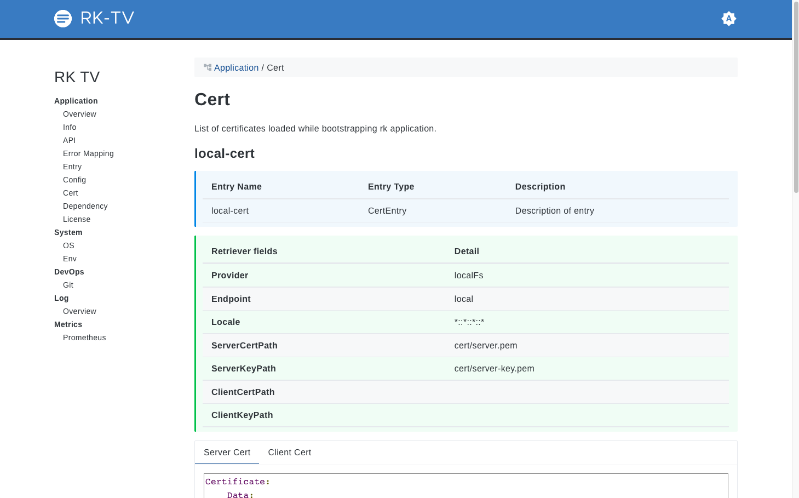

#### 5.8 依赖
rk-boot 会读取本地 go.mod 文件，并展示在 TV 页面中。

如果是打包编译的情况，rk-boot 会寻找 .rk/go.mod 路径，可以通过 **RK 命令行**，方便编译。
请参考：[例子](https://github.com/rookie-ninja/rk-demo/blob/master/standard/go-grpc/README_CN.md)

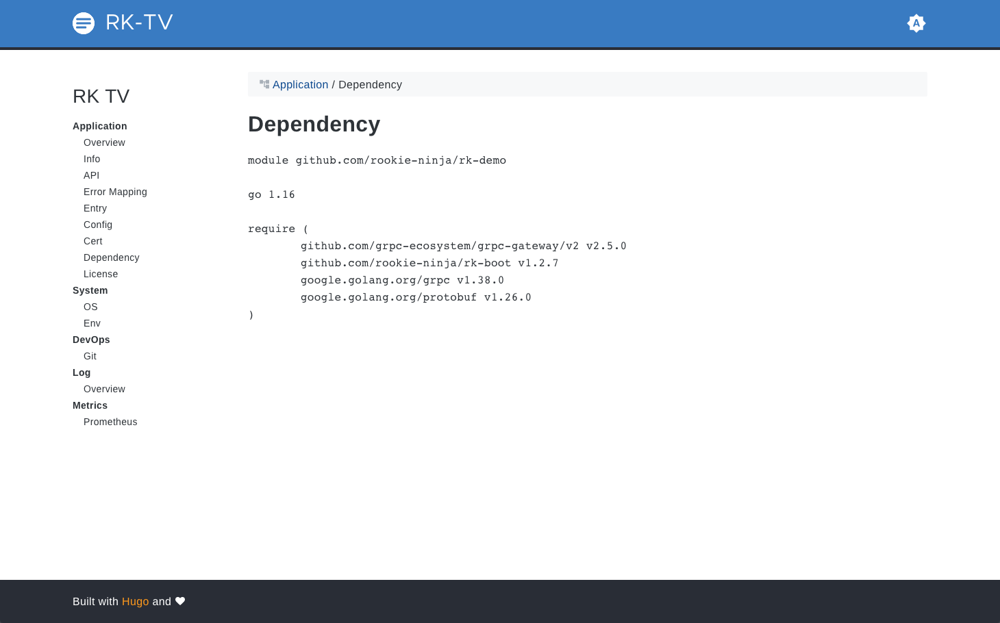

#### 5.9 OS 信息
rk-boot 会收集本地 OS 信息。


#### 5.10 Go Env 信息
rk-boot 会收集本地 Go Env 信息。

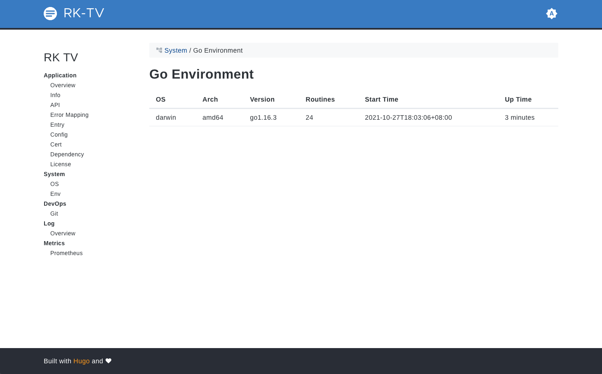

#### 5.11 Git 信息
rk-boot 会读取本地 .git 文件，并展示在 TV 页面中。

如果是打包编译的情况，rk-boot 会寻找 .rk/rk.yaml 路径，里面包含了 git 信息。可以通过 RK 命令行，方便编译。
请参考：[例子](https://github.com/rookie-ninja/rk-demo/blob/master/standard/go-grpc/README_CN.md)

#### 5.12 Log 信息
rk-boot 会显示目前在进程中的所有 Log 实例信息。

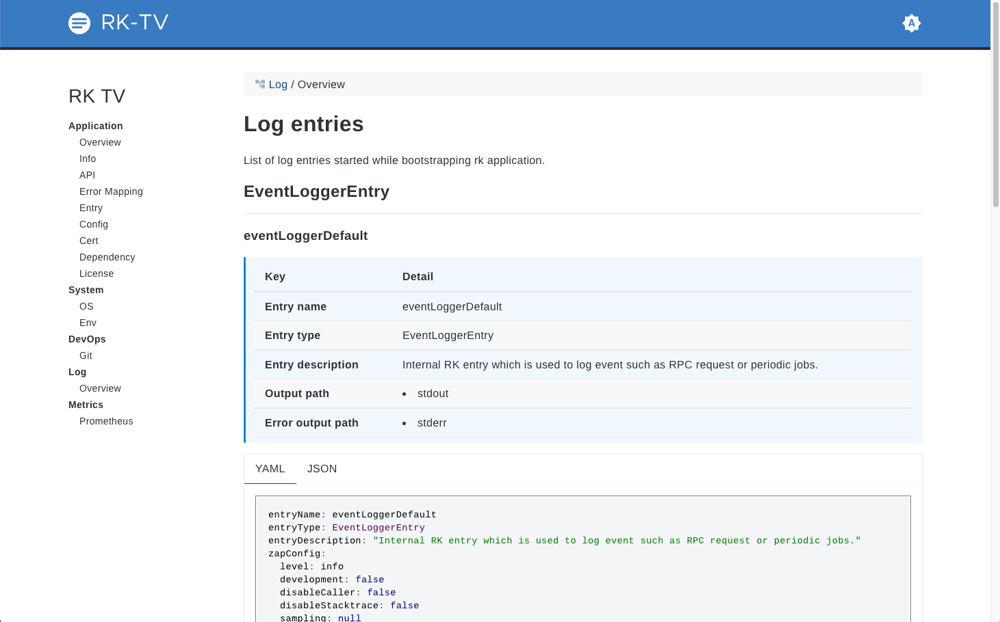

#### 5.13 Prometheus Metrics
rk-boot 如果开启了 Prometheus 中间件，我们可以在这个页面中看到 API 的基本监控信息。

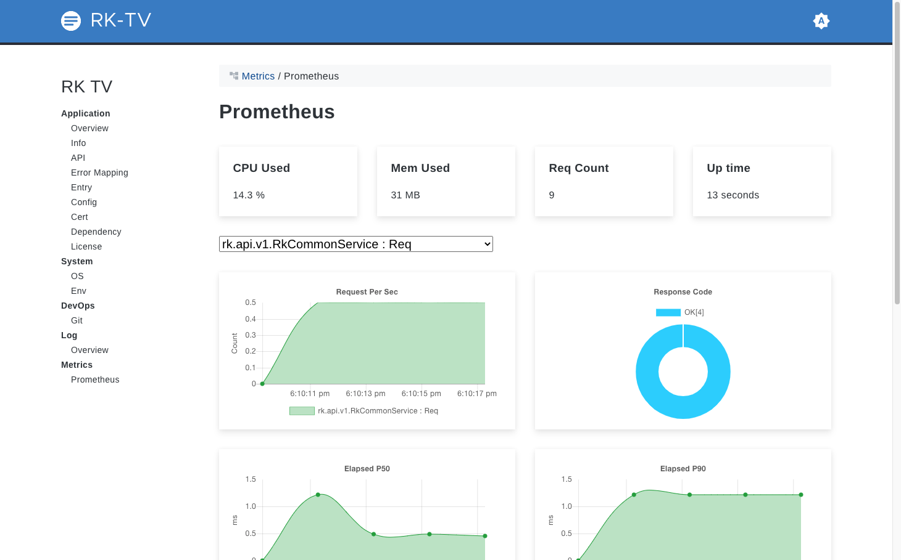

